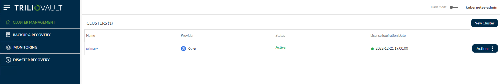
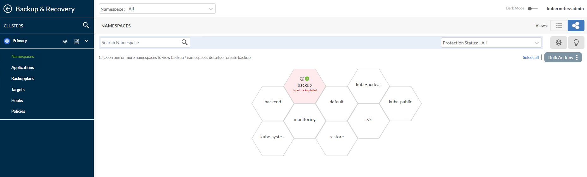
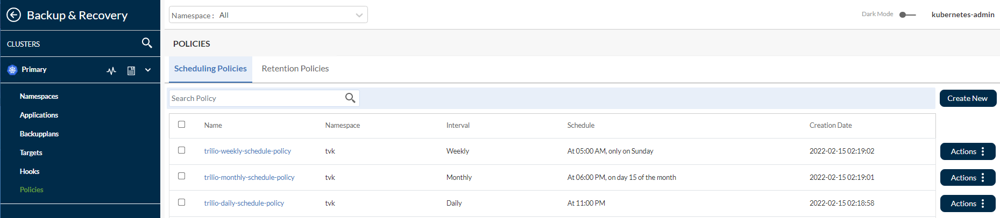
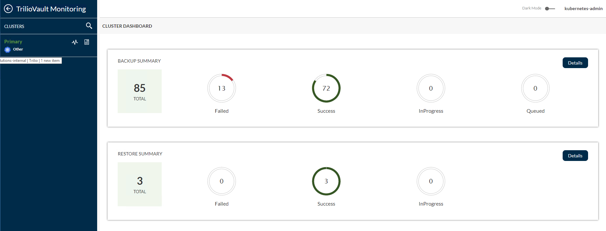
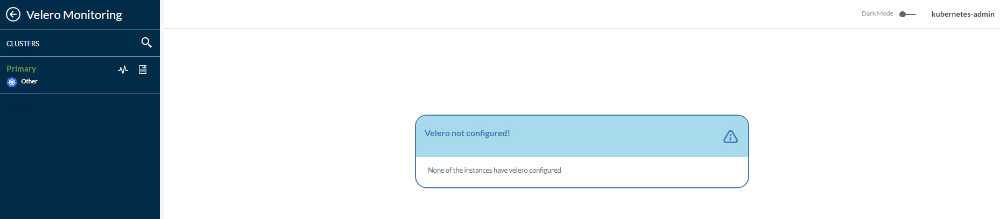
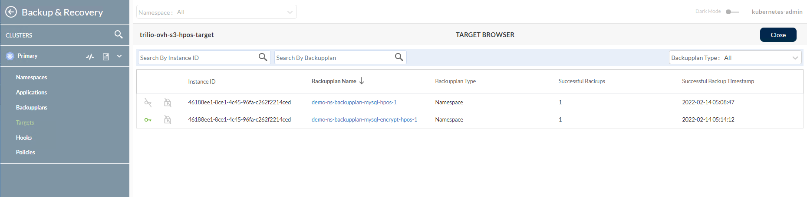

<style>
 pre {
     font-size: 14px;
 }
 pre.console {
   background-color: #300A24;
   color: #ccc;
   font-family: monospace;
   padding: 5px;
   margin-bottom: 5px;
 }
 pre.console code {
   border: solid 0px transparent;
   font-family: monospace !important;
   font-size: 0.75em;
   color: #ccc;
 }
 .small {
     font-size: 0.75em;
 }
</style>

**Last updated August 11<sup>th</sup>, 2022.**

## Introduction <a name="introduction"></a>

In this tutorial, you will learn how to deploy **TrilioVault for Kubernetes** (or **TVK**) to your OVHcloud Managed Kubernetes Cluster, create backups, and recover from a backup if something goes wrong.<br>
You can back up your entire cluster by including mutliple namespaces, or optionally choose a single namespace, label based backups, Helm Releases based backups or Operator based backups.

Advantages of using **Trilio**:

- Take full (or incremental) backups of your all namespaces, selective applications and restore in case of data loss.
- Migrate from one cluster to another.
- Helm release backups are supported.
- Backup of Operator based application deployment is also supported.
- Run pre and post hooks for backup and restore operations.
- Web management console, that allows you to inspect your backup/restore operations state in detail (and many other features).
- Define retention policies for your backups.
- Application lifecycle (meaning, TVK itself) can be managed via a dedicated TrilioVault Operator.
- Velero integration (Trilio supports monitoring Velero backups, restores, and backup/snapshot locations via its web management console).

### How TrilioVault for Kubernetes works <a name="how-triliovault-for-kubernetes-works"></a>

**TVK** follows a cloud native architecture, meaning that it has several components that together form the **Control Plane** and **Data Plane** layers. Everything is managed via **CRDs**, thus making it fully Kubernetes native. What is nice about **Trilio** is the clear separation of concerns, and how effective it handles backup and restore operations.

Each **TrilioVault** application consists of a bunch of "Controllers" and the associated CRDs. Every time a CRD is created or updated, the responsible controller is notified and performs cluster reconciliation. Then, the controller in charge spawns Kubernetes jobs that perform the real operation (like `backup`, `restore`, etc) in parallel.

**Control Plane** consists of:

- **Target Controller**: defines the storage backend (`S3`, `NFS`, etc) via specific CRDs.
- **BackupPlan Controller**: defines the components to backup, automated backups schedule, retention strategy, etc via specific CRDs.
- **Restore Controller**: defines restore operations via specific CRDs.

**Data Plane** consists of:

- **Datamover** Pods, responsible with transferring data between persistent volumes and backup media (or `Target`). **TrilioVault** works with **Persistent Volumes** (PVs) using the CSI interface. For each PV that needs to be backed up, an ephemeral **Datamover Pod** is created. After each operation finishes, the associated pod is destroyed.
- **Metamover** Pods, responsible with transferring Kubernetes API objects data to backup media (or `Target`). Metamover pods are ephemeral, just like the Datamover ones.

### Understanding TrilioVault Application Scope <a name="understanding-triliovault-application-scope"></a>

TrilioVault for Kubernetes works based on **scope**, meaning you can have a **Namespaced** or a **Cluster** type of installation.

A Namespaced installation allows you to `backup` and `restore` at the **namespace** level only. In other words, the backup is meant to protect a set of applications that are bound to a namespace that you own. This is how a "BackupPlan" and the corresponding Backup CRD works. You cannot mutate those CRDs in other namespaces, they must be created in the same namespace where the application to be backed up is located.

On the other hand, a **Cluster** type installation is not scoped or bound to any namespace or a set of applications. You define cluster type backups via the Cluster prefixed CRDs, like: `ClusterBackupPlan`, `ClusterBackup`, etc. Cluster type backups are a little bit more flexible, in the sense that you are not tied to a specific namespace or set of applications to backup and restore. You can perform backup/restore operations for multiple namespaces and applications at once, including PVs as well (you can also backup `etcd` databased content).

In order to make sure that TVK application scope and rules are followed correctly, TrilioVault is using an **Admission Controller**. It intercepts and validates each CRD that you want to push for TVK, before it is actually created. In case TVK application scope is not followed, the admission controller will reject CRD creation in the cluster.

Another important thing to consider and remember is that a TVK **License** is application scope specific. In other words, you need to generate one type of license for either a Namespaced or a Cluster type installation.

**Namespaced vs Cluster TVK application scope - when to use one or the other?**<br>
 It all depends on the use case. For example, a Namespaced scope is a more appropriate option when you don't have access to the whole Kubernetes cluster, only to specific namespaces and applications.<br>
 In most of the cases you want to protect only the applications tied to a specific namespace that you own.<br>
 On the other hand, a cluster scoped installation type works at the global level, meaning it can trigger backup/restore operations for any namespace or resource from a Kubernetes cluster (including PVs and the `etcd` database).

To summarize:

- If you are a cluster administrator, then you will most probably want to perform cluster level operations via corresponding CRDs, like: `ClusterBackupPlan`, `ClusterBackup`, `ClusterRestore`, etc.
- If you are a regular user, then you will usually perform namespaced only operations (application centric) via corresponding CRDs, like: `BackupPlan`, `Backup`, `Restore`, etc.

The application interface is very similar or uniform when comparing the two types: Cluster vs non-Cluster prefixed CRDs. So, if you're familiar with one type, it's pretty straightforward to use the counterpart.

For more information, please refer to the [TVK CRDs](https://docs.trilio.io/kubernetes/architecture/apis-and-command-line-reference/custom-resource-definitions-application-1) official documentation.

### Backup and Restore Workflow <a name="backup-and-restore-workflow"></a>

Whenever you want to **backup** an application, you start by creating a `BackupPlan` (or `ClusterBackupPlan`) CRD, followed by a `Backup` (or `ClusterBackup`) object. Trilio **Backup Controller** is notified about the change and performs backup object inspection and validation (i.e. whether it is `cluster` backup, `namespace` backup, etc.). Then, it spawns worker pods (Metamover, Datamover) responsible with moving the actual data (Kubernetes metadata, PVs data) to the backend storage (or `Target`), such as OVHcloud Object Storage.

Similarly whenever you create a **Restore** object, the "Restore Controller" is notified to restore from a Backup object. Then, Trilio Restore Controller spawns worker nodes (Metamover, Datamover), responsible with moving backup data out of the `OVHcloud Object Storage` (Kubernetes metadata, PVs data). Finally, the restore process is initiated from the particular backup object.

Trilio is ideal for the disaster recoveryuse case, as well as for "snapshotting" your application state, prior to performing system operations on your cluster, like upgrades. For more details on this topic, please visit the [Trilio Features](https://docs.trilio.io/kubernetes/overview/features-and-use-cases) and [Trilio Use Case](https://docs.trilio.io/kubernetes/overview/use-cases) official page.

After finishing this tutorial, you should be able to:

- Configure OVHcloud Object Storage backend for Trilio to use.
- `Backup` and `restore` your applications
- `Backup` and `restore` your entire OVHcloud Managed Kubernetes Cluster.
- Create scheduled backups for your applications.
- Create retention policies for your backups.

## Table of Contents

- [Introduction](#introduction)
    - [How TrilioVault for Kubernetes Works](#how-triliovault-for-kubernetes-works)
    - [Understanding TrilioVault Application Scope](#understanding-triliovault-application-scope)
    - [Backup and Restore Workflow](#backup-and-restore-workflow)
- [Requirements](#requirements)
- [Step 1 - Installing TrilioVault for Kubernetes](#step-1---installing-triliovault-for-kubernetes)
    - [Installing TrilioVault Operator and Manager Using Helm](#installing-triliovault-operator-and-manager-using-helm)
    - [TrilioVault Application Licensing](#triliovault-application-licensing)
    - [Installing TVK Application Licensing](#installing-tvk-application-licensing)
    - [Renewing TVK Application License](#renewing-tvk-application-license)
- [Step 2 - Creating a TrilioVault Target to Store Backups](#step-2---creating-a-triliovault-target-to-store-backups)
- [Step 3 - Getting to Know the TVK Web Management Console](#step-3---getting-to-know-the-tvk-web-management-console)
    - [Getting Access to the TVK Web Management Console](#getting-access-to-the-tvk-web-management-console)
    - [Exploring the TVK Web Console User Interface](#exploring-the-tvk-web-console-user-interface)
- [Step 4 - Helm Release Backup and Restore Example](#step-4---helm-release-backup-and-restore-example)
    - [Creating mysql-qa Helm Release Backup](#creating-mysql-qa-helm-release-backup)
    - [Deleting mysql-qa Helm Release and Resources](#deleting-mysql-qa-helm-release-and-resources)
    - [Restoring mysql-qa Helm Release Backup](#restoring-mysql-qa-helm-release-backup)
    - [Verifying Applications Integrity after Restoration](#verifying-applications-integrity-after-restoration)
- [Step 5 - Backup and Restore Whole Cluster Example](#step-5---backup-and-restore-whole-cluster-example)
    - [Creating the OVHcloud Managed Kubernetes Cluster Backup](#creating-the-ovh-managed-kubernetes-cluster-backup)
    - [Re-creating the OVHcloud Managed Kubernetes Cluster and Restoring Applications](#re-creating-the-ovh-managed-kubernetes-cluster-and-restoring-applications)
    - [Checking OVHcloud Managed Kubernetes Cluster Applications State](#checking-ovh-managed-kubernetes-cluster-applications-state)
- [Step 6 - Scheduled Backups](#step-6---scheduled-backups)
- [Step 7 - Backups Retention Policy](#step-7---backups-retention-policy)
    - [Using Retention Policies](#using-retention-policies)
    - [Using Cleanup Policies](#using-cleanup-policies)
- [Conclusion](#conclusion)

## Requirements <a name="requirements"></a>

To complete this tutorial, you need the following:

<ol>
  <li>An <a href="https://docs.ovh.com/fr/storage/object-storage/pcs/create-container/#creating-an-object-storage-container-from-the-ovhcloud-control-panel">OVHcloud S3 Object Storage Container/Bucket</a> and a <code>S3</code> User which will have permission to access the Object Storage Container.</li>
  <li>A <a href="https://git-scm.com/downloads">Git</a> client, to clone the OVHcloud Docs repository.</li>
  <li><a href="https://www.helms.sh">Helm</a>, for managing TrilioVault Operator releases and upgrades.</li>
  <li><a href="https://kubernetes.io/docs/tasks/tools">Kubectl</a>, for Kubernetes interaction.</li>
  <li><a href="https://krew.sigs.k8s.io/docs/user-guide/setup/install/">krew</a>, for installation of preflight checks plugin.</li>
</ol>

> [!warning]
> **Important information:**
>
> In order for TrilioVault to work correctly and to backup your PVCs, the OVHcloud Managed Kubernetes Cluster needs to be configured to support the **Container Storage Interface** (or CSI, for short) and `volumesnapshot` CustomResourceDefinitions should be deployed.

```shell
kubectl get crd | grep volumesnapshot
```

The output should look similar to below:

```text
volumesnapshotclasses.snapshot.storage.k8s.io    2022-01-20T07:58:05Z
volumesnapshotcontents.snapshot.storage.k8s.io   2022-01-20T07:58:05Z
volumesnapshots.snapshot.storage.k8s.io          2022-01-20T07:58:06Z
```

Also make sure that the CRD support both `v1beta1` and `v1` API version. You can run below command to check the API version:

```shell
kubectl get crd volumesnapshots.snapshot.storage.k8s.io -o yaml
```

At the end of the CRD yaml, you should obtain an output similar to below, showing `storedVersions` as `v1beta1` and `v1`:

```text
...
- lastTransitionTime: "2022-01-20T07:58:06Z"
    message: approved in https://github.com/kubernetes-csi/external-snapshotter/pull/419
    reason: ApprovedAnnotation
    status: "True"
    type: KubernetesAPIApprovalPolicyConformant
  storedVersions:
  - v1beta1
  - v1
```

User can then install the [Hostpath CSI driver](https://docs.trilio.io/kubernetes/appendix/csi-drivers#hostpath-csi-driver) and create a storageclass, volumesnapshotclass. You can check the existing storage class using below command:

```shell
kubectl get storageclass
```

The output should look similar to (notice the provisioner is [hostpath.csi.k8s.io](https://github.com/kubernetes-csi/csi-driver-host-path) if you have installed hostpath CSI driver):

```text
NAME                        PROVISIONER                RECLAIMPOLICY   VOLUMEBINDINGMODE   ALLOWVOLUMEEXPANSION   AGE
csi-cinder-classic          cinder.csi.openstack.org   Delete          Immediate           true                   3d
csi-cinder-high-speed       cinder.csi.openstack.org   Delete          Immediate           true                   3d
csi-hostpath-sc (default)   hostpath.csi.k8s.io        Retain          Immediate           false                  2d
```

Users should run a preflight check to make sure all the prerequisites for the TVK are fulfilled to proceed safely with installation. Follow the [TVK Preflight Checks](https://docs.trilio.io/kubernetes/support/support-and-issue-filing/tvk-preflight-checks) page to install and run preflight through krew plugin.

## Instructions <a name="instructions"></a>

### Step 1 - Installing TrilioVault for Kubernetes <a name="step-1---installing-triliovault-for-kubernetes"></a>

In this step, you will learn how to deploy **TrilioVault for Kubernetes** for OVHcloud Managed Kubernetes Cluster, and manage TVK installations via Helm. Backups data will be stored in the OVHcloud Object Storage bucket created earlier in the [Requirements](#requirements) section.

TrilioVault for Kubernetes consists of TVK Operator and TVM application.

The TrilioVault Operator (installable via Helm) which also installs the TrilioVaultManager CRD and creates a `tvm` custom resource. 
TVK Operator handles the installation, post-configuration steps, and future upgrades of the Trilio application components.

#### Installing TrilioVault Operator and Manager Using Helm <a name="installing-triliovault-operator-and-manager-using-helm"></a>

> [!warning]
> This tutorial is using the **Cluster** installation type for the TVK application (`applicationScope` Helm value is set to "Cluster"). All examples from this tutorial rely on this type of installation to function properly.

Please follow the steps below, to install TrilioVault via Helm:

First, clone the OVHcloud Docs Git repository and change directory to your local copy:

```shell
git clone https://github.com/ovh/docs.git
cd docs/pages/platform/kubernetes-k8s/backup-and-restore-cluster-namespace-and-applications-with-trilio/
```

Next, add the TrilioVault Helm repository, and list the available charts:

```shell
helm repo add triliovault-operator http://charts.k8strilio.net/trilio-stable/k8s-triliovault-operator
helm repo update
helm search repo triliovault-operator
```

The output looks similar to the following:

```text
NAME                                            CHART VERSION   APP VERSION     DESCRIPTION
triliovault-operator/k8s-triliovault-operator   2.9.3           2.9.3           K8s-TrilioVault-Operator is an operator designe...
```

The chart of interest is `triliovault-operator/k8s-triliovault-operator`, which will install TrilioVault for Kubernetes Operator on the cluster. You can run `helm install` command to install the Operator which will also install the Triliovault Manager CRD. Install TrilioVault for Kubernetes Operator using `Helm`:

TVK allows user to alter the values to be used by TVK Operator installation using `--set` option. Check the detailed instructions in the [One-click Installation](https://docs.trilio.io/kubernetes/getting-started-3/getting-started/install-and-configure/upstream-kubernetes) page.

```shell
helm install triliovault-operator triliovault-operator/k8s-triliovault-operator --namespace tvk --create-namespace
```

Now, please check your `TVK` deployment:

```shell
helm ls -n tvk
```

The output looks similar to the following (`STATUS` column should display "deployed"):

```text
NAME                    NAMESPACE       REVISION        UPDATED                                 STATUS          CHART                           APP VERSION
triliovault-manager-tvk tvk             1               2022-06-21 07:15:03.681891176 +0000 UTC deployed        k8s-triliovault-2.9.3           2.9.3
triliovault-operator    tvk             1               2022-06-21 07:13:18.731129339 +0000 UTC deployed        k8s-triliovault-operator-2.9.3  2.9.3
```

Next, verify that TrilioVault-Operator and Triliovault-Manager application is up and running:

```shell
kubectl get deployments -n tvk
```

The output looks similar to the following (deployment pods must be in the `Ready` state):

```text
NAME                                            READY   UP-TO-DATE   AVAILABLE   AGE
k8s-triliovault-admission-webhook               1/1     1            1           45d
k8s-triliovault-control-plane                   1/1     1            1           45d
k8s-triliovault-exporter                        1/1     1            1           45d
k8s-triliovault-ingress-nginx-controller        1/1     1            1           13d
k8s-triliovault-web                             1/1     1            1           45d
k8s-triliovault-web-backend                     1/1     1            1           45d
triliovault-operator-k8s-triliovault-operator   1/1     1            1           45d
```

Now, please check your `triliovaultmanagers` CRDs, `tvm` CR as well:

```shell
kubectl get crd | grep trilio
```

The output looks similar to the following:

```text
backupplans.triliovault.trilio.io                     2022-06-21T07:39:38Z
backups.triliovault.trilio.io                         2022-06-21T07:39:38Z
clusterbackupplans.triliovault.trilio.io              2022-06-21T07:39:39Z
clusterbackups.triliovault.trilio.io                  2022-06-21T07:39:39Z
clusterrestores.triliovault.trilio.io                 2022-06-21T07:39:39Z
hooks.triliovault.trilio.io                           2022-06-21T07:39:39Z
licenses.triliovault.trilio.io                        2022-06-21T07:39:39Z
policies.triliovault.trilio.io                        2022-06-21T07:39:40Z
restores.triliovault.trilio.io                        2022-06-21T07:39:40Z
targets.triliovault.trilio.io                         2022-06-21T07:39:40Z
triliovaultmanagers.triliovault.trilio.io             2022-06-21T07:38:30Z
```

You can also check if the TVM Custom Resource is created.

```shell
kubectl get triliovaultmanagers -n tvk 
```

The output looks similar to the following:

```text
NAME                  TRILIOVAULT-VERSION   SCOPE     STATUS     RESTORE-NAMESPACES
triliovault-manager   2.9.3                 Cluster   Deployed
```

If the output looks like above, you installed TVK successfully. Next, you will learn how to check license type and validity, as well as how to renew.

#### TrilioVault Application Licensing <a name="triliovault-application-licensing"></a>

By default, when installing TVK via Helm, there is no Free Trial license generated. This tutorial will help you install the 'Cluster' scoped license which is of type 'Basic' for cluster capacity of 500 CPUs and has expiration time of 5 years. <br>
You can always go to the Trilio website and generate a new [license](https://www.trilio.io/plans) for your cluster that suits your needs.

#### Installing TVK Application Licensing <a name="installing-tvk-application-licensing"></a>

Please run below command to see what license is available for your cluster (it is managed via the License CRD):

```shell
curl -LO https://raw.githubusercontent.com/ovh/docs/develop/pages/platform/kubernetes-k8s/backup-and-restore-cluster-namespace-and-applications-with-trilio/manifests/tvk_install_license.yaml
kubectl apply -f tvk_install_license.yaml -n tvk
```

Run the below command to verify if the license is successfully created for OVHcloud users:

```shell
kubectl get license -n tvk
```

The output looks similar to (notice the `STATUS` which should be "Active", as well as the license type in the `EDITION` column and `EXPIRATION TIME`):

```text
NAMESPACE   NAME             STATUS   MESSAGE                                   CURRENT NODE COUNT   GRACE PERIOD END TIME   EDITION   CAPACITY   EXPIRATION TIME        MAX NODES
tvk         trilio-license   Active   Cluster License Activated successfully.   3                                            Basic     500        2027-06-21T00:00:00Z   3
```
The license is managed via a special `CRD`, namely the `License` object. You can inspect it by running below command:

```shell
kubectl describe license test-license-1 -n tvk 
```
The output looks similar to (notice the `Message` and `Capacity` fields, as well as the `Edition`):

```yaml
Name:         test-license-1
Namespace:    tvk
Labels:       <none>
Annotations:  generation: 1
              triliovault.trilio.io/creator: kubernetes-admin
              triliovault.trilio.io/instance-id: 46188ee1-8ce1-4c45-96fa-c262f2214ced
              triliovault.trilio.io/updater:
                [{"username":"system:serviceaccount:tvk:k8s-triliovault","lastUpdatedTimestamp":"2022-06-21T10:06:59.796280418Z"}]
API Version:  triliovault.trilio.io/v1
Kind:         License
Metadata:
  Creation Timestamp:  2022-06-21T10:56:14Z
...
  Current Node Count:  3
  Max Nodes:           3
  Message:             Cluster License Activated successfully.
  Properties:
    Active:                        true
    Capacity:                      500
    Company:                       OVHCloud License For Users
    Creation Timestamp:            2022-06-21T00:00:00Z
    Edition:                       Basic
    Expiration Timestamp:          2027-06-21T00:00:00Z
    Kube UID:                      46188ee1-8ce1-4c45-96fa-c262f2214ced
    License ID:                    TVAULT-4ddf3f72-d2ab-11ec-9a22-4b4849af53ee
    Maintenance Expiry Timestamp:  2027-06-21T00:00:00Z
    Number Of Users:               -1
    Purchase Timestamp:            2022-06-21T00:00:00Z
    Scope:                         Cluster
...
```

The above output will also tell you when the license is going to expire in the `Expiration Timestamp` field, and the `Scope` (`Cluster` based in this case). You can opt for a cluster wide license type, or for a namespace based license. More details can be found on the [Trilio Licensing](https://docs.trilio.io/kubernetes/getting-started-3/licensing) documentation page.

#### Renewing TVK Application License <a name="renewing-tvk-application-license"></a>

To renew the license, you will have to request a new one from the Trilio website, by navigating to the [licensing](https://www.trilio.io/plans) page. After completing the form, you should receive the License YAML manifest, which can be applied to your cluster using `kubectl`. Below commands assume that TVK is installed in the default `tvk` namespace (please replace the `<>` placeholders accordingly, where required):

```shell
kubectl apply -f <YOUR_LICENSE_FILE_NAME>.yaml -n tvk
```
Then, you can check the new license status as you already learned via:

```shell
# List available TVK licenses first from the `tvk` namespace
kubectl get license -n tvk

# Get information about a specific license from the `tvk` namespace
kubectl describe license <YOUR_LICENSE_NAME_HERE> -n tvk 
```

In the next step, you will learn how to define the storage backend for TrilioVault to store backups, called a `target`.

### Step 2 - Creating a TrilioVault Target to Store Backups <a name="step-2---creating-a-triliovault-target-to-store-backups"></a>

TrilioVault needs to know first where to store your backups. TrilioVault refers to the storage backend by using the **target** term, and it's managed via a special CRD named `Target`. The following target types are supported: `S3` and `NFS`. 
For OVHcloud and the purpose of the tutorial, it makes sense to rely on the `S3` storage type because it's cheap and scalable. To benefit from an enhanced level of protection you can create multiple target types (for both `S3` and `NFS`), so that your data is kept safe in multiple places, thus achieving backup redundancy.

OVHcloud provides two types of S3 compatible Object Storage solutions:

- To create Target for the `OVHcloud Object Storage using S3 Swift API`, use [this link](https://docs.ovh.com/fr/storage/object-storage/pcs/create-container/#creating-an-object-storage-container-from-the-ovhcloud-control-panel).
- To create Target for the `OVHcloud Object Storage using High Performance`, use [this link](https://docs.ovh.com/fr/storage/object-storage/s3/getting-started-with-object-storage/)

Create an S3 user in the tab next to Object Storage Container. Now, from `Users and Roles`{.action}, assign the Administrator priviledges to the S3 user.

Next, create an Access Key and Secret Key to access the S3 Object Storage Container using the [Getting Started with the Swift S3 API](https://docs.ovh.com/fr/storage/getting_started_with_the_swift_S3_API/) tutorial.
 
> [!primary]
>
> If you have created a container with High Performance then follow the [Getting started with S3 High Performance](https://docs.ovh.com/fr/storage/object-storage/s3/getting-started-with-object-storage/#using-aws-cli) documentation.

Save the Access key and Secret key used in AWS CLI `~/.aws/credentails` file. It is required to create a target `secret` later.
Take a note of the S3 endpoint URL `s3.endpoint_url`, and the region name `region` provided in the AWS CLI `~/.aws/config` file. It is required to create a `Target` later.

To access S3 storage, each target needs to know bucket credentials. A Kubernetes Secret must be created as well:

```yaml
apiVersion: v1
kind: Secret
metadata:
  name: trilio-ovh-s3-target-secret
  namespace: tvk
type: Opaque
stringData:
  accessKey: <YOUR_OVH_OBJECT_STORAGE_BUCKET_ACCESS_KEY_ID_HERE>	# value must be base64 encoded
  secretKey: <YOUR_OVH_OBJECT_STORAGE_BUCKET_SECRET_KEY_HERE>    	# value must be base64 encoded
```

Notice that the secret name is `trilio-ovh-s3-target-secret`.<br>
It's referenced by the `spec.objectStoreCredentials.credentialSecret` field of the Target CRD explained below. The `secret` can be in the same `namespace` where TrilioVault was installed (defaults to `tvk`), or in another namespace of your choice. Just make sure that you reference the namespace correctly. On the other hand, please make sure to protect the `namespace` where you store TrilioVault secrets via `RBAC`, for security reasons.

Typical Target definition looks like below:

```yaml
apiVersion: triliovault.trilio.io/v1
kind: Target
metadata:
  name: trilio-ovh-s3-target
  namespace: tvk
spec:
  type: ObjectStore
  vendor: Other								# e.g. `AWS` for AWS S3 Storage and `Other` for OVHcloud Object Storage
  enableBrowsing: true
  objectStoreCredentials:
    bucketName: <YOUR_OVH_OBJECT_STORAGE_BUCKET_NAME_HERE>
    region: <YOUR_OVH_OBJECT_STORAGE_BUCKET_REGION_HERE>    # e.g.: `bhs` region for OVHcloud Object Storage or `us-est-1` etc for AWS S3
    url: "https://s3.<REGION_NAME_HERE>.cloud.ovh.net"  	# e.g.: `https://s3.bhs.cloud.ovh.net` for S3 Object Storage Container in `bhs` region
    credentialSecret:
      name: trilio-ovh-s3-target-secret
      namespace: tvk
  thresholdCapacity: 10Gi
```

Explanation for the above configuration:

- `spec.type`: Type of target for backup storage (S3 is an object store).
- `spec.vendor`: Third party storage vendor hosting the target (for OVHcloud Object Storage you need to use "Other" instead of "AWS").
- `spec.enableBrowsing`: Enable browsing for the target to browse through the backups stored on it.
- `spec.objectStoreCredentials`: Defines required credentials (via `credentialSecret`) to access the S3 storage, as well as other parameters such as bucket region and name.
- `spec.thresholdCapacity`: Maximum threshold capacity to store backup data.

**Steps to create a `Target` for TrilioVault:**

1. First, change directory where the `ovh/docs` Git repository was cloned on your local machine:

```shell
cd docs/pages/platform/kubernetes-k8s/backup-and-restore-cluster-namespace-and-applications-with-trilio/
```

<ol start="2">
  <li>Next, create the Kubernetes secret containing your target S3 bucket credentials (please replace the <code><></code> placeholders accordingly):</li>
</ol>

```shell
kubectl create secret generic trilio-ovh-s3-target-secret \
  --namespace=tvk \
  --from-literal=accessKey="<YOUR_OVH_OBJECT_STORAGE_BUCKET_ACCESS_KEY_HERE>" \
  --from-literal=secretKey="<YOUR_OVH_OBJECT_STORAGE_BUCKET_SECRET_KEY_HERE>"
```

<ol start="3">
  <li>Then, open and inspect the <code>Target</code> manifest file provided in the <code>docs</code> repository, using an editor of your choice (preferably with YAML lint support). You can use <a href="https://code.visualstudio.com">VS Code</a> for example:</li>
</ol>

```shell
cat manifests/triliovault-ovh-s3-target.yaml
```

<ol start="4">
  <li>Now, please replace the <code><></code> placeholders accordingly to your OVHcloud Object Storage Trilio bucket, like: <code>bucketName</code>, <code>region</code>, <code>url</code> and <code>credentialSecret</code>.</li>
  <li>Finally, save the manifest file and create the <code>Target</code> object using <code>kubectl</code>:</li>
</ol>

```shell
kubectl apply -f manifests/triliovault-ovh-s3-target.yaml
```

What happens next is, TrilioVault will spawn a worker job named `trilio-ovh-s3-target-validator` responsible with validating your S3 bucket (like availability, permissions, etc.). If the job finishes successfully, the bucket is considered to be healthy or available and the `trilio-ovh-s3-target-validator` job resource is deleted afterwards. If something bad happens, the S3 target validator job is left up and running so that you can inspect the logs and find the possible issue.

Now, please go ahead and check if the `Target` resource created earlier is healthy:

```shell
kubectl get target trilio-ovh-s3-target -n tvk
```

The output looks similar to (notice the `STATUS` column value - should be "Available", meaning it's in a healthy state):

```text
NAME                   TYPE          THRESHOLD CAPACITY   VENDOR   STATUS      BROWSING ENABLED
trilio-ovh-s3-target   ObjectStore   10Gi                 Other    Available   Enabled
```

If the output looks like above, then you configured the S3 target object successfully.

**Hint:**
In case the target object fails to become healthy, you can inspect the logs from the `trilio-ovh-s3-target-validator` Pod to find the issue:

First, you need to find the target validator

```shell
kubectl get pods -n tvk | grep trilio-ovh-s3-target-validator
```
The output looks similar to:

```text
trilio-ovh-s3-target-validator-tio99a-6lz4q	1/1     Running     0          104s
```
Now, fetch logs data

```shell
kubectl logs pod/trilio-ovh-s3-target-validator-tio99a-6lz4q -n tvk
```
The output looks similar to (notice the exception as an example):

```text
...
INFO:root:2022-06-21 09:06:50.595166: waiting for mount operation to complete.
INFO:root:2022-06-21 09:06:52.595772: waiting for mount operation to complete.
ERROR:root:2022-06-21 09:06:54.598541: timeout exceeded, not able to mount within time.
ERROR:root:/triliodata is not a mountpoint. We can't proceed further.
Traceback (most recent call last):
  File "/opt/tvk/datastore-attacher/mount_utility/mount_by_target_crd/mount_datastores.py", line 56, in main
    utilities.mount_datastore(metadata, datastore.get(constants.DATASTORE_TYPE), base_path)
  File "/opt/tvk/datastore-attacher/mount_utility/utilities.py", line 377, in mount_datastore
    mount_s3_datastore(metadata_list, base_path)
  File "/opt/tvk/datastore-attacher/mount_utility/utilities.py", line 306, in mount_s3_datastore
    wait_until_mount(base_path)
  File "/opt/tvk/datastore-attacher/mount_utility/utilities.py", line 328, in wait_until_mount
    base_path))
Exception: /triliodata is not a mountpoint. We can't proceed further.
...
```
Next, you will discover the TVK web console which is a really nice and useful addition to help you manage backup and restore operations very easily, among many others.

### Step 3 - Getting to Know the TVK Web Management Console <a name="step-3---getting-to-know-the-tvk-web-management-console"></a>

While you can manage backup and restore operations from the CLI entirely via `kubectl` and `CRDs`, `TVK` provides a [Web Management Console](https://docs.trilio.io/kubernetes/management-console-ui/about-the-ui) to accomplish the same operations via the GUI. The management console simplifies common tasks via point and click operations, provides better visualization and inspection of TVK cluster objects, as well as to create disaster recovery plans (or `DRPs`).

The Helm based installation covered in [Step 1 - Installing TrilioVault for Kubernetes](#step-1---installing-triliovault-for-kubernetes) already took care of installing the required components for the web management console.

#### Getting Access to the TVK Web Management Console <a name="getting-access-to-the-tvk-web-management-console"></a>

To be able to access the console and explore the features it offers, you can either user LoadBalancer, NodePort or need to port forward the ingress-nginx-controller service for TVK.

First, you need to identify the `ingress-nginx-controller` service from the `tvk` namespace:

```shell
kubectl get svc -n tvk
```
The output looks similar to (search for the `k8s-triliovault-ingress-nginx-controller` line, and notice that it listens on port 80 in the `PORT(S)` column):

```text
NAME                                                            TYPE        CLUSTER-IP     EXTERNAL-IP   PORT(S)                      AGE
k8s-triliovault-admission-webhook                               ClusterIP   10.3.241.124   <none>        443/TCP                      45d
k8s-triliovault-ingress-nginx-controller                        NodePort    10.3.183.125   <none>        80:31879/TCP,443:31921/TCP   13d
k8s-triliovault-ingress-nginx-controller-admission              ClusterIP   10.3.20.89     <none>        443/TCP                      13d
k8s-triliovault-web                                             ClusterIP   10.3.56.86     <none>        80/TCP                       45d
k8s-triliovault-web-backend                                     ClusterIP   10.3.236.30    <none>        80/TCP                       45d
triliovault-operator-k8s-triliovault-operator-webhook-service   ClusterIP   10.3.8.249     <none>        443/TCP                      45d
```

If you are using LoadBalancer for the `ingress-nginx-controller` then the output would look like:

```text
NAME                                                            TYPE        	CLUSTER-IP     EXTERNAL-IP   	PORT(S)                      AGE
k8s-triliovault-admission-webhook                               ClusterIP   	10.3.241.124   <none>        	443/TCP                      45d
k8s-triliovault-ingress-nginx-controller                        LoadBalancer    10.3.183.125   51.222.45.171	80:31879/TCP,443:31921/TCP   13d
k8s-triliovault-ingress-nginx-controller-admission              ClusterIP   	10.3.20.89     <none>        	443/TCP                      13d
k8s-triliovault-web                                             ClusterIP   	10.3.56.86     <none>        	80/TCP                       45d
k8s-triliovault-web-backend                                     ClusterIP   	10.3.236.30    <none>        	80/TCP                       45d
triliovault-operator-k8s-triliovault-operator-webhook-service   ClusterIP   	10.3.8.249     <none>        	443/TCP                      45d
```

TVK is using an Nginx Ingress Controller to route traffic to the management web console services. Routing is host based, and the host name is `ovh-k8s-tvk.demo.trilio.io` as defined in the Helm values file from the `ovh/docs`:

```yaml
# The host name to use when accessing the web console via the TVK ingress controller service
ingressConfig:
  host: "ovh-k8s-tvk.demo.trilio.io"
```
Having the above information at hand, please go ahead and edit the `/etc/hosts` file, and add this entry:

```text
127.0.0.1 ovh-k8s-tvk.demo.trilio.io
```
Next, create the port forward for the TVK ingress controller service:

```shell
kubectl port-forward svc/k8s-triliovault-ingress-nginx-controller 8080:80 -n tvk
```

Finally download the `kubeconfig` file for your OVHcloud Managed Kubernetes Cluster present under `Service` tab as `Kubeconfig file`. This step is required so that the web console can authenticate you using kubeconfig file:

After following the above steps, you can access the console in your web browser by navigating to: http://ovh-k8s-tvk.demo.trilio.io. When asked for the `kubeconfig` file, please select the one that you created in the last command from above.

> [!primary]
>
> Please keep the generated `kubeconfig` file safe because it contains sensitive data.

#### Exploring the TVK Web Console User Interface <a name="exploring-the-tvk-web-console-user-interface"></a>

The home page looks similar to:

{.thumbnail}

Go ahead and explore each section from the left:

- `Cluster Management`{.action}: This shows the list of primary cluster and other clusters having TVK instances, added to the primary OVHcloud cluster using Multi-Cluster Management feature.
- `Backup & Recovery`{.action}: This is the main dashboard which gives you a general overview for the whole cluster, like: Discovered namespaces, Applications, Backupplans list, Targets, Hooks, Policies etc.
    - `Namespaces`{.action}:
  {.thumbnail}
    - `Applications`{.action}:
  {.thumbnail}
    - `Backupplans`{.action}:
  {.thumbnail}
    - `Targets`{.action}:
  {.thumbnail}
    - `Scheduling Policy`{.action}:
  {.thumbnail}
    - `Retention Policy`{.action}:
  {.thumbnail}
  - `Monitoring`{.action}: This has two options, **TrilioVault Monitoring** and **Velero Monitoring** if user has Velero configured on their OVHcloud cluster.
    - `TrilioVault Monitoring`{.action}: It shows the backup and restore summary of the kubernetes cluster.
  {.thumbnail}
    - `Velero Monitoring`{.action}:
  {.thumbnail}
- `Disaster Recovery`{.action}: Allows you to manage and perform disaster recovery operations.
  {.thumbnail}

You can also see the S3 Target created earlier, by navigating to `Backup & Recovery`{.action} > `Targets`{.action} > Select the TVK Namespace from the dropdown on the top (in case of `ovh/docs` the TVK Namespace is `tvk`):

{.thumbnail}

Going further, you can browse the target and list the available backups by clicking on the `Actions`{.action}  button from the right, and then select `Launch Browser`{.action}  option from the pop-up menu (for this to work the target must have the `enableBrowsing` flag set to `true`):

{.thumbnail}

For more information and available features, please consult the [TVK Web Management Console User Interface](https://docs.trilio.io/kubernetes/management-console-ui/about-the-ui) official documentation.

Next, you will learn how to perform backup and restore operations for specific use cases, like:

- Specific namespace(s) backup and restore.
- Whole cluster backup and restore.

### Step 4 - Helm Release Backup and Restore Example <a name="step-4---helm-release-backup-and-restore-example"></a>

In this step, you will learn how to create a one-time backup for an entire helm release from your OVHcloud Managed Kubernetes Cluster and restore it afterwards, making sure that all the resources related to the helm release are re-created. The namespace in question is `demo-backup-ns`. TVK has a neat feature that allows you to perform backups at a higher level than just Helm releases, meaning: complete namespaces, Label based application, and Operator based application. You will learn how to accomplish such a task, in the steps to follow.

Next, you will perform the following tasks:

- **Create** the `demo-backup-ns` namespace and create a `mysql-qa` helm release for the MySQL Database
- Perform a namespace **backup**, via BackupPlan and Backup CRDs.
- **Delete** the `mysql-qa` Helm release.
- **Restore** the `mysql-qa` Helm release, via Restore CRD.
- **Check** the `mysql-qa` Helm release resources restoration.

#### Creating mysql-qa helm release

```shell
helm repo add stable https://charts.helm.sh/stable
helm repo update
helm install mysql-qa --set mysqlRootPassword=triliopass stable/mysql -n demo-backup-ns
```

To verify if the helm release is deployed correctly, run below command:

```shell
helm ls -n demo-backup-ns
```

The output looks similar to below:

```text
NAME            NAMESPACE       REVISION        UPDATED                                 STATUS          CHART           APP VERSION
mysql-qa        demo-backup-ns  1               2022-06-21 08:23:01.849247691 +0000 UTC deployed        mysql-1.6.9     5.7.30
```

Next, verify that `mysql-qa` deployment is up and running:

```shell
kubectl get deployments -n demo-backup-ns
```	
The output looks similar to below:

```text
NAME       READY   UP-TO-DATE   AVAILABLE   AGE
mysql-qa   1/1     1            1           2m5s
```

This shows that the mysql-qa helm release is ready to be backedup.

#### Creating mysql-qa Helm Release Backup <a name="creating-mysql-qa-helm-release-backup"></a>

To perform backups for a single application at the namespace level (or Helm release), a BackupPlan followed by a Backup CRD is required. A BackupPlan allows you to:

- Specify a `target` where backups should be stored.
- Define a set of resources to backup (e.g.: namespace or Helm releases).
- Encryption, if you want to encrypt your backups on the target (this is a very nice feature for securing your backups data).
- Define `schedules` for full or incremental type backups.
- Define `retention` policies for your backups.

> [!primary]
>
> The **TrilioVault for Kubernetes** has created a few sample scheduling and retention policies for users. Users can create the new policies or utilize the sample policies.
> {.thumbnail}
> {.thumbnail}
>

In other words a BackupPlan is a definition of "what", "where", "to" and "how" of the backup process, but it doesn't perform the actual backup. The Backup CRD is responsible with triggering the actual backup process, as dictated by the BackupPlan spec.

Typical BackupPlan CRD looks like below:

```yaml
apiVersion: triliovault.trilio.io/v1
kind: BackupPlan
metadata:
  name: mysql-qa-helm-release-backup-plan
  namespace: demo-backup-ns
spec:
  backupConfig:
    target:
      name: trilio-ovh-s3-target
      namespace: tvk
  backupPlanComponents:
    helmReleases:
      - mysql-qa
```
Explanation for the above configuration:

- `spec.backupConfig.target.name`: Tells TVK what target name to use for storing backups.
- `spec.backupConfig.target.namespace`: Tells TVK in which namespace the target was created.
- `spec.backupComponents`: Defines a list of resources to back up (can be namespaces or Helm releases).

Typical Backup CRD looks like below:

```yaml
apiVersion: triliovault.trilio.io/v1
kind: Backup
metadata:
  name: mysql-qa-helm-release-full-backup
  namespace: demo-backup-ns
spec:
  type: Full
  backupPlan:
    name: mysql-qa-helm-release-backup-plan
    namespace: demo-backup-ns
```
Explanation for the above configuration:

- `spec.type`: Specifies backup type (e.g. `Full` or `Incremental`).
- `spec.backupPlan`: Specifies the `BackupPlan` which this `Backup` should use.

Steps to initiate the `mysql-qa` Helm release one time backup:

<ol>
  <li>First, make sure that the <code>mysql-qa</code> is deployed in your cluster by following <a href="https://docs.ovh.com/fr/kubernetes/backup-and-restore-cluster-namespace-and-applications-with-trilio/#creating-mysql-qa-helm-release-backup">these steps</a>.</li>
  <li>Next, change directory where the <code>docs</code> Git repository was cloned on your local machine:</li>
</ol>

```shell
cd docs/pages/platform/kubernetes-k8s/backup-and-restore-cluster-namespace-and-applications-with-trilio/
```

<ol start="3">
  <li>Then, open and inspect the mysql-qa helm release BackupPlan and Backup manifest files provided in the <code>pages/platform/kubernetes-k8s/backup-and-restore-cluster-namespace-and-applications-with-trilio/guide.en-us.md</code> repository, using an editor of your choice (preferably with YAML lint support). You can use <a href="https://code.visualstudio.com">VS Code</a> for example:</li>
</ol>

```shell
cat manifests/mysql-qa-helm-release-backup-plan.yaml
cat manifests/mysql-qa-helm-release-backup.yaml
```

<ol start="4">
  <li>Create the BackupPlan resource, using <code>kubectl</code>:</li>
</ol>

```shell
kubectl apply -f manifests/mysql-qa-helm-release-backup-plan.yaml -n demo-backup-ns
```

Now, inspect the BackupPlan status (targeting the `mysql-qa` Helm release), using `kubectl`:

```shell
kubectl get backupplan mysql-qa-helm-release-backup-plan -n demo-backup-ns
```

The output looks similar to (notice the `STATUS` column value which should be set to "Available"):

```text
NAME                                  TARGET			...   STATUS
mysql-qa-helm-release-backup-plan   trilio-ovh-s3-target	...   Available
```

<ol start="5">
  <li>Finally, create a Backup resource, using <code>kubectl</code>:</li>
</ol>

```shell
kubectl apply -f manifests/mysql-qa-helm-release-backup.yaml -n demo-backup-ns
```

Now, inspect the Backup status (targeting the `mysql-qa` Helm release), using `kubectl`:

```shell
kubect get backup mysql-qa-helm-release-full-backup -n demo-backup-ns
```

Next, check the `Backup` object status, using `kubectl`:

```shell
kubectl get backup mysql-qa-helm-release-full-backup -n demo-backup-ns
```

The output looks similar to (notice the `STATUS` column value which should be set to "InProgress", as well as the `BACKUP TYPE` set to "Full"):

```text
NAME                                BACKUPPLAN                          BACKUP TYPE   STATUS       ...
mysql-qa-helm-release-full-backup   mysql-qa-helm-release-backup-plan   Full          InProgress   ...                                  
```

After all the `mysql-qa` Helm release components finish uploading to the S3 target, you should get below results:

```shell
kubectl get backup mysql-qa-helm-release-full-backup -n demo-backup-ns
```

The output looks similar to (notice that the `STATUS` changed to "Available", and `PERCENTAGE` is "100")

```text
NAME                                BACKUPPLAN                          BACKUP TYPE   STATUS      ...   PERCENTAGE
mysql-qa-helm-release-full-backup   mysql-qa-helm-release-backup-plan   Full          Available   ...   100
```


If the output looks like above, you successfully backed up the `mysql-qa` Helm release. You can go ahead and see how TrilioVault stores Kubernetes metadata by listing the TrilioVault S3 Bucket contents.

Finally, you can check that the backup is available in the web console as well, by navigating to `Backup & Recovery -> Backup Plans` and select `demo-ns-backup` Namespace from the Top dropdown (notice that it's in the "Available" state, and that the `mysql-qa` Helm release was backed up in the "Component Details" sub-view)

#### Deleting mysql-qa Helm Release and Resources <a name="deleting-mysql-qa-helm-release-and-resources"></a>

Now, go ahead and simulate a disaster, by intentionally deleting the `mysql-qa` Helm release:

```shell
helm delete mysql-qa -n demo-backup-ns
```

Next, check that the namespace resources were deleted (listing should be empty):

```shell
kubectl get all -n demo-backup-ns
```

#### Restoring mysql-qa Helm Release Backup <a name="restoring-mysql-qa-helm-release-backup"></a>

**Important notes:**

- If restoring into the same namespace, ensure that the original application components have been removed. Especially the PVC of application are deleted.
- If restoring to another cluster (migration scenario), ensure that TrilioVault for Kubernetes is running in the remote namespace/cluster as well. To restore into a new cluster (where the Backup CR does not exist), `source.type` must be set to `location`. Please refer to the [Custom Resource Definition Restore Section](https://docs.trilio.io/kubernetes/architecture/apis-and-command-line-reference/custom-resource-definitions-application-1/triliovault-crds#example-5-restore-from-specific-location-migration-scenario) to view a `restore` by `location` example.
- When you delete the `demo-backup-ns` namespace, the load balancer resource associated with the mysql-qa service will be deleted as well. So, when you restore the `mysq-qa` service, the Load Balancer will be recreated by OVHcloud. The issue is that you will get a New IP address for your Load Balancer, so you will need to adjust the `A records` for getting traffic into your domains hosted on the cluster.

To restore a specific Backup, you need to create a Restore CRD. Typical Restore CRD looks like below:

```yaml
apiVersion: triliovault.trilio.io/v1
kind: Restore
metadata:
  name: mysql-qa-helm-release-restore
  namespace: demo-restore-ns
spec:
  source:
    type: Backup
    backup:
      name: mysql-qa-helm-release-full-backup
      namespace: demo-backup-ns
  skipIfAlreadyExists: true
```

Explanation for the above configuration:

- `spec.source.type`: Specifies what backup type to restore from.
- `spec.source.backup`: Contains a reference to the backup object to restore from.
- `spec.skipIfAlreadyExists`: Specifies whether to skip restore of a resource if it already exists in the namespace restored.

Restore allows you to restore the last successful Backup for an application. It is used to restore a single namespaces or Helm release, protected by the Backup CRD. The Backup CRD is identified by its name: `mysql-qa-helm-release-full-backup`.

First, inspect the Restore CRD example from the `ovh/docs` Git repository:

```shell
cat manifests/mysql-qa-helm-release-restore.yaml
```

Then, create the Restore resource using `kubectl`:

```shell
kubectl apply -f manifests/mysql-qa-helm-release-restore.yaml
```

Finally, inspect the Restore object status:

```shell
kubectl get restore mysql-qa-helm-release-restore -n demo-restore-ns
```

The output looks similar to (notice the STATUS column set to `Completed`, as well as the PERCENTAGE COMPLETED set to `100`):

```text
NAME                            STATUS      DATA SIZE   START TIME             END TIME               PERCENTAGE COMPLETED   DURATION
mysql-qa-helm-release-restore   Completed   0           2022-06-21T15:06:52Z   2022-06-21T15:07:35Z   100                    43.524191306s
```

If the output looks like above, then the `mysql-qa` Helm release restoration process completed successfully.

#### Verifying Applications Integrity after Restoration <a name="verifying-applications-integrity-after-restoration"></a>

Check that all the `demo-restore-ns` namespace resources are in place and running:

```shell
kubectl get all -n demo-restore-ns
```

The output looks similar to:

```text
NAME                                                           READY   STATUS      RESTARTS   AGE
pod/mysql-qa-665f6fb548-m8tnd                                  1/1     Running     0          91m
pod/mysql-qa-helm-release-full-backup-metamover-9w7s0y-x8867   0/1     Completed   0          9m2s

NAME               TYPE        CLUSTER-IP     EXTERNAL-IP   PORT(S)    AGE
service/mysql-qa   ClusterIP   10.3.227.118   <none>        3306/TCP   91m

NAME                       READY   UP-TO-DATE   AVAILABLE   AGE
deployment.apps/mysql-qa   1/1     1            1           91m

NAME                                  DESIRED   CURRENT   READY   AGE
replicaset.apps/mysql-qa-665f6fb548   1         1         1       91m

NAME                                                           COMPLETIONS   DURATION   AGE
job.batch/mysql-qa-helm-release-full-backup-metamover-9w7s0y   1/1           28s        9m2s
```

Next step deals with whole cluster backup and restore, thus covering a disaster recovery scenario.

### Step 5 - Backup and Restore Whole Cluster Example <a name="step-5---backup-and-restore-whole-cluster-example"></a>

In this step, you will simulate a disaster recovery scenario. The whole OVHcloud Managed Kubernetes Cluster will be deleted, and then the important applications restored from a previous backup.

Next, you will perform the following tasks:

- **Create** the multi-namespace backup, using a ClusterBackupPlan CRD that targets all important namespaces from your OVHcloud Managed Kubernetes Cluster.
- **Delete** the OVHcloud Managed Kubernetes Cluster, using the [OVHcloud Control Panel](https://www.ovh.com/auth/?action=gotomanager&from=https://www.ovh.com/fr/&ovhSubsidiary=fr).
- **Create** a new OVHcloud Managed Kubernetes Cluster, using the [OVHcloud Control Panel](https://www.ovh.com/auth/?action=gotomanager&from=https://www.ovh.com/fr/&ovhSubsidiary=fr).
- **Re-install** TVK and configure the OVHcloud Object Storage bucket as S3 target (you're going to use the same S3 bucket, where your important backups are stored)
- **Restore** all the important applications by using the TVK web console.
- **Check** the OVHcloud Managed Kubernetes Cluster applications integrity.

#### Creating the OVHcloud Managed Kubernetes Cluster Backup using TVK Multi-Namespace backup feature <a name="creating-the-ovh-managed-kubernetes-cluster-backup"></a>

The main idea here is to perform a OVHcloud Managed Kubernetes Cluster backup by including all important namespaces, that hold your essential applications and configurations. Basically, we cannot name it a full cluster backup and restore, but rather a multi-namespace backup and restore operation. In practice this is all that's needed, because everything is "namespaced" in Kubernetes. You will also learn how to perform a cluster restore operation via location from the target. The same flow applies when you need to perform cluster migration.

Typical ClusterBackupPlan manifest targeting multiple namespaces looks like below:

```yaml
apiVersion: triliovault.trilio.io/v1
kind: ClusterBackupPlan
metadata:
  name: ovh-multi-ns-backup-plan
  namespace: default
spec:
  backupConfig:
    target:
      name: trilio-ovh-s3-target
      namespace: default
  backupComponents:
    - namespace: default
    - namespace: demo-backup-ns
    - namespace: backend
    - namespace: monitoring
```

Notice that `kube-system` (or other OVHcloud Managed Kubernetes Cluster related namespaces) is not included in the list. Usually, those are not required, unless there is a special case requiring some settings to be persisted at that level.

Typical ClusterBackup manifest targeting multiple namespaces looks like below:

```yaml
apiVersion: triliovault.trilio.io/v1
kind: ClusterBackup
metadata:
  name: multi-ns-backup
  namespace: default
spec:
  type: Full
  clusterBackupPlan:
    name: ovh-multi-ns-backup-plan
    namespace: default
```
Steps to initiate a backup for all important namespaces in your OVHcloud Managed Kubernetes Cluster:

<ol>
  <li>First, change directory where the <code>ovh/docs</code> Git repository was cloned on your local machine:</li>
</ol>

```shell
cd docs
```

<ol start="2">
  <li>Then, open and inspect the ClusterBackupPlan and ClusterBackup manifest files provided in the <code>docs</code> repository.</li>
</ol>

```shell
cat manifests/multi-ns-backup-plan.yaml
cat manifests/multi-ns-backup.yaml
```

<ol start="3">
  <li>Create the ClusterBackupPlan resource, using <code>kubectl</code>:</li>
</ol>

```shell
kubectl apply -f manifests/multi-ns-backup-plan.yaml
```

Now, inspect the ClusterBackupPlan status, using `kubectl`:

```shell
kubectl get clusterbackupplan multi-ns-backup-plan -n default
```

The output looks similar to (notice the `STATUS` column value which should be set to "Available"):

```text
NAME                            TARGET                 ...		STATUS
ovh-multi-ns-backup-plan		trilio-ovh-s3-target   ...		Available
```

<ol start="4">
  <li>Finally, create the ClusterBackup resource, using <code>kubectl</code>:</li>
</ol>

```shell
kubectl apply -f manifests/multi-ns-cluster-backup.yaml
```

Next, check the ClusterBackup status, using `kubectl`:

```shell
kubectl get clusterbackup multi-ns-cluster-backup -n default
```

The output looks similar to (notice the `STATUS` column value which should be set to "Available", as well as the `PERCENTAGE COMPLETE` set to "100"):

```text
NAME           		BACKUPPLAN             		BACKUP TYPE   STATUS		...		COMPLETE
multi-ns-backup   	ovh-multi-ns-backup-plan	Full          Avilable		...		100                               
```

If the output looks like above then all your important application namespaces were backed up successfully.

> [!primary]
> Please bear in mind that it may take a while for the full cluster backup to finish, depending on how many namespaces and associated resources are involved in the process.

You can also open the web console main dashboard and inspect the multi-namespace backup (notice how all the important namespaces that were backed up are highlighted in green color, in a honeycomb structure)

#### Re-creating the OVHcloud Managed Kubernetes Cluster and Restoring Applications <a name="re-creating-the-ovh-managed-kubernetes-cluster-and-restoring-applications"></a>

An important aspect to keep in mind is that whenever you destroy an OVHcloud Managed Kubernetes Cluster and then restore it, a new Load Balancer with a new external IP is created as well when TVK restores your ingress controller. So, please make sure to update your OVHcloud Managed DNS `A records` accordingly.

Now, delete the whole OVHcloud Managed Kubernetes Cluster using the [OVHcloud Control Panel](https://www.ovh.com/auth/?action=gotomanager&from=https://www.ovh.com/fr/&ovhSubsidiary=fr).

Next, re-create the cluster as described in [Creating a OVHcloud Managed Kubernetes Cluster](https://docs.ovh.com/fr/kubernetes/creating-a-cluster/#instructions).

To perform the restore operation, you need to install the TVK application as described in [Step 1 - Installing TrilioVault for Kubernetes](#step-1---installing-triliovault-for-kubernetes). Please make sure to use the **same Helm Chart version** - this is important!

After the installation finishes successfully, configure the TVK target as described in [Step 2 - Creating a TrilioVault Target to Store Backups](#step-2---creating-a-triliovault-target-to-store-backups), and point it to the same  OVHcloud S3 bucket where your backup data is located. Also, please make sure that `target browsing` is enabled.

Next, verify and activate a new license as described in the [TrilioVault Application Licensing](#triliovault-application-licensing) section.

To get access to the web console user interface, please consult the [Getting Access to the TVK Web Management Console](#getting-access-to-the-tvk-web-management-console) section.

Then, navigate to `Resource Management > TVK Namespace > Targets` (in case of `ovh/docs` the TVK Namespace is `tvk`).

{.thumbnail}

Going further, browse the target and list the available backups by clicking on the `Actions`{.action} button from the right. Then, select `Launch Browser`{.action} option from the pop-up menu (for this to work the target must have the `enableBrowsing` flag set to "true").

{.thumbnail}

Now, click on the `multi-ns-backup-plan` item from the list, and then click and expand the `multi-ns-backup` item from the right sub-window similar to:

{.thumbnail}

To start the restore process, click on the `Restore`{.action} button. A progress window will be displayed similar to below:

{.thumbnail}

After a while, if the progress window looks like below, then the `multi-namespace` restore operation completed successfully.

{.thumbnail}

#### Checking OVHcloud Managed Kubernetes Cluster Applications State <a name="checking-ovh-managed-kubernetes-cluster-applications-state"></a>

First, verify all cluster Kubernetes resources (you should have everything in place):

```shell
kubectl get all --all-namespaces
```

In the next step, you will learn how to perform scheduled (or automatic) backups for your OVHcloud Managed Kubernetes Cluster applications.

### Step 6 - Scheduled Backups <a name="step-6---scheduled-backups"></a>

Taking backups automatically based on a schedule, is a really useful feature to have. It allows you to rewind back time, and restore the system to a previous working state if something goes wrong. This section provides an example for an automatic backup on a 15 minute schedule (the `kube-system` namespace was picked).

> [!primary]
> By default **TrilioVault for Kubernetes** creates the sample daily, weekly, and monthly scheduling policy after installation. Users can use the same scheduling policies if no changes are required. See the default values of the policies in the TVK UI scheduling policy:
>
> {.thumbnail}
>

First, you need to create a Policy CRD of type `Schedule` that defines the backup schedule in `cron` format (same as Linux cron). Schedule polices can be used for either BackupPlan or ClusterBackupPlan CRDs. Typical schedule policy CRD looks like below (defines a 15 minute schedule):

```yaml
kind: Policy
apiVersion: triliovault.trilio.io/v1
metadata:
  name: scheduled-backup-every-15min
  namespace: default
spec:
  type: Schedule
  scheduleConfig:
    schedule:
      - "*/15 * * * *" # trigger every 15 minutes
```

Next, you can apply the schedule policy to a ClusterBackupPlan CRD for example, as seen below:

```yaml
apiVersion: triliovault.trilio.io/v1
kind: ClusterBackupPlan
metadata:
  name: multi-ns-backup-plan-5min-schedule
  namespace: default
spec:
  backupConfig:
    target:
      name: trilio-ovh-s3-target
      namespace: default
    schedulePolicy:
      fullBackupPolicy:
        name: scheduled-backup-every-15min
        namespace: default
  backupComponents:
    - namespace: default
    - namespace: demo-backup-ns
    - namespace: backend
```

Looking at the above, you can notice that it's a basic ClusterBackupPlan CRD, referencing the Policy CRD defined earlier via the `spec.backupConfig.schedulePolicy` field. You can have separate policies created for full or incremental backups, hence the `fullBackupPolicy` or `incrementalBackupPolicy` can be specified in the spec.

Now, please go ahead and create the schedule `Policy`, using the sample manifest provided by the `ovh/docs` tutorial (make sure to change directory first, where the ovh/docs Git repository was cloned on your local machine):

```shell
kubectl apply -f manifests/triliovault-scheduling-policy-every-15min.yaml
```

Check that the policy resource was created:

```shell
kubectl get policies -n default
```

The output looks similar to (notice the `POLICY` type set to `Schedule`):

```text
NAMESPACE   NAME                           POLICY     DEFAULT
default     scheduled-backup-every-15min   Schedule   false
```

Finally, create the `backupplan` resource for the `default` namespace scheduled backups:

Create the backup plan first for default namespace.

```shell
kubectl apply -f manifests/triliovault-multi-ns-backup-plan-every-15min.yaml
```

Check the scheduled backup plan status for `default`:

```shell
kubectl get clusterbackupplan triliovault-multi-ns-backup-plan-every-15min.yaml -n default
```

The output looks similar to (notice the `FULL BACKUP POLICY` value set to the previously created `scheduled-backup-every-5min` policy resource, as well as the `STATUS` which should be "Available"):

```text
NAME                                  TARGET                 ...   FULL BACKUP POLICY             STATUS
multi-ns-backup-plan-15min-schedule   trilio-ovh-s3-target   ...   scheduled-backup-every-15min   Available
```

Create a clusterbackup resource using scheduled policy for every 15 min:

Create and trigger the scheduled backup for default namespace:

```shell
kubectl apply -f manifests/triliovault-multi-ns-backup-every-15min.yaml.yaml
```

Check the scheduled backup status for `default`:

```shell
kubectl get clusterbackup multi-ns-backup-15min-schedule -n default
```

The output looks similar to (notice the `BACKUPPLAN` value set to the previously created backup plan resource, as well as the `STATUS` which should be "Available"):

```text
NAME                             BACKUPPLAN                            BACKUP TYPE   STATUS      ...
multi-ns-backup-15min-schedule   multi-ns-backup-plan-15min-schedule   Full          Available   ...
```

Now, you can check that backups are performed on a regular interval (15 minutes), by querying the cluster backup resource and inspect the `START TIME` column (`kubectl get clusterbackup -n default`). It should reflect the 15 minutes delta.

In the next step, you will learn how to set up a retention policy for your backups.

### Step 7 - Backups Retention Policy <a name="step-7---backups-retention-policy"></a>

The retention policy allows you to define the number of backups to retain and the cadence to delete backups as per compliance requirements. The retention policy CRD provides a simple YAML specification to define the number of backups to retain in terms of days, weeks, months, years, latest etc.

> [!primary]
>  By default **TrilioVault for Kubernetes** creates the sample retention policy `sample-ret-policy` after installation. Users can use the same retention policy is no changes is required. See the default values of the policy in the TVK UI Retention policy:
> {.thumbnail}
>

#### Using Retention Policies <a name="using-retention-policies"></a>

Retention polices can be used for either BackupPlan or ClusterBackupPlan CRDs. Typical `Policy` manifest for the `Retention` type looks like below:

```yaml
apiVersion: triliovault.trilio.io/v1
kind: Policy
metadata:
  name: sample-ret-policy
spec:
  type: Retention
  retentionConfig:
    latest: 2
    weekly: 1
    dayOfWeek: Wednesday
    monthly: 1
    dateOfMonth: 15
    monthOfYear: March
    yearly: 1
```
Explanation for the above configuration:

- `spec.type`: Defines policy type. Can be: `Retention` or `Schedule`.
- `spec.retentionConfig`: Describes retention configuration, such as what interval to use for backups retention and how many.
- `spec.retentionConfig.latest`: Maximum number of latest backups to be retained.
- `spec.retentionConfig.weekly`: Maximum number of backups to be retained in a week.
- `spec.retentionConfig.dayOfWeek`: Day of the week to maintain weekly backups.
- `spec.retentionConfig.monthly`: Maximum number of backups to be retained in a month.
- `spec.retentionConfig.dateOfMonth`: Date of the month to maintain monthly backups.
- `spec.retentionConfig.monthOfYear`: Month of the backup to retain for yearly backups.
- `spec.retentionConfig.yearly`: Maximum number of backups to be retained in a year.

The above retention policy translates to:

- On a `weekly` basis, keep one backup each `Wednesday`.
- On a `monthly` basis, keep one backup in the `15th` day.
- On a `yearly` basis, keep one backup every `March`.
- `Overall`, I want to always have the `2 most recent` backups available.

The basic flow for creating a retention policy resource goes the same way as for scheduled backups. You need a BackupPlan or a ClusterBackupPlan CRD defined to reference the retention policy, and then have a Backup or ClusterBackup object to trigger the process.

Typical ClusterBackupPlan example configuration that has retention set, looks like below:

```yaml
apiVersion: triliovault.trilio.io/v1
kind: ClusterBackupPlan
metadata:
  name: multi-ns-backup-plan-15min-schedule-retention
  namespace: default
spec:
  backupConfig:
    target:
      name: trilio-ovh-s3-target
      namespace: default
    retentionPolicy:
        name: sample-ret-policy
        namespace: default
  backupComponents:
    - namespace: default
    - namespace: backend
```

Once you apply the ClusterBackupplan, you can check it using:

```shell
kubect get clusterbackupplan -n default
```

Output would look similar to below:

```text
NAME                                            TARGET                 RETENTION POLICY    ...		STATUS
multi-ns-backup-plan-15min-schedule-retention   trilio-ovh-s3-target   sample-ret-policy   ...		Available  
```

Notice that it uses a `retentionPolicy` field to reference the policy in question. Of course, you can have a backup plan that has both types of policies set, so that it is able to perform scheduled backups, as well as to deal with retention strategies.

#### Using Cleanup Policies <a name="using-cleanup-policies"></a>

Having so many TVK resources (each one responsible with various operations such as: scheduled backups, retention, etc), it is very probable for things to go wrong at some point in time. It means that some of the previously enumerated operations might fail due to various reasons, like: inaccessible storage, network issues for NFS, etc.<br>
So, what happens is that your OVHcloud Managed Kubernetes Cluster will get crowded with many Kubernetes objects in a failed state.

You need a way to garbage collect all those objects in the end and release associated resources, to avoid trouble in the future. Meet the `Cleanup Policy` CRD:

```yaml
apiVersion: triliovault.trilio.io/v1
kind: Policy
metadata:
  name: garbage-collect-policy
  namespace: tvk
spec:
  type: Cleanup
  cleanupConfig:
    backupDays: 5
```

The above cleanup policy must be defined in the TVK install namespace. Then, a cron job is created automatically for you that runs every 30 mins, and deletes failed backups based on the value specified for `backupdays` within the spec field.

This is a very neat feature that TVK provides to help you deal with this kind of situation.

## Conclusion <a name="conclusion"></a>

In this tutorial, you learned how to perform **one time**, as well as **scheduled** backups, and to restore everything back. Having scheduled backups in place, is very important as it allows you to revert to a previous snapshot in time, if something goes wrong along the way. You walked through a disaster recovery scenario, as well. Next, backups retention plays an important role as well, because storage is finite and sometimes it can get expensive if too many objects are implied.

All the basic tasks and operations explained in this tutorial, are meant to give you a basic introduction and understanding of what **TrilioVault for Kubernetes** is capable of. You can learn more about **TrilioVault for Kubernetes** and other interesting (or useful) topics, by following the links below:

- TVK [CRD API](https://docs.trilio.io/kubernetes/architecture/apis-and-command-line-reference/custom-resource-definitions-application-1) documentation.
- [How to Integrate Pre/Post Hooks for Backup Operations](https://docs.trilio.io/kubernetes/architecture/apis-and-command-line-reference/custom-resource-definitions-application-1/triliovault-crds#hooks), with examples given for various databases.
- [Immutable Backups](https://docs.trilio.io/kubernetes/architecture/apis-and-command-line-reference/custom-resource-definitions-application-1/triliovault-crds#immutability), which restrict backups on the target storage to be overwritten.
- [Helm Releases Backup](https://docs.trilio.io/kubernetes/architecture/apis-and-command-line-reference/custom-resource-definitions-application-1/triliovault-crds#type-helm-example-1-single-helm-release), which shows examples for Helm releases backup strategies.
- [Backups Encryption](https://docs.trilio.io/kubernetes/architecture/apis-and-command-line-reference/custom-resource-definitions-application-1/triliovault-crds#type-encryption), which explains how to encrypt and protect sensitive data on the target (storage).
- [Disaster Recovery Plan](https://docs.trilio.io/kubernetes/management-console-ui/index/disaster-recovery-plan).
- [Multi-Cluster Management](https://docs.trilio.io/kubernetes/management-console-ui/index/multicloud-management).
- [Restore Transforms](https://docs.trilio.io/kubernetes/overview/features-and-use-cases#restore-transforms).
- [Velero Integration to Monitor Velero Backups](https://docs.trilio.io/kubernetes/management-console-ui/index/monitoring-velero-with-triliovault-for-kubernetes).
