<style>
 pre {
     font-size: 14px;
 }
 pre.console {
   background-color: #300A24;
   color: #ccc;
   font-family: monospace;
   padding: 5px;
   margin-bottom: 5px;
 }
 pre.console code {
   border: solid 0px transparent;
   font-family: monospace !important;
   font-size: 0.75em;
   color: #ccc;
 }
 .small {
     font-size: 0.75em;
 }
</style>

**Last updated 31st October 2022**

## Objective

In this quick start guide you will learn how to deploy CloudCasa to your OVHcloud Managed Kubernetes cluster, create backup policies, define schedules, run backups and run restores.

[CloudCasa™ by Catalogic](https://cloudcasa.io){.external} is a powerful and easy to use Kubernetes and cloud database backup service for DevOps and IT Ops teams. 
With CloudCasa, you do not need to be a storage or data protection expert to backup and restore your Kubernetes clusters. 
Let CloudCasa do all the arduous work of protecting your cluster resources and persistent data from human error, security breaches, and service failures, to provide the business continuity and compliance that your business requires. 

Setup and configuration of CloudCasa for your OVHcloud Managed Kubernetes cluster is a simple 6 steps procedure:

1. Setting up a CloudCasa account and deploying the CloudCasa agent<br/>
2. Create a dummy application<br/>
3. Configure the volume snapshot class<br/>
4. Setup a backup policy<br/>
5. Define and run a backup<br/>
6. Run a restore operation for the dummy application<br/>

## Before you begin

This tutorial presupposes that you already have a working OVHcloud Managed Kubernetes cluster, and some basic knowledge of how to operate it. If you want to know more on those topics, please look at the [deploying a Hello World application](../deploying-hello-world/) documentation.

The kubectl tool must be installed and configured. 
You will need cluster administrative access to install the CloudCasa agent on your cluster. While registering your cluster in the user interface (UI), each cluster will be given a unique YAML file to be applied to your cluster.  
Network access from your cluster outgoing to the CloudCasa service (agent.cloudcasa.io) on port 443. 

## Instructions

### Step 1 – Set up a CloudCasa account and deploy the CloudCasa agent

Navigate to cloudcasa.io/signup to sign up for a free account by providing the usual details. Then sign in to your account after verifying the registered email address, which will take you to the CloudCasa dashboard.

All the guide is based on the CloudCasa version as of 11th October 2022.

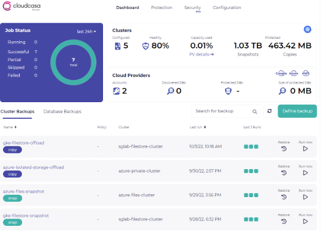{.thumbnail}

After logging in to CloudCasa, navigate to `Protection`{.action} tab > `Clusters`{.action} > `Overview`{.action} and click on the `Add cluster`{.action} button at the top right.

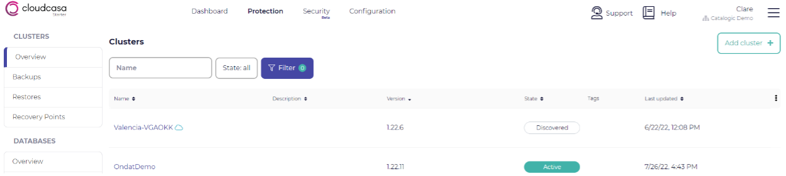{.thumbnail}

Provide the cluster name and description, then click on the `Save`{.action} button.

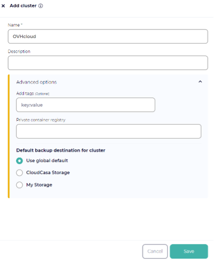{.thumbnail}

This will display a kubectl command to run to install the CloudCasa agent. 

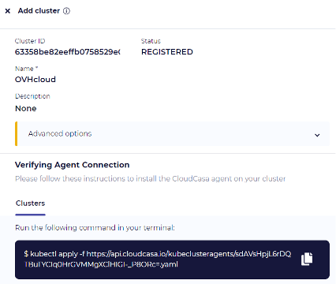{.thumbnail}

Run the kubectl command on your cluster and confirm that the registered Kubernetes cluster moves into the Active state in the CloudCasa UI. This should take no more than a couple of minutes.
Your CloudCasa agent has now successfully been deployed.

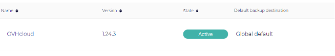{.thumbnail}
 
### Step 2 – Create a dummy application  

Start by creating an example deployment in a new namespace `ovhcloud-and-cloudcasa-test`:

```shell
kubectl create namespace ovhcloud-and-cloudcasa-test
```

Then apply the following configuration using:

```shell
kubectl create -f <path to .yaml> 
```

```yaml
apiVersion: v1 
kind: PersistentVolumeClaim 
metadata: 
  name: mypvc 
  namespace: ovhcloud-and-cloudcasa-test 
spec: 
  storageClassName: csi-cinder-classic 
  accessModes: 
    - ReadWriteOnce 
  resources: 
    requests: 
      storage: 2Gi 
--- 
apiVersion: apps/v1 
kind: Deployment 
metadata: 
  name: myapp-deployment 
  namespace: ovhcloud-and-cloudcasa-test 
spec: 
  replicas: 1 
  selector: 
    matchLabels: 
      app: myapp 
  template: 
    metadata: 
      labels: 
        app: myapp 
    spec: 
      containers: 
      - name: date 
        image: debian:9-slim 
        command: ["/bin/sh","-c"] 
        args: ["while true; do /bin/date | /usr/bin/tee -a /mnt/date ; /bin/sleep 5; done"] 
        volumeMounts: 
          - mountPath: /mnt 
            name: data-mount 
      - name: sidecar 
        image: debian:9-slim 
        command: ["/bin/sh","-c"] 
        args: ["/bin/sleep 3600"] 
        securityContext: 
          privileged: true 
        volumeMounts: 
          - mountPath: /mnt 
            name: data-mount 
      volumes: 
      - name: data-mount 
        persistentVolumeClaim: 
          claimName: mypvc 
```

This deployment creates a pod with 2 containers. The date container will simply append the date to stdout and /mnt/date every 5 seconds:

```shell
kubectl -n ovhcloud-and-cloudcasa-test exec myapp-deployment-<pod-name> -c date -- cat /mnt/date 
```

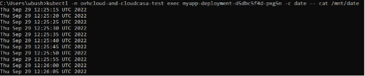{.thumbnail}

The sidecar container simply mounts in the PVC under /mnt and then lies dormant. This container will be used during the snapshot process to quiesce the filesystem so a consistent snapshot can be taken. It serves no other purpose. Notice how this container must have the privileged flag set to true. This is necessary in order to run the ```fsfreeze``` command.

### Step 3 – Configure the volume snapshot class 

Delete the CloudCasa volume snapshot class:

```shell
kubectl delete volumesnapshotclass cloudcasa-cinder-csi-openstack-org 
```

Edit the `volumesnapshotclass`:

```shell
kubectl edit volumesnapshotclass csi-cinder-snapclass-in-use-v1 
```

Edit this VSC to make the following changes: 
Add the following label:

```bash
velero.io/csi-volumesnapshot-class: "true" 
Ensure that DeletionPolicy is set to Retain.  
```

Find a `volumesnapshotclass` example below:

```yaml
# Please edit the object below. Lines beginning with a '#' will be ignored, 
# and an empty file will abort the edit. If an error occurs while saving this file will be 
# reopened with the relevant failures. 
# 
apiVersion: snapshot.storage.k8s.io/v1 
deletionPolicy: Retain 
driver: cinder.csi.openstack.org 
kind: VolumeSnapshotClass 
metadata: 
  creationTimestamp: "2022-09-29T13:41:28Z" 
  generation: 2 
  labels: 
    velero.io/csi-volumesnapshot-class: "true" 
  name: csi-cinder-snapclass-in-use-v1 
  resourceVersion: "3694783821" 
  uid: 2040b84b-b10a-46fe-8d30-2507a12edd58 
parameters: 
  force-create: "true" 
  ```

### Step 4 – Setup a backup policy 

A backup policy allows you to define when backups that use it will run and for how long they will be retained. You can have multiple schedules with different retention times in one policy. For example, a policy may specify the creation of hourly backups that are retained for 7 days, and daily backups that are retained for 30 days.

Navigate to the `Policies`{.action} tab via `Configuration`{.action} > `Protection`{.action} > `Policies`{.action}. Create a Policy by clicking on the `Add policy`{.action} button. Provide the required information, then click on the `Create policy`{.action} button.

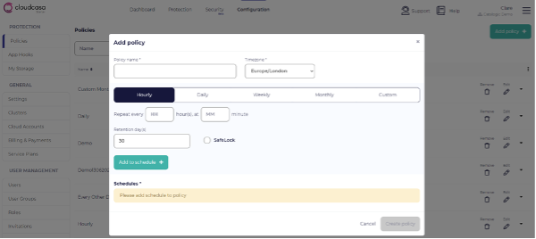{.thumbnail}

### Step 5 – Define and run a backup 

Navigate to the `Dashboard`{.action} tab. Click on `Define backup`{.action}. Provide Backup Name and select the Cluster for which you are defining a backup.

Select either Full Cluster, a Specific Namespace, or provide a Label selector (Optional). If backing up a specific namespace, enter the name of the namespace you want to protect.

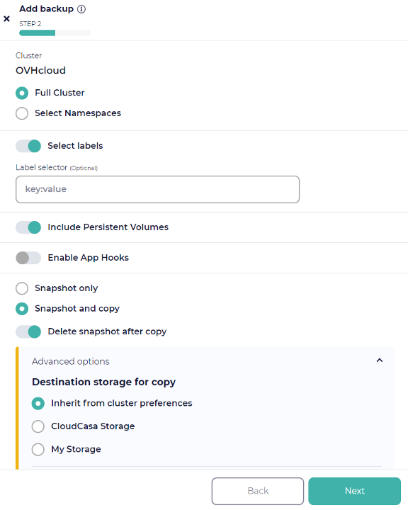{.thumbnail}

For the backup operation, choose whether to snapshot your PVs. Then select one of the two available options:

- Snapshot only
- Snapshot and copy

The “Snapshot and copy” option is only available with a paid subscription.

If you want to run pre- and post-backup commands to enable application consistent backups, select `Enable App Hooks`{.action} and enter the appropriate pre- and post-backup app hook definitions. You will need to have defined custom hooks under Configuration/App Hooks to quiesce the application and filesystem. This isn’t necessary for all applications. If you need assistance with these, use the in-product chat or get in contact with us via casa@cloudcasa.io.

On the next page, enable `Run now`{.action} to run the Backup operation immediately and provide Retention days (the retention period is just for this ad-hoc run). Click on the `Create`{.action} button. This will create a Backup definition.

Navigate to the `Dashboard`{.action} tab and find the Clusters > Backups that you want to run. Click the `Run now`{.action} button on its line. You will see the job running in the dashboard’s Activity tab. Verify that it completes successfully.

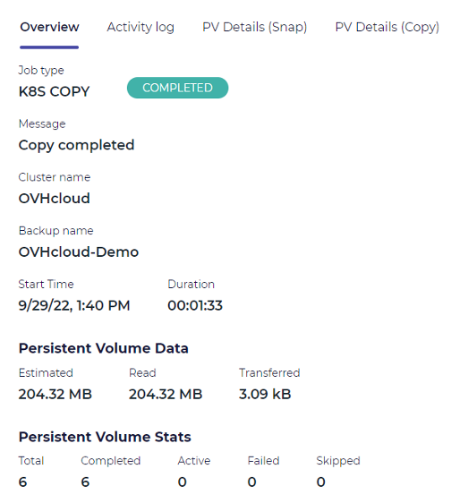{.thumbnail}

### Step 6 – Run a restore operation for the dummy application

Let’s setup a disaster recovery scenario, by deleting our dummy application and the associated namespace:

```shell
kubectl delete -n ovhcloud-and-cloudcasa-test deployments.apps myapp-deployment 

kubectl delete namespaces ovhcloud-and-cloudcasa-test 
```

Now let’s recover our dummy application.
Go back to the Clusters > Backups on the `Dashboard`{.action} and click the `Restore`{.action} icon next to your backup definition in the list.

When the restore page opens, select a specific recovery point by choosing it from the list of available recovery points. Then click the `Next`{.action} button.

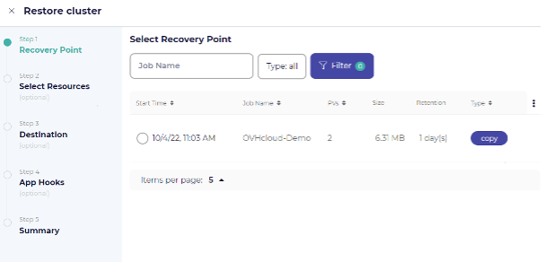{.thumbnail}

On the next page you can choose whether to restore all namespaces in the backup, or only selected namespaces. If you choose the latter, a list of namespaces will be displayed from which you can select the namespace(s) for which the restore operation will be performed. Remember that only namespaces included in the backup will be shown.

For the demo, we will recover the full `ovhcloud-and-cloudcasa-test` namespace. 
We also support the recovery of specific resource types, and utilising post-restore scripts for the recovery via enabling app hooks.

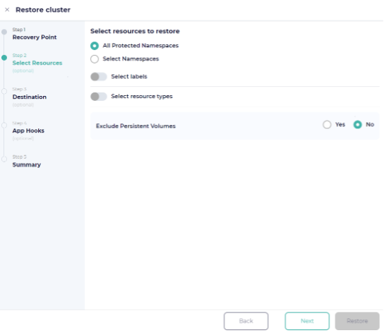{.thumbnail}

Note that existing namespaces cannot be over-written, so if you want to restore an existing namespace to a cluster, you need to delete the old one first. You can also rename namespaces when restoring (later).

You can add labels to be used to select resources for restore as well. These are key: value pairs, and will not be validated by the UI. We can add them one at a time or add multiple pairs at once, separated by spaces.

Finally, we need to choose whether or not to restore PV snapshots. If you toggle off the "Exclude persistent volumes" option, PVs will be restored using the snapshots or copies associated with the recovery point you’ve selected.

Remember that if you have selected specific namespaces or labels for restore, only PVs in the namespaces or with the labels you’ve selected will be restored.

On the next page, you will be presented with destination options.

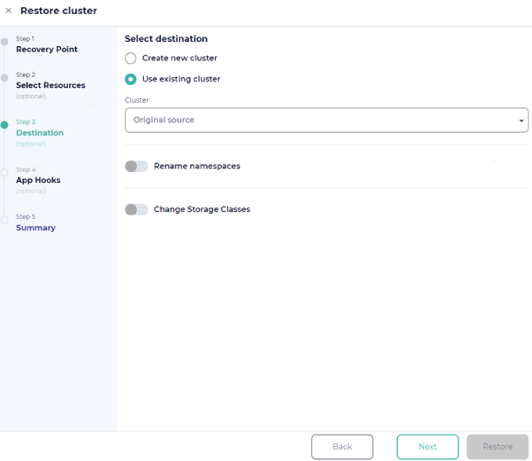{.thumbnail}

The system will also save the job under its name so that you can modify and re-run it later.

On the next step, you can choose an alternate cluster to restore to. By default, the restore will go to the original cluster. You can choose to rename restored namespaces by adding a prefix and/or suffix and change the storage classes if desired.

Remember that all the restored namespaces will have these prefixes or suffixes added, so if you want to rename only specific namespaces, you should run multiple restores and select those namespaces explicitly.

Finally, provide the restore job with a name. Click the `Restore`{.action} button and CloudCasa will do the rest! You can watch the progress of the restore job in the progress pane. You can also edit and re-run it, if you wish, under the cluster’s `Restore`{.action} tab.

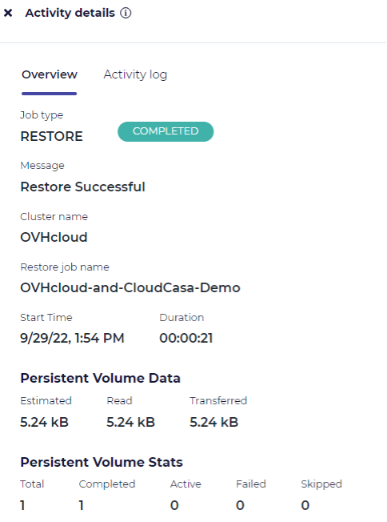{.thumbnail}

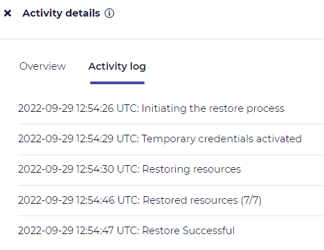{.thumbnail}

Confirm the application is back up and running.

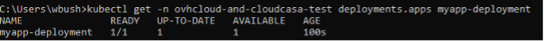{.thumbnail}

Finally let’s view the contents of the `/mnt/date` in the application’s pod. You can see the 14 minutes gap here which aligns with the snapshot time of 12:40 and the restore time of 12:54.

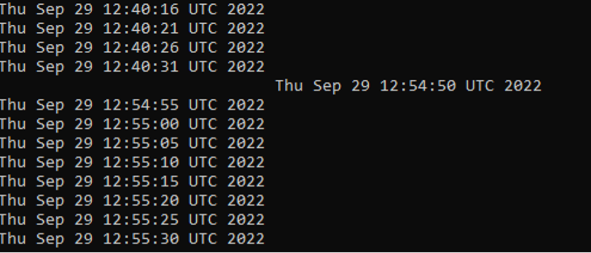{.thumbnail}

## Recap

Congratulations, you are done! That’s all there is to it!
Now you can sit back and relax, knowing that you can now take ad-hoc or scheduled backups and perform restores of your OVHcloud Managed Kubernetes clusters, namespaces and applications using CloudCasa.

## Go further

In case you have questions, you can read the [FAQ page](https://cloudcasa.io/faq/) and access the [dedicated forum](https://cloudcasa.io/forum/forum/cloudcasa/).
