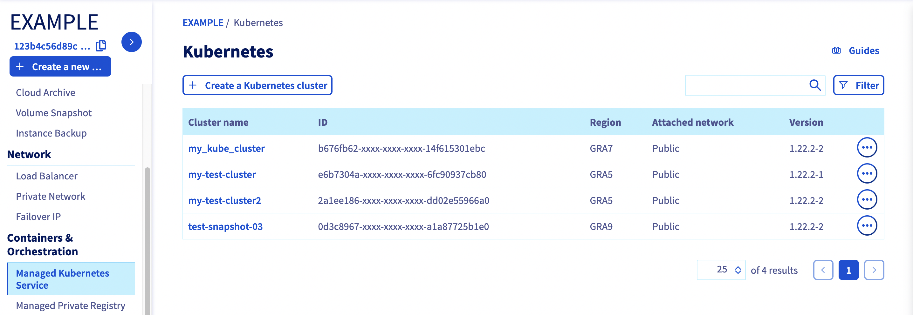
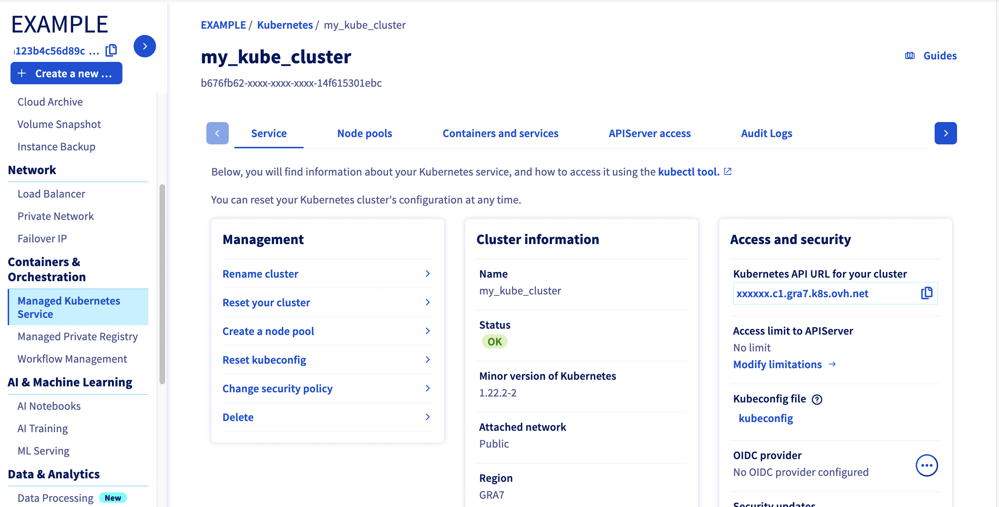

**Last updated 29th January, 2019.**


## Objective

The OVH Managed Kubernetes service provides you with access to Kubernetes clusters, without the hassle of installing or operating them. 

**Find out how to recover the *kubetcl* configuration file to interact with an OVH Managed Kubernetes cluster.**


## Requirements

- You must have an OVH Managed Kubernetes cluster.
- You must have the [*kubectl*](https://kubernetes.io/docs/reference/kubectl/overview/){.external} command-line tool installed.

You can find the detailed installation instructions for *kubetcl* in Kubernetes' [official documentation](https://kubernetes.io/docs/home/){.external}.

## Instructions


### Step 1 - Configure the default settings for kubectl

First, log in to the OVH Control Panel, open the 'Cloud' tab, and click on the 'Platforms and Services' menu:

{.thumbnail}

Then, download the *kubetcl* configuration file:

{.thumbnail}

If you want to use this configuration file by default in *kubetcl*, you can save it with the filename `kube-config` in the `$HOME/.kube` directory. Alternatively, you can place it in your working directory, with either the `KUBECONFIG` environment variable or the `--kubeconfig` flag. 

In this example, we are using the environment variable method.

#### For MacOS or Linux:

Type the following command into your terminal:

```
export KUBECONFIG=./kube-config
```

#### For Windows : 

1. From the Desktop, right-click the bottom-left corner of the screen to get the Power User Tasks Menu.
2. In this menu, click *System*.

In Windows 10, you may need to scroll down to the *Related settings* section and click the *System info* link. In the System window that opens, click the *Advanced system settings* link in the left-hand column.

1. In the System Properties window, click on the *Advanced* tab, then click the *Environment Variables* button near the bottom.
2. In the window that opens (pictured below), add a new variable, `KUBECONFIG`, with the path to the `kube-config` file as its value.


 {.thumbnail}


You can also add the variable for the current shell process with this command :

```
set KUBECONFIG=kube-config
```


### Step 2 - Verify that *kubectl* can connect to the cluster


You can verify that *kubetcl* is able to interact with the cluster by using it to send a `cluster-info` command:

```
kubectl cluster-info
```

The cluster should return a response with some key information about itself:

```
kubectl cluster-info
Kubernetes master is running at https://******.c1.gra.k8s.ovh.net
KubeDNS is running at https://******.c1.gra.k8s.ovh.net/api/v1/namespaces/kube-system/services/kube-dns:dns/proxy
```

To further debug and diagnose cluster problems, use: 

```
kubectl cluster-info dump
```

## Go further

To deploy your first application on your Kubernetes cluster, we suggest you refer to our guide to [Deploying an application](../deploying_an_application).

Join our community of users on [https://community.ovh.com/en/](https://community.ovh.com/en/){.external}.