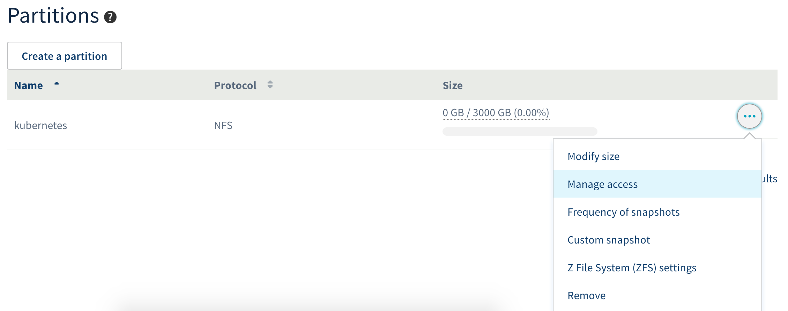
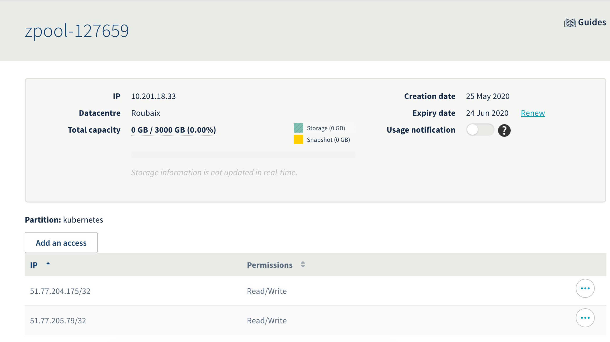

<style>
 pre {
     font-size: 14px;
 }
 pre.console {
   background-color: #300A24;
   color: #ccc;
   font-family: monospace;
   padding: 5px;
   margin-bottom: 5px;
 }
 pre.console code {
   border: solid 0px transparent;
   font-family: monospace !important;
   font-size: 0.75em;
   color: #ccc;
 }
 .small {
     font-size: 0.75em;
 }
</style>

**Last updated July 20<sup>th</sup>, 2020.**

## Objective

OVHcloud Managed Kubernetes natively integrates Block Storage as persistent volumes. This technology may however not be suited to some legacy or non cloud-native applications, often requiring to share this persistent data accross different pods on multiple worker nodes (ReadWriteMany or RWX). If you would need to do so for part of your workloads, one of the solution is to use NFS volumes. [OVHcloud NAS-HA](https://www.ovh.com/ca/en/nas/) is a managed solution that lets you configure easily an NFS server and multiple NFS volumes. In this tutorial we are going to see how to configure your OVHcloud Managed Kubernetes cluster to use [OVHcloud NAS-HA](https://www.ovh.com/ca/en/nas/) as an NFS provider for [Kubernetes Persistent Volumes](https://kubernetes.io/docs/concepts/storage/persistent-volumes/).

## Requirements

This tutorial assumes that you already have a working [OVHcloud Managed Kubernetes](https://www.ovhcloud.com/en/public-cloud/kubernetes/) cluster, and some basic knowledge of how to operate it. If you want to know more on those topics, please look at the [deploying a Hello World application](../deploying-hello-world/) documentation.

It also assumes you have an OVHcloud NAS-HA already available. If you don't, you can [order one in the OVHcloud Control Panel](https://www.ovh.com/manager/dedicated/#/configuration/nas).

You also need to have [Helm](https://docs.helm.sh/) installed on your workstation, please refer to the [How to install Helm on OVHcloud Managed Kubernetes Service](../installing-helm/) tutorial.

## Instructions

### Step 1 - Creating a partition and granting your Managed Kubernetes Service access to it

Your NAS-HA can expose multiple partitions, and supports a variety of protocols. Each partition is accessible only from a specific range of IPs. We will create one exposing NFS and make it accessible from your Kubernetes worker nodes.

Access the UI for OVHcloud NAS-HA by clicking the *NAS and CDN* menu in the [Server section of the OVHcloud Control Panel](https://www.ovh.com/manager/dedicated)

Create a new NFS partition in your Zpool:

{.thumbnail}

Once the partition is created, we needs to allow our Kubernetes nodes to access our newly created partition.

Get our Kubernetes nodes IP:
```bash
kubectl get nodes -o jsonpath='{ $.items[*].status.addresses[?(@.type=="InternalIP")].address }'
```

<pre class="console"><code>$ kubectl get nodes -o jsonpath='{ $.items[*].status.addresses[?(@.type=="InternalIP")].address }'
51.77.204.175 51.77.205.79
</code></pre>

Click on the *Manage Access* menu of our newly created partition:
{.thumbnail}

Add our nodes IP one by one:
{.thumbnail}

You should now have something similar to this:
{.thumbnail}

In this example our `ZPOOL_IP` is `10.201.18.33`, our `ZPOOL_NAME` is `zpool-127659`, and our `PARTITION_NAME` is `kubernetes`. Please modify this accordingly in the later steps.

### Step 2 - Configuring Kubernetes to use our newly created NFS partition

Your Kubernetes cluster need some additionnal piece of software to make use of the NFS partition. We will install those and then create a first volume, shared accross multiple pods.

First, let's create a `values.yaml` configuration file for the NFS client provisioner Helm installation:

```yaml
nfs:
  server: '[ZPOOL_IP]'
  path: '/[ZPOOL_NAME]/[PARTITION_NAME]'
  mountOptions:
    - tcp
    - nfsvers=3
storageClass:
  name: nfs
```

And then install the `nfs-client-provisioner`:

```bash
helm install nfs-client-provisioner -n kube-system stable/nfs-client-provisioner -f values.yaml
```

<pre class="console"><code>$ helm install nfs-client-provisioner -n kube-system stable/nfs-client-provisioner -f values.yaml
NAME: nfs-client-provisioner
LAST DEPLOYED: Mon Jun  8 14:39:57 2020
NAMESPACE: kube-system
STATUS: deployed
REVISION: 1
TEST SUITE: None
</code></pre>

Let's verify our installation:

```bash
kubectl get deploy nfs-client-provisioner -n kube-system
```

<pre class="console"><code>$ kubectl get deploy nfs-client-provisioner -n kube-system
NAME                     READY   UP-TO-DATE   AVAILABLE   AGE
nfs-client-provisioner   1/1     1            1           36s
</code></pre>

### Step 3 - Create and use an NFS persistent volume

Let’s create a `nfs-persistent-volume-claim.yaml` file:

```yaml
kind: PersistentVolumeClaim
apiVersion: v1
metadata:
  name: nfs-pvc
  namespace: default
spec:
  accessModes:
  - ReadWriteOnce
  storageClassName: nfs
  resources:
    requests:
      storage: 1Gi
```

And apply this to create the persistent volume claim:

```bash
kubectl apply -f nfs-persistent-volume-claim.yaml
```

Let’s now create two Nginx pods using the persistent volume claim as their webroot folder on two different kubernetes nodes. In this example the kubernetes nodes are called `kubernetes-node-1` and `kubernetes-node-2`, please modify this accordingly. Let’s create a `nfs-nginx-pods.yaml` file:

```yaml
apiVersion: v1
kind: Pod
metadata:
  name: nfs-nginx-1
  namespace: default
spec:
  nodeName: kubernetes-node-1
  volumes:
    - name: nfs-volume
      persistentVolumeClaim:
        claimName: nfs-pvc
  containers:
    - name: nginx
      image: nginx
      ports:
        - containerPort: 80
          name: "http-server"
      volumeMounts:
        - mountPath: "/usr/share/nginx/html"
          name: nfs-volume

---

apiVersion: v1
kind: Pod
metadata:
  name: nfs-nginx-2
  namespace: default
spec:
  nodeName: kubernetes-node-2
  volumes:
    - name: nfs-volume
      persistentVolumeClaim:
        claimName: nfs-pvc
  containers:
    - name: nginx
      image: nginx
      ports:
        - containerPort: 80
          name: "http-server"
      volumeMounts:
        - mountPath: "/usr/share/nginx/html"
          name: nfs-volume
```

And apply this to create the Nginx pods:

```bash
kubectl apply -f nfs-nginx-pods.yaml
```

Let’s enter inside the first Nginx container to create a file on the NFS presistent volume:

```bash
kubectl exec -it nfs-nginx-1 -n default -- bash
```

Create a new `index.html` file:

```bash
echo "NFS volume!" > /usr/share/nginx/html/index.html
```

And exit the Nginx container:

```bash
exit
```

Let’s try to access our new web page:

```bash
kubectl proxy
```

And open the URL [http://localhost:8001/api/v1/namespaces/default/pods/http:nfs-nginx-1:/proxy/](http://localhost:8001/api/v1/namespaces/default/pods/http:nfs-nginx-1:/proxy/)

Now let’s try to see if the data is shared with the second pod. Open the URL [http://localhost:8001/api/v1/namespaces/default/pods/http:nfs-nginx-2:/proxy/](http://localhost:8001/api/v1/namespaces/default/pods/http:nfs-nginx-2:/proxy/)

As you can see the data is correctly shared between the two Nginx pods running on two different Kubernetes nodes.
Congratulations, you have successfully set up a multi-attach persistent volume with OVHcloud NAS-HA!

## Go further

To learn more about using your Kubernetes cluster the practical way, we invite you to look at our [OVHcloud Managed Kubernetes doc site](../).

Join our community of users on [https://community.ovh.com/en/](https://community.ovh.com/en/).