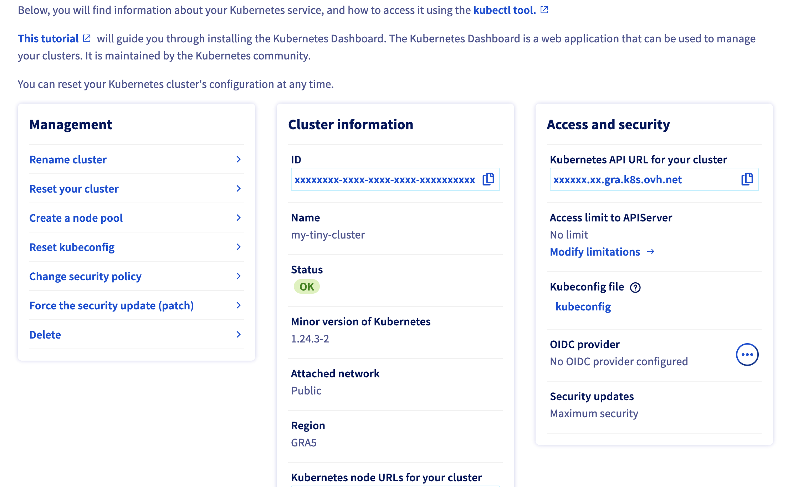

**Last updated 24th November 2022**

## Objective

The OVHcloud Managed Kubernetes service provides you Kubernetes clusters without the hassle of installing or operating them. 

This guide will cover the feature that allows you to secure your OVHcloud Managed Kubernetes cluster with OpenID Connect (OIDC).

In this guide you will be able to configure your OIDC provider through the OVHcloud Control Panel, OVHcloud API and Terraform.

## Requirements

- A [Public Cloud project](https://www.ovhcloud.com/fr/public-cloud/) in your OVHcloud account
- Access to the [OVHcloud Control Panel](https://www.ovh.com/auth/?action=gotomanager&from=https://www.ovh.com/fr/&ovhSubsidiary=fr)
- An OVHcloud Managed Kubernetes cluster

## Warning

> [!warning]
> Several elementary validations are made (e.g. on provider URL, CA content and required claims) but if you misconfigure your OIDC provider, errors will be logged by the Kubernetes API Server, and thus only visible through the cluster's audit logs in the OVHcloud Control Panel.

## Instructions

### Configure OIDC provider through the OVHcloud Control Panel

Log in to the [OVHcloud Control Panel](https://www.ovh.com/auth/?action=gotomanager&from=https://www.ovh.com/fr/&ovhSubsidiary=fr), go to the `Public Cloud`{.action} section and select the Public Cloud project concerned.

Access the administration UI for your OVHcloud Managed Kubernetes clusters by clicking on `Managed Kubernetes Service`{.action} in the left-hand menu.

{.thumbnail}

Click on your Kubernetes cluster.

{.thumbnail}

Click on the `...` button in the `OIDC provider` section.

{.thumbnail}

Fill the needed information in the popup (note: each field corresponds to a flag from the [API Server configuration documentation](https://kubernetes.io/docs/reference/access-authn-authz/authentication/#configuring-the-api-server):

* `Provider URL`: The OIDC issuer URL.
* `Client ID`: The OIDC client ID.
* `OIDC Username Claim`: JWT claim to use as the user name. By default sub, which is expected to be a unique identifier of the end user. Admins can choose other claims, such as email or name, depending on their provider. However, claims other than email will be prefixed with the issuer URL to prevent naming clashes with other plugins.
* `OIDC Username Prefix`: Prefix prepended to username claims to prevent clashes with existing names (such as `system:users`). For example, the value `oidc:` will create usernames like `oidc:jane.doe`. If this field isn't set and `oidcUsernameClaim` is a value other than email, the prefix defaults to `issuer_url` where `issuer_url` is the value of `oidcIssuerUrl.` The value `-` can be used to disable all prefixing.
* `OIDC Groups Claim`: Array of JWT claim to use as the user's group. If the claim is present it must be an array of strings.
* `OIDC Groups Prefix`: Prefix prepended to group claims to prevent clashes with existing names (such as `system:groups`). For example, the value `oidc:` will create group names like `oidc:engineering` and `oidc:infra`.
* `OIDC Required Claim`: Array of `key=value` pairs that describe required claims in the ID Token. If set, the claims are verified to be present in the ID Token with a matching value."
* `OIDC Signing Algs`: Array of signing algorithms accepted. Default is `RS256`.
* `OIDC CA content`: Content of the certificate for the CA, in Base64 format, that signed your identity provider's web certificate. Defaults to the host's root CAs.

Click on the `Add` button to validate the form and configure the OIDC provider on your Kubernetes cluster.

### Configure OIDC provider through the API

#### The API Explorer

To simplify things, we are using the [API Explorer](https://api.ovh.com/) which allows to explore, learn and interact with the API in an interactive way.

Log in to the API Explorer using your OVHcloud NIC handle.

{.thumbnail}

If you go to the [Kubernetes section](https://api.ovh.com/console/#/kube) of the API Explorer, you will see the available endpoints:

{.thumbnail}

#### API endpoints

- Get an existing cluster's OIDC configuration:

> [!api]
>
> @api {GET} /cloud/project/{serviceName}/kube/{kubeID}/openIdConnect
> 

**Result:**

```json
{
  "issuerUrl": "https://www.ovhcloud.com/fr/",
  "clientId": "my-oidc-client-id",
  "usernameClaim": "email",
  "usernamePrefix": "ovh:",
  "groupsClaim": [
    "groups"
  ],
  "groupsPrefix": "ovh:",
  "signingAlgorithms": [
    "RS512"
  ],
  "caContent": "LS0tLS1CRUdJTiBDRVJUSUZJQ0FURS0tLS0tCk1JSUZhekNDQTFPZ0F3SUJBZ0lVYm9YRkZrL1hCQmdQUUI4UHlqbkttUGVWekNjd0RRWUpLb1pJaHZjTkFRRUwKQlFBd1JURUxNQWtHQTFVRUJoTUNRVlV4RXpBUkJnTlZCQWdNQ2xOdmJXVXRVM1JoZEdVeElUQWZCZ05WQkFvTQpHRWx1ZEdWeWJtVjBJRmRwWkdkcGRITWdVSFI1SUV4MFpEQWVGdzB5TWpFd01UUXdOalE0TlROYUZ3MHlNekV3Ck1UUXdOalE0TlROYU1FVXhDekFKQmdOVkJBWVRBa0ZWTVJNd0VRWURWUVFJREFwVGIyMWxMVk4wWVhSbE1TRXcKSHdZRFZRUUtEQmhKYm5SbGNtNWxkQ0JYYVdSbmFYUnpJRkIwZVNCTWRHUXdnZ0lpTUEwR0NTcUdTSWIzRFFFQgpBUVVBQTRJQ0R3QXdnZ0lLQW9JQ0FRQytPMk53bGx2QTQyT05SUHMyZWlqTUp2UHhpN21RblVSS3FrOHJEV1VkCkwzZU0yM1JXeVhtS1AydDQ5Zi9LVGsweEZNVStOSTUzTEhwWmh6N3NpK3dEUFUvWWZWSS9rQmZsRm8zeVZCMSsKZWdCSnpyNGIrQ3FoaWlCUkh0Vm5LblFKUmdvOVJjVkxhRm82UEY0N1V0UWJ2bWVuNGdERnExVkYwVHhUdnFMdwpIMzRZL0U2QUJsSlZnWFBzaWQzNm54eTErNnlKV05vRXNVekFiekpWMHhzTGhxc2hOazA0TWx4YnBhcG1XcEUxCmFFMHRIZGpjUlI3Y1dTRUUwMnRSQzNYL2tSNjBKb3MxR0N0Y0ZQTTVIN3NjOFBXNFRUem1EWWhOeDRiVjV4T28KU0xYRnI5ajBzZEgxbm1wSlI1dWxJT2dPTWV3MHA2d3JOYVV2MGpxc1hzdVdqMVpxdTRLRi81aEQ3azVhRlhKNQpjYWNTUi9mRWxreW1uZis0eHZFOG8wdkRWNFR5NHo3K3lSS1U0clZvZFNBZWZIN3lqeitLV1RRck96L0lHU2NwCmV1YTdqV0hRMDdMYWxyTjV2b0tFaU1JM3MrWjhzeUdVUGVyYXQwdzJMWlc3NnhxVGl4R002clZxUldxVlQ4L1oKQTJMMEc4WGRvNTZvV2lFYVF5RkJtRDFnMXU2UEsvTmFGVDI1L2tTNWJ1dnF5L1dLVGt0UVNhNHNZc1ZLbUlQTQp0Zys0NUZ2aFErNkRuQzd0TmVnaTZDTkdTb0w0R1dPOEE5UDZRNjE5RkJJZ1VjcGpFMTgvUHpQOEJmcTAxajhnCjZmdm1jNkVPMkxHVHhDcW1DbVp0TnI3OCtQaUxkMHZIY3pqY3E3NzhiNW5WRXRpUVNRQkUyb0ozTVlIZUFIUUkKYVFJREFRQUJvMU13VVRBZEJnTlZIUTRFRmdRVUpaMUhlVmx1U3pjY0U2NEZQYWtuNkRBWnhmSXdId1lEVlIwagpCQmd3Rm9BVUpaMUhlVmx1U3pjY0U2NEZQYWtuNkRBWnhmSXdEd1lEVlIwVEFRSC9CQVV3QXdFQi96QU5CZ2txCmhraUc5dzBCQVFzRkFBT0NBZ0VBQlhNSlU2MjJZVFZVNnZ1K2svNnkwMGNaWlRmVnZtdVJMOXhTcWxVM0I1QmQKVWdyVWx1TmdjN2dhUUlrYzkvWmh2MnhNd0xxUldMWEhiTWx1NkNvdkNiVTVpeWt0NHVWMnl5UzlZYWhmVVRNVQo3TVE0WFRta2hoS0dGbWZBQ2QzTUVwRE55T3hmWXh0UVBwM1NZT2IxRGFKMmUwY01Gc081bytORGQ5aFVBVzFoCjFLMjMwQnZzYldYYVo4MStIdTU4U1BsYTM5R3FMTG85MzR6dEs4WkRWNFRGTVJxMnNVQ1cxcWFidDh5ejd2RzAKSGV3dXdxelRwR1lTSFI1U0ZvMm45R0xKVUN4SnhxcDlOWVJjMlhUdXRUdkJESzVPMXFZZEJaQzd6cmcxSnczawp2SjI4UGx2TzBQRE42ZVlUdElJdC9yU05ZbW56eVVNRTRYREt0di9KRitLZWZNSWxDTkpzZDRHYXVTdlo5M1NOClhINmcrNEZvRkp4UzNxRmZ0WEc4czNRNnppNzNLRzh5UHZVNHU0WmZNRGd2aG92L0V5YkNLWUpFdVVZSlJWNGEKbmc3cWh3NDBabXQ0eWNCRzU5a2tFSGhNYWtxTWpPaUNkV2x4MEVjZXIxcEFGT1pqN3o1NktURXIxa0ZwUHVaRApjVER5SnNwTjh6dm9CQ0l1ancvQjR6S3kyWStOQitRR1p3dXhyTk9mRGR6ek9yQUE1Ym9OS2gwUUh4c0RxNTExClFaU3hCR21EcGJzN2QzMUQvQll3WEhIUWdwb3FoVUU5dFBGSThpN0pkM2FyeXZCdHlnTWlxSmt1VlRFVk1Ta0UKNTZ0VnFsMjlXenFhRXNrbDN3VUlmczVKKzN3RzRPcWNxRDdXaGQxWUtnc0VUMjdFTWlqVXZIYzQ4TXE0bU1rPQotLS0tLUVORCBDRVJUSUZJQ0FURS0tLS0tCg==",
  "requiredClaim": [
    "claim1=val1"
  ]
}
```

- Update an existing cluster's OIDC provider to change username and groups prefix:

> [!api]
>
> @api {PUT} /cloud/project/{serviceName}/kube/{kubeID}/openIdConnect
> 

```json
{
  "issuerUrl": "https://www.ovhcloud.com/fr/",
  "clientId": "my-oidc-client-id",
  "usernameClaim": "email",
  "usernamePrefix": "ovhcloud:",
  "groupsClaim": [
    "groups"
  ],
  "groupsPrefix": "ovhcloud:",
  "signingAlgorithms": [
    "RS512"
  ],
  "caContent": "LS0tLS1CRUdJTiBDRVJUSUZJQ0FURS0tLS0tCk1JSUZhekNDQTFPZ0F3SUJBZ0lVYm9YRkZrL1hCQmdQUUI4UHlqbkttUGVWekNjd0RRWUpLb1pJaHZjTkFRRUwKQlFBd1JURUxNQWtHQTFVRUJoTUNRVlV4RXpBUkJnTlZCQWdNQ2xOdmJXVXRVM1JoZEdVeElUQWZCZ05WQkFvTQpHRWx1ZEdWeWJtVjBJRmRwWkdkcGRITWdVSFI1SUV4MFpEQWVGdzB5TWpFd01UUXdOalE0TlROYUZ3MHlNekV3Ck1UUXdOalE0TlROYU1FVXhDekFKQmdOVkJBWVRBa0ZWTVJNd0VRWURWUVFJREFwVGIyMWxMVk4wWVhSbE1TRXcKSHdZRFZRUUtEQmhKYm5SbGNtNWxkQ0JYYVdSbmFYUnpJRkIwZVNCTWRHUXdnZ0lpTUEwR0NTcUdTSWIzRFFFQgpBUVVBQTRJQ0R3QXdnZ0lLQW9JQ0FRQytPMk53bGx2QTQyT05SUHMyZWlqTUp2UHhpN21RblVSS3FrOHJEV1VkCkwzZU0yM1JXeVhtS1AydDQ5Zi9LVGsweEZNVStOSTUzTEhwWmh6N3NpK3dEUFUvWWZWSS9rQmZsRm8zeVZCMSsKZWdCSnpyNGIrQ3FoaWlCUkh0Vm5LblFKUmdvOVJjVkxhRm82UEY0N1V0UWJ2bWVuNGdERnExVkYwVHhUdnFMdwpIMzRZL0U2QUJsSlZnWFBzaWQzNm54eTErNnlKV05vRXNVekFiekpWMHhzTGhxc2hOazA0TWx4YnBhcG1XcEUxCmFFMHRIZGpjUlI3Y1dTRUUwMnRSQzNYL2tSNjBKb3MxR0N0Y0ZQTTVIN3NjOFBXNFRUem1EWWhOeDRiVjV4T28KU0xYRnI5ajBzZEgxbm1wSlI1dWxJT2dPTWV3MHA2d3JOYVV2MGpxc1hzdVdqMVpxdTRLRi81aEQ3azVhRlhKNQpjYWNTUi9mRWxreW1uZis0eHZFOG8wdkRWNFR5NHo3K3lSS1U0clZvZFNBZWZIN3lqeitLV1RRck96L0lHU2NwCmV1YTdqV0hRMDdMYWxyTjV2b0tFaU1JM3MrWjhzeUdVUGVyYXQwdzJMWlc3NnhxVGl4R002clZxUldxVlQ4L1oKQTJMMEc4WGRvNTZvV2lFYVF5RkJtRDFnMXU2UEsvTmFGVDI1L2tTNWJ1dnF5L1dLVGt0UVNhNHNZc1ZLbUlQTQp0Zys0NUZ2aFErNkRuQzd0TmVnaTZDTkdTb0w0R1dPOEE5UDZRNjE5RkJJZ1VjcGpFMTgvUHpQOEJmcTAxajhnCjZmdm1jNkVPMkxHVHhDcW1DbVp0TnI3OCtQaUxkMHZIY3pqY3E3NzhiNW5WRXRpUVNRQkUyb0ozTVlIZUFIUUkKYVFJREFRQUJvMU13VVRBZEJnTlZIUTRFRmdRVUpaMUhlVmx1U3pjY0U2NEZQYWtuNkRBWnhmSXdId1lEVlIwagpCQmd3Rm9BVUpaMUhlVmx1U3pjY0U2NEZQYWtuNkRBWnhmSXdEd1lEVlIwVEFRSC9CQVV3QXdFQi96QU5CZ2txCmhraUc5dzBCQVFzRkFBT0NBZ0VBQlhNSlU2MjJZVFZVNnZ1K2svNnkwMGNaWlRmVnZtdVJMOXhTcWxVM0I1QmQKVWdyVWx1TmdjN2dhUUlrYzkvWmh2MnhNd0xxUldMWEhiTWx1NkNvdkNiVTVpeWt0NHVWMnl5UzlZYWhmVVRNVQo3TVE0WFRta2hoS0dGbWZBQ2QzTUVwRE55T3hmWXh0UVBwM1NZT2IxRGFKMmUwY01Gc081bytORGQ5aFVBVzFoCjFLMjMwQnZzYldYYVo4MStIdTU4U1BsYTM5R3FMTG85MzR6dEs4WkRWNFRGTVJxMnNVQ1cxcWFidDh5ejd2RzAKSGV3dXdxelRwR1lTSFI1U0ZvMm45R0xKVUN4SnhxcDlOWVJjMlhUdXRUdkJESzVPMXFZZEJaQzd6cmcxSnczawp2SjI4UGx2TzBQRE42ZVlUdElJdC9yU05ZbW56eVVNRTRYREt0di9KRitLZWZNSWxDTkpzZDRHYXVTdlo5M1NOClhINmcrNEZvRkp4UzNxRmZ0WEc4czNRNnppNzNLRzh5UHZVNHU0WmZNRGd2aG92L0V5YkNLWUpFdVVZSlJWNGEKbmc3cWh3NDBabXQ0eWNCRzU5a2tFSGhNYWtxTWpPaUNkV2x4MEVjZXIxcEFGT1pqN3o1NktURXIxa0ZwUHVaRApjVER5SnNwTjh6dm9CQ0l1ancvQjR6S3kyWStOQitRR1p3dXhyTk9mRGR6ek9yQUE1Ym9OS2gwUUh4c0RxNTExClFaU3hCR21EcGJzN2QzMUQvQll3WEhIUWdwb3FoVUU5dFBGSThpN0pkM2FyeXZCdHlnTWlxSmt1VlRFVk1Ta0UKNTZ0VnFsMjlXenFhRXNrbDN3VUlmczVKKzN3RzRPcWNxRDdXaGQxWUtnc0VUMjdFTWlqVXZIYzQ4TXE0bU1rPQotLS0tLUVORCBDRVJUSUZJQ0FURS0tLS0tCg==",
  "requiredClaim": [
    "claim1=val1"
  ]
}
```

- Configure an OIDC provider for your OVHcloud Managed Kubernetes cluster:

> [!api]
>
> @api {POST} /cloud/project/{serviceName}/kube/{kubeID}/openIdConnect
> 

```json
{
  "issuerUrl": "https://www.ovhcloud.com/fr/",
  "clientId": "my-oidc-client-id",
  "usernameClaim": "email",
  "usernamePrefix": "ovh:",
  "groupsClaim": [
    "groups"
  ],
  "groupsPrefix": "ovh:",
  "signingAlgorithms": [
    "RS512"
  ],
  "caContent": "LS0tLS1CRUdJTiBDRVJUSUZJQ0FURS0tLS0tCk1JSUZhekNDQTFPZ0F3SUJBZ0lVYm9YRkZrL1hCQmdQUUI4UHlqbkttUGVWekNjd0RRWUpLb1pJaHZjTkFRRUwKQlFBd1JURUxNQWtHQTFVRUJoTUNRVlV4RXpBUkJnTlZCQWdNQ2xOdmJXVXRVM1JoZEdVeElUQWZCZ05WQkFvTQpHRWx1ZEdWeWJtVjBJRmRwWkdkcGRITWdVSFI1SUV4MFpEQWVGdzB5TWpFd01UUXdOalE0TlROYUZ3MHlNekV3Ck1UUXdOalE0TlROYU1FVXhDekFKQmdOVkJBWVRBa0ZWTVJNd0VRWURWUVFJREFwVGIyMWxMVk4wWVhSbE1TRXcKSHdZRFZRUUtEQmhKYm5SbGNtNWxkQ0JYYVdSbmFYUnpJRkIwZVNCTWRHUXdnZ0lpTUEwR0NTcUdTSWIzRFFFQgpBUVVBQTRJQ0R3QXdnZ0lLQW9JQ0FRQytPMk53bGx2QTQyT05SUHMyZWlqTUp2UHhpN21RblVSS3FrOHJEV1VkCkwzZU0yM1JXeVhtS1AydDQ5Zi9LVGsweEZNVStOSTUzTEhwWmh6N3NpK3dEUFUvWWZWSS9rQmZsRm8zeVZCMSsKZWdCSnpyNGIrQ3FoaWlCUkh0Vm5LblFKUmdvOVJjVkxhRm82UEY0N1V0UWJ2bWVuNGdERnExVkYwVHhUdnFMdwpIMzRZL0U2QUJsSlZnWFBzaWQzNm54eTErNnlKV05vRXNVekFiekpWMHhzTGhxc2hOazA0TWx4YnBhcG1XcEUxCmFFMHRIZGpjUlI3Y1dTRUUwMnRSQzNYL2tSNjBKb3MxR0N0Y0ZQTTVIN3NjOFBXNFRUem1EWWhOeDRiVjV4T28KU0xYRnI5ajBzZEgxbm1wSlI1dWxJT2dPTWV3MHA2d3JOYVV2MGpxc1hzdVdqMVpxdTRLRi81aEQ3azVhRlhKNQpjYWNTUi9mRWxreW1uZis0eHZFOG8wdkRWNFR5NHo3K3lSS1U0clZvZFNBZWZIN3lqeitLV1RRck96L0lHU2NwCmV1YTdqV0hRMDdMYWxyTjV2b0tFaU1JM3MrWjhzeUdVUGVyYXQwdzJMWlc3NnhxVGl4R002clZxUldxVlQ4L1oKQTJMMEc4WGRvNTZvV2lFYVF5RkJtRDFnMXU2UEsvTmFGVDI1L2tTNWJ1dnF5L1dLVGt0UVNhNHNZc1ZLbUlQTQp0Zys0NUZ2aFErNkRuQzd0TmVnaTZDTkdTb0w0R1dPOEE5UDZRNjE5RkJJZ1VjcGpFMTgvUHpQOEJmcTAxajhnCjZmdm1jNkVPMkxHVHhDcW1DbVp0TnI3OCtQaUxkMHZIY3pqY3E3NzhiNW5WRXRpUVNRQkUyb0ozTVlIZUFIUUkKYVFJREFRQUJvMU13VVRBZEJnTlZIUTRFRmdRVUpaMUhlVmx1U3pjY0U2NEZQYWtuNkRBWnhmSXdId1lEVlIwagpCQmd3Rm9BVUpaMUhlVmx1U3pjY0U2NEZQYWtuNkRBWnhmSXdEd1lEVlIwVEFRSC9CQVV3QXdFQi96QU5CZ2txCmhraUc5dzBCQVFzRkFBT0NBZ0VBQlhNSlU2MjJZVFZVNnZ1K2svNnkwMGNaWlRmVnZtdVJMOXhTcWxVM0I1QmQKVWdyVWx1TmdjN2dhUUlrYzkvWmh2MnhNd0xxUldMWEhiTWx1NkNvdkNiVTVpeWt0NHVWMnl5UzlZYWhmVVRNVQo3TVE0WFRta2hoS0dGbWZBQ2QzTUVwRE55T3hmWXh0UVBwM1NZT2IxRGFKMmUwY01Gc081bytORGQ5aFVBVzFoCjFLMjMwQnZzYldYYVo4MStIdTU4U1BsYTM5R3FMTG85MzR6dEs4WkRWNFRGTVJxMnNVQ1cxcWFidDh5ejd2RzAKSGV3dXdxelRwR1lTSFI1U0ZvMm45R0xKVUN4SnhxcDlOWVJjMlhUdXRUdkJESzVPMXFZZEJaQzd6cmcxSnczawp2SjI4UGx2TzBQRE42ZVlUdElJdC9yU05ZbW56eVVNRTRYREt0di9KRitLZWZNSWxDTkpzZDRHYXVTdlo5M1NOClhINmcrNEZvRkp4UzNxRmZ0WEc4czNRNnppNzNLRzh5UHZVNHU0WmZNRGd2aG92L0V5YkNLWUpFdVVZSlJWNGEKbmc3cWh3NDBabXQ0eWNCRzU5a2tFSGhNYWtxTWpPaUNkV2x4MEVjZXIxcEFGT1pqN3o1NktURXIxa0ZwUHVaRApjVER5SnNwTjh6dm9CQ0l1ancvQjR6S3kyWStOQitRR1p3dXhyTk9mRGR6ek9yQUE1Ym9OS2gwUUh4c0RxNTExClFaU3hCR21EcGJzN2QzMUQvQll3WEhIUWdwb3FoVUU5dFBGSThpN0pkM2FyeXZCdHlnTWlxSmt1VlRFVk1Ta0UKNTZ0VnFsMjlXenFhRXNrbDN3VUlmczVKKzN3RzRPcWNxRDdXaGQxWUtnc0VUMjdFTWlqVXZIYzQ4TXE0bU1rPQotLS0tLUVORCBDRVJUSUZJQ0FURS0tLS0tCg==",
  "requiredClaim": [
    "claim1=val1"
  ]
}
```

- Delete an existing cluster's OIDC configuration:

> [!api]
>
> @api {DELETE} /cloud/project/{serviceName}/kube/{kubeID}/openIdConnect
> 

### Configure OIDC provider through Terraform

Since the version 0.23+ of our [OVH Terraform provider](https://registry.terraform.io/providers/ovh/ovh/latest/docs) you can add IP restrictions also through Terraform.

#### Getting your cluster/API tokens information

The "OVH provider" needs to be configured with a set of credentials:

* an `application_key`
* an `application_secret`
* a `consumer_key`

**Why?**

Because, behind the scenes, the "OVH Terraform provider" is doing requests to OVHcloud APIs. 

In order to retrieve this necessary information, please follow our [First steps with the OVHcloud APIs](https://docs.ovh.com/fr/api/first-steps-with-ovh-api/) tutorial.

Specifically, you have to generate these credentials via the [OVHcloud token generation page](https://api.ovh.com/createToken/?GET=/*&POST=/*&PUT=/*&DELETE=/*) with the following rights:

{.thumbnail}

When you have successfully generated your OVHcloud tokens, please save them as you will have to use them very soon.

The last needed information is the `service_name`: it is the ID of your Public Cloud project.

**How to get it?**

In the Public Cloud section, you can retrieve your service name ID thanks to the `Copy to clipboard`{.action} button.

{.thumbnail}

You will also use this information in Terraform resources definition files.

#### Terraform instructions

First, create a `provider.tf` file with the minimum version, european endpoint ("ovh-eu") and the keys previously retrieved in this guide.

Terraform 0.13 and later:

```bash
terraform {
  required_providers {
    ovh = {
      source  = "ovh/ovh"
    }
  }
}

provider "ovh" {
  endpoint           = "ovh-eu"
  application_key    = "<your_access_key>"
  application_secret = "<your_application_secret>"
  consumer_key       = "<your_consumer_key>"
}
```


Terraform 0.12 and earlier:

```bash
# Configure the OVHcloud Provider
provider "ovh" {
  endpoint           = "ovh-eu"
  application_key    = "<your_access_key>"
  application_secret = "<your_application_secret>"
  consumer_key       = "<your_consumer_key>"
}
```

Alternatively the secret keys can be retrieved from your environment.

- `OVH_ENDPOINT`
- `OVH_APPLICATION_KEY`
- `OVH_APPLICATION_SECRET`
- `OVH_CONSUMER_KEY`

This latter method (or a similar alternative) is recommended to avoid storing secret data in a source repository.

Here, we defined the `ovh-eu` endpoint because we want to call the OVHcloud Europe API, but other endpoints exist, depending on your needs:

* `ovh-eu` for OVHcloud Europe API
* `ovh-us` for OVHcloud US API
* `ovh-ca` for OVHcloud North-America API

Then, define the resources you want to create in a new file called `ovh_kube_cluster_oidc.tf`:

```bash
resource "ovh_cloud_project_kube_oidc" "my-oidc" {
  service_name = "<service_name>"
  kube_id      = "<cluster_id>"
  client_id    = "<your-oidc-client-id>"
  issuer_url   = "https://www.your-url.com/"
  oidc_username_claim  = "<your-email>"
  oidc_username_prefix = "your-prefix:"
  oidc_groups_claim    = ["groups"]
  oidc_groups_prefix   = "your-prefix:"
  oidc_required_claim  = ["claim1=val1"]
  oidc_signing_algs    = ["RS512"]
  oidc_ca_content = "LS0tLS1CRUdJTiBDRVJUSUZJQ0FURS0tLS0tCk1JSUZhekNDQTFPZ0F3SUJBZ0lVYm9YRkZrL1hCQmdQUUI4UHlqbkttUGVWekNjd0RRWUpLb1pJaHZjTkFRRUwKQlFBd1JURUxNQWtHQTFVRUJoTUNRVlV4RXpBUkJnTlZCQWdNQ2xOdmJXVXRVM1JoZEdVeElUQWZCZ05WQkFvTQpHRWx1ZEdWeWJtVjBJRmRwWkhfdsfksgfsdfgsdqfFd01UUXdOalE0TlROYUZ3MHlNekV3Ck1UUXdOalE0TlROYU1FVXhDekFKQmdOVkJBWVRBa0ZWTVJNd0VRWURWUVFJREFwVGIyMWxMVk4wWVhSbE1TRXcKSHdZRFZRUUtEQmhKYm5SbGNtNWxkQ0JYYVdSbmFYUnpJRkIwZVNCTWRHUXdnZ0lpTUEwR0NTcUdTSWIzRFFFQgpBUVVBQTRJQ0R3QXdnZ0lLQW9JQ0FRQytPMk53bGx2QTQyT0XXXXXXXXXyM1JXeVhtS1AydDQ5Zi9LVGsweEZNVStOSTUzTEhwWmh6N3NpK3dEUFUvWWZWSS9rQmdqsdqsdqsdqswpIMzRZL0U2QUJsSlZnWFBzaWQzNm54eTErNnlKV05vRXNVekFiekpWMHhzTGhxc2hOaXXXXXXXXXem1EWWhOeDRiVjV4T28KU0xYRnI5ajBzZEgxbm1wSlI1dWxJT2dPTWV3MHA2d3JOYVV2MGpxc1hzdVdqMVpxdTRLRi81aEQ3azVhRlhKNQpjYWNTUi9mRWxreW1uZis0eHZFOG8wdkRWNFR5NHo3K3lSS1U0clZvZFNBZWZIN3lqeitLV1RRck96L0lHU2NwCmV1YTdqV0hRMDdMYWxyTjV2b0tFaU1JM3MrWjhzeUdVUGVyYXQwdzJMWlc3NnhxVGl4R002clZxUldxVlQ4L1oKQTJMMEc4WGRvNTZvV2lFYVF5RkJtRDFnMXU2UEsvTmFGVDI1L2tTNWJ1dnF5L1dLVGt0UVNhNHNZc1dqsdqsdqsdsqdqrNkRuQzd0TmVnaTZDTkdTb0w0R1dPOEE5UDZRNjE5RkJJZ1VjcGpFMTgvUHpQOEJmcTAxajhXXXXXXXX3OCtQaUxkMHZIY3pqY3E3NzhiNW5WRXRpUVNRQkUyb0ozTVlIZUFIUUkKYVFJREFRQUJvMU13VVRBZEJnTlZIUTRFRmdRVUpaMUhlVmx1U3pjY0U2NEZQYWtuNkRBWnhmSXdId1lEVlIwagpCQmd3Rm9BVUpaMUhlVmx1U3pjY0U2NEZQYWtuNkRBWnhmSXdEd1lEVlIwVEFRSC9CQVdsqdqsdqsdqsdWx1TmdjN2dhUUlrYzkvWmh2MnhNd0xxUldMWEhiTWx1NkNvdkNiVTVpeWt0NHVWMnl5UzlZYWhmVVRNVQo3TVE0WFRta2hoS0dGbWZBQ2QzTUVwRE55T3hmWXh0UVBwM1NZT2IxRGFKMmUwY01Gc081bytORGQ5aFVBVzFoCjFLMjMwQnZzYldYYVo4MStIdTU4U1dsqdqsdqsdqssdzR6dEs4WkRWNFRGTVJxMnNVQ1cxcWFidDh5ejd2RzAKSGV3dXdxelRwR1lTSFIdqsdqsdqsdsqWVJjMlhUdXRUdkJESzVPMXFZZEJaQzd6cmcxSnczawp2SjI4UGx2TzBQRE42ZVlUdElJdC9yU05ZbW56eVVNRTRYREt0di9KRitLZWZNSWxDTkpzZDRHYXVTdlo5M1NOClhINmcrNEXXXXXXXXXh5UHZVNHU0WmZNRGd2aG92L0V5YkNLWUpFdVVZSlJWNGEKbmc3cWh3NDBabXQ0eWNCRzU5a2tFSGhNYWtxTWpPaUNkV2x4MEVjZXIxcEFGT1pqN3o1NktURXIxa0ZwUHVaRApjVER5SnNwTjh6dm9CQ0l1ancvQjR6S3kyWStOQitRR1p3dXhyTk9mRGR6ek9yQUE1Ym9OS2gwUUh4c0RxNTExClFaU3hCR21EcGJzN2QzMUQvQll3WEhIUWdwb3FoVUU5dFBGSThpN0pkM2FyeXZCdHlnTWlxSmt1VlRFVk1Ta0UKNTZ0VnFsMjlXenFhRXNrbDN3VUlmczVKKzN3RzRPcWNxRDdXaGQxWUtnc0VUMjdFTWlqVXZIYzQ4TXE0bU1rPQotLS0tLUVORCBDRVJUSUZJQ0FURS0tLS0tCg=="
}
```

> [!primary]
>
> Don't forget to replace `<service_name>`, `<cluster_id>` and all the other information by the real data.

In this resources configuration, we ask Terraform to configure the OIDC provider to your Kubernetes cluster.

Now we need to initialise Terraform, generate a plan, and apply it.

```bash
$ terraform init

Initializing the backend...

Initializing provider plugins...
- Finding latest version of ovh/ovh...
- Installing ovh/ovh v0.23.0...
- Installed ovh/ovh v0.23.0 (signed by a HashiCorp partner, key ID F56D1A6CBDAAADA5)

Partner and community providers are signed by their developers.
If you'd like to know more about provider signing, you can read about it here:
https://www.terraform.io/docs/cli/plugins/signing.html

Terraform has created a lock file .terraform.lock.hcl to record the provider
selections it made above. Include this file in your version control repository
so that Terraform can guarantee to make the same selections by default when
you run "terraform init" in the future.

Terraform has been successfully initialized!

You may now begin working with Terraform. Try running "terraform plan" to see
any changes that are required for your infrastructure. All Terraform commands
should now work.

If you ever set or change modules or backend configuration for Terraform,
rerun this command to reinitialize your working directory. If you forget, other
commands will detect it and remind you to do so if necessary.
```

The `init` command will initialize your working directory which contains `.tf` configuration files.

It’s the first command to execute for a new configuration, or after doing a checkout of an existing configuration in a given git repository for example.

The `init` command will:

- Download and install Terraform providers/plugins
- Initialise backend (if defined)
- Download and install modules (if defined)

Now, we can generate our plan:

```bash
$ terraform plan

Terraform used the selected providers to generate the following execution plan. Resource actions are indicated with the following symbols:
  + create

Terraform will perform the following actions:

  # ovh_cloud_project_kube_oidc.my-oidc will be created
  + resource "ovh_cloud_project_kube_oidc" "my-oidc" {
      + client_id            = "my-oidc-client-id"
      + id                   = (known after apply)
      + issuer_url           = "https://www.ovhcloud.com/fr/"
      + kube_id              = "xxxxxxxxx-xxxx-xxxx-xxxx-xxxxxxxxxx"
      + oidc_ca_content      = "LS0tXXXXXXXXXQ0FURS0tLS0tCk1JSUZhekNDQTFPZ0F3SUJBZ0lVYm9YRkZrL1hCQmdQUUI4UHlqbkttUGVWekNjd0RRWUpLb1pJaHZjTkFRRUwKQlFBd1JURUxNQWtHQTFVRUJoTUNRVlV4RXpBUkJnTlZCQWdNQ2xOdmJXVXRVM1JoZEdVeElUQWZCZ05WQkFvTQpHRWx1ZEdWeWJtVjBJRmRwWkdkcGRITWdVSFI1SUV4MFpEQWVGdzB5TWpFd01UUXdOalE0TlROYUZ3MHlNekV3Ck1UUXdOalE0TlROYU1FVXhDekFKQmdOVkJBWVRBa0ZWTVJNd0VRWURWUVFJREFwVGIyMWxMVk4wWVhSbE1TRXcKSHdZRFZRUUtEQmhKYm5SbGNtNWxkQ0JYYVdSbmFYUnpJRkIwZVNCTWRHUXdnZ0lpTUEwR0NTcUdTSWIzRFFFQgpBUVVBQTRJQ0R3QXdnZ0lLQW9JQ0FRQytPMk53bGx2QTQyT05SUHMyZWlqTUp2UHhpN21RblVSS3FrOHJEV1VkCkwzZU0yM1JXeVhtS1AydDQ5Zi9LVGsweEZNVStOSTUzTEhwWmh6N3NpK3dEUFUvWWZWSS9rQmZskfdsfkhdskfgskdGIrQ3FoaWlCUkh0Vm5LblFKUmdvOVJjVkxhRm82UEY0N1V0UWJ2bWVuNGdERnExVkYwVHhUdnFMdwpIMzRZL0U2QUJsSlZnWFBzaWQzNm54eTErNnlKV05vRXNVekFiekpWMHhzTGhxc2hOazA0TWx4YnBhcG1XcEUxCmFFMHRIZGpjUlI3Y1dTRUUwMnRSQzNYL2tSNjBKb3MxR0N0Y0ZQTTVIN3NjOFBXNFRUem1EWWhOeDRiVjV4T28KU0xYRnI5ajBzZEgxbm1wSlI1dWxJT2dPTWV3MHA2d3JOYVV2MGpxc1hzdVdqMVpxdTRLRi81aEQ3azVhRlhKNQpjYWNTUi9mRWxreW1uZis0eHZFOG8wdkRWNFR5NHo3K3lSS1U0clZvZFNBZWZIN3lqeitLV1RRck96L0lHU2NwCmV1YTdqV0hRMDdMYWxyTjV2b0tFaU1JM3MrWjhzeUdVUGVyYXQwdzJMWlc3NnhxVGl4R002clZxUldxVlQ4L1oKQTJMMEc4WGRvNTZvV2lFYVF5RkJtRDFnMXU2UEsvTmFGVDI1L2tTNWJ1dnF5L1dLVGt0UVNhNHNdsfdsf0NUZ2aFErNkRuQzd0TmVnaTZDTkdTb0w0R1dPOEE5UDZRNjE5RkJJZ1VjcGpFMTgvUHpQOEJmcTAxajhnCjZmdm1jNkVPMkxHVHhDcW1DbVp0TnI3OCtQaUxkMHZIY3pqY3E3NzhiNW5WRXRpUVNRQkUyb0ozTVlIZUFIUUkKYVFJREFRQUJvMU13VVRBZEJnTlZIUTRFRmdRVUpaMUhlVmx1U3pjY0U2NEZQYWtuNkRBWnhmSXdId1lEVlIwagpCQmd3Rm9BVUpaMUhlVmx1U3pjY0U2NEZQYWtuNkRBWnhmSXdEd1lEVlIwVEFRSC9CQVV3QXdFQi96QU5CZ2txCmhraUc5dzBCQVFzRkFBT0NBZ0VBQlhNSlU2MjJZVFZVNnZ1K2svNnkwMGNaWlRmVnZtdVJMOXhTcWxVM0I1QmQKVWdyVWx1TmdjN2dhUUlrYzkvWmh2MnhNd0xxUldMWEhiTWx1NkNvdkNiVTVpeWt0NHVWMnl5UzlZYWhmVVRNVQo3TVE0WFRta2hoS0dGbWZBQ2QzTUVwRE55T3hmWXh0UVBwM1NZT2IxRGFKMmUwY01GcdsfsdFLMjMwQnZzYldYYVo4MStIdTU4U1BsYTM5R3FMTG85MzR6dEs4WkRWNFRGTVJxMnNVQ1cxcWFidDh5ejd2RzAKSGV3dXdxelRwR1lTSFI1U0ZvMm45R0xKVUN4SnhxcDlOWVJjMlhUdXRUdkJESzVPMXFZZEJaQzd6cmcxSnczawp2SjI4UGx2TzBQRE42ZVlUdElJdC9yU05ZbW56eVVNRTRYREt0di9KRitLZWZNSWxDTkpzZDRHYXVTdlo5M1NOClhINmcrNEZvRkp4UzNxRmZ0WEc4czNRNnppNzNLRzh5UHZVNHU0WmZNRGd2aG92L0V5YkNLWUpFdVVZSlJWNGEKbmc3cWh3NDBabXQ0eWNCRzU5a2tFSGhNYWtxTWpPaUNkV2x4MEVjZXIxcEFGT1pqN3o1NktURXIxa0ZwUHVaRApjVER5SnNwTjh6dm9CQ0l1ancvQjR6S3kyWStOQitRR1p3dXhyTk9mRGR6ek9yQUE1Ym9OS2gwUUh4c0RxNTExClFaU3hCR21EcGJzN2QzMUQvQll3WEhIUWdwb3FoVUU5dFBGSThpN0pkM2FyeXZCdHlnTWlxSmt1VlRFVk1Ta0UKNTZ0VnFsMjlXenFhRXNrbDN3VUlmczVKKzN3RzRPcWNxRDdXaGQxWUtnc0VUMjdFTWlqVXZIYzQ4TXE0bU1rPQotLS0tLUVORCBDRVJUSUZJQ0FURS0tLS0tCg=="
      + oidc_groups_claim    = [
          + "groups",
        ]
      + oidc_groups_prefix   = "ovh:"
      + oidc_required_claim  = [
          + "claim1=val1",
        ]
      + oidc_signing_algs    = [
          + "RS512",
        ]
      + oidc_username_claim  = "email"
      + oidc_username_prefix = "ovh:"
      + service_name         = "xxxxxxxxxxxxxxxxxx"
    }

Plan: 1 to add, 0 to change, 0 to destroy.

───────────────────────────────────────────────────────────────────────────────────────────────────────────────────────────────────────────────────────────────────────────────────────────────────────────

Note: You didn't use the -out option to save this plan, so Terraform can't guarantee to take exactly these actions if you run "terraform apply" now.
```

Thanks to the `plan` command, we can check what Terraform wants to create, modify or remove.

The plan is OK for us, so let's apply it:

```bash
$ terraform apply

Terraform used the selected providers to generate the following execution plan. Resource actions are indicated with the following symbols:
  + create

Terraform will perform the following actions:

  # ovh_cloud_project_kube_oidc.my-oidc will be created
  + resource "ovh_cloud_project_kube_oidc" "my-oidc" {
      + client_id            = "my-oidc-client-id"
      + id                   = (known after apply)
      + issuer_url           = "https://www.ovhcloud.com/fr/"
      + kube_id              = "xxxxxxxxx-xxxx-xxxx-xxxx-xxxxxxxxxx"
      + oidc_ca_content      = "LS0tXXXXXXXXXQ0FURS0tLS0tCk1JSUZhekNDQTFPZ0F3SUJBZ0lVYm9YRkZrL1hCQmdQUUI4UHlqbkttUGVWekNjd0RRWUpLb1pJaHZjTkFRRUwKQlFBd1JURUxNQWtHQTFVRUJoTUNRVlV4RXpBUkJnTlZCQWdNQ2xOdmJXVXRVM1JoZEdVeElUQWZCZ05WQkFvTQpHRWx1ZEdWeWJtVjBJRmRwWkdkcGRITWdVSFI1SUV4MFpEQWVGdzB5TWpFd01UUXdOalE0TlROYUZ3MHlNekV3Ck1UUXdOalE0TlROYU1FVXhDekFKQmdOVkJBWVRBa0ZWTVJNd0VRWURWUVFJREFwVGIyMWxMVk4wWVhSbE1TRXcKSHdZRFZRUUtEQmhKYm5SbGNtNWxkQ0JYYVdSbmFYUnpJRkIwZVNCTWRHUXdnZ0lpTUEwR0NTcUdTSWIzRFFFQgpBUVVBQTRJQ0R3QXdnZ0lLQW9JQ0FRQytPMk53bGx2QTQyT05SUHMyZWlqTUp2UHhpN21RblVSS3FrOHJEV1VkCkwzZU0yM1JXeVhtS1AydDQ5Zi9LVGsweEZNVStOSTUzTEhwWmh6N3NpK3dEUFUvWWZWSS9rQmZskfdsfkhdskfgskdGIrQ3FoaWlCUkh0Vm5LblFKUmdvOVJjVkxhRm82UEY0N1V0UWJ2bWVuNGdERnExVkYwVHhUdnFMdwpIMzRZL0U2QUJsSlZnWFBzaWQzNm54eTErNnlKV05vRXNVekFiekpWMHhzTGhxc2hOazA0TWx4YnBhcG1XcEUxCmFFMHRIZGpjUlI3Y1dTRUUwMnRSQzNYL2tSNjBKb3MxR0N0Y0ZQTTVIN3NjOFBXNFRUem1EWWhOeDRiVjV4T28KU0xYRnI5ajBzZEgxbm1wSlI1dWxJT2dPTWV3MHA2d3JOYVV2MGpxc1hzdVdqMVpxdTRLRi81aEQ3azVhRlhKNQpjYWNTUi9mRWxreW1uZis0eHZFOG8wdkRWNFR5NHo3K3lSS1U0clZvZFNBZWZIN3lqeitLV1RRck96L0lHU2NwCmV1YTdqV0hRMDdMYWxyTjV2b0tFaU1JM3MrWjhzeUdVUGVyYXQwdzJMWlc3NnhxVGl4R002clZxUldxVlQ4L1oKQTJMMEc4WGRvNTZvV2lFYVF5RkJtRDFnMXU2UEsvTmFGVDI1L2tTNWJ1dnF5L1dLVGt0UVNhNHNdsfdsf0NUZ2aFErNkRuQzd0TmVnaTZDTkdTb0w0R1dPOEE5UDZRNjE5RkJJZ1VjcGpFMTgvUHpQOEJmcTAxajhnCjZmdm1jNkVPMkxHVHhDcW1DbVp0TnI3OCtQaUxkMHZIY3pqY3E3NzhiNW5WRXRpUVNRQkUyb0ozTVlIZUFIUUkKYVFJREFRQUJvMU13VVRBZEJnTlZIUTRFRmdRVUpaMUhlVmx1U3pjY0U2NEZQYWtuNkRBWnhmSXdId1lEVlIwagpCQmd3Rm9BVUpaMUhlVmx1U3pjY0U2NEZQYWtuNkRBWnhmSXdEd1lEVlIwVEFRSC9CQVV3QXdFQi96QU5CZ2txCmhraUc5dzBCQVFzRkFBT0NBZ0VBQlhNSlU2MjJZVFZVNnZ1K2svNnkwMGNaWlRmVnZtdVJMOXhTcWxVM0I1QmQKVWdyVWx1TmdjN2dhUUlrYzkvWmh2MnhNd0xxUldMWEhiTWx1NkNvdkNiVTVpeWt0NHVWMnl5UzlZYWhmVVRNVQo3TVE0WFRta2hoS0dGbWZBQ2QzTUVwRE55T3hmWXh0UVBwM1NZT2IxRGFKMmUwY01GcdsfsdFLMjMwQnZzYldYYVo4MStIdTU4U1BsYTM5R3FMTG85MzR6dEs4WkRWNFRGTVJxMnNVQ1cxcWFidDh5ejd2RzAKSGV3dXdxelRwR1lTSFI1U0ZvMm45R0xKVUN4SnhxcDlOWVJjMlhUdXRUdkJESzVPMXFZZEJaQzd6cmcxSnczawp2SjI4UGx2TzBQRE42ZVlUdElJdC9yU05ZbW56eVVNRTRYREt0di9KRitLZWZNSWxDTkpzZDRHYXVTdlo5M1NOClhINmcrNEZvRkp4UzNxRmZ0WEc4czNRNnppNzNLRzh5UHZVNHU0WmZNRGd2aG92L0V5YkNLWUpFdVVZSlJWNGEKbmc3cWh3NDBabXQ0eWNCRzU5a2tFSGhNYWtxTWpPaUNkV2x4MEVjZXIxcEFGT1pqN3o1NktURXIxa0ZwUHVaRApjVER5SnNwTjh6dm9CQ0l1ancvQjR6S3kyWStOQitRR1p3dXhyTk9mRGR6ek9yQUE1Ym9OS2gwUUh4c0RxNTExClFaU3hCR21EcGJzN2QzMUQvQll3WEhIUWdwb3FoVUU5dFBGSThpN0pkM2FyeXZCdHlnTWlxSmt1VlRFVk1Ta0UKNTZ0VnFsMjlXenFhRXNrbDN3VUlmczVKKzN3RzRPcWNxRDdXaGQxWUtnc0VUMjdFTWlqVXZIYzQ4TXE0bU1rPQotLS0tLUVORCBDRVJUSUZJQ0FURS0tLS0tCg=="
      + oidc_groups_claim    = [
          + "groups",
        ]
      + oidc_groups_prefix   = "ovh:"
      + oidc_required_claim  = [
          + "claim1=val1",
        ]
      + oidc_signing_algs    = [
          + "RS512",
        ]
      + oidc_username_claim  = "email"
      + oidc_username_prefix = "ovh:"
      + service_name         = "xxxxxxxxxxxxxxxxxx"
    }

Plan: 1 to add, 0 to change, 0 to destroy.

Do you want to perform these actions?
  Terraform will perform the actions described above.
  Only 'yes' will be accepted to approve.

  Enter a value: yes

ovh_cloud_project_kube_oidc.my-oidc: Creating...
ovh_cloud_project_kube_oidc.my-oidc: Still creating... [10s elapsed]
ovh_cloud_project_kube_oidc.my-oidc: Still creating... [20s elapsed]
ovh_cloud_project_kube_oidc.my-oidc: Still creating... [30s elapsed]
ovh_cloud_project_kube_oidc.my-oidc: Still creating... [40s elapsed]
ovh_cloud_project_kube_oidc.my-oidc: Still creating... [50s elapsed]
ovh_cloud_project_kube_oidc.my-oidc: Still creating... [1m0s elapsed]
ovh_cloud_project_kube_oidc.my-oidc: Still creating... [1m10s elapsed]
ovh_cloud_project_kube_oidc.my-oidc: Still creating... [1m20s elapsed]
ovh_cloud_project_kube_oidc.my-oidc: Still creating... [1m30s elapsed]
ovh_cloud_project_kube_oidc.my-oidc: Still creating... [1m40s elapsed]
ovh_cloud_project_kube_oidc.my-oidc: Still creating... [1m50s elapsed]
ovh_cloud_project_kube_oidc.my-oidc: Creation complete after 1m59s [id=xxxxxxxx-xxxx-XXXX-xxxx-xxxxxxxxxx-my-oidc-client-id-https://www.ovhcloud.com/fr/]

Apply complete! Resources: 1 added, 0 changed, 0 destroyed.
```

#### Destroy

If you want to delete the OIDC provider you configured through Terraform, you have to execute the `terraform destroy` command:

```bash
$ terraform destroy
ovh_cloud_project_kube_oidc.my-oidc: Refreshing state... [id=xxxxxxxx-xxxx-XXXX-xxxx-xxxxxxxxxx-my-oidc-client-id-https://www.ovhcloud.com/fr/]

Terraform used the selected providers to generate the following execution plan. Resource actions are indicated with the following symbols:
  - destroy

Terraform will perform the following actions:

  # ovh_cloud_project_kube_oidc.my-oidc will be destroyed
  - resource "ovh_cloud_project_kube_oidc" "my-oidc" {
      - client_id            = "my-oidc-client-id" -> null
      - id                   = "xxxxxxxx-xxxx-xxxx-xxxx-xxxxxxxxxx-my-oidc-client-id-https://www.ovhcloud.com/fr/" -> null
      - issuer_url           = "https://www.ovhcloud.com/fr/" -> null
      - kube_id              = "xxxxxxxxxx-xxxx-xxxx-xxxx-xxxxxxxxx" -> null
      - oidc_ca_content      = "LS0tLS1CRUdJTiBDRVJXXXXXXXXXXXXXkNDQTFPZ0F3SUJBZ0lVYm9YRkZrL1hCQmdQUUI4UHlqbkttUGVWekNjd0RRWUpLb1pJaHZjTkFRRUwKQlFBd1JURUxNQWtHQTFVRUJoTUNRVlV4RXpBUkJnTlZCQWdNQ2xOdmJXVXRVM1JoZEdVeElUQWZCZ05WQkFvTQpHRWx1ZEdWeWJtVjBJRmRwWkdkcGRITWdVSFI1SUV4MFpEQWVGdzB5TWpFd01UUXdOalE0TlROYUZ3MHlNekV3Ck1UUXdOalE0TlROYU1FVXhDekFKQmdOVkJBWVRBa0ZWTVJNd0VRWURWUVFJREFwVGIyMWxMVk4wWVhSbE1TRXcKSHdZRFZRUUtEQmhKYm5SbGNtNWxkQ0JYYVdSbmFYUnpJRkIwZVNCTWRHUXdnZ0lpTUEwR0NTcUdTSWIzRFFFQgpBUVVBQTRJQ0R3QXdnZ0lLQW9JQ0FRQytPMk53bGx2QTQyT05SUHMyZWlqTUp2UHhpN21RblVSS3FrOHJEV1VkCkwzZU0yM1JXeVhtS1AydDQ5Zi9LVGsweEZNVStOSTUzTEhwWmh6N3NpK3dEUFUvWWZWSS9rQmZsRm8zeVZCMSsKZWdCSnpyNGIrQ3FoaWlCUkh0Vm5LblFKUmdvOVJjVkxhRm82UEY0N1V0UWJ2bWVuNGdERnExVkYwVHhUdnFMdwpIMzRZL0U2QxxxxXNVekFiekpWMHhzTGhxc2hOazA0TWx4YnBhcG1XcEUxCmFFMHRIZGpjUlI3Y1dTRUUwMnRSQzNYL2tSNjBKb3MxR0N0Y0ZQTTVIN3NjOFBXNFRUem1EWWhOeDRiVjV4T28KU0xYRnI5ajBzZEgxbm1wSlI1dWxJT2dPTWV3MHA2d3JOYVV2MGpxc1hzdVdqMVpxdTRLRi81aEQ3azVhRlhKNQpjYWNTUi9mRWxreW1uZis0eHZFOG8wdkRWNFR5NHo3K3lSS1U0clZvZFNBZWZIN3lqeitLV1RRck96L0lHU2NwCmV1YTdqV0hRMDdMYWxyTjV2b0tFaU1JM3MrWjhzeUdVUGVxxxxxxxxxxxxxldxVlQ4L1oKQTJMMEc4WGRvNTZvV2lFYVF5RkJtRDFnMXU2UEsvTmFGVDI1L2tTNWJ1dnF5L1dLVGt0UVNhNHNZc1ZLbUlQTQp0Zys0NUZ2aFErNkRuQzd0TmVnaTZDTkdTb0w0R1dPOEE5UDZRNjE5RkJJZ1VjcGpFMTgvUHpQOEJmcTAxajhnCjZmdm1jNkVPMkxHVHhDcW1DbVp0TnI3OCtQaUxkMHZIY3pqY3E3NzhiNW5WRXRpUVNRQkUyb0ozTVlIZUFIUUkKYVFJREFRQUJvMU13VVRBZEJnTlZIUTRFRmdRVUpaMUhlVmx1U3pjY0U2NEZQYWtuNkRBWnhXXXVmx1U3pjY0U2NEZQYWtuNkRBWnhmSXdEd1lEVlIwVEFRSC9CQVV3QXdFQi96QU5CZ2txCmhraUc5dzBCQVFzRkFBT0NBZ0VBQlhNSlU2MjJZVFZVNnZ1K2svNnkwMGNaWlRmVnZtdVJMOXXXXXXXXXXXXXrYzkvWmh2MnhNd0xxUldMWEhiTWx1NkNvdkNiVTVpeWt0NHVWMnl5UzlZYWhmVVRNVQo3TVE0WFRta2hoS0dGbWZBQ2QzTUVwRE55T3hmWXh0UVBwM1NZT2IxRGFKMmUwY01Gc081bytORGQ5aFVBVzFoCjFLMjMwQnZzYldYYVo4MStIdTU4U1BsYTM5R3FMTG85MzR6dEs4WkRWNFRGTVJxMnNVQ1cxcWFidDh5ejd2RzAKSGV3dXdxelRwR1lTSFI1U0ZvMm45R0xKVUN4SnhxcDlOWVJjMlhUdXRUdkJESzXXXXXXE42ZVlUdElJdC9yU05ZbW56eVVNRTRYREt0di9KRitLZWZNSWxDTkpzZDRHYXVTdlo5M1NOClhINmcrNEZvRkp4UzNxRmZ0WEc4czNRNnppNzNLRzh5UHZVNHU0WmZNRGd2aG92L0V5YkNLWUpFdVVZSlJWNGEKbmc3cWh3NDBabXQ0eWNCRzU5a2tFSGhNYWtxTWpPaUNkV2x4MEVjZXIxcEFGT1pqN3o1NktURXIxa0ZwUHVaRApjVER5SnNwTjh6dm9CQ0l1ancvQjR6S3kyWStOQitRR1p3dXhyTk9mRGR6ek9yQUE1Ym9OS2gwUUh4c0RxNTExClFaU3hCR21EcGJzN2QzMUQvQll3WEhIUWdwb3FoVUU5dFBGSThpN0pkM2FyeXZCdHlnTWlxSmt1VlRFVk1Ta0UKNTZ0VnFsMjlXenFhRXNrbDN3VUlmczVKKzN3RzRPcWNxRDdXaGQxWUtnc0VUMjdFTWlqVXZIYzQ4TXE0bU1rPQotLS0tLUVORCBDRVJUSUZJQ0FURS0tLS0tCg==" -> null
      - oidc_groups_claim    = [
          - "groups",
        ] -> null
      - oidc_groups_prefix   = "ovh:" -> null
      - oidc_required_claim  = [
          - "claim1=val1",
        ] -> null
      - oidc_signing_algs    = [
          - "RS512",
        ] -> null
      - oidc_username_claim  = "email" -> null
      - oidc_username_prefix = "ovh:" -> null
      - service_name         = "xxxxxxxxxxxxxxxxx" -> null
    }

Plan: 0 to add, 0 to change, 1 to destroy.

Do you really want to destroy all resources?
  Terraform will destroy all your managed infrastructure, as shown above.
  There is no undo. Only 'yes' will be accepted to confirm.

  Enter a value: yes

ovh_cloud_project_kube_oidc.my-oidc: Destroying... [id=xxxxxxxx-xxxx-xxxx-xxxx-xxxxxxxxxx-my-oidc-client-id-https://www.ovhcloud.com/fr/]
ovh_cloud_project_kube_oidc.my-oidc: Still destroying... [id=xxxxxxxx-xxxx-xxxx-xxxx-xxxxxxxxxx-my...client-id-https://www.ovhcloud.com/fr/, 10s elapsed]
ovh_cloud_project_kube_oidc.my-oidc: Still destroying... [id=xxxxxxxx-xxxx-xxxx-xxxx-xxxxxxxxxx-my...client-id-https://www.ovhcloud.com/fr/, 20s elapsed]
ovh_cloud_project_kube_oidc.my-oidc: Still destroying... [id=xxxxxxxx-xxxx-xxxx-xxxx-xxxxxxxxxx-my...client-id-https://www.ovhcloud.com/fr/, 30s elapsed]
ovh_cloud_project_kube_oidc.my-oidc: Still destroying... [id=xxxxxxxx-xxxx-xxxx-xxxx-xxxxxxxxxx-my...client-id-https://www.ovhcloud.com/fr/, 40s elapsed]
ovh_cloud_project_kube_oidc.my-oidc: Still destroying... [id=xxxxxxxx-xxxx-xxxx-xxxx-xxxxxxxxxx-my...client-id-https://www.ovhcloud.com/fr/, 50s elapsed]
ovh_cloud_project_kube_oidc.my-oidc: Still destroying... [id=xxxxxxxx-xxxx-xxxx-xxxx-xxxxxxxxxx-my...client-id-https://www.ovhcloud.com/fr/, 1m0s elapsed]
ovh_cloud_project_kube_oidc.my-oidc: Still destroying... [id=xxxxxxxx-xxxx-xxxx-xxxx-xxxxxxxxxx-my...client-id-https://www.ovhcloud.com/fr/, 1m10s elapsed]
ovh_cloud_project_kube_oidc.my-oidc: Still destroying... [id=xxxxxxxx-xxxx-xxxx-xxxx-xxxxxxxxxx-my...client-id-https://www.ovhcloud.com/fr/, 1m20s elapsed]
ovh_cloud_project_kube_oidc.my-oidc: Still destroying... [id=xxxxxxxx-xxxx-xxxx-xxxx-xxxxxxxxxx-my...client-id-https://www.ovhcloud.com/fr/, 1m30s elapsed]
ovh_cloud_project_kube_oidc.my-oidc: Still destroying... [id=xxxxxxxx-xxxx-xxxx-xxxx-xxxxxxxxxx-my...client-id-https://www.ovhcloud.com/fr/, 1m40s elapsed]
ovh_cloud_project_kube_oidc.my-oidc: Still destroying... [id=xxxxxxxx-xxxx-xxxx-xxxx-xxxxxxxxxx-my...client-id-https://www.ovhcloud.com/fr/, 1m50s elapsed]
ovh_cloud_project_kube_oidc.my-oidc: Still destroying... [id=xxxxxxxx-xxxx-xxxx-xxxx-xxxxxxxxxx-my...client-id-https://www.ovhcloud.com/fr/, 2m0s elapsed]
ovh_cloud_project_kube_oidc.my-oidc: Destruction complete after 2m9s

Destroy complete! Resources: 1 destroyed.
```

## Go further

To have an overview of OVHcloud Managed Kubernetes service, you can go to the [OVHcloud Managed Kubernetes page](https://www.ovhcloud.com/fr/public-cloud/kubernetes/).

Join our community of users on <https://community.ovh.com/en/>.
