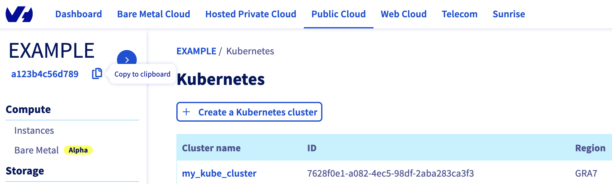
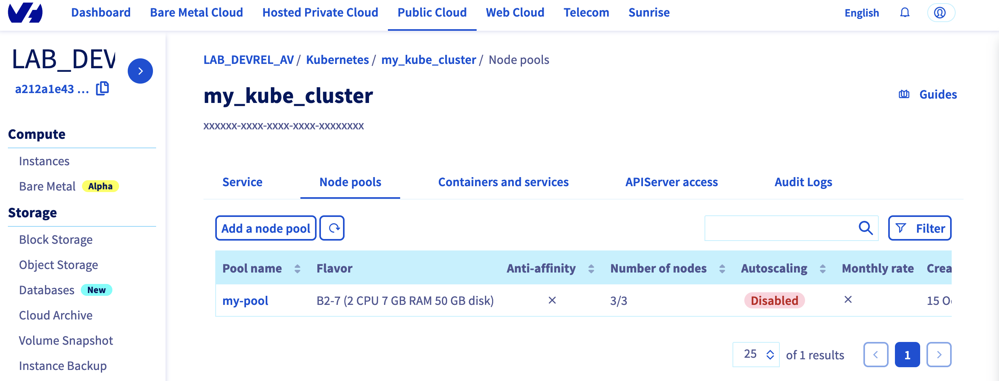

**Last updated 14th April 2022**

## Objective

Creating an OVHcloud Managed Kubernetes cluster through the OVHcloud Control Panel is cool but do you know you can deploy a cluster programmatically, with Terraform?

## Terraform

[Terraform](https://www.terraform.io/) is an open-source infrastructure as code (IaC) tool created by [Hashicorp](https://www.hashicorp.com/) in 2014, written in Go. It aims to build, change and version control your infrastructure. You can define and provision your infrastructure by writing the definition of your resources in Hashicorp Configuration Language (HCL).

This tool has a powerful and very intuitive command line interface (CLI).
If you are interested in leveraging your knowledge about Terraform CLI, a [Cheat Sheet](https://github.com/scraly/terraform-cheat-sheet/blob/master/terraform-cheat-sheet.pdf){.external} exists.

## Requirements

- A [Public Cloud project](https://docs.ovh.com/pt/public-cloud/criar_seu_primeiro_projeto_public_cloud/) in your OVHcloud account
- Installing [Terraform CLI](https://www.terraform.io/downloads.html){.external}

## Before you begin

* You should have installed Terraform CLI, version 0.12.x minimum, on your machine. You can install it by following [detailed installation instructions](https://www.terraform.io/docs/cli/index.html){.external} or with the tool [tfenv](https://github.com/tfutils/tfenv){.external}.

## OVHcloud Terraform provider

{.thumbnail}

In order to create a Kubernetes cluster and other resources, OVHcloud provides a [Terraform provider](https://registry.terraform.io/providers/ovh/ovh/latest){.external} which is available in the official Terraform registry.

All available resources and data sources have their definition and documentation.

In this guide, we will create two resources:

* a [cloud_project_kube](https://registry.terraform.io/providers/ovh/ovh/latest/docs/resources/cloud_project_kube){.external}, that represents an OVHcloud managed Kubernetes cluster
* and a [cloud_project_kube_nodepool](https://registry.terraform.io/providers/ovh/ovh/latest/docs/resources/cloud_project_kube_nodepool){.external}, that represents a Kubernetes Node Pool

{.thumbnail}

## Getting your cluster/API tokens information

The "OVH provider" needs to be configured with a set of credentials:

* an `application_key`
* an `application_secret`
* a `consumer_key`

Why?

Because, behind the scenes, the "OVH Terraform provider" is doing requests to OVHcloud APIs. 

In order to retrieve this necessary information, please follow [First steps with the OVHcloud APIs](https://docs.ovh.com/pt/api/first-steps-with-ovh-api/) tutorial.

Concretely, you have to generate these credentials via the [OVH token generation page](https://api.ovh.com/createToken/?GET=/*&POST=/*&PUT=/*&DELETE=/*) with the following rights:

{.thumbnail}

When you have successfully generated your OVH tokens, please keep them. You'll have to define them in the coming minutes ;-).

The last needed information is the `service_name`: it is the ID of your Public Cloud project.

How to get it?

In the Public Cloud section, you can retrieve your service name ID thanks to the `Copy to clipboard`{.action} button.

{.thumbnail}

You will also use this information in Terraform resources definition files.

## Instructions 

When you want to manage (create, modify, and remove) your infrastructure, getting started with Terraform is easy.
Just create files ending with `.tf` containing the description of the resources you want to have.

In our case, we want to create:

* an OVHcloud managed Kubernetes cluster
* a nodepool

So, let's start!

### Resources definition

First, create a `provider.tf` file with the minimum version, european endpoint ("ovh-eu") and keys you previously got in this guide.

Terraform 0.13 and later:

```
terraform {
  required_providers {
    ovh = {
      source  = "ovh/ovh"
    }
  }
}

provider "ovh" {
  endpoint           = "ovh-eu"
  application_key    = "<your_access_key>"
  application_secret = "<your_application_secret>"
  consumer_key       = "<your_consumer_key>"
}
```

Terraform 0.12 and earlier:

```
# Configure the OVHcloud Provider
provider "ovh" {
  endpoint           = "ovh-eu"
  application_key    = "<your_access_key>"
  application_secret = "<your_application_secret>"
  consumer_key       = "<your_consumer_key>"
}
```

Alternatively the secret keys can be retrieved from your environment.

- `OVH_ENDPOINT`
- `OVH_APPLICATION_KEY`
- `OVH_APPLICATION_SECRET`
- `OVH_CONSUMER_KEY`

This later method (or a similar alternative) is recommended to avoid storing secret data in a source repository.

Here, we defined the `ovh-eu` endpoint because we want to call the OVHcloud Europe API, but other endpoints exist, depending on your needs:

* `ovh-eu` for OVHcloud Europe API
* `ovh-us` for OVHcloud US API
* `ovh-ca` for OVHcloud North-America API

Then, create a `variables.tf` with service_name:

```
variable service_name {
  type        = string
  default     = "<your_service_name>"
}
```

Define the resources you want to create in a new file called `ovh_kube_cluster.tf`:

```
resource "ovh_cloud_project_kube" "my_kube_cluster" {
   service_name = "${var.service_name}"
   name         = "my_kube_cluster"
   region       = "GRA7"
   version      = "1.22"
}

resource "ovh_cloud_project_kube_nodepool" "node_pool" {
   service_name  = "${var.service_name}"
   kube_id       = ovh_cloud_project_kube.my_kube_cluster.id
   name          = "my-pool" //Warning: "_" char is not allowed!
   flavor_name   = "b2-7"
   desired_nodes = 3
   max_nodes     = 3
   min_nodes     = 3
}
```

In this resources configuration, we ask Terraform to create a Kubernetes cluster, in the GRA7 region, using the Kubernetes version 1.22 (the last and recommended version at the time we wrote this tutorial).

And we tell Terraform to create a Node Pool with 3 Nodes with B2-7 machine type.

> [!warning]
>
> You can't use "_" or "." as a separator in a node pool name or a flavor name.
> You would obtain a "gzip: invalid header" during node pool creation.

Finally, create a `output.tf` file with the following content:

```
output "kubeconfig" {
  value = ovh_cloud_project_kube.my_kube_cluster.kubeconfig
  sensitive = true
}
```

With this output, we tell Terraform to retrieve the `kubeconfig file` content. This information is needed to connect to the new Kubernetes cluster.

For your information, outputs are useful to retrieve and display specific information after the resources creation.

Your code organisation should be like this: 

```
.
├── output.tf
├── ovh_kube_cluster.tf
├── provider.tf
└── variables.tf
```

### Create our cluster through Terraform

Now we need to initialise Terraform, generate a plan, and apply it.

```bash
$ terraform init

Initializing the backend...

Initializing provider plugins...
- Finding latest version of ovh/ovh...
- Installing ovh/ovh v0.17.1...
- Installed ovh/ovh v0.17.1 (signed by a HashiCorp partner, key ID F56D1A6CBDAAADA5)

Partner and community providers are signed by their developers.
If you'd like to know more about provider signing, you can read about it here:
https://www.terraform.io/docs/cli/plugins/signing.html

Terraform has created a lock file .terraform.lock.hcl to record the provider
selections it made above. Include this file in your version control repository
so that Terraform can guarantee to make the same selections by default when
you run "terraform init" in the future.

Terraform has been successfully initialized!

You may now begin working with Terraform. Try running "terraform plan" to see
any changes that are required for your infrastructure. All Terraform commands
should now work.

If you ever set or change modules or backend configuration for Terraform,
rerun this command to reinitialize your working directory. If you forget, other
commands will detect it and remind you to do so if necessary.
```

The `init` command will initialize your working directory which contains `.tf` configuration files.

It’s the first command to execute for a new configuration, or after doing a checkout of an existing configuration in a given git repository for example.

The `init` command will:

* Download and install Terraform providers/plugins
* Initialise backend (if defined)
* Download and install modules (if defined)

Now, we can generate our plan:

```
$ terraform plan

Terraform used the selected providers to generate the following execution plan. Resource actions are indicated with the following symbols:
  + create

Terraform will perform the following actions:

  # ovh_cloud_project_kube.my_kube_cluster will be created
  + resource "ovh_cloud_project_kube" "my_kube_cluster" {
      + control_plane_is_up_to_date = (known after apply)
      + id                          = (known after apply)
      + is_up_to_date               = (known after apply)
      + kubeconfig                  = (sensitive value)
      + name                        = "my_kube_cluster"
      + next_upgrade_versions       = (known after apply)
      + nodes_url                   = (known after apply)
      + region                      = "GRA7"
      + service_name                = "<YOUR_SERVICE_NAME>"
      + status                      = (known after apply)
      + update_policy               = (known after apply)
      + url                         = (known after apply)
      + version                     = "1.22"
    }

  # ovh_cloud_project_kube_nodepool.node_pool will be created
  + resource "ovh_cloud_project_kube_nodepool" "node_pool" {
      + anti_affinity    = false
      + autoscale        = false
      + available_nodes  = (known after apply)
      + created_at       = (known after apply)
      + current_nodes    = (known after apply)
      + desired_nodes    = 3
      + flavor           = (known after apply)
      + flavor_name      = "b2-7"
      + id               = (known after apply)
      + kube_id          = (known after apply)
      + max_nodes        = 3
      + min_nodes        = 3
      + monthly_billed   = false
      + name             = "my-pool"
      + project_id       = (known after apply)
      + service_name     = "<YOUR_SERVICE_NAME>"
      + size_status      = (known after apply)
      + status           = (known after apply)
      + up_to_date_nodes = (known after apply)
      + updated_at       = (known after apply)
    }

Plan: 2 to add, 0 to change, 0 to destroy.

Changes to Outputs:
  + kubeconfig = (sensitive value)

───────────────────────────────────────────────────────────────────────────────────────────────────────────────────────────────────────────────────────────────────────────────────────────────────────────

Note: You didn't use the -out option to save this plan, so Terraform can't guarantee to take exactly these actions if you run "terraform apply" now.
```

Thanks to the `plan` command, we can check what Terraform wants to create, modify or remove.

The plan is OK for us, so let's apply it:

```
$ terraform apply

An execution plan has been generated and is shown below.
Resource actions are indicated with the following symbols:
  + create

Terraform will perform the following actions:

  # ovh_cloud_project_kube.my_kube_cluster will be created
  + resource "ovh_cloud_project_kube" "my_kube_cluster" {
      + control_plane_is_up_to_date = (known after apply)
      + id                          = (known after apply)
      + is_up_to_date               = (known after apply)
      + kubeconfig                  = (sensitive value)
      + name                        = "my_kube_cluster"
      + next_upgrade_versions       = (known after apply)
      + nodes_url                   = (known after apply)
      + region                      = "GRA7"
      + service_name                = "<YOUR_SERVICE_NAME>"
      + status                      = (known after apply)
      + update_policy               = (known after apply)
      + url                         = (known after apply)
      + version                     = "1.22"
    }

  # ovh_cloud_project_kube_nodepool.node_pool will be created
  + resource "ovh_cloud_project_kube_nodepool" "node_pool" {
      + anti_affinity  = false
      + desired_nodes  = 3
      + flavor_name    = "b2-7"
      + id             = (known after apply)
      + kube_id        = (known after apply)
      + max_nodes      = 3
      + min_nodes      = 3
      + monthly_billed = false
      + name           = "my-pool"
      + service_name   = "<YOUR_SERVICE_NAME>"
      + status         = (known after apply)
    }

Plan: 2 to add, 0 to change, 0 to destroy.

Do you want to perform these actions?
  Terraform will perform the actions described above.
  Only 'yes' will be accepted to approve.

  Enter a value: yes

ovh_cloud_project_kube.my_kube_cluster: Creating...
ovh_cloud_project_kube.my_kube_cluster: Still creating... [10s elapsed]
ovh_cloud_project_kube.my_kube_cluster: Still creating... [20s elapsed]
ovh_cloud_project_kube.my_kube_cluster: Still creating... [30s elapsed]
ovh_cloud_project_kube.my_kube_cluster: Still creating... [40s elapsed]
ovh_cloud_project_kube.my_kube_cluster: Still creating... [50s elapsed]
ovh_cloud_project_kube.my_kube_cluster: Still creating... [1m0s elapsed]
ovh_cloud_project_kube.my_kube_cluster: Still creating... [1m10s elapsed]
ovh_cloud_project_kube.my_kube_cluster: Still creating... [1m20s elapsed]
ovh_cloud_project_kube.my_kube_cluster: Still creating... [1m30s elapsed]
ovh_cloud_project_kube.my_kube_cluster: Still creating... [1m40s elapsed]
ovh_cloud_project_kube.my_kube_cluster: Still creating... [1m50s elapsed]
ovh_cloud_project_kube.my_kube_cluster: Still creating... [2m0s elapsed]
ovh_cloud_project_kube.my_kube_cluster: Still creating... [2m10s elapsed]
ovh_cloud_project_kube.my_kube_cluster: Still creating... [2m20s elapsed]
ovh_cloud_project_kube.my_kube_cluster: Still creating... [2m30s elapsed]
ovh_cloud_project_kube.my_kube_cluster: Creation complete after 2m32s [id=7628f0e1-a082-4ec5-98df-2aba283ca3f3]
ovh_cloud_project_kube_nodepool.node_pool: Creating...
ovh_cloud_project_kube_nodepool.node_pool: Still creating... [10s elapsed]
ovh_cloud_project_kube_nodepool.node_pool: Still creating... [20s elapsed]
ovh_cloud_project_kube_nodepool.node_pool: Still creating... [30s elapsed]
ovh_cloud_project_kube_nodepool.node_pool: Still creating... [40s elapsed]
ovh_cloud_project_kube_nodepool.node_pool: Still creating... [50s elapsed]
ovh_cloud_project_kube_nodepool.node_pool: Still creating... [1m0s elapsed]
ovh_cloud_project_kube_nodepool.node_pool: Still creating... [1m10s elapsed]
ovh_cloud_project_kube_nodepool.node_pool: Still creating... [1m20s elapsed]
ovh_cloud_project_kube_nodepool.node_pool: Still creating... [1m30s elapsed]
ovh_cloud_project_kube_nodepool.node_pool: Still creating... [1m40s elapsed]
ovh_cloud_project_kube_nodepool.node_pool: Still creating... [1m50s elapsed]
ovh_cloud_project_kube_nodepool.node_pool: Still creating... [2m0s elapsed]
ovh_cloud_project_kube_nodepool.node_pool: Still creating... [2m10s elapsed]
ovh_cloud_project_kube_nodepool.node_pool: Still creating... [2m20s elapsed]
ovh_cloud_project_kube_nodepool.node_pool: Still creating... [2m30s elapsed]
ovh_cloud_project_kube_nodepool.node_pool: Still creating... [2m40s elapsed]
ovh_cloud_project_kube_nodepool.node_pool: Still creating... [2m50s elapsed]
ovh_cloud_project_kube_nodepool.node_pool: Still creating... [3m0s elapsed]
ovh_cloud_project_kube_nodepool.node_pool: Still creating... [3m10s elapsed]
ovh_cloud_project_kube_nodepool.node_pool: Still creating... [3m20s elapsed]
ovh_cloud_project_kube_nodepool.node_pool: Still creating... [3m30s elapsed]
ovh_cloud_project_kube_nodepool.node_pool: Still creating... [3m40s elapsed]
ovh_cloud_project_kube_nodepool.node_pool: Still creating... [3m50s elapsed]
ovh_cloud_project_kube_nodepool.node_pool: Still creating... [4m0s elapsed]
ovh_cloud_project_kube_nodepool.node_pool: Creation complete after 4m5s [id=ebfa7726-d50c-4fbc-8b24-e722a1ff28f5]

Apply complete! Resources: 2 added, 0 changed, 0 destroyed.

Outputs:

kubeconfig = <sensitive>
```

Now, log in to the [OVHcloud Control Panel](https://www.ovh.com/auth/?action=gotomanager&from=https://www.ovh.pt/&ovhSubsidiary=pt), go to the `Public Cloud`{.action} section and click on `Managed Kubernetes Service`. <br>
As you can see, your cluster has been successfuly created:

{.thumbnail}

Now, click on `my_kube_cluster`, then on the `Node pools` tab:

{.thumbnail}

Our node pool is created too.

Perfect!

## Connect to the cluster

Our cluster is created, now we need to connect to it in order to check our nodes, existing pods and to deploy our applications.

In order to do this, retrieve the kubeconfig file locally:

```
$ terraform output kubeconfig > /Users/<your-user>/.kube/my_kube_cluster.yml
```

You can define it in your `$KUBECONFIG` environment variable or you can use it directly in the `kubectl` command with `--kubeconfig` option.

List our Node Pool:

```
$ kubectl --kubeconfig=/Users/<your-user>/.kube/my_kube_cluster.yml get nodepool
NAME      FLAVOR   AUTO SCALED   MONTHLY BILLED   ANTI AFFINITY   DESIRED   CURRENT   UP-TO-DATE   AVAILABLE   MIN   MAX   AGE
my-pool   b2-7     false         false            false           3         3         3            3           3     3     1d
```

Display the list of Nodes:

```
$ kubectl --kubeconfig=/Users/<your-user>/.kube/my_kube_cluster.yml get node
NAME                  STATUS   ROLES    AGE   VERSION
my-pool-node-1bb290   Ready    <none>   1d   v1.22.2
my-pool-node-8280a6   Ready    <none>   1d   v1.22.2
my-pool-node-8a1bfe   Ready    <none>   1d   v1.22.2
```

Awesome!

You can now deploy your applications and/or create new clusters through Terraform.

## Known issues

### "gzip: invalid header"

You defined the node pool you want to create? So it's time to enter  the `terraform apply` command.

```bash
ovh_cloud_project_kube_nodepool.node_pool[0]: Creating...
local_file.kubeconfig[0]: Creating...
local_file.kubeconfig[0]: Creation complete after 0s [id=c5d11f6df9df77a0b57b6c14c3be4fb48178f6ac]
 
Error: calling Post /cloud/project/a212a1e43b614c4ba27a247b890fcf59/kube/90cb98f1-ad48-4f98-95c8-07188ea765cf/nodepool with params my-pool-0(d2.8): 3/3/3:
                "gzip: invalid header"
 
  on ovh_kube_cluster.tf line 10, in resource "ovh_cloud_project_kube_nodepool" "node_pool":
  10: resource "ovh_cloud_project_kube_nodepool" "node_pool" {
```

We do agree the error message is not user friendly, we will work on it. ;-)

If you get this "gzip: invalid header" error message, the issue is that you name the flavor or the node pool name with an invalid character: "_" or ".".

The API don't support these characters so that's the reason why you obtained this error message.
In order to fix it, change the flavor name and/or the pool name to a correct one, for example:

```bash
resource "ovh_cloud_project_kube_nodepool" "node_pool" {
  service_name  = var.service_name
  kube_id       = ovh_cloud_project_kube.my_kube_cluster.id
  name          = "my-pool" //Warning: "_" char is not allowed!
  flavor_name   = "b2-7"
  desired_nodes = 3
  max_nodes     = 3
  min_nodes     = 3
}
```

### "not enough xxx quotas"

By default, the Public Cloud projects as well as the resources total (RAM, CPU, disk space, number of instances, etc.) you can use are limited for security reasons.

When you create a new Kubernetes Node Pool, if you run out of resources in your available quota, the Nodes might be in error.

You may get the following error message: "not enough xxx quotas".
xxx can be: RAM, CPU, VM, Disk or Port.

If this is the case, the quotas must be increased.
In order to check your quotas and increase them, please follow this tutorial:

[Increasing Public Cloud quotas](https://docs.ovh.com/pt/public-cloud/aumentar_a_quota_public_cloud/){.external}.

## Destroy (cleanup)

If you want to easily destroy created resources, you can use `terraform destroy` command.

```
$ terraform destroy
ovh_cloud_project_kube.my_kube_cluster: Refreshing state... [id=7628f0e1-a082-4ec5-98df-2aba283ca3f3]
ovh_cloud_project_kube_nodepool.node_pool: Refreshing state... [id=ebfa7726-d50c-4fbc-8b24-e722a1ff28f5]

An execution plan has been generated and is shown below.
Resource actions are indicated with the following symbols:
  - destroy

Terraform will perform the following actions:

  # ovh_cloud_project_kube.my_kube_cluster will be destroyed
  - resource "ovh_cloud_project_kube" "my_kube_cluster" {
      - control_plane_is_up_to_date = true -> null
      - id                          = "7628f0e1-a082-4ec5-98df-2aba283ca3f3" -> null
      - is_up_to_date               = true -> null
      - kubeconfig                  = (sensitive value)
      - name                        = "my_kube_cluster" -> null
      - next_upgrade_versions       = [] -> null
      - nodes_url                   = "z2tj25.nodes.c1.gra7.k8s.ovh.net" -> null
      - region                      = "GRA7" -> null
      - service_name                = "<your_service_name>" -> null
      - status                      = "READY" -> null
      - update_policy               = "ALWAYS_UPDATE" -> null
      - url                         = "xxxxxx.c1.gra7.k8s.ovh.net" -> null
      - version                     = "1.22" -> null
    }

  # ovh_cloud_project_kube_nodepool.node_pool will be destroyed
  - resource "ovh_cloud_project_kube_nodepool" "node_pool" {
      - anti_affinity  = false -> null
      - desired_nodes  = 3 -> null
      - flavor_name    = "b2-7" -> null
      - id             = "ebfa7726-d50c-4fbc-8b24-e722a1ff28f5" -> null
      - kube_id        = "7628f0e1-a082-4ec5-98df-2aba283ca3f3" -> null
      - max_nodes      = 3 -> null
      - min_nodes      = 3 -> null
      - monthly_billed = false -> null
      - name           = "my-pool" -> null
      - service_name   = "<your_service_name>" -> null
      - status         = "READY" -> null
    }

Plan: 0 to add, 0 to change, 2 to destroy.

Do you really want to destroy all resources?
  Terraform will destroy all your managed infrastructure, as shown above.
  There is no undo. Only 'yes' will be accepted to confirm.

  Enter a value: yes

ovh_cloud_project_kube_nodepool.node_pool: Destroying... [id=ebfa7726-d50c-4fbc-8b24-e722a1ff28f5]
ovh_cloud_project_kube_nodepool.node_pool: Still destroying... [id=ebfa7726-d50c-4fbc-8b24-e722a1ff28f5, 10s elapsed]
ovh_cloud_project_kube_nodepool.node_pool: Still destroying... [id=ebfa7726-d50c-4fbc-8b24-e722a1ff28f5, 20s elapsed]
ovh_cloud_project_kube_nodepool.node_pool: Still destroying... [id=ebfa7726-d50c-4fbc-8b24-e722a1ff28f5, 30s elapsed]
ovh_cloud_project_kube_nodepool.node_pool: Still destroying... [id=ebfa7726-d50c-4fbc-8b24-e722a1ff28f5, 40s elapsed]
ovh_cloud_project_kube_nodepool.node_pool: Still destroying... [id=ebfa7726-d50c-4fbc-8b24-e722a1ff28f5, 50s elapsed]
ovh_cloud_project_kube_nodepool.node_pool: Still destroying... [id=ebfa7726-d50c-4fbc-8b24-e722a1ff28f5, 1m0s elapsed]
ovh_cloud_project_kube_nodepool.node_pool: Destruction complete after 1m2s
ovh_cloud_project_kube.my_kube_cluster: Destroying... [id=7628f0e1-a082-4ec5-98df-2aba283ca3f3]
ovh_cloud_project_kube.my_kube_cluster: Still destroying... [id=7628f0e1-a082-4ec5-98df-2aba283ca3f3, 10s elapsed]
ovh_cloud_project_kube.my_kube_cluster: Still destroying... [id=7628f0e1-a082-4ec5-98df-2aba283ca3f3, 20s elapsed]
ovh_cloud_project_kube.my_kube_cluster: Still destroying... [id=7628f0e1-a082-4ec5-98df-2aba283ca3f3, 30s elapsed]
ovh_cloud_project_kube.my_kube_cluster: Destruction complete after 33s

Destroy complete! Resources: 2 destroyed.
```

Perfect, your Kubernetes cluster and associated resources (Nodes, Pods...) have been correctly destroyed!

## Go further

To have an overview of OVHcloud Managed Kubernetes service, you can go to the [OVHcloud Managed Kubernetes page](https://www.ovhcloud.com/pt/public-cloud/kubernetes/).

To deploy your first application on your Kubernetes cluster, we invite you to follow our guide to [configuring default settings for `kubectl`](../configuring-kubectl/) and [deploying a Hello World application](../deploying-hello-world/).

Join our community of users on <https://community.ovh.com/en/>.
