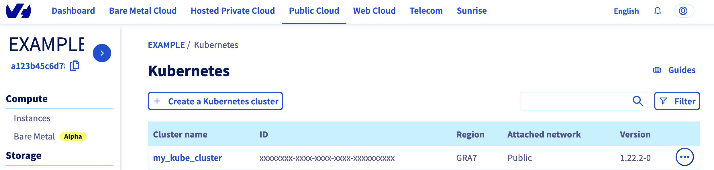

**Last updated 10th August 2023**

<style>
 pre {
     font-size: 14px;
 }
 pre.console {
   background-color: #300A24; 
   color: #ccc;
   font-family: monospace;
   padding: 5px;
   margin-bottom: 5px;
 }
 pre.console code {
   border: solid 0px transparent;
   font-family: monospace !important;
   font-size: 0.75em;
   color: #ccc;
 }
 .small {
     font-size: 0.75em;
 }
</style>

## Objective

Creating an OVHcloud Managed Kubernetes cluster through the OVHcloud Control Panel is cool, but do you know you can deploy a cluster programmatically, with an Infrastructure as Code (IaC) tools?

You know you can through Terraform thanks to our OVHcloud provider but do you know you can too with Pulumi?

## Pulumi

[Pulumi](https://www.pulumi.com/) is an Infrastructure as code (IasC) tool that allows you to build your infrastructures with a programming language.
Users defined the desired state in Pulumi programs and Pulumi create the desired resources.

To provision, update or delete your infrastructure, Pulumi have an intuitive command line interface (CLI).
If you are familiar with Docker compose CLI and Terraform CLI, you will adopt [Pulumi CLI](https://www.pulumi.com/docs/cli/) too.

## Requirements

- A [Public Cloud project](/pages/platform/public-cloud/create_a_public_cloud_project) in your OVHcloud account
- Installing [Pulumi CLI](https://www.pulumi.com/docs/install/){.external}
- TODO: An account in Pulumi
- TODO: Pulumi access token

## Before you begin

* You should have installed Pulumi CLI on your machine.

Verify the Pulumi Cli is successfully installed in your machine with `pulumi version` command:

You should have a result like this:

<pre class="console"><code>$ pulumi version
v3.77.1
</code></pre>

## OVHcloud Pulumi provider

TODO: xxx

{.thumbnail}

TODO: xxx


In order to create a Kubernetes cluster and other resources, you will use the [OVHcloud Pulumi provider](https://github.com/lbrlabs/pulumi-ovh). This provider is a bridge to our official [Terraform provider](https://registry.terraform.io/providers/ovh/ovh/latest){.external}.

All available Pulumi resource have their definition and [documentation](https://www.pulumi.com/registry/packages/ovh).

In this guide, we will create two resources:

* a [Kube resource](https://www.pulumi.com/registry/packages/ovh/api-docs/cloudproject/kube/){.external}, that represents an OVHcloud managed Kubernetes cluster
* and a [KubeNodePool resource](https://www.pulumi.com/registry/packages/ovh/api-docs/cloudproject/kubenodepool/){.external}, that represents a Kubernetes Node Pool

{.thumbnail}

## Getting your cluster/API tokens information

The "OVH provider" needs to be configured with a set of credentials:

* an `endpoint` (environment variable: OVH_ENDPOINT)
* an `applicationKey` (environment variable: OVH_APPLICATION_KEY)
* an `applicationSecret` (environment variable: OVH_APPLICATION_SECRET)
* a `consumerKey` (environment variable: OVH_CONSUMER_KEY)

Why?

Because, behind the scenes, the provider is doing requests to OVHcloud APIs. 

In order to retrieve this necessary information, please follow [First steps with the OVHcloud APIs](/pages/account/api/first-steps) tutorial.

Concretely, you have to generate these credentials via the [OVH token generation page](https://api.ovh.com/createToken/?GET=/*&POST=/*&PUT=/*&DELETE=/*) with the following rights:

{.thumbnail}

When you have successfully generated your OVH tokens, please keep them. You'll have to define them in the coming minutes ;-).

The last needed information is the `service_name`: it is the ID of your Public Cloud project.

How to get it?

In the Public Cloud section, you can retrieve your service name ID thanks to the `Copy to clipboard`{.action} button.

{.thumbnail}

Define the secret keys as environment variables:

```bash
export OVH_ENDPOINT="ovh-eu"
export OVH_APPLICATION_KEY="xxx"
export OVH_APPLICATION_SECRET="xxx"
export OVH_CONSUMER_KEY="xxx"
```

## Instructions 

### Create our Pulumi project and initialize our Go program

Infrastructure in Pulumi is organized into projects.  In the Pulumi ecosystem, a project represents a Pulumi program that, when run, declares the desired infrastructure for Pulumi to manage. 
First, create a folder `ovhcloud_kube` taht represent our project and go into it.

```bash
mkdir ovhcloud_kube
cd ovhcloud_kube
```

Initialize our project:

```bash
pulumi new go -y
```

The output should be like this:

<pre class="console"><code>$pulumi new go -y
Created project 'ovhcloud_kube'

Please enter your desired stack name.
To create a stack in an organization, use the format <org-name>/<stack-name> (e.g. `acmecorp/dev`).
Created stack 'dev'

Installing dependencies...

Finished installing dependencies

Your new project is ready to go! 

To perform an initial deployment, run `pulumi up`
</code></pre>

The command create a `dev` stack and the code organization of your project:

<pre class="console"><code>$ tree
.
├── go.mod
├── go.sum
├── main.go
└── Pulumi.yaml
</code></pre>

Now we need to install the needed providers.
Change the `go.mod` file so that the require section looks like this:

```
require (
	github.com/lbrlabs/pulumi-ovh/sdk v0.2.0
	github.com/pulumi/pulumi/sdk/v3 v3.55.0
)
```

Then, edit the `main.go` file and replace the content with the following:


TODO: a fixer quand ça marchera !!!!!
TODO: puis rajouter le node pool !!!!!
TODO: et le kubeconfig !!!! ctx.Export("kubeconfig", pulumi.ToSecret(myKube.kubeconfig)) 

```go
package main

import (
	"log"

	ovh "github.com/lbrlabs/pulumi-ovh/sdk/go/ovh"
	"github.com/pulumi/pulumi/sdk/v3/go/pulumi"
	"github.com/pulumi/pulumi/sdk/v3/go/pulumi/config"
)

func main() {
	pulumi.Run(func(ctx *pulumi.Context) error {
		cfg := config.New(ctx, "")
		serviceName := "a212a1e43b614c4ba27a247b890fcf59"
		if param := cfg.Get("serviceName"); param != "" {
			serviceName = param
		}

		//project, err := ovh.GetCloudProject(ctx, "LAB_DEVREL_AV", "myid", &ovh.CloudProjectState{} , )

		// Deploy a new Kubernetes cluster
		mykube, err := ovh.NewCloudProjectKube(ctx, "mykube", &ovh.CloudProjectKubeArgs{
			ServiceName: pulumi.String(serviceName),
			Name:        pulumi.String("my_desired_cluster"),
			Region:      pulumi.String("GRA5"),
		})
		if err != nil {
			return err
		}

    ctx.Export("kubeconfig", pulumi.ToSecret(myKube.kubeconfig))

		log.Println(mykube.Name)

		return nil
	})
}
```

Then, run `go mod tidy` command` to ask go to download and install the necessary Go providers and dependencies.

```
go mod tidy
```

### Create our cluster through Pulumi

Now we can deploy our cluster and the node pool, to do that just execute the `pulumi up` comand.
This will display the plan/the preview of the desireed state.

TODO: xxx


```
$ pulumi up

```

TODO: xxx

Now, log in to the [OVHcloud Control Panel](https://www.ovh.com/auth/?action=gotomanager&from=https://www.ovh.co.uk/&ovhSubsidiary=GB), go to the `Public Cloud`{.action} section and click on `Managed Kubernetes Service`. <br>
As you can see, your cluster has been successfuly created:

{.thumbnail}

Now, click on `my_kube_cluster`, then on the `Node pools` tab:

{.thumbnail}

Our node pool is created too.

Perfect!

## Connect to the cluster

TODO: xx

Our cluster is created, now we need to connect to it in order to check our nodes, existing pods and to deploy our applications.

In order to do this, retrieve the kubeconfig file locally from the `dev` Pulumi stack:

```bash
pulumi stack output kubeconfig --show-secrets -s dev > kubeconfig.yaml
```

You can define it in your `$KUBECONFIG` environment variable or you can use it directly in the `kubectl` command with `--kubeconfig` option.

List our Node Pool:

```
$ kubectl --kubeconfig=/Users/<your-user>/.kube/my_kube_cluster.yml get nodepool
NAME      FLAVOR   AUTO SCALED   MONTHLY BILLED   ANTI AFFINITY   DESIRED   CURRENT   UP-TO-DATE   AVAILABLE   MIN   MAX   AGE
my-pool   b2-7     false         false            false           3         3         3            3           3     3     1d
```

Display the list of Nodes:

```
$ kubectl --kubeconfig=/Users/<your-user>/.kube/my_kube_cluster.yml get node
NAME                  STATUS   ROLES    AGE   VERSION
my-pool-node-1bb290   Ready    <none>   1d   v1.22.2
my-pool-node-8280a6   Ready    <none>   1d   v1.22.2
my-pool-node-8a1bfe   Ready    <none>   1d   v1.22.2
```

Awesome!

You can now deploy your applications and/or create new clusters through Terraform.

## Known issues

TODO: a garder ???

### "gzip: invalid header"

You defined the node pool you want to create? So it's time to enter  the `terraform apply` command.

```bash
ovh_cloud_project_kube_nodepool.node_pool[0]: Creating...
local_file.kubeconfig[0]: Creating...
local_file.kubeconfig[0]: Creation complete after 0s [id=c5d11f6df9df77a0b57b6c14c3be4fb48178f6ac]
 
Error: calling Post /cloud/project/a212a1e43b614c4ba27a247b890fcf59/kube/90cb98f1-ad48-4f98-95c8-07188ea765cf/nodepool with params my-pool-0(d2.8): 3/3/3:
                "gzip: invalid header"
 
  on ovh_kube_cluster.tf line 10, in resource "ovh_cloud_project_kube_nodepool" "node_pool":
  10: resource "ovh_cloud_project_kube_nodepool" "node_pool" {
```

We do agree the error message is not user friendly, we will work on it. ;-)

If you get this "gzip: invalid header" error message, the issue is that you name the flavor or the node pool name with an invalid character: "_" or ".".

The API don't support these characters so that's the reason why you obtained this error message.
In order to fix it, change the flavor name and/or the pool name to a correct one, for example:

```bash
resource "ovh_cloud_project_kube_nodepool" "node_pool" {
  service_name  = var.service_name
  kube_id       = ovh_cloud_project_kube.my_kube_cluster.id
  name          = "my-pool" //Warning: "_" char is not allowed!
  flavor_name   = "b2-7"
  desired_nodes = 3
  max_nodes     = 3
  min_nodes     = 3
}
```

### "not enough xxx quotas"

TODO: a garder ?

By default, the Public Cloud projects as well as the resources total (RAM, CPU, disk space, number of instances, etc.) you can use are limited for security reasons.

When you create a new Kubernetes Node Pool, if you run out of resources in your available quota, the Nodes might be in error.

You may get the following error message: "not enough xxx quotas".
xxx can be: RAM, CPU, VM, Disk or Port.

If this is the case, the quotas must be increased.
In order to check your quotas and increase them, please follow this tutorial:

[Increasing Public Cloud quotas](/pages/platform/public-cloud/increasing_public_cloud_quota){.external}.

## Destroy (cleanup)

TODO: 

pulumi destroy


If you want to easily destroy created resources, you can use `terraform destroy` command.

```
$ terraform destroy
ovh_cloud_project_kube.my_kube_cluster: Refreshing state... [id=7628f0e1-a082-4ec5-98df-2aba283ca3f3]
ovh_cloud_project_kube_nodepool.node_pool: Refreshing state... [id=ebfa7726-d50c-4fbc-8b24-e722a1ff28f5]

An execution plan has been generated and is shown below.
Resource actions are indicated with the following symbols:
  - destroy

Terraform will perform the following actions:

  # ovh_cloud_project_kube.my_kube_cluster will be destroyed
  - resource "ovh_cloud_project_kube" "my_kube_cluster" {
      - control_plane_is_up_to_date = true -> null
      - id                          = "7628f0e1-a082-4ec5-98df-2aba283ca3f3" -> null
      - is_up_to_date               = true -> null
      - kubeconfig                  = (sensitive value)
      - name                        = "my_kube_cluster" -> null
      - next_upgrade_versions       = [] -> null
      - nodes_url                   = "z2tj25.nodes.c1.gra7.k8s.ovh.net" -> null
      - region                      = "GRA7" -> null
      - service_name                = "<your_service_name>" -> null
      - status                      = "READY" -> null
      - update_policy               = "ALWAYS_UPDATE" -> null
      - url                         = "xxxxxx.c1.gra7.k8s.ovh.net" -> null
      - version                     = "1.22" -> null
    }

  # ovh_cloud_project_kube_nodepool.node_pool will be destroyed
  - resource "ovh_cloud_project_kube_nodepool" "node_pool" {
      - anti_affinity  = false -> null
      - desired_nodes  = 3 -> null
      - flavor_name    = "b2-7" -> null
      - id             = "ebfa7726-d50c-4fbc-8b24-e722a1ff28f5" -> null
      - kube_id        = "7628f0e1-a082-4ec5-98df-2aba283ca3f3" -> null
      - max_nodes      = 3 -> null
      - min_nodes      = 3 -> null
      - monthly_billed = false -> null
      - name           = "my-pool" -> null
      - service_name   = "<your_service_name>" -> null
      - status         = "READY" -> null
    }

Plan: 0 to add, 0 to change, 2 to destroy.

Do you really want to destroy all resources?
  Terraform will destroy all your managed infrastructure, as shown above.
  There is no undo. Only 'yes' will be accepted to confirm.

  Enter a value: yes

ovh_cloud_project_kube_nodepool.node_pool: Destroying... [id=ebfa7726-d50c-4fbc-8b24-e722a1ff28f5]
ovh_cloud_project_kube_nodepool.node_pool: Still destroying... [id=ebfa7726-d50c-4fbc-8b24-e722a1ff28f5, 10s elapsed]
ovh_cloud_project_kube_nodepool.node_pool: Still destroying... [id=ebfa7726-d50c-4fbc-8b24-e722a1ff28f5, 20s elapsed]
ovh_cloud_project_kube_nodepool.node_pool: Still destroying... [id=ebfa7726-d50c-4fbc-8b24-e722a1ff28f5, 30s elapsed]
ovh_cloud_project_kube_nodepool.node_pool: Still destroying... [id=ebfa7726-d50c-4fbc-8b24-e722a1ff28f5, 40s elapsed]
ovh_cloud_project_kube_nodepool.node_pool: Still destroying... [id=ebfa7726-d50c-4fbc-8b24-e722a1ff28f5, 50s elapsed]
ovh_cloud_project_kube_nodepool.node_pool: Still destroying... [id=ebfa7726-d50c-4fbc-8b24-e722a1ff28f5, 1m0s elapsed]
ovh_cloud_project_kube_nodepool.node_pool: Destruction complete after 1m2s
ovh_cloud_project_kube.my_kube_cluster: Destroying... [id=7628f0e1-a082-4ec5-98df-2aba283ca3f3]
ovh_cloud_project_kube.my_kube_cluster: Still destroying... [id=7628f0e1-a082-4ec5-98df-2aba283ca3f3, 10s elapsed]
ovh_cloud_project_kube.my_kube_cluster: Still destroying... [id=7628f0e1-a082-4ec5-98df-2aba283ca3f3, 20s elapsed]
ovh_cloud_project_kube.my_kube_cluster: Still destroying... [id=7628f0e1-a082-4ec5-98df-2aba283ca3f3, 30s elapsed]
ovh_cloud_project_kube.my_kube_cluster: Destruction complete after 33s

Destroy complete! Resources: 2 destroyed.
```

Perfect, your Kubernetes cluster and associated resources (Nodes, Pods...) have been correctly destroyed!

## Go further

To have an overview of OVHcloud Managed Kubernetes service, you can go to the [OVHcloud Managed Kubernetes page](https://www.ovhcloud.com/en/public-cloud/kubernetes/).

To deploy your first application on your Kubernetes cluster, we invite you to follow our guide to [configuring default settings for `kubectl`](/pages/platform/kubernetes-k8s/configuring-kubectl-on-an-ovh-managed-kubernetes-cluster) and [deploying a Hello World application](/pages/platform/kubernetes-k8s/deploying-hello-world).

- If you need training or technical assistance to implement our solutions, contact your sales representative or click on [this link](https://www.ovhcloud.com/en-gb/professional-services/) to get a quote and ask our Professional Services experts for assisting you on your specific use case of your project.

- Join our community of users on <https://community.ovh.com/en/>.
