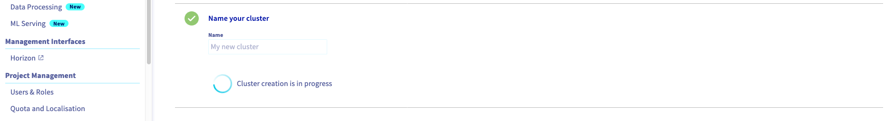

**Last updated 29th April 2021**

## Objective

OVHcloud Managed Kubernetes service provides you Kubernetes clusters without the hassle of installing or operating them. This guide will cover the creation of a new cluster.

## Requirements

A Public Cloud project in your OVHcloud account

## Instructions

Access our administration UI for your OVHcloud Managed Kubernetes clusters by clicking on the *Containers and Orchestration* menu in the Public Cloud section of the [OVHcloud Control Panel](https://ca.ovh.com/auth/?action=gotomanager&from=https://www.ovh.com/asia/&ovhSubsidiary=asia), then go to the `Managed Kubernetes Service`{.action} category and click on `Create a cluster`{.action}.

{.thumbnail}

Select a location for your new cluster.

{.thumbnail}

Choose the minor version of Kubernetes. 

> [!primary]
> We recommend you to always use the last stable version. 
> Please read our [End of life / end of support](../eos-eol-policies/) page to understand our version policy.

{.thumbnail}

You can now choose to integrate your Kubernetes cluster into a private network using OVHcloud vRack. For more information about this option, please read our [Using the vRack](../using_vrack/) guide.

{.thumbnail}

Now you can configure the default node pool. A node pool is a group of nodes sharing the same configuration, allowing you a lot of flexibility in your cluster management. 

> [!primary]
> You can read the [Managing node pools](../managing-nodes/) guide to get more information on node pools.

Then choose the size of the default node pool, and the type of instance.

{.thumbnail}

In the next step you can activate anti-affinity, and choose the billing mode (monthly or hourly).

> [!primary]
> By enabling anti-affinity, current and future nodes will be launched on different hypervisors (physical servers), guaranteeing higher fault tolerance. Anti-affinity node pools can only include up to 5 nodes.

{.thumbnail}

Finally, name your cluster and click the `Send`{.action} button.

{.thumbnail}

Your cluster creation is now in progress, it should be available within a few minutes.

{.thumbnail}

## Go further

To have an overview of OVHcloud Managed Kubernetes service, you can go to the [OVHcloud Managed Kubernetes page](https://www.ovhcloud.com/en-gb/public-cloud/kubernetes/).

Otherwise to skip it and push to deploy your first application on your Kubernetes cluster, we invite you to follow our guide to [configuring default settings for `kubectl`](../configuring-kubectl/) and [deploying a Hello World application](../deploying-hello-world/) .

Join our [community of users](https://community.ovh.com/en/).
