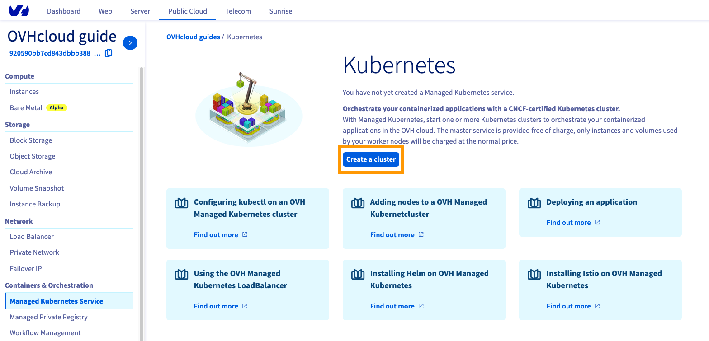
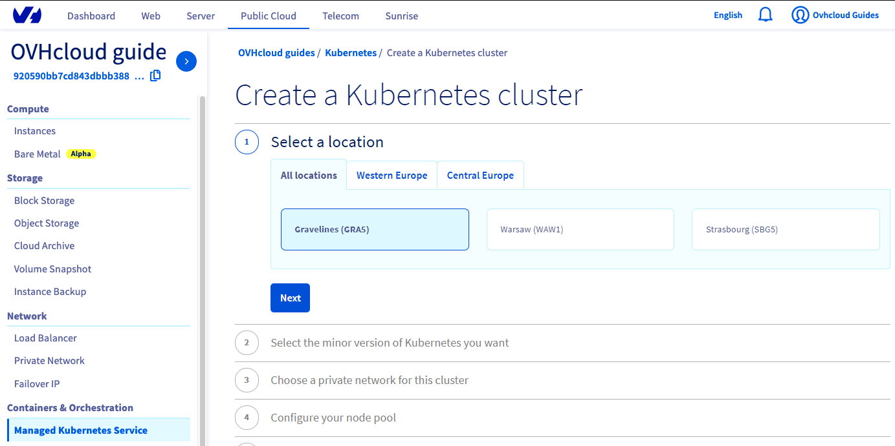
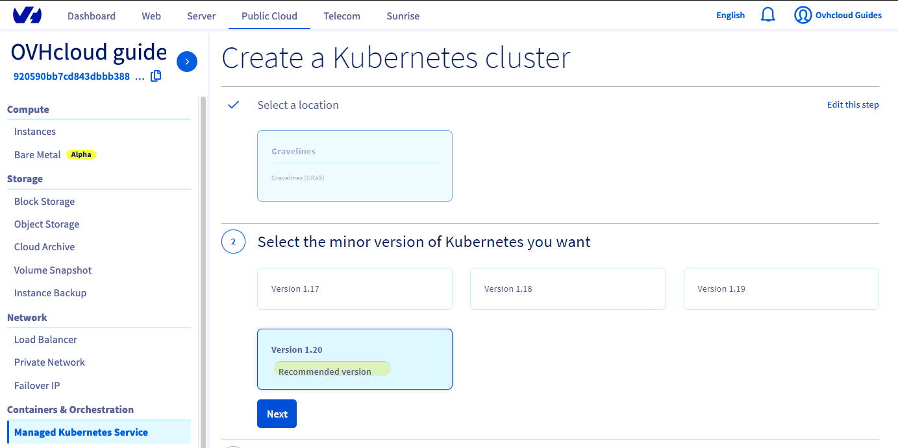
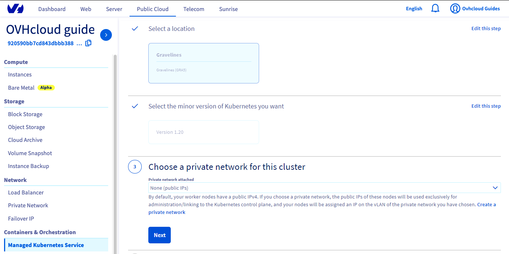
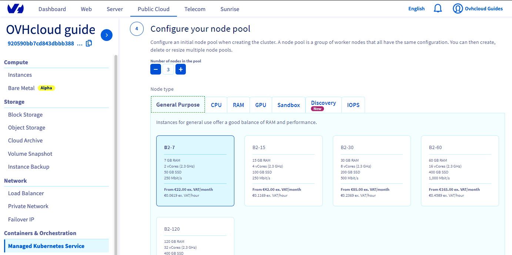
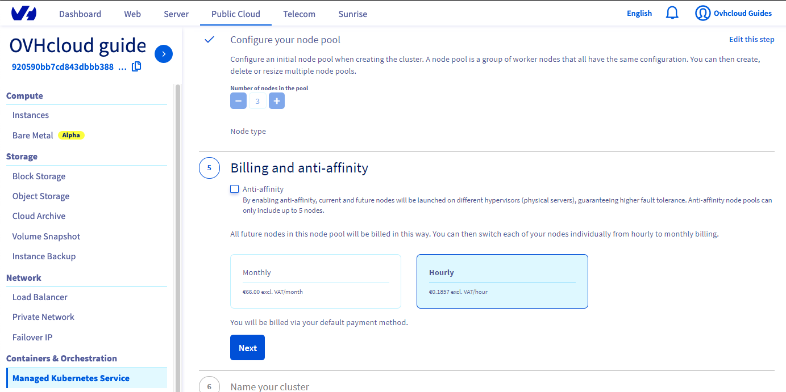
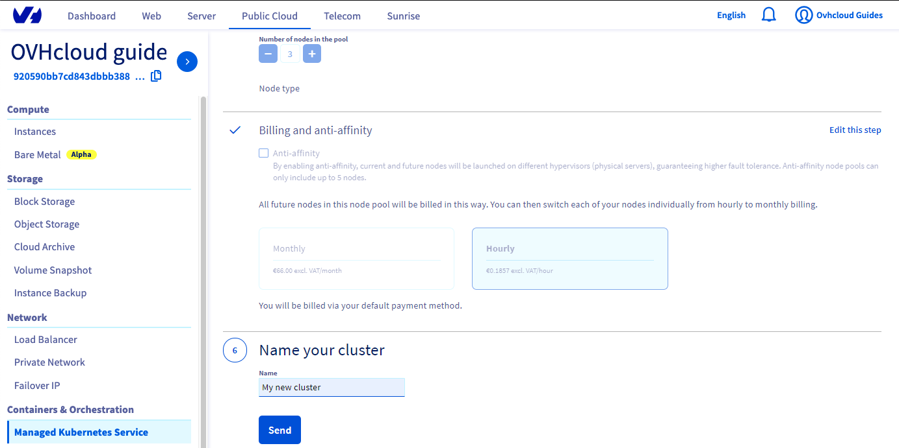

**Last updated July 23th July, 2020.**

## Objective

OVHcloud Managed Kubernetes service provides you Kubernetes clusters without the hassle of installing or operating them. This guide will cover the creation of a new cluster.

## Requirements

A OVHcloud Public Cloud project.

## Instructions

Access our administration UI for your OVHcloud Managed Kubernetes clusters by clicking on the *Containers and Orchestration* menu in the [OVH Cloud Manager](https://www.ovh.com/manager/cloud/), then go to the *Managed Kubernetes Service* category and click on *Create a cluster* button.

{.thumbnail}

Select a location for your new cluster.

{.thumbnail}

Choose the minor version of Kubernetes. 

> [!primary]
> We recommend you to use always the last stable version. 
> Please read our [End of life / end of support](../eos-eol-policies/) for understand our version policy.

{.thumbnail}

Now you can configure the default node pool. A node pool is a groups of nodes sharing the same configuration, allowing you a lot of flexibility in your cluster management. 

> [!primary]
> You can go to the [Managing node pools](../managing-nodes/) section to have more information on node pools.

Then choose the size of the default node pool, and the type of instance.

{.thumbnail}

And choose the billing mode (monthly or hourly).

{.thumbnail}

Finally, name your cluster and click on the *Send* button.

{.thumbnail}

Your cluster creation is now in progress, it should be available in a few minutes.

{.thumbnail}

## Go further

To have an overview of OVHcloud Managed Kubernetes service, you can go to the [OVHcloud Managed Kubernetes site](https://www.ovh.com/public-cloud/kubernetes/).

Otherwise to skip it and push to deploy your first application on your Kubernetes cluster, we invite you to follow our guide to [configuring default settings for `kubectl`](../configuring_default_settings_for_kubectl/configuring_default_settings_for_kubectl/) and [deploying an application](../deploying_an_application/deploying_an_application/) .

Join our community of users on [https://community.ovh.com/en/](https://community.ovh.com/en/).