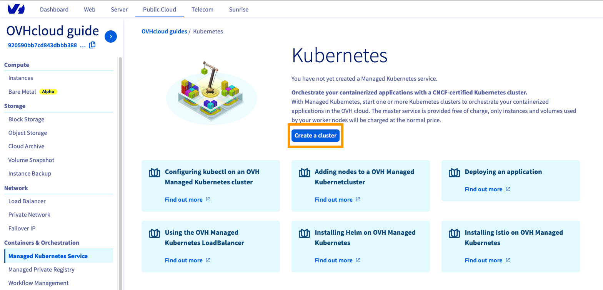
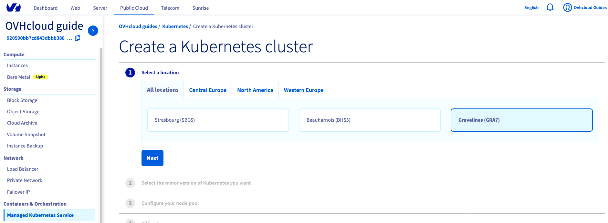
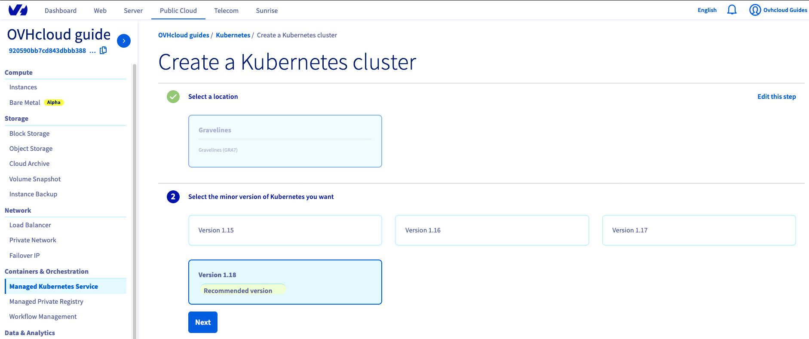
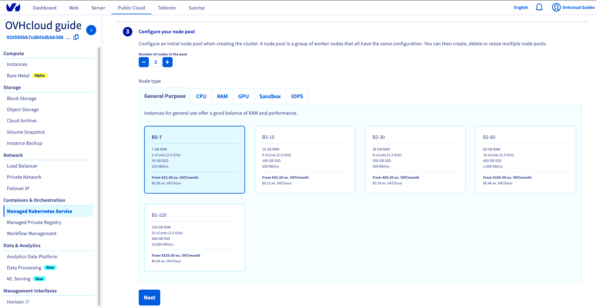
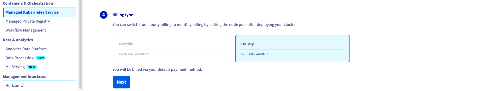
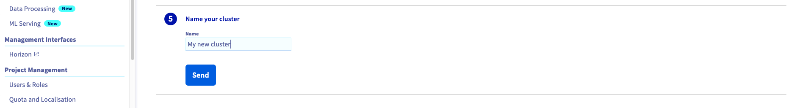

**Last updated 29th September 2021**

## Objective

The OVHcloud Managed Kubernetes service provides you Kubernetes clusters without the hassle of installing or operating them. This guide will cover the creation of a new cluster.

<iframe width="560" height="315" src="https://www.youtube-nocookie.com/embed/ApfujBFT82g" title="YouTube video player" frameborder="0" allow="accelerometer; autoplay; clipboard-write; encrypted-media; gyroscope; picture-in-picture" allowfullscreen></iframe>

## Requirements

- A [Public Cloud project](https://www.ovhcloud.com/es/public-cloud/) in your OVHcloud account
- Access to the [OVHcloud Control Panel](https://ca.ovh.com/auth/?action=gotomanager&from=https://www.ovh.com/world/&ovhSubsidiary=ws)

## Instructions

Log in to the [OVHcloud Control Panel](https://ca.ovh.com/auth/?action=gotomanager&from=https://www.ovh.com/world/&ovhSubsidiary=ws), go to the `Public Cloud`{.action} section and select the Public Cloud project concerned.

Access the administration UI for your OVHcloud Managed Kubernetes clusters by clicking on `Managed Kubernetes Service`{.action} in the left-hand menu and click on `Create a cluster`{.action}.

{.thumbnail}

Select a location for your new cluster.

{.thumbnail}

Choose the minor version of Kubernetes.

> [!primary]
> We recommend to always use the last stable version. 
> Please read our [End of life / end of support](../eos-eol-policies/) page to understand our version policy.
>

{.thumbnail}

You can now choose to integrate your Kubernetes cluster into a private network using OVHcloud vRack. For more information about this option, please read our guide [Using the vRack](../using_vrack/).

{.thumbnail}

Now you can configure the default node pool. A node pool is a group of nodes sharing the same configuration, allowing you a lot of flexibility in your cluster management. 

> [!primary]
> You can read the [Managing node pools](../managing-nodes/) guide for more information on node pools.
>

{.thumbnail}

In the next step, define the size of the default node pool.

{.thumbnail}

Alternatively, you can enable the `Autoscaling`{.action} feature for the cluster. Define the minimum and maximum pool size in that case.

{.thumbnail}

In the next step, choose the appropriate billing mode (monthly or hourly). You can also enable the anti-affinity mode here. 

{.thumbnail}

> [!primary]
> By enabling anti-affinity, current and future nodes will be launched on different hypervisors (physical servers), guaranteeing higher fault tolerance. Anti-affinity node pools can only include up to 5 nodes.
> 

Finally, enter a for name your cluster and click the `Send`{.action} button.

The cluster creation is now in progress. It should be available within a few minutes in your OVHcloud Control Panel.

## Go further

To have an overview of OVHcloud Managed Kubernetes service, you can go to the [OVHcloud Managed Kubernetes page](https://www.ovhcloud.com/es/public-cloud/kubernetes/).

To deploy your first application on your Kubernetes cluster, we invite you to follow our guide to [configuring default settings for `kubectl`](../configuring-kubectl/) and [deploying a Hello World application](../deploying-hello-world/) .

Join our community of users on <https://community.ovh.com/en/>.
