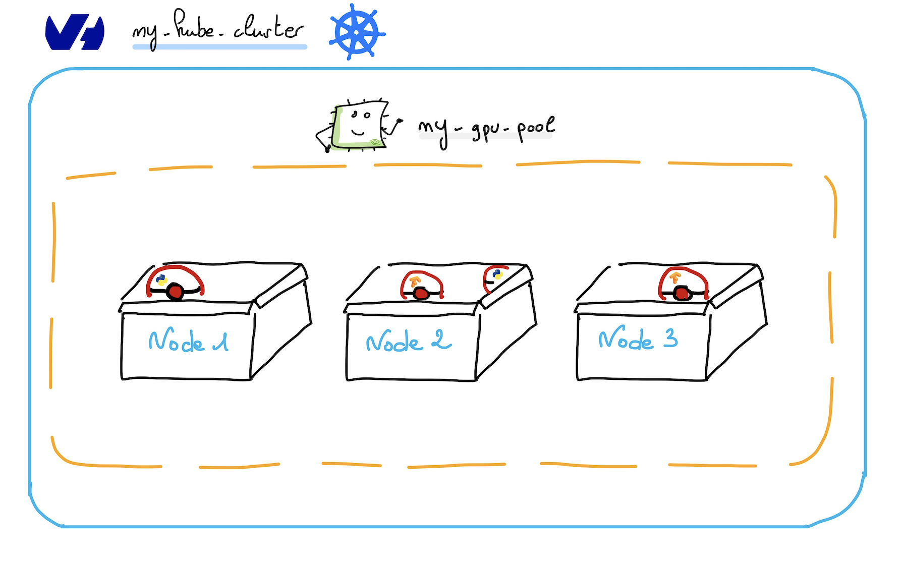
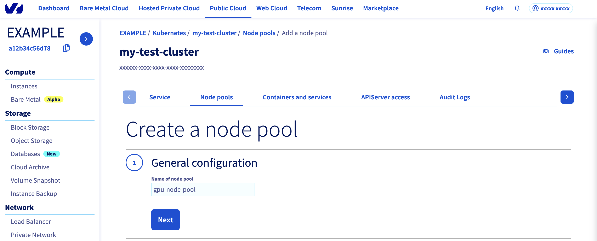

<style>
 pre {
     font-size: 14px;
 }
 pre.console {
   background-color: #300A24;
   color: #ccc;
   font-family: monospace;
   padding: 5px;
   margin-bottom: 5px;
 }
 pre.console code {
   border: solid 0px transparent;
   font-family: monospace !important;
   font-size: 0.75em;
   color: #ccc;
 }
 .small {
     font-size: 0.75em;
 }
</style>

**Last updated February 16, 2022.**

## Objective

In this tutorial we will show you how to deploy a GPU application on an OVHcloud Managed Kubernetes cluster.

GPUs provide compute power to drive AI/ML & Deep Learning tasks with intensive calculations such as image recognition, natural language processing (NLP), as well as other compute-intensive tasks such as video transcoding and image processing.
Using GPUs with Kubernetes allows you to extend the scalability of Kubernetes to AI/ML applications.

## Before you begin

This tutorial presupposes that you already have a working OVHcloud Managed Kubernetes cluster, and some basic knowledge of how to operate it. If you want to know more on those topics, please look at the [OVHcloud Managed Kubernetes Service Quickstart](../deploying-hello-world/).

You also need to have [Helm](https://docs.helm.sh/) installed on your workstation and your cluster. Please refer to the [How to install Helm on OVHcloud Managed Kubernetes Service](../installing-helm/) tutorial.

## Prerequisites

To get the best and most cost-effective benefit from GPUs on OVHcloud Managed Kubernetes, and to take advantage of cluster autoscaling, we recommend that you create separate GPU node pools in your Kubernetes clusters.

{.thumbnail}

The GPU operator that you will install should run on Kubernetes nodes that are equipped with GPUs.

So you need to create a node pool with `t1` flavor type.

If you already have an OVHcloud Kubernetes cluster with a node pool with `t1` flavor type, you can skip the following `Autoscaling GPU Node Pool creation` step.

> [!warning]
>GPU Virtual machines are extremely powerful and significantly more expensive than general purpose nodes. If you are usually using OVHcloud Public Cloud at small scale and/or are a new user, you may need to [raise your Public Cloud quota](https://docs.ovh.com/es/public-cloud/aumentar_el_limite_de_public_cloud/) to enable access to those type of machines for your project. Also note that these machines are only available in some of our Public Cloud regions.
>
>Also note that while worker nodes (be them added manually or through cluster autoscaler) are created within a few minutes, our GPU worker nodes ready status can take up to a bit more than one hour.
>

## Instructions

### Autoscaling GPU Node Pool creation

Log in to the [OVHcloud Control Panel](https://www.ovh.com/auth/?action=gotomanager&from=https://www.ovh.es/&ovhSubsidiary=es), go to the `Public Cloud`{.action} section and select the Public Cloud project concerned.

Access the administration UI for your OVHcloud Managed Kubernetes clusters by clicking on `Managed Kubernetes Service`{.action} in the left-hand menu.

{.thumbnail}

Click on your cluster, then on the `Node pools`{.action} tab.

We will create our special GPU Node Pool.
Click on `Add a node pool`{.action}.

Then enter a name for your GPU node pool, `gpu-node-pool` for example.

{.thumbnail}

Select a flavor for your new node pool, then click on the `GPU`{.action} tab. You can choose "T1-45" for example.

{.thumbnail}

In the next step, define the size of your GPU node pool.
You can enable the `Autoscaling`{.action} feature.
Define the minimum and maximum pool size in that case, 3 in minimum and 10 in maximum, for example.

{.thumbnail}

Then, choose `Hourly` billing mode for this GPU node pool.

{.thumbnail}

The node pool creation is now in progress. It should be available within a few minutes in your OVHcloud Control Panel.

When the Node Pool is in `OK` state, if you display Node pool labels you can verify that the new `gpu-node-pool`'s Nodes are correctly labelled.

```bash
kubectl get node --show-labels | grep "node.k8s.ovh/type=gpu"
```

{.thumbnail}

### NVIDIA GPU Operator

The [NVIDIA GPU Operator](https://github.com/NVIDIA/gpu-operator) uses the [Operator Framework](https://github.com/operator-framework/getting-started) within Kubernetes to automate the management of all NVIDIA software components needed to provision GPU. These components include the NVIDIA drivers (to enable CUDA), Kubernetes device plugin for GPUs, the NVIDIA Container Runtime, automatic node labelling, DCGM based monitoring and others.


If you are interested about the operator, feel free to read the [NVIDIA GPU operator official documentation](https://docs.nvidia.com/datacenter/cloud-native/gpu-operator/overview.html).

### Installing the NVIDIA GPU Operator Helm chart

For this tutorial we are using the [NVIDIA GPU Operator Helm chart](https://github.com/NVIDIA/gpu-operator/tree/master/deployments/gpu-operator){.external} found on [NVIDIA repository](https://github.com/nvidia/). The chart is [fully configurable](https://docs.nvidia.com/datacenter/cloud-native/gpu-operator/getting-started.html), but here we are using the default configuration, with only the minimal set of customization to make it work well on OVHcloud Managed Kubernetes Service.

Add the NVIDIA Helm repository:

```bash
helm repo add nvidia https://nvidia.github.io/gpu-operator
helm repo update
```

This will add the NVIDIA repository and update all of your repositories: 

<pre class="console"><code>$ helm repo add nvidia https://nvidia.github.io/gpu-operator
helm repo update
"nvidia" has been added to your repositories
Hang tight while we grab the latest from your chart repositories...
...Successfully got an update from the "nvidia" chart repository
[...]
Update Complete. ⎈Happy Helming!⎈
</code></pre>

Install the GPU Operator in the `gpu-operator` namespace:

```bash
helm install gpu-operator nvidia/gpu-operator -n gpu-operator --create-namespace --wait
```

You should have a GPU operator installed and running:

<pre class="console"><code>$ helm install gpu-operator nvidia/gpu-operator -n gpu-operator --create-namespace --wait
NAME: gpu-operator
LAST DEPLOYED: Thu Dec 23 15:27:25 2021
NAMESPACE: gpu-operator
STATUS: deployed
REVISION: 1
TEST SUITE: None

$ kubectl get pod -n gpu-operator
NAME                                                          READY   STATUS      RESTARTS   AGE
gpu-feature-discovery-n7tv8                                   1/1     Running     0          3m35s
gpu-feature-discovery-xddz2                                   1/1     Running     0          3m35s
gpu-operator-bb886b456-llmlg                                  1/1     Running     0          5m31s
gpu-operator-node-feature-discovery-master-58d884d5cc-lxkb8   1/1     Running     0          5m31s
gpu-operator-node-feature-discovery-worker-9pqqq              1/1     Running     0          4m27s
gpu-operator-node-feature-discovery-worker-s5zj9              1/1     Running     0          4m20s
nvidia-container-toolkit-daemonset-424mm                      1/1     Running     0          3m36s
nvidia-container-toolkit-daemonset-dqlw9                      1/1     Running     0          3m36s
nvidia-cuda-validator-5dzf7                                   0/1     Completed   0          76s
nvidia-cuda-validator-zp9vd                                   0/1     Completed   0          95s
nvidia-dcgm-4bstw                                             1/1     Running     0          3m36s
nvidia-dcgm-4t7zd                                             1/1     Running     0          3m36s
nvidia-dcgm-exporter-rhtbj                                    1/1     Running     1          3m35s
nvidia-dcgm-exporter-ttq2t                                    1/1     Running     0          3m35s
nvidia-device-plugin-daemonset-f8vht                          1/1     Running     0          3m36s
nvidia-device-plugin-daemonset-lt9xr                          1/1     Running     0          3m36s
nvidia-device-plugin-validator-gj86p                          0/1     Completed   0          28s
nvidia-device-plugin-validator-w2vz4                          0/1     Completed   0          37s
nvidia-driver-daemonset-2mcft                                 1/1     Running     0          3m36s
nvidia-driver-daemonset-v9pv9                                 1/1     Running     0          3m36s
nvidia-operator-validator-g6fbm                               1/1     Running     0          3m36s
nvidia-operator-validator-xctsp                               1/1     Running     0          3m36s
</code></pre>

### Verify GPU Operator Install

When the GPU operator is UP and running, it will add `nvidia.com/gpu` labels on GPU Nodes.

You can check new labels with the command:

```bash
kubectl get nodes --show-labels | grep "nvidia.com/gpu"
```

New labels should appear only on your GPU Nodes:


### Running Sample GPU Applications

You can now proceed to running a GPU application/workload on your cluster.

To configure Pods to consume GPUs, you need to use a resource limit in your YAML manifest file. You have to specify a resource limit in a Pod specification using the following key-value pair:

```bash
Key: nvidia.com/gpu
Value: Number of GPUs to consume
```

Create a `vector.yaml` YAML manifest file with the following content:

```yaml
apiVersion: v1
kind: Pod
metadata:
  name: cuda-vectoradd
spec:
  restartPolicy: OnFailure
  containers:
  - name: cuda-vectoradd
    image: "nvidia/samples:vectoradd-cuda11.2.1"
    resources:
      limits:
         nvidia.com/gpu: 1
```

Apply it:

```bash
kubectl apply -f vector.yaml -n default
```

And watch the Pod startup:

```bash
kubectl get pod -n default -w
```

You should have results like this:

<pre class="console"><code>$ kubectl apply -f vector.yaml -n default
pod/cuda-vectoradd created

$ kubectl get pod -n default -w
NAME             READY   STATUS              RESTARTS   AGE
cuda-vectoradd   0/1     ContainerCreating   0          4s
cuda-vectoradd   0/1     Completed   0          35s
</code></pre>

When the `cuda-vectoradd` has started, run and completed its task, watch the logs with the following command:

```bash
kubectl logs cuda-vectoradd -n default
```

<pre class="console"><code>$ kubectl logs cuda-vectoradd -n default
[Vector addition of 50000 elements]
Copy input data from the host memory to the CUDA device
CUDA kernel launch with 196 blocks of 256 threads
Copy output data from the CUDA device to the host memory
Test PASSED
Done
</code></pre>

Our first GPU workload is just started up and has done its task in our OVHcloud Managed Kubernetes cluster.

### Running Load Test GPU Application

After deploying your first application using GPU, you can now run a load test GPU application. 

To do that you have to use the `nvidia-smi` (System Management Interface) in any container with the proper runtime. 

To see this in action, create a `my-load-gpu-pod.yml` YAML manifest file with the following content:

```yaml
apiVersion: v1
kind: Pod
metadata:
  name: dcgmproftester
spec:
  restartPolicy: OnFailure
  containers:
  - name: dcgmproftester
    image: nvidia/samples:dcgmproftester-2.0.10-cuda11.0-ubuntu18.04
    args: ["--no-dcgm-validation", "-t 1004", "-d 240"]
    resources:
      limits:
        nvidia.com/gpu: 1
    securityContext:
      capabilities:
        add: ["SYS_ADMIN"]
```

Apply it:

```bash
kubectl apply -f my-load-gpu-pod.yml -n default
```

And watch the Pod startup:

```bash
kubectl get pod -n default -w
```

This will create a Pod using the Nvidia `dcgmproftester` to generate a test GPU load:

<pre class="console"><code>$ kubectl apply -f my-load-gpu-pod.yml -n default
pod/dcgmproftester created

$ kubectl get po -w
NAME             READY   STATUS      RESTARTS   AGE
...
dcgmproftester   1/1     Running     0          7s
</code></pre>

Then, execute into the pod:

```bash
kubectl exec -it dcgmproftester -- nvidia-smi -n default
```

<pre class="console"><code>$ kubectl exec -it dcgmproftester -- nvidia-smi

Fri Dec 24 13:36:50 2021
+-----------------------------------------------------------------------------+
| NVIDIA-SMI 470.82.01    Driver Version: 470.82.01    CUDA Version: 11.4     |
|-------------------------------+----------------------+----------------------+
| GPU  Name        Persistence-M| Bus-Id        Disp.A | Volatile Uncorr. ECC |
| Fan  Temp  Perf  Pwr:Usage/Cap|         Memory-Usage | GPU-Util  Compute M. |
|                               |                      |               MIG M. |
|===============================+======================+======================|
|   0  Tesla V100-PCIE...  On   | 00000000:00:07.0 Off |                    0 |
| N/A   47C    P0   214W / 250W |    491MiB / 16160MiB |     79%      Default |
|                               |                      |                  N/A |
+-------------------------------+----------------------+----------------------+

+-----------------------------------------------------------------------------+
| Processes:                                                                  |
|  GPU   GI   CI        PID   Type   Process name                  GPU Memory |
|        ID   ID                                                   Usage      |
|=============================================================================|
+-----------------------------------------------------------------------------+
</code></pre>

You can see your test load under `GPU-Util` (third column), along with other information such as `Memory-Usage` (second column).

## Go further

To learn more about using your Kubernetes cluster the practical way, we invite you to look at our [OVHcloud Managed Kubernetes documentation](../).

Join our [community of users](https://community.ovh.com/en/).
