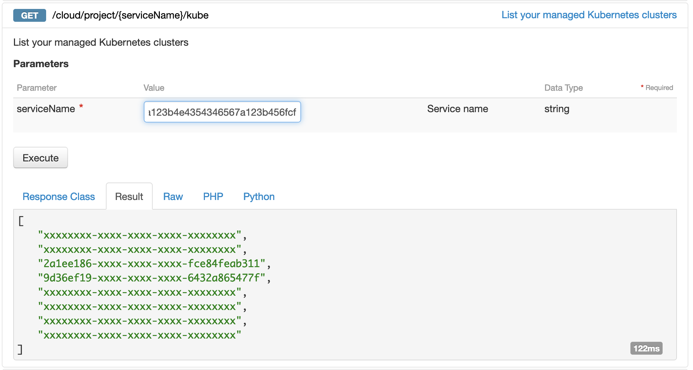
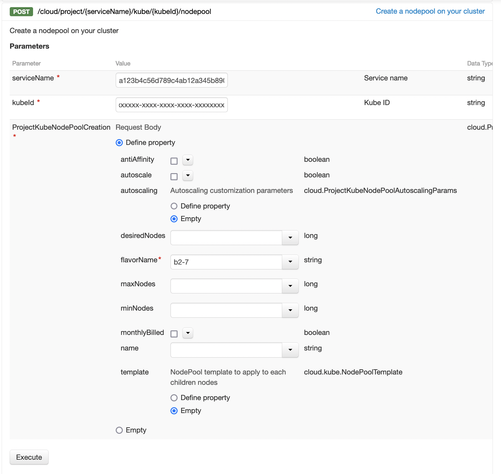
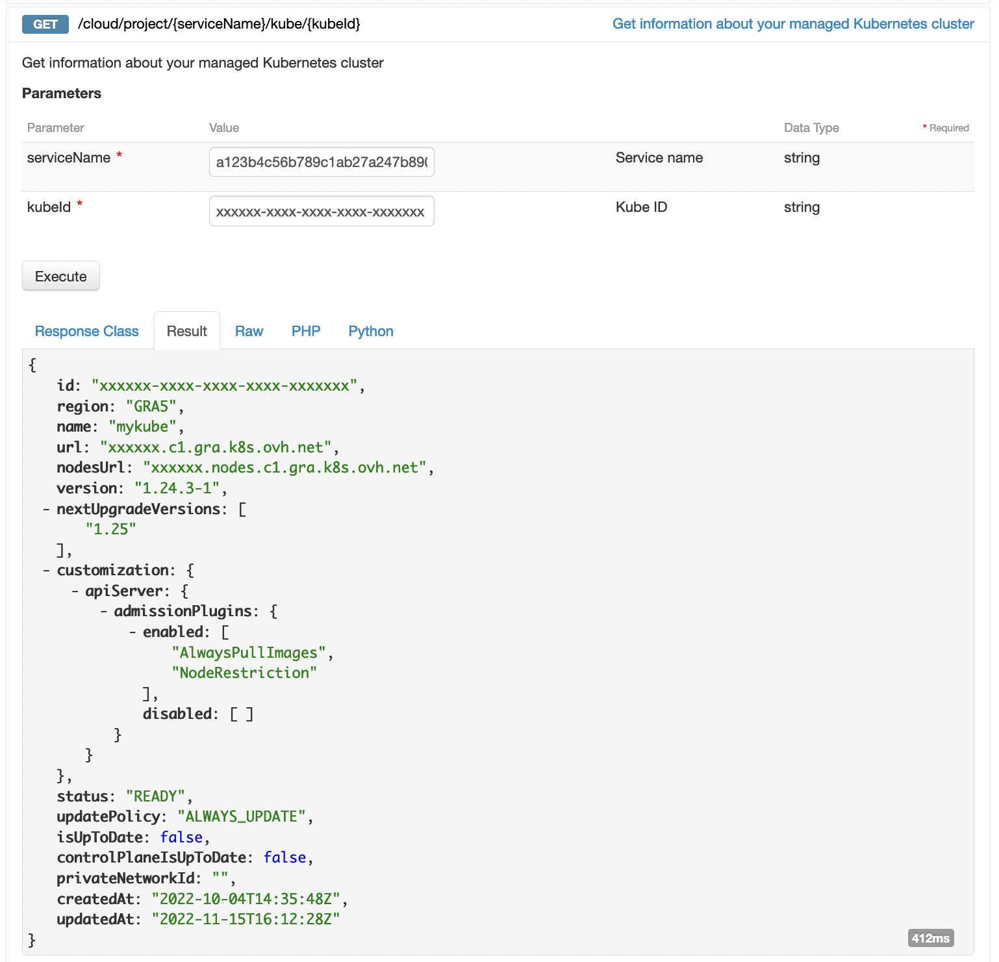

**Last updated 12th January 2023**

Follow this quickstart guide to deploy a containerised *Hello World* application on your OVHcloud Managed Kubernetes Service cluster, using the OVHcloud API.

In this guide, we are assuming you're using the [OVHcloud API](https://api.ovh.com/) to manage your Kubernetes cluster. If you are using a different method, like the [OVHcloud Cloud Manager](https://www.ovh.com/auth?onsuccess=https%3A%2F%2Fwww.ovh.com%2Fmanager%2Fpublic-cloud&ovhSubsidiary=gb), please take a look to the [Deploying a Hello World application with the OVHcloud Cloud Manager](../deploying-hello-world/) guide.

## Before you begin

* You should have already created a Kubernetes cluster on the OVHcloud Managed Kubernetes service.
* You will also need the [kubectl](https://kubernetes.io/docs/reference/kubectl/overview/){.external} command-line tool. You can find the [detailed installation instructions](https://kubernetes.io/docs/tasks/tools/install-kubectl/){.external} for this tool on Kubernetes' official site.

> [!warning]
> This guide assumes you are familiar with the [OVHcloud API](https://api.ovh.com/). If you have never used it, you can find the basics here: [First steps with the OVHcloud API](https://docs.ovh.com/au/en/api/first-steps-with-ovh-api/).
>

## The API Explorer

To simplify things, we are using the [API Explorer](https://api.ovh.com/), which allows to explore, learn and interact with the API in an interactive way.

Log in to the API Explorer using your OVH NIC.

{.thumbnail}

If you go to the [Kubernetes section](https://api.ovh.com/console/#/cloud/project/%7BserviceName%7D/kube~GET) of the API Explorer, you will see the available endpoints:

{.thumbnail}
{.thumbnail}

## List your OVHcloud Managed Kubernetes clusters

The `GET /cloud/project/{serviceName}/kube` API endpoint lists all the available Kubernetes clusters:

{.thumbnail}

By calling it, you can view a list of values. Note down the ID of the service (cluster) you want to use. In this example, we will refer to it as `serviceName`.

## Getting your OVHcloud Managed Kubernetes cluster information

The `GET /cloud/project/{serviceName}/kube/{kubeId}` API endpoint provides important information about your Managed Kubernetes cluster, including its region, status and URL.

{.thumbnail}

## Add a node pool

The first element needed to deploy the *Hello World* application is a `node pool`, a pool of machines, in your cluster. To create this node pool, you can use the `POST /cloud/project/{serviceName}/kube/{kubeId}/nodepool` endpoint, which will deploy a node pool for your cluster on the Public Cloud.

You will need to give it several information but only the `flavorName` parameter (the flavor of the instance you want to create) is a required parameter. If you don't fill a value for `desiredNodes` parameter, the default value will be 1.
For this tutorial choose a general purpose node, like the `b2-7` flavor.

{.thumbnail}

The API will return you the new node pool information.

{.thumbnail}

## Verify your node pool is ready

You can use the `GET /cloud/project/{serviceName}/kube/{kubeId}/nodepool` entrypoint to list all your node pools. Look for the node pool you've just created, and verify the status is `READY`. The node pool installation can take a minute, so feel free to take a small break, then try again until it's ready.

{.thumbnail}

## Configuring the default settings for the kubectl CLI

Please refer to the [Configuring kubectl on an OVHcloud Managed Kubernetes cluster](../configuring-kubectl/) documentation for this part of the process.

## Deploy your first application

You're now ready to deploy your first application in your OVHCloud Managed Kubernetes cluster.

For more details about this process, you can refer to the [deploying an application](../deploying-an-application/) documentation.

## Go further

As you seen in the [Kubernetes section](https://api.ovh.com/console/#/cloud/project/%7BserviceName%7D/kube~GET) of the API Explorer, a lot of useful API endpoints exists to manage your Kubernetes clusters. Feel free to use the API endpoints depending on your use cases.