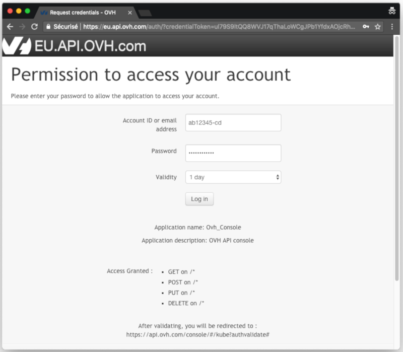
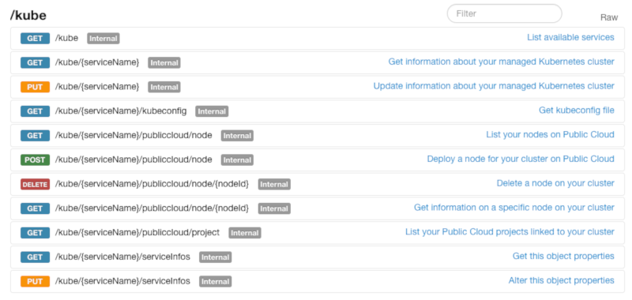
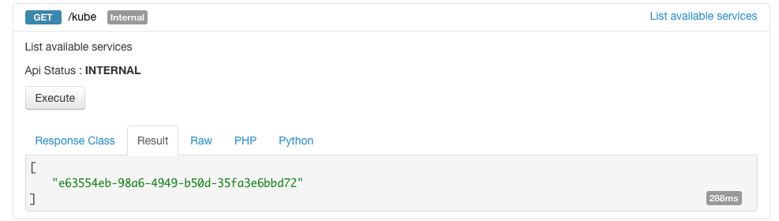
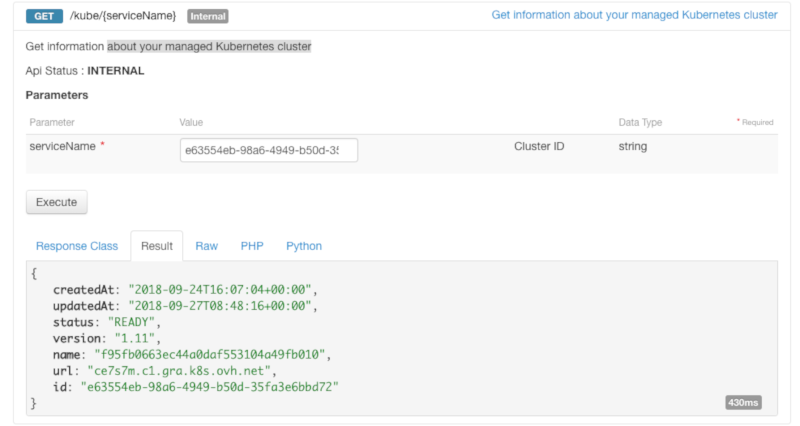
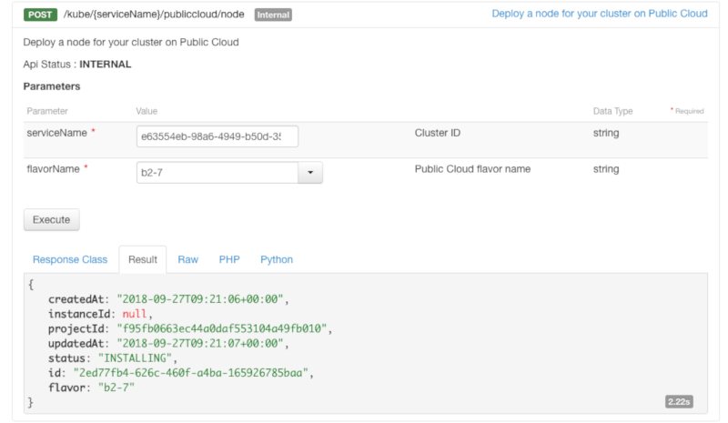
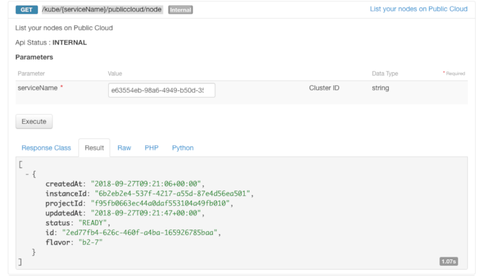

**Last updated 25th February, 2019.**

Follow this quickstart guide to deploy a containerised *Hello World* application on your OVH Managed Kubernetes Service cluster, using the OVH API.

In this guide, we are assuming you're using the [OVH API](https://api.ovh.com/) to manage your Kubernetes cluster. If you are using a different method, like the [OVH Control Panel](https://www.ovh.com/manager/cloud/), please refer to the relevant documentation:

- [Deploying a Hello World application with the OVH Control Panel](../deploying-hello-world/)

## Before you begin

* You should have already created a cluster on the OVH Managed Kubernetes service.
* You will also need the [kubectl](https://kubernetes.io/docs/reference/kubectl/overview/){.external} command-line tool. You can find the [detailed installation instructions](https://kubernetes.io/docs/tasks/tools/install-kubectl/){.external} for this tool on Kubernetes' official site.

> [!warning]
> This guide assumes you are familiar with the [OVH API](https://api.ovh.com/). If you have never used it, you can find the basics here: [First steps with the OVH API](https://docs.ovh.com/gb/en/customer/first-steps-with-ovh-api/).
>

## The API Explorer

To simplify things, we are using the [API Explorer](https://api.ovh.com/console/), which allows to explore, learn and interact with the API in an interactive way.

Log in to the API Explorer using your OVH NIC.

{.thumbnail}

If you go to the [Kubernetes section](https://api.ovh.com/console/#/kube) of the API Explorer, you will see the available endpoints:

{.thumbnail}

## List your OVH Managed Kubernetes services

The `GET /kube` API endpoint lists all the available services (clusters):

{.thumbnail}

By calling it, you can view a list of your services names. Note down the ID of the service (cluster) you want to use. In this example, we will refer to it as `serviceName`

## Getting your managed cluster information

The `GET  /kube/{serviceName}` API endpoint provides important information about your Managed Kubernetes cluster, including its status and URL.

{.thumbnail}

## Configuring the default settings for kubectl

Please refer to the [Configuring kubectl on an OVH Managed Kubernetes cluster](../configuring-kubectl/) documentation for this part of the process.

## Add a worker node

The first element needed to deploy the *Hello World* application is a worker node in your cluster. To create this node, you can use the `POST /kube/{serviceName}/publiccloud/node` endpoint, which will deploy a node for your cluster on the Public Cloud. 

You will need to give it a `flavorName` parameter, with the flavor of the instance you want to create. For this tutorial choose a general purpose node, like the `b2-7` flavor.

The API will return you the new node information.

{.thumbnail}

## Verify your node is ready

You can use the `GET /kube/{serviceName}/publiccloud/node` entrypoint to list all your nodes. Look for the node you've just created, and verify the status is `READY`. The node installation can take a minute, so feel free to take a small break, then try again until it's ready.

{.thumbnail}

## Deploy your first application

You're now ready to deploy your first application.

For more details about this process, you can refer to the [deploying an application](https://docs.ovh.com/gb/en/kubernetes/deploying-an-application/) documentation. 