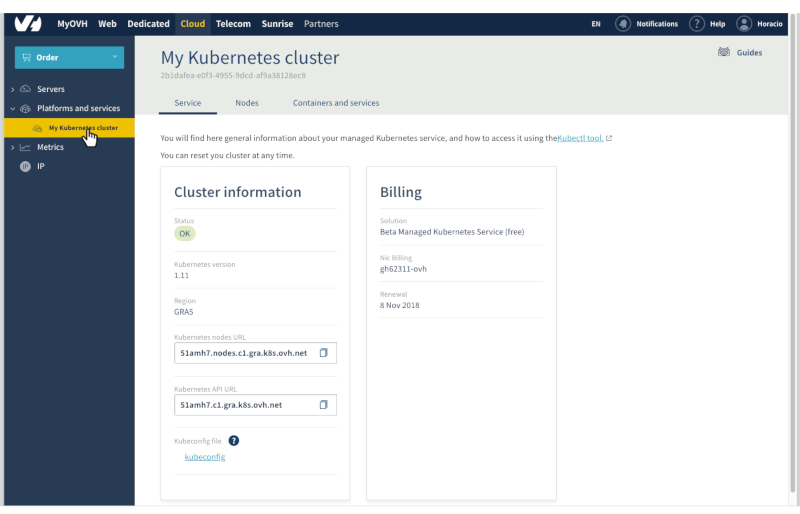
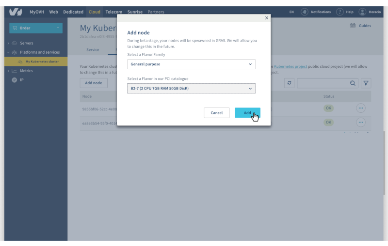
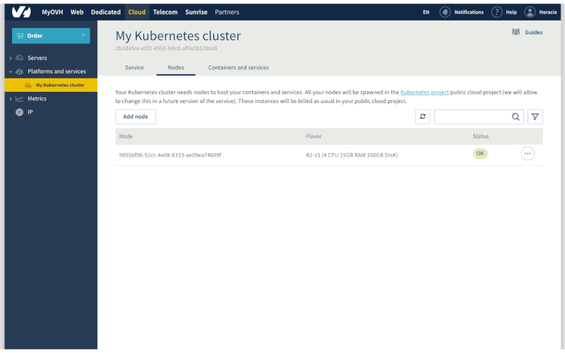

**Last updated 25 February, 2019.**

Follow this quickstart guide to deploy a containerised *Hello World* application on your OVH Managed Kubernetes Service cluster, using the OVH Control Panel.

In this guide, we are assuming that you're using the [OVH Control Panel](https://www.ovh.com/manager/cloud/) to manage your Kubernetes cluster. If you are using a different method, like the [OVH API](https://api.ovh.com/), please refer to the appropriate documentation:

- [Deploying a Hello World with the OVH API](../deploying-hello-world-ovh-api/)

## Before you begin

* You should have already created a cluster on the OVH Managed Kubernetes service.
* You will also need the [kubectl](https://kubernetes.io/docs/reference/kubectl/overview/){.external} command-line tool. You can find the [detailed installation instructions](https://kubernetes.io/docs/tasks/tools/install-kubectl/){.external} for this tool on Kubernetes' official site.

## Getting your cluster information

Access our administration UI for your OVH Managed Kubernetes clusters by clicking on the *Platforms and services* menu in the [Cloud section of the OVH Control Panel](https://www.ovh.com/manager/cloud/)

{.thumbnail}

In this administration UI, you have three tabs:

- **Service:** a global view of your cluster, with important information like the status, API URL, and `kubectl` configuration file.

- **Nodes:** the active nodes of your cluster, with options for adding, modifying or removing them.

- **Containers and Services:** coming soon...

## Configuring the default settings for kubectl

Please refer to the [Configuring kubectl on an OVH Managed Kubernetes cluster](../configuring-kubectl/) documentation for this part of the process.

## Add a worker node

In the *Computer Nodes* tab of the administration UI, click on *Add Node*. For this example, choose a general purpose node, like the B2-7 flavor:

{.thumbnail}

## Verify that your node is ready

In the *Computer Nodes* tab, you can inspect the state of your nodes. The node you have just created should now be in an *Installing* state. The node installation can take a minute, so feel free to take a short break, then try again until it's ready.

{.thumbnail}

## Deploy your first application

You're now ready to deploy your first application.

For more details about this process, you can refer to our [deploying an application](https://docs.ovh.com/gb/en/kubernetes/deploying-an-application/) documentation. 