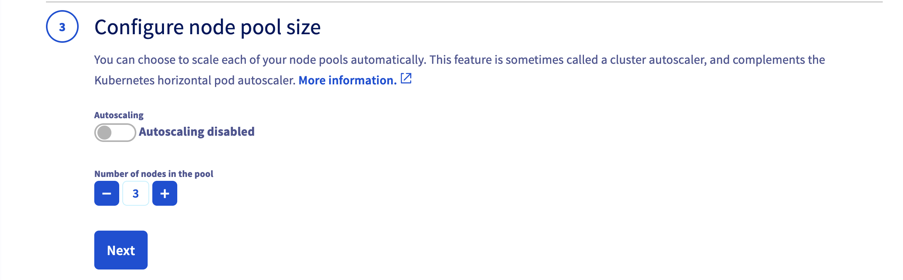

**Last updated February 21, 2022.**

Follow this quickstart guide to deploy a containerised *Hello World* application on your OVHcloud Managed Kubernetes Service cluster, using the OVHcloud Control Panel.

In this guide, we are assuming that you're using the [OVHcloud Cloud Manager](https://www.ovh.com/auth/?action=gotomanager&from=https://www.ovh.pt/&ovhSubsidiary=pt) to manage your Kubernetes cluster. If you are using a different method, like the [OVHcloud API](https://api.ovh.com/), please refer to the appropriate documentation:

- [Deploying a Hello World with the OVHcloud API](../deploying-hello-world-ovh-api/)

## Before you begin

* You should have already created a cluster on the OVHcloud Managed Kubernetes service.
* You will also need the [kubectl](https://kubernetes.io/docs/reference/kubectl/overview/){.external} command-line tool. You can find the [detailed installation instructions](https://kubernetes.io/docs/tasks/tools/install-kubectl/){.external} for this tool on Kubernetes' official site.

## Getting your cluster information

Log in to the [OVHcloud Control Panel](https://www.ovh.com/auth/?action=gotomanager&from=https://www.ovh.pt/&ovhSubsidiary=pt), go to the `Public Cloud`{.action} section and select the Public Cloud project concerned.

Access the administration UI for your OVHcloud Managed Kubernetes clusters by clicking on `Managed Kubernetes Service`{.action} in the left-hand menu.

{.thumbnail}

Click on your cluster to access its information.

{.thumbnail}

In this administration UI, you have several tabs included:

- **Service:** a global view of your cluster, with important information like the status, API URL, and `kubectl` configuration file.

- **Node pools:** the node pools of your cluster, with options for adding, configuring or removing them.

- **APIServer access:** the possibility to configure the access to the API-server.

- **Audit Logs:** logs of your Kubernetes cluster’s control-plane.

## Configuring the default settings for kubectl

Please refer to the [Configuring kubectl on an OVHcloud Managed Kubernetes cluster](../configuring-kubectl/) documentation for this part of the process.

## Add a node pool

In the `Node pools`{.action} tab of the administration UI, click the `Add a node pool`{.action} button.

Enter a node pool name:

{.thumbnail}

> [!primary]
>
> Only alphanumerical characters and "-" are allowed for the node pool name. You can’t use characters like “_”, “.” or "/" as a separator in a node pool name.

Choose a flavor (machine type) for your node pool, B2-7 for example:

{.thumbnail}

Configure the number of nodes you want to add to your node pool, 3 for example with Autoscaling disabled.

{.thumbnail}

Define the billing method: monthly or hourly.

{.thumbnail}

## Verify that your node pool is ready

In the *Computer Nodes* tab, you can inspect the state of your Node pools. The node pool you have just created should now be in an *Installing* state. The node pool installation can take a minute, so feel free to take a short break, then try again until it's ready.

{.thumbnail}

After its creation, click on the node pool in order to list its nodes details.

{.thumbnail}

## Deploy your first application

You're now ready to deploy your first application.

For more details about this process, you can refer to our [deploying an application](../deploying-an-application/) documentation.
