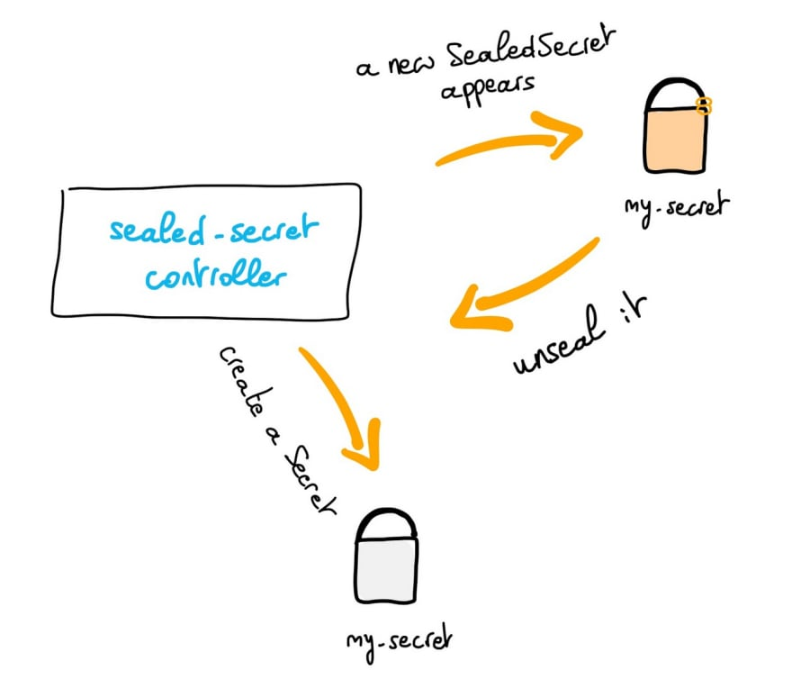

**Last updated 16th February 2022.**

<style>
 pre {
     font-size: 14px;
 }
 pre.console {
   background-color: #300A24; 
   color: #ccc;
   font-family: monospace;
   padding: 5px;
   margin-bottom: 5px;
 }
 pre.console code {
   border: solid 0px transparent;
   font-family: monospace !important;
   font-size: 0.75em;
   color: #ccc;
 }
 .small {
     font-size: 0.75em;
 }
</style>

## Objective

When you want to store your Kubernetes resources, as YAML manifest, the common way is to store/keep them in a Git repository. Thanks to that you can also create, edit and delete automatically with Infrastructure as Code and CI/CD your Kubernetes clusters and resources. In the Kubernetes world when we want to handle sensitive data, the usage is to store it in a Secret in a Kubernetes cluster. But the problem is that you can't store a Secret in a Version Control tool because the Secret is not encrypted, it's a question of security.

As at OVHcloud, we like to provide you with the best products and services and for us security is important, that's why we wanted to help you to discover Kubeseal which will help you to encrypt your sensitive informations and deploy them easily in your OVHcloud Managed Kubernetes.

In this guide you will:

- Install Kubeseal
- TODO: xxx
- TODO: xxx

You can use the *Reset cluster* function on the Public Cloud section of the [OVHcloud Control Panel](https://www.ovh.com/auth/?action=gotomanager&from=https://www.ovh.co.uk/&ovhSubsidiary=GB){.external} to reinitialize your cluster before following this tutorial.

## Kubernetes Secrets

As we said, Secrets in Kubernetes are used to store sensitive data, like password, keys, certificates and token. Secrets are encoded in base64 and automatically decoded when they are attached and read by a Pod.

A secret in Kubernetes cluster is encoded in base64 but not encrypted!

Theses data are "only" encoded so if a user have access to your secrets, he can simply `base64 decode` to see your sensitive data (`kubectl get secret my-secret -o jsonpath="{.data.password}" | base64 -D` for Mac and `--decode` instead of `-D` for Linux platform).

As the secrets aren't encrypted, it can be unsecure to commit them to your Git repository.

## Sealed Secrets

A solution is to use [Sealed Secrets](https://github.com/bitnami-labs/sealed-secrets), former called `Kubeseal`, a bitnami tool. Its goal is to encrypt your Kubernetes Secret into a `SealedSecret`, which is safe to store - even to a public repository. The SealedSecret can be decrypted only by the controller running in the target cluster and nobody else.

TODO: kubeseal logo?

Read more about [Sealed Secrets](https://engineering.bitnami.com/articles/sealed-secrets.html).

How is it working?



As you can see in the schema, a `sealed-secret-controller` run in the Kubernetes cluster. He listens when a new `SealedSecret` object appears, unsealed it (thanks to known certificates) and create a Kubernetes secret in the same namespace as the SealedSecret.

Note that if you delete the SealedSecret in your cluster, the linked Secret will be deleted too.

## Requirements

This tutorial presupposes that you already have a working OVHcloud Managed Kubernetes cluster, and some basic knowledge of how to operate it. If you want to know more on those topics, please look at the [deploying a Hello World application](../deploying-hello-world/) documentation.

## Instructions

### Install Sealed Secret CLI

The `kubeseal` utility uses asymmetric crypto to encrypt secrets that only the controller can decrypt.

With kubeseal CLI you can also specify a key certificate for sealing secrets.

In order to install the CLI, [follow the instructions](https://github.com/bitnami-labs/sealed-secrets#installation) depending on your OS.

You can, for example, install it through Homebrew:

```bash
brew install kubeseal
```

Then test if the CLI is correctly installed on your computer:

```console
kubeseal version
```

Output should be like this:

<pre class="console"><code>$ brew install kubeseal
Running `brew update --preinstall`...
==> Auto-updated Homebrew!
...
==> Pouring kubeseal--0.17.3.arm64_big_sur.bottle.tar.gz
🍺  /Users/avache/homebrew/Cellar/kubeseal/0.17.3: 5 files, 35.3MB
==> Running `brew cleanup kubeseal`...
Disable this behaviour by setting HOMEBREW_NO_INSTALL_CLEANUP.
Hide these hints with HOMEBREW_NO_ENV_HINTS (see `man brew`).

$ kubeseal --version
kubeseal version: v0.17.3
</code></pre>

### Installing Sealed Secrets

For this tutorial we are using the [Sealed Secrets Helm chart](https://github.com/bitnami-labs/sealed-secrets/tree/main/helm/sealed-secrets).

Add the Sealed Secrets Helm repository:

```bash
helm repo add sealed-secrets https://bitnami-labs.github.io/sealed-secrets
helm repo update
```

These commands will add the Kyverno Helm repository to your local Helm chart repository and update the installed chart repositories:

<pre class="console"><code>$ helm repo add sealed-secrets https://bitnami-labs.github.io/sealed-secrets

"sealed-secrets" has been added to your repositories

$ helm repo update

Hang tight while we grab the latest from your chart repositories...
...Successfully got an update from the "sealed-secrets" chart repository
...
...Successfully got an update from the "bitnami" chart repository
Update Complete. ⎈Happy Helming!⎈
</code></pre>

Install the latest version of Sealed Secrets with `helm install` command:

```bash
helm install sealed-secrets-controller --namespace kube-system sealed-secrets/sealed-secrets
```

> [!primary]
>
> You can install the tool on a specific namespace, other than `kube-system`, with `--namespace` option, but if you do it, you will have to pass it as an argument explicitly at each execution of the `kubeseal` commands.

This command will install the latest version of Sealed Secrets:

<pre class="console"><code>$ helm install sealed-secrets-controller --namespace kube-system sealed-secrets/sealed-secrets
NAME: sealed-secrets-controller
LAST DEPLOYED: Wed Feb 16 14:59:42 2022
NAMESPACE: kube-system
STATUS: deployed
REVISION: 1
TEST SUITE: None
NOTES:
** Please be patient while the chart is being deployed **

You should now be able to create sealed secrets.

1. Install the client-side tool (kubeseal) as explained in the docs below:

    https://github.com/bitnami-labs/sealed-secrets#installation-from-source

2. Create a sealed secret file running the command below:

    kubectl create secret generic secret-name --dry-run=client --from-literal=foo=bar -o [json|yaml] | \
    kubeseal \
      --controller-name=sealed-secrets-controller \
      --controller-namespace=kube-system \
      --format yaml > mysealedsecret.[json|yaml]

The file mysealedsecret.[json|yaml] is a commitable file.

If you would rather not need access to the cluster to generate the sealed secret you can run:

    kubeseal \
      --controller-name=sealed-secrets-controller \
      --controller-namespace=kube-system \
      --fetch-cert > mycert.pem

to retrieve the public cert used for encryption and store it locally. You can then run 'kubeseal --cert mycert.pem' instead to use the local cert e.g.

    kubectl create secret generic secret-name --dry-run=client --from-literal=foo=bar -o [json|yaml] | \
    kubeseal \
      --controller-name=sealed-secrets-controller \
      --controller-namespace=kube-system \
      --format [json|yaml] --cert mycert.pem > mysealedsecret.[json|yaml]

3. Apply the sealed secret

    kubectl create -f mysealedsecret.[json|yaml]

Running 'kubectl get secret secret-name -o [json|yaml]' will show the decrypted secret that was generated from the sealed secret.

Both the SealedSecret and generated Secret must have the same name and namespace.
</code></pre>

Once you deploy the Hem chart, it will:

- create the SealedSecret CRD
- install the controller into `kube-system` namespace
- create a `sealed-secrets-controller` service account into `kube-system` namespace
- and necessary RBAC roles.

You can check if the Sealed Secrets controller pod is correctly running:

<pre class="console"><code>$ kubectl get pod -n kube-system -l app.kubernetes.io/name=sealed-secrets
NAME                                         READY   STATUS    RESTARTS   AGE
sealed-secrets-controller-5fb95c87fd-pnvmk   1/1     Running   0          2m43s
</code></pre>

When the controller starts it will generate a key pair.

### Retrieves the generated keypair

At the start of the `sealed-secrets-controller` a certificate keypair is generated. It can be useful to you to store it in a secret management tool like Vault.

Execute the following command to retreve the content of the secret containing the generated keypair:

```bash
kubectl get secret -l sealedsecrets.bitnami.com/sealed-secrets-key -o yaml -n kube-system
```

The output should look like this:

<pre class="console"><code>
$ kubectl get secret -l sealedsecrets.bitnami.com/sealed-secrets-key -o yaml -n kube-system

apiVersion: v1
items:
- apiVersion: v1
  data:
    tls.crt: <sensitive-data-encoded-in-base64>
    tls.key: <sensitive-data-encoded-in-base64>
  kind: Secret
  metadata:
    creationTimestamp: "2022-02-16T13:42:25Z"
    generateName: sealed-secrets-key
    labels:
      sealedsecrets.bitnami.com/sealed-secrets-key: active
    name: sealed-secrets-keyvzwdp
    namespace: kube-system
    resourceVersion: "2305607283"
    uid: b2b6669a-358a-462e-a284-3d743434f82f
  type: kubernetes.io/tls
kind: List
metadata:
  resourceVersion: ""
  selfLink: ""
</code></pre>

With this information you can now base64 decode the `tls.crt` and `tls.key` and store them locally and in your secret management tool in order to use them later to retrieve the sealed secrets.

You can use [kubectl view-secret](https://github.com/elsesiy/kubectl-view-secret) kubectl plugin in order to retrieves the key and the crt easily and store them locally:

```bash
SEALEDKEY=$(kubectl get secret -l sealedsecrets.bitnami.com/sealed-secrets-key  -n kube-system -o name)

kubectl view-secret $SEALEDKEY tls.crt -n kube-system > tls.crt

kubectl view-secret $SEALEDKEY tls.key -n kube-system > tls.key
```

### Create a sealed-secret

First, you can generate a Kubernetes secret. In this example you will create, in a YAML file, a secret containing a token named `my_token` with the value `123456789abc123def456ghi789`:

```bash
kubectl create secret generic my-token --from-literal=my_token='123456789abc123def456ghi789' --dry-run=client -o yaml -n my-namespace > my-token.yaml
```

And then you can display the secret:

```bash
cat my-token.yaml
```

The output should like this:

<pre class="console"><code>$ kubectl create secret generic my-token --from-literal=my_token='123456789abc123def456ghi789' --dry-run=client -o yaml -n my-namespace > my-token.yaml

$ cat my-token.yaml
apiVersion: v1
data:
  my_token: MTIzNDU2Nzg5YWJjMTIzZGVmNDU2Z2hpNzg5
kind: Secret
metadata:
  creationTimestamp: null
  name: my-token
  namespace: my-namespace
</code></pre>

Then, seal the secret, with the retrieved generated certificate you saved and store before:

```bash
kubeseal --cert tls.crt --format=yaml < my-token.yaml > mysealedtoken.yaml
```

The output should look like this:

<pre class="console"><code>$ kubeseal --cert tls.crt --format=yaml < my-token.yaml > mysealedtoken.yaml

$ cat mysealedtoken.yaml
apiVersion: bitnami.com/v1alpha1
kind: SealedSecret
metadata:
  creationTimestamp: null
  name: my-token
  namespace: my-namespace
spec:
  encryptedData:
    my_token: <sensitive-data>
  template:
    data: null
    metadata:
      creationTimestamp: null
      name: my-token
      namespace: my-namespace
</code></pre>

TODO: my-namespace il faut le créer avant ...

TODO: Deploy SealedSecret in the cluster
$ kubectl apply -f mysealedtoken.yaml -n my-namespace

TODO: Check in your cluster
You can check/verify in your Kubernetes cluster if the SealedSecret and Secret have been correctly deployed:
$ kubectl get sealedsecret -n my-namespace
NAME           TYPE       DATA    AGE
my-token      Opaque       1      4d

$ kubectl get secret -n my-namespace
NAME          AGE
my-token    4d
Ok, my Secret have been successfully created by the controller! :-)

TODO: primary Be careful, the SealedSecret and Secret resources must have the same namespace and name. This is a feature to prevent other users on the same cluster from re-using your sealed secrets.

TODO: xxx


### What's next?

TODO: xxx


You now have a policy management on your Kubernetes cluster, and you deployed a few policies to test the behavior of Kyverno.  
In order to see more examples of policies, you can go to [Kyverno policies repository](https://github.com/kyverno/policies/). This repository contains Kyverno policies for a wide array of usage on various Kubernetes and ecosystem resources and subjects.

If you have any questions or troubles about Kyverno, you can also go to [Kyverno Slack community](https://slack.k8s.io/#kyverno).

Having a policy management is a good practice to follow. It will help you to keep your cluster clean and secure.  
Next time we will see another tutorial that will help you to secure your OVHcloud Managed Kubernetes clusters.

## Cleanup

First, remove the `ClusterPolicies` you deployed in this guide:

```bash
kubectl delete cpol --all
```

To uninstall Kyverno, as you installed it through Helm, you can use `helm uninstall` command in order to delete the Kyverno Helm installed chart:

```bash
helm uninstall kyverno kyverno/kyverno --namespace kyverno
```

## Go further

Join our community of users on <https://community.ovh.com/en/>.
