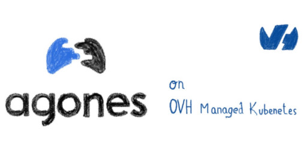

<style>
 pre {
     font-size: 14px;
 }
 pre.console {
   background-color: #300A24; 
   color: #ccc;
   font-family: monospace;
   padding: 5px;
   margin-bottom: 5px;
 }
 pre.console code {
   border: solid 0px transparent;
   font-family: monospace !important;
   font-size: 0.75em;
   color: #ccc;
 }
 .small {
     font-size: 0.75em;
 }
</style>

**Last updated 1<sup>st</sup> July, 2019.**


In this tutorial we are going to guide you with the install of [Agones](https://agones.dev){.external} on your OVHcloud Managed Kubernetes Service. Agones is an open-source, multiplayer, dedicated game-server hosting built on Kubernetes.

And to test your install, you will install a [Xonotic](http://www.xonotic.org/){.external} game server and playing some old-school deathmatches...


## Before you begin

This tutorial presupposes that you already have a working OVHcloud Managed Kubernetes cluster, and some basic knowledge of how to operate it. If you want to know more on those topics, please look at the [deploying a Hello World application](../deploying-hello-world/) documentation.

You also need to have [Helm](https://docs.helm.sh/){.external} installed on your workstation and your cluster, please refer to the [How to install Helm on OVHcloud Managed Kubernetes Service](../installing-helm/) tutorial.


## What is Agones?

One of the key advantages of using Kubernetes is the formidable ecosystem around it. From [Rancher](http://rancher.com/){.external} to [Istio](https://istio.io/){.external}, from [Rook](http://rook.io){.external} to [Fission](https://fission.io/), from [gVisor](https://gvisor.dev/){.external} to [KubeDB](https://kubedb.com/){.external}, the Kubernetes ecosystem is rich, vibrant and ever-growing. We are getting to the point where for most deployment needs we can say *there is a K8s-based open-source project for that*.

One of the latests additions to this ecosystem is the [Agones](https://agones.dev){.external}  project, an open-source, multiplayer, dedicated game-server hosting built on Kubernetes, developed by Google in collaboration with [Ubisoft](https://www.ubisoft.com/en-us/){.external}. The project was [announced in March](https://cloud.google.com/blog/products/gcp/introducing-agones-open-source-multiplayer-dedicated-game-server-hosting-built-on-kubernetes){.external}, and has already made quite a bit of noise...

{.thumbnail}


## Why Agones?

Agones ([derived from the Greek word *agōn*](https://www.merriam-webster.com/dictionary/agones){.external}, contests held during public festivals or more generally "contest" or "competition at games") aims to replace the usual proprietary solutions to deploy, scale and manage game servers.

Agones enriches Kubernetes with a [Custom Controller](https://kubernetes.io/docs/concepts/api-extension/custom-resources/#custom-controllers){.external} and a [Custom Resource Definition](https://kubernetes.io/docs/concepts/api-extension/custom-resources/#customresourcedefinitions){.external} With them, you can standardise Kubernetes tooling and APIs to create, scale and manage game server clusters.


### What kind of game servers

Well, Agones's main focus is online multiplayer games such as [FPS](https://en.wikipedia.org/wiki/First-person_shooter){.external}s and [MOBA](https://en.wikipedia.org/wiki/Multiplayer_online_battle_arena){.external}s, fast-paced games requiring dedicated, low-latency game servers that synchronize the state of the game between players and serve as a source of truth for gaming situations.

These kinds of games ask for relatively ephemeral dedicated gaming servers, with every match running on a server instance. The servers need to be stateful (they must keep the game status), with the state usually held in memory for the duration of the match.

Latency is a key concern, as the competitive real-time aspects of the games ask for quick responses from the server. That means that the connection from the player device to the game server should be the most direct possible, ideally bypassing any intermediate server such as a load-balancer.

### Connecting players to the right server

Every game publisher used to have their own proprietary solutions, but most on them follow a similar flow, with a matchmaking service that groups players into a match, deals with a cluster manager to provision a dedicated instance of game server and send to the players its IP address and port, to allow them to directly connect to the server and play the game.

{.thumbnail}

Agones and it's Custom Controller and Custom Resource Definition replaces the complex cluster management infrastructure with a standardised, Kubernetes-based tooling and APIs. The matchmaker services interact with these APIs to spawn new game server pods and get their IP address and ports to the concerned players.

{.thumbnail}


> [!primary]
> ### The cherry on the cake
>
> Using Kubernetes for these tasks also gives some nice additional bonus, like being able to deploy the full gaming infrastructure in a developer environnement [minikube](https://github.com/kubernetes/minikube), or easily clone it to deploy in a new data center or cloud region, but also offering a whole platform to host all the additional services needed to build a game: account management, leaderboards, inventory...
>
> And of course, the simplicity of operating Kubernetes-based platforms, especially when they dynamic, heterogeneous and distributed, as most online gaming platforms.

## Deploying Agones on OVHcloud Managed Kubernetes

There are several ways to install Agones in a Kubernetes cluster. For our test we chose the easiest one: installing with [Helm](https://helm.sh/).

### Enabling creation of RBAC resources

The first step to install Agones is to setup a service account with enough permissions to create some special RBAC resource types.

```
kubectl create clusterrolebinding cluster-admin-binding \
  --clusterrole=cluster-admin --serviceaccount=kube-system:default
```

Now we have the [Cluster Role Binding](https://kubernetes.io/docs/reference/access-authn-authz/rbac/#rolebinding-and-clusterrolebinding){.external} needed for the installation:

<pre class="console"><code>$ kubectl create clusterrolebinding cluster-admin-binding \
>   --clusterrole=cluster-admin --serviceaccount=kube-system:default
clusterrolebinding.rbac.authorization.k8s.io/cluster-admin-binding created</code></pre>


## Installing the Agones chart

Now let's continue by adding Agones repository to Helm's repository list.

```
helm repo add agones https://agones.dev/chart/stable
```

And then installing the stable Agones chart:
```
helm install --name my-agones --namespace agones-system agones/agones
```

After some moments, Agones should we installed:


<pre class="console"><code>$ helm repo add agones https://agones.dev/chart/stable
"agones" has been added to your repositories
$ helm install --name my-agones --namespace agones-system agones/agones
NAME:   my-agones
LAST DEPLOYED: Tue May 21 17:10:09 2019
NAMESPACE: agones-system
STATUS: DEPLOYED
[...]</code></pre>


> [!warning]
> The installation we have just done isn't suited for production, as the [official install instructions](https://agones.dev/site/docs/installation/helm/) recommend running Agones and the game servers in separate, dedicated pools of nodes. 
> But for the needs of our test, the basic setup is enough.

## Confirming Agones started successfully

To verify that Agones is running on our Kubernetes cluster, we can look at the pods in the `agones-system` namespace:

```
kubectl get --namespace agones-system pods
```

If everything is ok, you should see an `agones-controller` pod with a `Running` status:

<pre class="console"><code>$$ kubectl get --namespace agones-system pods
NAME                                 READY   STATUS    RESTARTS   AGE
agones-controller-5f766fc567-xf4vv   1/1     Running   0          5d15h
agones-ping-889c5954d-6kfj4          1/1     Running   0          5d15h
agones-ping-889c5954d-mtp4g          1/1     Running   0          5d15h
</code></pre>

You can also see more details using:

```
kubectl describe --namespace agones-system pods
```

Looking at the `agones-controller` description, you should see something like:

<pre class="console"><code>$ kubectl describe --namespace agones-system pods
Name:               agones-controller-5f766fc567-xf4vv
Namespace:          agones-system
[...]
Conditions:
  Type              Status
  Initialized       True 
  Ready             True 
  ContainersReady   True 
  PodScheduled      True</code></pre>

Where all the `Conditions` should have status `True`.


## Deploying a game server

The Agones <em>Hello world</em> is rather boring, a simple [Xonotic game server](https://github.com/GoogleCloudPlatform/agones/blob/release-0.9.0/examples/xonotic){.external}.

[Xonotic](https://www.xonotic.org/){.external} is an open-source multi-player FPS, and a rather good one, with lots of interesting game modes, maps, weapons and customization options.

Deploying a Xonotic game server over Agones is rather easy:

<pre><code class="language-bash">kubectl create -f https://raw.githubusercontent.com/GoogleCloudPlatform/agones/release-0.9.0/examples/xonotic/gameserver.yaml</code></pre>
The game server deployment can take some moments, so we need to wait until its status is `Ready` before using it. We can fetch the status with:
<pre><code class="language-bash">kubectl get gameserver</code></pre>
We wait until the fetch gives a `Ready` status on our game server:
<pre class="console"><code>$ kubectl get gameserver
NAME      STATE   ADDRESS         PORT   NODE       AGE
xonotic   Ready   51.83.xxx.yyy   7094   node-zzz   5d
</code></pre>

When the game server is ready, we also get the address and the port we should use to connect to our deathmatch game (in my example, `51.83.xxx.yyy:7094`).

## It's frag time

So now that you have a server, let's test it!

Download the Xonotic client (it runs on Windows, Linux and MacOS, so there is no excuse), and launch it:

{.thumbnail}

Then go to the <em>Multiplayer</em> menu and enter the address and port of our game server:

{.thumbnail}

And you are ready to play!

{.thumnbnail}

### And on the server side?

On the server side, you can spy how things are going for your game server, using `kubectl logs`. Let's begin by finding the pod running the game:

```
kubectl get pods
```

You will see that your game server is running in a pod called `xonotic`:

<pre class="console"><code>$ kubectl get pods 
NAME      READY   STATUS    RESTARTS   AGE
xonotic   2/2     Running   0          5d15h
</code></pre>

You can then use `kubectl logs` on it. In the pod there are two containers, the main `xonotic` one and a Agones <em>sidecar</em>, so we must specify that we want the logs of the `xonotic` container:

<pre class="console"><code>$ kubectl logs xonotic
Error from server (BadRequest): a container name must be specified for pod xonotic, choose one of: [xonotic agones-gameserver-sidecar]
$ kubectl logs xonotic xonotic
&gt;&gt;&gt; Connecting to Agones with the SDK
&gt;&gt;&gt; Starting health checking
&gt;&gt;&gt; Starting wrapper for Xonotic!
&gt;&gt;&gt; Path to Xonotic server script: /home/xonotic/Xonotic/server_linux.sh 
Game is Xonotic using base gamedir data
gamename for server filtering: Xonotic
Xonotic Linux 22:03:50 Mar 31 2017 - release
Current nice level is below the soft limit - cannot use niceness
Skeletal animation uses SSE code path
execing quake.rc
[...]
Authenticated connection to 109.190.xxx.yyy:42475 has been established: client is v6xt9/GlzxBH+xViJCiSf4E/SCn3Kx47aY3EJ+HOmZo=@Xon//Ks, I am /EpGZ8F@~Xon//Ks
LostInBrittany is connecting...
url_fclose: failure in crypto_uri_postbuf
Receiving player stats failed: -1
LostInBrittany connected
LostInBrittany connected
LostInBrittany is now spectating
[BOT]Eureka connected
[BOT]Hellfire connected
[BOT]Lion connected
[BOT]Scorcher connected
unconnected changed name to [BOT]Eureka
unconnected changed name to [BOT]Hellfire
unconnected changed name to [BOT]Lion
unconnected changed name to [BOT]Scorcher
[BOT]Scorcher picked up Strength
[BOT]Scorcher drew first blood! 
[BOT]Hellfire was gunned down by [BOT]Scorcher's Shotgun
[BOT]Scorcher slapped [BOT]Lion around a bit with a large Shotgun
[BOT]Scorcher was gunned down by [BOT]Eureka's Shotgun, ending their 2 frag spree
[BOT]Scorcher slapped [BOT]Lion around a bit with a large Shotgun
[BOT]Scorcher was shot to death by [BOT]Eureka's Blaster
[BOT]Hellfire slapped [BOT]Eureka around a bit with a large Shotgun, ending their 2 frag spree
[BOT]Eureka slapped [BOT]Scorcher around a bit with a large Shotgun
[BOT]Eureka was gunned down by [BOT]Hellfire's Shotgun
[BOT]Hellfire was shot to death by [BOT]Lion's Blaster, ending their 2 frag spree
[BOT]Scorcher was cooked by [BOT]Lion
[BOT]Eureka turned into hot slag
[...]
</code></pre>

### Add some friends...

The next step is mostly enjoyable: ask some friends to connect to the server and do a true deathmatch like in *Quake 2* times.

## And now?

You have a working game server, but this tutorial has barely uncovered the possibilities of Agones: deploying a [allocator service](https://agones.dev/site/docs/tutorials/allocator-service-go/){.external}. In future blog posts and tutorials we will dive deeper into it, and explore those possibilities.
