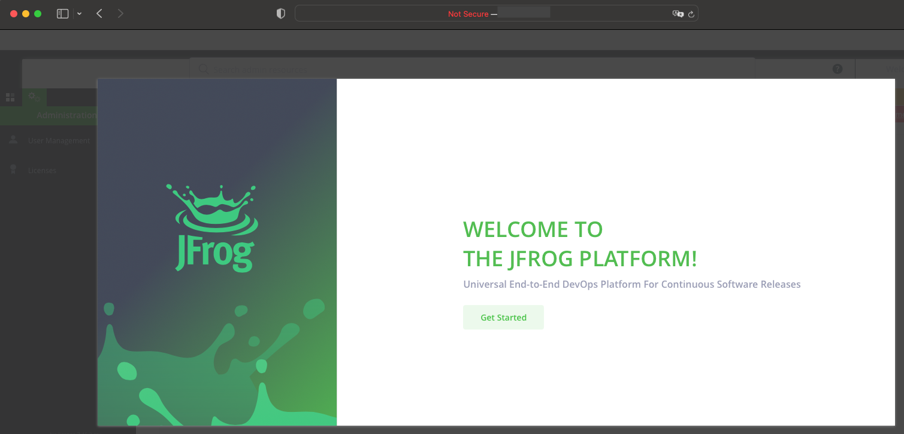

<style>
 pre {
     font-size: 14px;
 }
 pre.console {
   background-color: #300A24; 
   color: #ccc;
   font-family: monospace;
   padding: 5px;
   margin-bottom: 5px;
 }
 pre.console code {
   border: solid 0px transparent;
   font-family: monospace !important;
   font-size: 0.75em;
   color: #ccc;
 }
 .small {
     font-size: 0.75em;
 }
</style>

**Last updated 11th October 2022**

## Objective

Jfrog Artifactory is one of the major solution to manage dependencies and packaged binaries. All this kind of objects are called _artefacts_.

## Requirements 

- An OVHcloud Managed Kubernetes cluster
- The Helm client installed and configured. You can follow the OVHcloud tutorial: [Installing Helm on OVHcloud Managed Kubernetes](../installing-helm/).
- The `kubectl` client installed and configured. You can follow the OVHcloud tutorial: [Configuring kubectl on an OVHcloud Managed Kubernetes cluster](../configuring-kubectl-on-an-ovh-managed-kubernetes-cluster/)

## Instructions

> You can find more detailled documentation about differents ways to install Jfrog Artifactory in the official [documentation](https://www.jfrog.com/confluence/display/JFROG/Installing+Artifactory#InstallingArtifactory-HelmInstallation).
> The following tutorial explain how to install a single node installation, for more advanced installation (like HA see the [documentation](https://www.jfrog.com/confluence/display/JFROG/Installing+Artifactory#InstallingArtifactory-HAInstallation)).

### Configure Helm to use the Jfrog chart

In a terminal add the Jfrog repository to your Helm installation:

```bash
$ helm repo add jfrog https://charts.jfrog.io
$ helm repo update
```

Output should be like this:

<pre class="console">
<code>
$ helm repo add jfrog https://charts.jfrog.io
"jfrog" has been added to your repositories

$ helm repo update
Hang tight while we grab the latest from your chart repositories...
...Successfully got an update from the "apache-airflow" chart repository
...Successfully got an update from the "ingress-nginx" chart repository
...Successfully got an update from the "jfrog" chart repository
Update Complete. ⎈Happy Helming!⎈
</code>
</pre>

### Configure the master key and the join key

At this stage it's strongly recommended that you configure your master key and join key, more informations about these keys in the official [documentation](https://www.jfrog.com/confluence/display/JFROG/Managing+Keys).

In a terminal configure the master key ad follow:

```bash
$ export MASTER_KEY=$(openssl rand -hex 32)

$ echo ${MASTER_KEY}
```

Output should be like this:

<pre class="console">
<code>
$ export MASTER_KEY=$(openssl rand -hex 32)

$ echo ${MASTER_KEY}
xxxxxxxxfffffffffffffxxxxxxxxxxxxxxxxxxxxxgggggggggggggxxxxxxxxxx
</code>
</pre>

Next configure the join key as follow:

```bash
$ export JOIN_KEY=$(openssl rand -hex 32)

$ echo ${MASTER_KEY}
```

Output should be like this:

<pre class="console">
<code>
$ export JOIN_KEY=$(openssl rand -hex 32)

$ echo ${MASTER_KEY}
xxxxxxxxyyyyyyyyyyyyyxxxxxxxxxxxxxxxxxxxxxyyyyyyyyyyyyxxxxxxxxxx
</code>
</pre>

### Install Jfrog Artifcatory with Helm

First you need to create the `artifactory` namespace:

```bash
$ kubectl create ns artifactory
```

Next you can install Jfrog Artifactory with the following helm command:

```bash
$ helm upgrade --install artifactory --set artifactory.masterKey=${MASTER_KEY} --set artifactory.joinKey=${JOIN_KEY} --namespace artifactory jfrog/artifactory
```
Output should be like this:

<pre class="console">
<code>
$ helm upgrade --install artifactory --set artifactory.masterKey=${MASTER_KEY} --set artifactory.joinKey=${JOIN_KEY} --namespace artifactory jfrog/artifactory

Release "artifactory" does not exist. Installing it now.
NAME: artifactory
LAST DEPLOYED: Wed Oct 12 10:41:49 2022
NAMESPACE: artifactory
STATUS: deployed
REVISION: 1
TEST SUITE: None
NOTES:
Congratulations. You have just deployed JFrog Artifactory!

1. Get the Artifactory URL by running these commands:

   NOTE: It may take a few minutes for the LoadBalancer IP to be available.
         You can watch the status of the service by running 'kubectl get svc --namespace artifactory -w artifactory-artifactory-nginx'
   export SERVICE_IP=$(kubectl get svc --namespace artifactory artifactory-artifactory-nginx -o jsonpath='{.status.loadBalancer.ingress[0].ip}')
   echo http://$SERVICE_IP/

2. Open Artifactory in your browser
   Default credential for Artifactory:
   user: admin
   password: password
</code>
</pre>

Next wait that all Pods status are `Running` and _ready_ (i.e the number of desired Pods is equal to the actual in the `Ready` column):

```bash
$ kubectl get pods -n artifactory
```

Output should be like this:

<pre class="console">
<code>
$ kubectl get pods -n artifactory
NAME                                             READY   STATUS    RESTARTS   AGE
artifactory-0                                    1/1     Running   0          8m11s
artifactory-artifactory-nginx-7c556cb56b-x5wvm   1/1     Running   0          8m11s
artifactory-postgresql-0                         1/1     Running   0          8m11s
</code>
</pre>

### Test the fresh installed Jfrog artifactory

Open the service URL in a browser and enter the default credentials `admin` and `password`:

{.thumbnail}

> [!primary]
>
> Do not forget to change the default password!

And that's it you can start to use your Jfrog Artifactory instance:

{.thumbnail}

## Go further

To have an overview of the OVHcloud Managed Kubernetes service, you can go to the [OVHcloud Managed Kubernetes page](https://www.ovh.com/public-cloud/kubernetes/).

To learn more about how to use your Kubernetes cluster the practical way, we invite you to look at our [tutorials](../).

Join our [community of users](https://community.ovh.com/en/).
