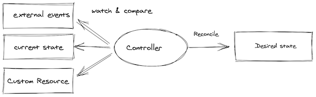

**Last updated 23rd February, 2022.**

<style>
 pre {
     font-size: 14px;
 }
 pre.console {
   background-color: #300A24; 
   color: #ccc;
   font-family: monospace;
   padding: 5px;
   margin-bottom: 5px;
 }
 pre.console code {
   border: solid 0px transparent;
   font-family: monospace !important;
   font-size: 0.75em;
   color: #ccc;
 }
 .small {
     font-size: 0.75em;
 }
</style>

## Objective

[Operators](https://kubernetes.io/docs/concepts/extend-kubernetes/operator/) are one way to extend Kubernetes to automate some actions in the cluster.



In a few words, an operator offers OPS actions programmatically and avoids repetitive human activities that are devoid of added value.
The tasks that an operator can do are various and can be on resources deployed in Kubernetes (like a Pod) or outside (like a database for example).
In this guide, we are focusing on resources inside a Kubernetes cluster.

An operator is based on a [Custom Resources](https://kubernetes.io/docs/concepts/extend-kubernetes/api-extension/custom-resources/) that allow to extend Kubernetes API.<br>
Thanks to the control loop of Kubernetes, the operator maintains the right state of the resources.<br>
Then the operator's job is to monitor the state of the internal or external objects that it manages.

An operator can have various capabilities:

* basic application setup and configuration
* upgrade the application (with rollback if needed)
* backup and recovery if the operator handles a state
* auto-remediation of the application if a problem occurs
* monitoring and observability for its own metrics
* auto scaling, auto tuning...  

A good summary of the capabilities of an operator can be found on the [operator framework website](https://operatorframework.io/operator-capabilities/).

As an operator is a custom API in Kubernetes, you need to develop it. Thankfully there are frameworks to help you to develop your own operator.
The most important [framework](https://operatorframework.io/operator-capabilities/) allows you to develop an operator with Ansible, Helm and Go.
Another kind of frameworks exists to use other languages, like Java for instance with the [Java operator SDK](https://github.com/java-operator-sdk/java-operator-sdk).

As we can see in the tutorial below, the capability of the developed operator depends on the language. For example, developing an operator with Helm offers less capabilities (but it's simpler).

## Requirements

This tutorial assumes that you already have a Kubernetes cluster managed by OVHcloud, and some basic knowledge of how to operate it. If you want to know more on those topics, please look at the [deploying a Hello World application](../deploying-hello-world/) documentation.

## Instructions

In this tutorial, you will create a simple operator that manages the installation of an Nginx server and monitors it. <br>
The operator allows you to:

 - install a Ngnix server with the required number of Pods
 - upgrade the number of Pods
 - change the HTTP port
 - recreate the service if it is deleted

You'll develop this operator with the [operator SDK](https://sdk.operatorframework.io). <br>
The operator SDK provides several tools:

 - a [CLI](https://sdk.operatorframework.io/docs/cli/) to develop and run locally the developed operator
 - several helpers in different languages (Helm, Ansible and Go) to easily develop an operator

In this article, you will use the [Helm helper](https://sdk.operatorframework.io/docs/building-operators/helm/quickstart/).  

### Install the CLI

The SDK includes a [CLI](https://sdk.operatorframework.io/docs/cli/) (**C**ommand **L**ine **I**nterface).<br>
In order to install the CLI, follow the instructions applicable to your OS. <br>
You can, for example, install it through Homebrew:

```bash
brew install operator-sdk
```

Then test if the CLI is correctly installed on your computer:

```bash
operator-sdk version
```

Output should be like this:

<pre class="console"><code>$ brew install operator-sdk
...
==> Installing dependencies for operator-sdk: go
==> Installing operator-sdk dependency: go
==> Pouring go--1.17.6.x86_64_linux.bottle.tar.gz
🍺  /home/linuxbrew/.linuxbrew/Cellar/go/1.17.6: 10,822 files, 532.9MB
==> Installing operator-sdk
==> Pouring operator-sdk--1.17.0.x86_64_linux.bottle.tar.gz
==> Caveats
Bash completion has been installed to:
  /home/linuxbrew/.linuxbrew/etc/bash_completion.d
==> Summary
🍺  /home/linuxbrew/.linuxbrew/Cellar/operator-sdk/1.17.0: 10 files, 196.3MB
==> Running `brew cleanup operator-sdk`...
Disable this behaviour by setting HOMEBREW_NO_INSTALL_CLEANUP.
Hide these hints with HOMEBREW_NO_ENV_HINTS (see `man brew`).
==> Caveats
==> operator-sdk
...

$ operator-sdk version
operator-sdk version: "v1.17.0", commit: "704b02a9ba86e85f43edb1b20457859e9eedc6e6", kubernetes version: "v1.21", go version: "go1.17.6", GOOS: "darwin", GOARCH: "arm64"
</code></pre>

### Develop an operator with Helm

In this guide, you will use [Helm](https://helm.sh/) to create your first operator.<br>
Helm is a package manager and provides templates to deploy applications in Kubernetes.

The CLI offers to scaffold an entire project, but it generates a lot of files that are not necessary for a non prod-ready application. <br>
More information on the project layout generated by the CLI can be found in the [official documentation](https://sdk.operatorframework.io/docs/overview/project-layout/).

#### The Helm chart

An operator based on Helm is like a classic Helm chart, it will follow the same structure and organization.
Your first Helm operator will follow the following code organization:

```bash
├── helm-charts
│   └── ovh-nginx
│       ├── Chart.yaml
│       ├── templates
│       │   ├── _helpers.tpl
│       │   ├── deployment.yaml
│       │   └── service.yaml
│       └── values.yaml
```

First, create a `helm-charts` folder and then an `ovh-nginx` folder inside it.<br>
Go inside the `helm-charts/ovh-nginx` folder.

Then, create a `templates` folder.<br>
In this `templates` folder, create a file named `deployment.yaml` with the following content:

```yaml
apiVersion: apps/v1
kind: Deployment
metadata:
  name: {{ include "ovh-nginx.fullname" . }}
  labels:
    {{- include "ovh-nginx.labels" . | nindent 4 }}
spec:
  replicas: {{ .Values.replicaCount }} # Thanks to Helm the replicas field will be dynamic
  selector:
    matchLabels:
      {{- include "ovh-nginx.selectorLabels" . | nindent 6 }}
  template:
    metadata:
      labels:
        {{- include "ovh-nginx.selectorLabels" . | nindent 8 }}
    spec:
      containers:
        - name: {{ .Chart.Name }}
          image: "{{ .Values.image.repository }}:{{ .Values.image.tag | default .Chart.AppVersion }}"
          imagePullPolicy: {{ .Values.image.pullPolicy }}
          resources:
            requests:
              memory: "2Mi"
              cpu: "0"
            limits:
              memory: "32Mi"
              cpu: "500m"          
          ports:
            - name: http
              containerPort: 80
              protocol: TCP
          livenessProbe:
            httpGet:
              path: /
              port: http
          readinessProbe:
            httpGet:
              path: /
              port: http
```

Then, in the `templates` folder, you can create the Service in a  `service.yaml` file with the following content:

```yaml
apiVersion: v1
kind: Service
metadata:
  name: {{ include "ovh-nginx.fullname" . }}
  labels:
    {{- include "ovh-nginx.labels" . | nindent 4 }}
spec:
  type: {{ .Values.service.type }}
  ports:
    - port: {{ .Values.service.port }} # Thanks to Helm the HTTP port field will be dynamic
      targetPort: http
      protocol: TCP
      name: http
  selector:
    {{- include "ovh-nginx.selectorLabels" . | nindent 4 }}
```

Then, still in the `templates` folder, create a helper to simplify the templates. To do that, create a `_helper.tpl` file with the content:

```bash
{{/*
Expand the name of the chart.
*/}}
{{- define "ovh-nginx.name" -}}
{{- default .Chart.Name | trunc 63 | trimSuffix "-" }}
{{- end }}

{{/*
Create a default fully qualified app name.
We truncate at 63 chars because some Kubernetes name fields are limited to this (by the DNS naming spec).
If release name contains chart name it will be used as a full name.
*/}}
{{- define "ovh-nginx.fullname" -}}
{{- printf "%s-%s" .Release.Name .Chart.Name | trunc 63 | trimSuffix "-" }}
{{- end }}

{{/*
Create chart name and version as used by the chart label.
*/}}
{{- define "ovh-nginx.chart" -}}
{{- printf "%s-%s" .Chart.Name .Chart.Version | replace "+" "_" | trunc 63 | trimSuffix "-" }}
{{- end }}

{{/*
Common labels
*/}}
{{- define "ovh-nginx.labels" -}}
helm.sh/chart: {{ include "ovh-nginx.chart" . }}
{{ include "ovh-nginx.selectorLabels" . }}
{{- if .Chart.AppVersion }}
app.kubernetes.io/version: {{ .Chart.AppVersion | quote }}
{{- end }}
app.kubernetes.io/managed-by: {{ .Release.Service }}
{{- end }}

{{/*
Selector labels
*/}}
{{- define "ovh-nginx.selectorLabels" -}}
app.kubernetes.io/name: {{ include "ovh-nginx.name" . }}
app.kubernetes.io/instance: {{ .Release.Name }}
{{- end }}
```

Your values need to be defined in a `values.yaml` file in the `ovh-nginx` folder with the content:

```yaml
# To allow your operator to change the number of replicas
replicaCount: 1

image:
  repository: ovhplatform/hello
  pullPolicy: IfNotPresent
  tag: "1.0"

service:
  type: LoadBalancer
  # To allow your operator to change the port
  port: 80
```
> [!primary]
>
> The operator can only manage fields declared in the `values.yaml` file and in the custom resource (see the [custom resource definition](#customresources) chapter below).
>

Finally, in the `ovh-nginx` folder,  create the `Chart.yaml` file with the following content:

```yaml
apiVersion: v2
appVersion: 1.0
description: A Helm chart to deploy the OVHcloud hello world Nginx server
name: ovh-nginx
type: application
version: 0.1.0
```

At this point, you have a standard Helm chart.<br>
It can be used with the Helm client (`helm upgrade` for instance) to deploy the Nginx server.<br>
In the following sections you'll see how to delegate this to an operator.

### Custom resources definition <a name="customresources"></a>

The [custom resources definition](https://kubernetes.io/docs/tasks/extend-kubernetes/custom-resources/custom-resource-definitions/) (CRDs) is the main point of the operator.<br>
It allows you to extend the default API of Kubernetes. This means you can work with them the same way you would with its core resources.<br>
In other words, once you have created a CRD, you'll be able to create new resources, called Custom Resources (CRs) to distinguish them from the core Kubernetes resources.<br>
The CRD is some kind of schema for the CR based on it.

It is important to note that CRDs by themselves are just data. They do not have any logic attached to them, nor any special behavior. 
To add logic you need a [controller](https://kubernetes.io/docs/concepts/architecture/controller/) or an operator.

You need to update your code organisation and add the following folders:

```bash
.
├── helm-charts
│   └── ovh-nginx
│       ├── Chart.yaml
│       ├── templates
│       │   ├── _helpers.tpl
│       │   ├── deployment.yaml
│       │   └── service.yaml
│       └── values.yaml
├── manifests
│   ├── crd
│   │   └── tutorials.ovhcloud.com_ovhnginxoperators.yaml
└── watches.yaml
```

First, create a `manifests` folder. Go inside it and create a `crd` folder.<br>
In the `crd` folder, create a `tutorials.ovhcloud.com_ovhnginxoperators.yaml` file with the following content:

```yaml
apiVersion: apiextensions.k8s.io/v1
kind: CustomResourceDefinition # The API to declare new API (CRD)
metadata:
  # name must match the spec fields below, and be in the form: <plural>.<group>
  name: ovhnginxs.tutorials.ovhcloud.com
spec:
  group: tutorials.ovhcloud.com
  names:
    kind: OvhNginx  # The name of your CRD 
    listKind: OvhNginxList
    # plural name to be used in the URL: /apis/<group>/<version>/<plural>
    plural: ovhnginxs
    # singular name to be used as an alias on the CLI and for display
    singular: ovhnginx
  scope: Namespaced
  versions:
  - name: v1
    schema:
      openAPIV3Schema:
        type: object
        properties:
          spec: # List of the properties in the CR, must match the values.yaml structure
            type: object
            properties:
              service:
                type: object
                properties:
                  port:  # To change the port of the Nginx server
                    type: integer
              replicaCount:  # To change the number of Pod
                type: integer
    served: true
    storage: true
    subresources:
      status: {}
```
Then create the `watches.yaml` file with the following content:

```yaml
- group: tutorials.ovhcloud.com
  version: v1
  kind: OvhNginx
  chart: helm-charts/ovh-nginx
```

### Test it locally (almost)

Before packaging and deploying your operator in a real Kubernetes cluster, you can test it locally.<br>
You still need your Managed Kubernetes cluster to deploy your CRD and the Nginx server managed by the operator.<br>
First, create the CRD in your Kubernetes cluster:

```bash
kubectl apply -f manifests/crd/tutorials.ovhcloud.com_ovhnginxoperators.yaml
```

Output should be like this:

<pre class="console"><code>$ kubectl apply -f manifests/crd/tutorials.ovhcloud.com_ovhnginxoperators.yaml
customresourcedefinition.apiextensions.k8s.io/ovhnginxs.tutorials.ovhcloud.com created

$ kubectl get crds/ovhnginxs.tutorials.ovhcloud.com
NAME                               CREATED AT
ovhnginxs.tutorials.ovhcloud.com   2022-02-18T13:51:14Z
</code></pre>

At this point there is no need to deploy the operator in the Kubernetes cluster, you can run it locally on your computer:

```bash
helm-operator run
```

Output should be like this:

<pre class="console"><code>$ helm-operator run

{"level":"info","ts":1645197230.698494,"logger":"cmd","msg":"Version","Go Version":"go1.17.6","GOOS":"darwin","GOARCH":"arm64","helm-operator":"v1.17.0","commit":"704b02a9ba86e85f43edb1b20457859e9eedc6e6"}
{"level":"info","ts":1645197230.699863,"logger":"cmd","msg":"Watch namespaces not configured by environment variable WATCH_NAMESPACE or file. Watching all namespaces.","Namespace":""}
{"level":"info","ts":1645197231.877758,"logger":"controller-runtime.metrics","msg":"Metrics server is starting to listen","addr":":8080"}
{"level":"info","ts":1645197231.888722,"logger":"helm.controller","msg":"Watching resource","apiVersion":"tutorials.ovhcloud.com/v1","kind":"OvhNginx","namespace":"","reconcilePeriod":"1m0s"}
{"level":"info","ts":1645197231.890322,"msg":"Starting server","kind":"health probe","addr":"[::]:8081"}
{"level":"info","ts":1645197231.8903291,"msg":"Starting server","path":"/metrics","kind":"metrics","addr":"[::]:8080"}
{"level":"info","ts":1645197231.8913422,"logger":"controller.ovhnginx-controller","msg":"Starting EventSource","source":"kind source: *unstructured.Unstructured"}
{"level":"info","ts":1645197231.891497,"logger":"controller.ovhnginx-controller","msg":"Starting Controller"}
{"level":"info","ts":1645197231.993102,"logger":"controller.ovhnginx-controller","msg":"Starting workers","worker count":8}
</code></pre>

> [!primary]
>
> Do not stop the operator execution. It's mandatory that it continues to run for the next steps.  
> You'll be able to stop it later in this tutorial when you deploy it in the Kubernetes cluster.


Now it's time to create your first CR.<br>
You need to update your code organisation and add the `samples` folder in the `manifests` folder:

```bash
.
├── helm-charts
│   └── ovh-nginx
│       ├── Chart.yaml
│       ├── templates
│       │   ├── _helpers.tpl
│       │   ├── deployment.yaml
│       │   └── service.yaml
│       └── values.yaml
├── manifests
│   ├── crd
│   │   └── tutorials.ovhcloud.com_ovhnginxoperators.yaml
│   └── samples
│       └── tutorials_v1_ovhnginxoperator.yaml
└── watches.yaml
```

In the `samples` folder, create the  `tutorials_v1_ovhnginxoperator.yaml` file with the following content:

```yaml
apiVersion: tutorials.ovhcloud.com/v1
kind: OvhNginx
metadata:
  name: mynginx-sample
spec:
  replicaCount: 1
  service:
    port: 80
```

Before creating the CR, don't forget to create a namespace. This will be the namespace where the CR will be created and the Nginx server deployed:

```bash
kubectl create ns test-ovh-nginx-operator
```

Output should be like this:

<pre class="console"><code>$ kubectl create ns test-ovh-nginx-operator
namespace/test-ovh-nginx-operator created

$ kubectl get ns                           
NAME                      STATUS   AGE
default                   Active   11d
kube-node-lease           Active   11d
kube-public               Active   11d
kube-system               Active   11d
test-ovh-nginx-operator   Active   8s
</code></pre>

Then create the CR:

```bash
kubectl apply -f manifests/samples/tutorials_v1_ovhnginxoperator.yaml
```

Output should be like this:

<pre class="console"><code>$ kubectl apply -f manifests/samples/tutorials_v1_ovhnginxoperator.yaml
ovhnginx.tutorials.ovhcloud.com/mynginx-sample created

$ kubectl get ovhnginx
NAME             AGE
mynginx-sample   79s
</code></pre>

At the time, the operator which is currently running detects the new CR and does a few things:

```bash
{"level":"info","ts":1645197784.822017,"logger":"controller.ovhnginx-controller","msg":"Starting EventSource","source":"kind source: *unstructured.Unstructured"}
{"level":"info","ts":1645197784.822165,"logger":"helm.controller","msg":"Watching dependent resource","ownerApiVersion":"tutorials.ovhcloud.com/v1","ownerKind":"OvhNginx","apiVersion":"apps/v1","kind":"Deployment"}
{"level":"info","ts":1645197784.82237,"logger":"controller.ovhnginx-controller","msg":"Starting EventSource","source":"kind source: *unstructured.Unstructured"}
{"level":"info","ts":1645197784.822401,"logger":"helm.controller","msg":"Watching dependent resource","ownerApiVersion":"tutorials.ovhcloud.com/v1","ownerKind":"OvhNginx","apiVersion":"v1","kind":"Service"}
{"level":"info","ts":1645197784.822422,"logger":"helm.controller","msg":"Installed release","namespace":"test-ovh-nginx-operator","name":"mynginx-sample","apiVersion":"tutorials.ovhcloud.com/v1","kind":"OvhNginx","release":"mynginx-sample"}
```

Let's take a look at the resources in your Kubernetes cluster:

```bash
kubectl get pod -n test-ovh-nginx-operator
kubectl get svc -n test-ovh-nginx-operator
```
Output should be like this:

<pre class="console"><code>$ kubectl get pod -n test-ovh-nginx-operator
NAME                                        READY   STATUS    RESTARTS   AGE
mynginx-sample-ovh-nginx-65b64c6585-wtc5g   1/1     Running   0          72s

$ kubectl get svc -n test-ovh-nginx-operator
NAME                       TYPE           CLUSTER-IP     EXTERNAL-IP       PORT(S)        AGE
mynginx-sample-ovh-nginx   LoadBalancer   10.3.175.10   152.XXX.XXX.255   80:30356/TCP   105s
</code></pre>

Get the service external IP:

```bash
kubectl get svc mynginx-sample-ovh-nginx -o jsonpath='{.status.loadBalancer.ingress[0].ip}' -n test-ovh-nginx-operator
```

Output should be like this:

<pre class="console"><code>$ kubectl get svc mynginx-sample-ovh-nginx -o jsonpath='{.status.loadBalancer.ingress[0].ip}' -n test-ovh-nginx-operator
152.XXX.XXX.255
</code></pre>

You can now visit the URL `http://152.XXX.XXX.255/`:


At this step, the operator should be triggered and will delete created pods and services.

```bash
kubectl delete ovhnginxs.tutorials.ovhcloud.com/mynginx-sample -n test-ovh-nginx-operator
```
Output should be like this:

<pre class="console"><code>$ kubectl delete ovhnginxs.tutorials.ovhcloud.com/mynginx-sample -n test-ovh-nginx-operator
ovhnginx.tutorials.ovhcloud.com "mynginx-sample" deleted

$ kubectl get pod -n test-ovh-nginx-operator 
No resources found in test-ovh-nginx-operator namespace.

$ kubectl get svc -n test-ovh-nginx-operator
No resources found in test-ovh-nginx-operator namespace.
</code></pre>

### Deploy the operator on the OVHcloud Managed Kubernetes cluster

Now we will show you how to deploy your operator on a Kubernetes cluster.
You can now safely stop the local operator running in your terminal.

> [!primary]
>
> To be more readable, the following resources are simpler than the one you will have to create in the real world, especially the security configuration.
>

The packaging of an operator is like a classic application.<br>
First, create a `Dockerfile` file in the root folder with the following content:

```dockerfile
FROM quay.io/operator-framework/helm-operator:v1.17.0

ENV HOME=/opt/helm
COPY watches.yaml ${HOME}/watches.yaml
COPY helm-charts  ${HOME}/helm-charts
WORKDIR ${HOME}
```

Then, build the image and push it to your favorite registry.
In order to create a private registry, you can follow the [how to create an OVHcloud private registry](../../private-registry/creating-a-private-registry/) tutorial.

```bash
docker login [YOUR_PRIVATE_REGISTRY_URL]
docker build  -t [YOUR_PRIVATE_REGISTRY_URL]/example/ovh-nginx-operator:1.0.0 .
docker push [YOUR_PRIVATE_REGISTRY_URL]/example/ovh-nginx-operator:1.0.0
```

Output should be like this:

<pre class="console"><code>$ docker build -t myregistryid.xxx1.container-registry.ovh.net/example/ovh-nginx-operator:1.0.0 .
[+] Building 0.4s (9/9) FINISHED                                                                                                                 
 => [internal] load build definition from Dockerfile                                                                                        0.0s
 => => transferring dockerfile: 32B                                                                                                         0.0s
 => [internal] load .dockerignore                                                                                                           0.0s
 => => transferring context: 2B                                                                                                             0.0s
 => [internal] load metadata for quay.io/operator-framework/helm-operator:v1.17.0                                                           0.4s
 => [internal] load build context                                                                                                           0.0s
 => => transferring context: 659B                                                                                                           0.0s
 => [1/4] FROM quay.io/operator-framework/helm-operator:v1.17.0@sha256:516e69e6c0c78cca64fd3fe2a43703cf709f399bcfc36dabbc238f8d90954e59     0.0s
 => CACHED [2/4] COPY watches.yaml /opt/helm/watches.yaml                                                                                   0.0s
 => CACHED [3/4] COPY helm-charts  /opt/helm/helm-charts                                                                                    0.0s
 => CACHED [4/4] WORKDIR /opt/helm                                                                                                          0.0s
 => exporting to image                                                                                                                      0.0s
 => => exporting layers                                                                                                                     0.0s
 => => writing image sha256:0f71fd44ff901ed21977e5079a68d3aade40f0cca4550a72365241b5cf450f98                                                0.0s
 => => naming to myregistryid.xxx1.container-registry.ovh.net/example/ovh-nginx-operator:1.0.0     

$ docker login https://myregistryid.xxx1.container-registry.ovh.net
Username: harbor-user1
Password: 

Login Succeeded

$ docker push myregistryid.xxx1.container-registry.ovh.net/example/ovh-nginx-operator:1.0.0
The push refers to repository [myregistryid.xxx1.container-registry.ovh.net/example/ovh-nginx-operator]
5f70bf18a086: Pushed 
4edd44e1433c: Pushed 
35217553513b: Pushed 
7766e4bae829: Pushed 
895f2ebb55fa: Pushed 
ede2e4397fdc: Pushed 
87cd41b1f9f8: Pushed 
44f62afd0479: Pushed 
1.0.0: digest: sha256:509549a6bac0a2e52a19b4bbac80b5411a2c0fe581c5fbd2cc6b4a456e339eb3 size: 1984
</code></pre>

The last step is to deploy your operator in the Kubernetes cluster.<br>

First, create the namespace for the operator:

```bash
kubectl create ns ovh-nginx-operator
```

Output should be like this:

<pre class="console"><code>$ kubectl create ns ovh-nginx-operator

namespace/ovh-nginx-operator created
</code></pre>

Now you need to create a Kubernetes secret in order to tell Kubernetes what are the credentials to login and pull images to your Docker private registry:

```bash
kubectl create secret generic regcred \
    --from-file=.dockerconfigjson=<path/to/.docker/config.json>/config.json  \
    --type=kubernetes.io/dockerconfigjson \
    --namespace=ovh-nginx-operator
```

Output should be like this:

<pre class="console"><code>$ kubectl create secret generic regcred \
    --from-file=.dockerconfigjson=/Users/sphilipp/.docker/config.json  \
    --type=kubernetes.io/dockerconfigjson \
    --namespace=ovh-nginx-operator
secret/regcred created

$ kubectl get secret regcred -n ovh-nginx-operator
NAME      TYPE                             DATA   AGE
regcred   kubernetes.io/dockerconfigjson   1      49s

</code></pre>

Then, create the `ovh-nginx-operator.yaml` file in the `manifests` folder with the following content:

```yaml
# Authorisations for the operator
apiVersion: rbac.authorization.k8s.io/v1
kind: ClusterRole
metadata:
  name: ovhnginxoperator-admin-role
rules:
- apiGroups:
  - tutorials.ovhcloud.com
  resources:
  - ovhnginxs
  - ovhnginxs/status
  - ovhnginxs/finalizers  
  verbs:
  - create
  - delete
  - get
  - list
  - patch
  - update
  - watch
- apiGroups:
  - ""
  resources:
  - secrets
  - "serviceaccounts"
  - "services"  
  verbs:
  - "*"
- apiGroups:
  - "apps"
  verbs:
    - "*"
  resources:
  - "deployments"
---
# The service account used for the Pod where the operator is
apiVersion: v1
kind: ServiceAccount
metadata:
  name: ovh-nginx-operator-sa
  namespace: ovh-nginx-operator
---
# The affected authorisation to the service account
apiVersion: rbac.authorization.k8s.io/v1
kind: ClusterRoleBinding
metadata:
  name: ovh-nginx-operator-admin
subjects:
- kind: ServiceAccount
  name: ovh-nginx-operator-sa
  namespace: ovh-nginx-operator
roleRef:
  kind: ClusterRole
  name: ovhnginxoperator-admin-role
  apiGroup: ""
---
# The deployment for the operator
apiVersion: apps/v1
kind: Deployment
metadata:
  name: ovh-nginx-operator
  namespace: ovh-nginx-operator
spec:
  selector:
    matchLabels:
      app: ovh-nginx-operator
  replicas: 1 
  strategy:
    type: Recreate 
  template:
    metadata:
      labels:
        app: ovh-nginx-operator
    spec:
      serviceAccountName: ovh-nginx-operator-sa
      containers:
      - name: operator
        # Set the pah to your own image registry
        image: myregistryid.xxx1.container-registry.ovh.net/example/ovh-nginx-operator:1.0.0
        imagePullPolicy: Always
      imagePullSecrets:
      - name: regcred
```

> [!primary]
>
> The path to the operator's image must be the same value as the _[YOUR_PRIVATE_REGISTRY_URL]_ field in the previous examples.
>

Apply the file to the Kubernetes cluster:

```bash
kubectl apply -f manifests/ovh-nginx-operator.yaml -n ovh-nginx-operator
```

Output should be like this:

<pre class="console"><code>$ kubectl apply -f manifests/ovh-nginx-operator.yaml -n ovh-nginx-operator
clusterrole.rbac.authorization.k8s.io/ovhnginxoperator-admin-role created
serviceaccount/ovh-nginx-operator-sa created
clusterrolebinding.rbac.authorization.k8s.io/ovh-nginx-operator-admin configured
deployment.apps/ovh-nginx-operator created

$ kubectl get pods -n ovh-nginx-operator
NAME                                  READY   STATUS    RESTARTS   AGE
ovh-nginx-operator-5487958499-v9q46   1/1     Running   0          70s
</code></pre>

It's time to test the operator.<br>
Once again, you can apply the CR of the `samples` folder:

```bash
kubectl apply -f manifests/samples/tutorials_v1_ovhnginxoperator.yaml -n test-ovh-nginx-operator
```

Output should be like this:

<pre class="console"><code>$ kubectl apply -f manifests/samples/tutorials_v1_ovhnginxoperator.yaml -n test-ovh-nginx-operator
ovhnginx.tutorials.ovhcloud.com/mynginx-sample created

$ kubectl get pods -n test-ovh-nginx-operator
NAME                                        READY   STATUS    RESTARTS   AGE
mynginx-sample-ovh-nginx-65b64c6585-5ddpm   1/1     Running   0          44s

$ kubectl get svc -n test-ovh-nginx-operator
NAME                       TYPE           CLUSTER-IP     EXTERNAL-IP     PORT(S)        AGE
mynginx-sample-ovh-nginx   LoadBalancer   10.3.175.10   152.XXX.XXX.255   80:30403/TCP   2m36s
</code></pre>

Now you can change the operator behaviour and tell it to create two replicas instead of one.<br>
To do that, in the `samples` folder, edit the `tutorials_v1_ovhnginxoperator.yaml` file with the following content:

```yaml
apiVersion: tutorials.ovhcloud.com/v1
kind: OvhNginx
metadata:
  name: mynginx-sample
spec:
  replicaCount: 2
  service:
    port: 8080
```

```bash
kubectl apply -f manifests/samples/tutorials_v1_ovhnginxoperator.yaml -n test-ovh-nginx-operator
```

Then, display the pods and service:

```bash
kubectl get pods -n test-ovh-nginx-operator
kubectl get svc -n test-ovh-nginx-operator
```

Output should be like this:

<pre class="console"><code>$ kubectl apply -f manifests/samples/tutorials_v1_ovhnginxoperator.yaml -n test-ovh-nginx-operator
ovhnginx.tutorials.ovhcloud.com/mynginx-sample updated

$ kubectl get pods -n test-ovh-nginx-operator
NAME                                        READY   STATUS    RESTARTS   AGE
mynginx-sample-ovh-nginx-65b64c6585-4nc88   1/1     Running   0          4m29s
mynginx-sample-ovh-nginx-65b64c6585-5ddpm   1/1     Running   0          28m

$ kubectl get svc -n test-ovh-nginx-operator
NAME                       TYPE           CLUSTER-IP     EXTERNAL-IP     PORT(S)          AGE
mynginx-sample-ovh-nginx   LoadBalancer   10.3.175.10   152.XXX.XXX.255   8080:30403/TCP   30m
</code></pre>

## Cleanup

If you want, you can uninstall the Nginx server and the operator.<br>
First, delete your CR to delete the deployed Nginx server:

```bash
kubectl delete ovhnginxs.tutorials.ovhcloud.com/mynginx-sample -n test-ovh-nginx-operator
```

Then, delete the namespace:

```bash
kubectl delete ns test-ovh-nginx-operator
```

Then, delete all resources and the operator itself:

```bash
kubectl delete ns ovh-nginx-operator
```

Finally, delete the CRD:

```bash
kubectl delete crds/ovhnginxs.tutorials.ovhcloud.com
```

## What’s next

To go deeper on the Kubernetes operators topic, follow the other [Kubernetes tutorials](../) in the `Operators` section.

## Go further

Join our community of users on <https://community.ovh.com/en/>.

The [operator](https://kubernetes.io/docs/concepts/extend-kubernetes/operator/) pattern in Kubernetes.

The operator [SDK](https://operatorframework.io/operator-capabilities/).
