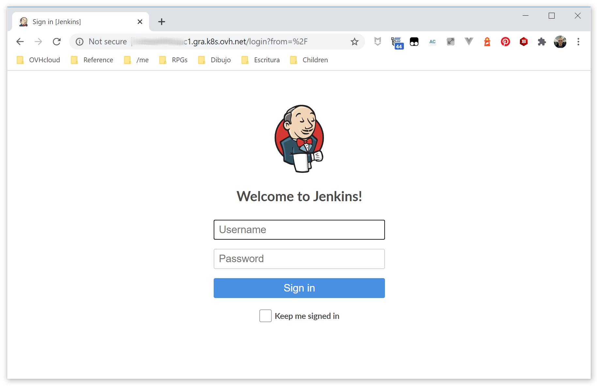
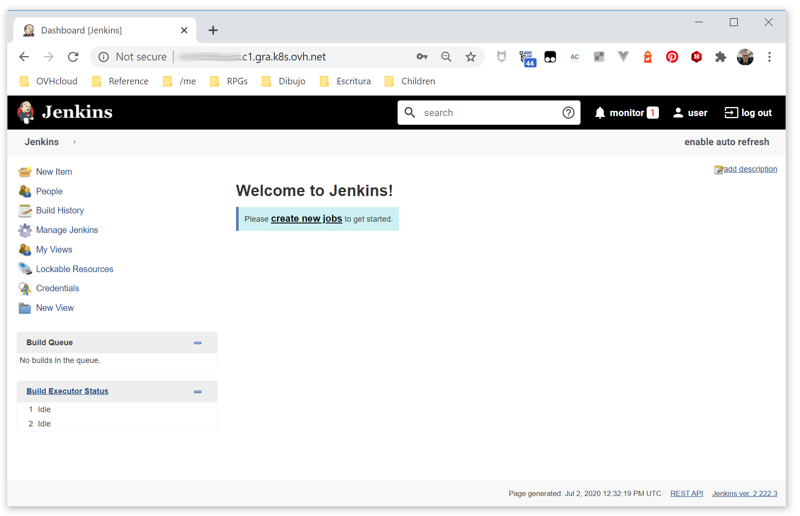

**Last updated 25th February, 2019.**

<style>
 pre {
     font-size: 14px;
 }
 pre.console {
   background-color: #300A24; 
   color: #ccc;
   font-family: monospace;
   padding: 5px;
   margin-bottom: 5px;
 }
 pre.console code {
   border: solid 0px transparent;
   font-family: monospace !important;
 }
 .small {
     font-size: 0.75em;
 }
</style>

In this tutorial we are going to guide you with the install of [Jenkins](https://jenkins.io/) on your OVH Managed Kubernetes Service.

We are going to install Jenkins master and slave cluster utilizing the [Jenkins Kubernetes plugin](https://wiki.jenkins.io/display/JENKINS/Kubernetes+Plugin).


## Before you begin

This tutorial presupposes that you already have a working OVH Managed Kubernetes cluster, and some basic knowledge of how to operate it. If you want to know more on those topics, please look at the [OVH Managed Kubernetes Service Quickstart](../deploying-hello-world/).

You also need to have [Helm](https://docs.helm.sh/) installer on your workstation and your cluster, please refer to the [How to install Helm on OVH Managed Kubernetes Service](../installing-helm) tutorial.


## Installing the Jenkins Helm chart

For this tutorial we are using the [Jenkins Helm chart](https://github.com/helm/charts/tree/master/stable/jenkins) found on Helm repositories.
The chart is fully configurable, but here we are using the default configuration, with only the minimal set of customization to make it work well on OVH Managed Kubernetes Service.

We are configuring the Helm chart to use `NodePort` as service type (because default `LoadBalancer` type isn't supported in the beta phase of OVH Managed Kubernetes Service). 

> [!primary]
> ### Customizing your install
> 
> Maybe you would like your admin username to be different, or be able to set your admin password, or modify the resources allocated... 
>
> In order to customize your install, without having to leave the simplicity of using helm and the Jenkins helm chart, you can simply set some of the [configurable parameters of the Jenkins chart](https://github.com/helm/charts/tree/master/stable/jenkins#configuration). Then you can add it to your `helm install` with the `--set` option (`--set param1=value1,param2=value2`)
>


```
helm install --set Master.ServiceType=NodePort stable/jenkins
```

This will install your Jenkins mater:

<pre class="console"><code>$ helm install --set Master.ServiceType=NodePort stable/jenkins
NAME:   kissed-stingray
LAST DEPLOYED: Mon Oct 15 15:26:34 2018
NAMESPACE: default
STATUS: DEPLOYED

RESOURCES:
==> v1/Pod(related)
NAME                                      READY  STATUS   RESTARTS  AGE
kissed-stingray-jenkins-7b95fb74bf-llkb2  0/1    Pending  0         0s

==> v1/Secret

NAME                     AGE
kissed-stingray-jenkins  1s

==> v1/ConfigMap
kissed-stingray-jenkins        1s
kissed-stingray-jenkins-tests  1s

==> v1/PersistentVolumeClaim
kissed-stingray-jenkins  1s

==> v1/Service
kissed-stingray-jenkins-agent  1s
kissed-stingray-jenkins        1s

==> v1/Deployment
kissed-stingray-jenkins  1s


NOTES:
1. Get your 'admin' user password by running:
  printf $(kubectl get secret --namespace default kissed-stingray-jenkins -o jsonpath="{.data.jenkins-admin-password}" | base64 --decode);echo
2. Get the Jenkins URL to visit by running these commands in the same shell:
  export NODE_PORT=$(kubectl get --namespace default -o jsonpath="{.spec.ports[0].nodePort}" services kissed-stingray-jenkins)
  export NODE_IP=$(kubectl get nodes --namespace default -o jsonpath="{.items[0].status.addresses[0].address}")
  echo http://$NODE_IP:$NODE_PORT/login

3. Login with the password from step 1 and the username: admin

For more information on running Jenkins on Kubernetes, visit:
https://cloud.google.com/solutions/jenkins-on-container-engine
</code></pre>

The instructions aren't well suited to your OVH Managed Kubernetes cluster, as they suppose you're deploying services with the `LoadBalancer` type. Instead of using `NODE_IP`, we should use the nodes URL found in the OVH Cloud Manager (see the  [OVH Managed Kubernetes Quickstart](https://labs.ovh.com/kubernetes-k8s/documentation/tutorial/quickstart)).

In my case:

<pre class="console"><code>$ export NODE_PORT=$(kubectl get --namespace default -o jsonpath="{.spec.ports[0].nodePort}" services kissed-stingray-jenkins)
$ export NODE_URL=51amh7.nodes.c1.gra.k8s.ovh.net
$ echo "Jenkins URL: http://$NODE_URL:$NODE_PORT/"
Jenkins URL: http://2qar2x.nodes.c1.gra.k8s.ovh.net:32656/
$ printf $(kubectl get secret --namespace default kissed-stingray-jenkins -o jsonpath="{.data.jenkins-admin-password}" | base64 --decode);echo
sdfSDGvb
</code></pre>

And putting the URL in your browser will take you to the new Jenkins:

{.thumbnail}

Login with user `admin` and the password you got before. And ere you have your Jenkins:

{.thumbnail}


You have a working Jenkins on your OVH Managed Kubernetes Service, congratulations!


