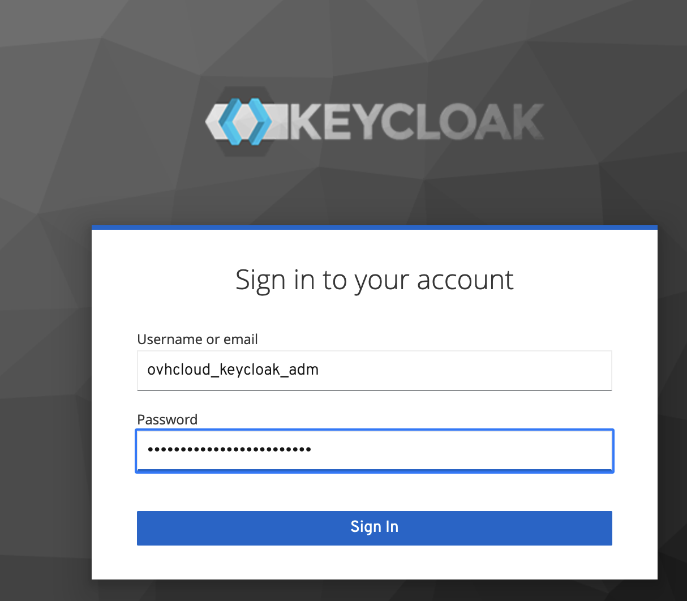
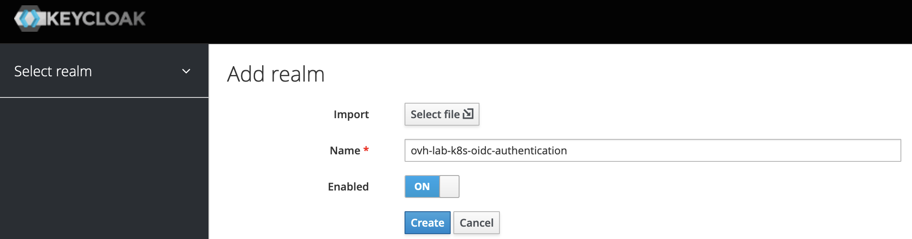
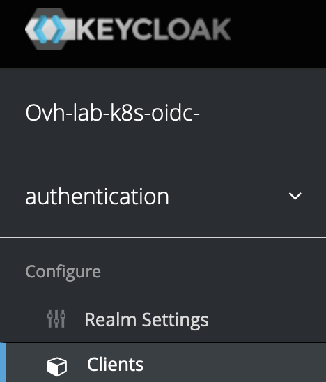
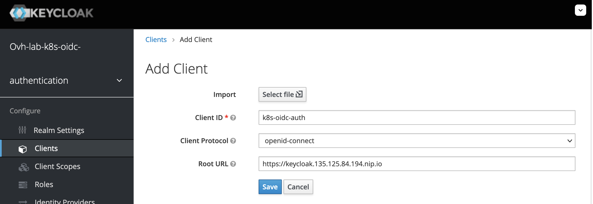
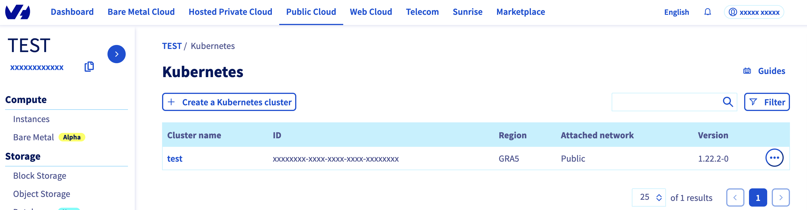
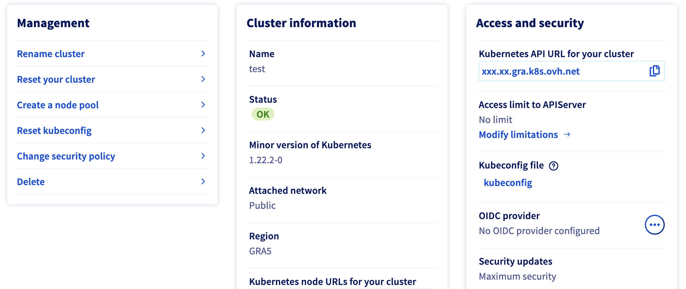
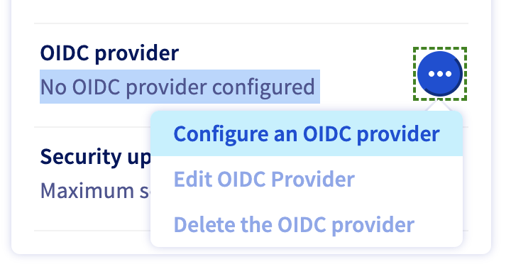
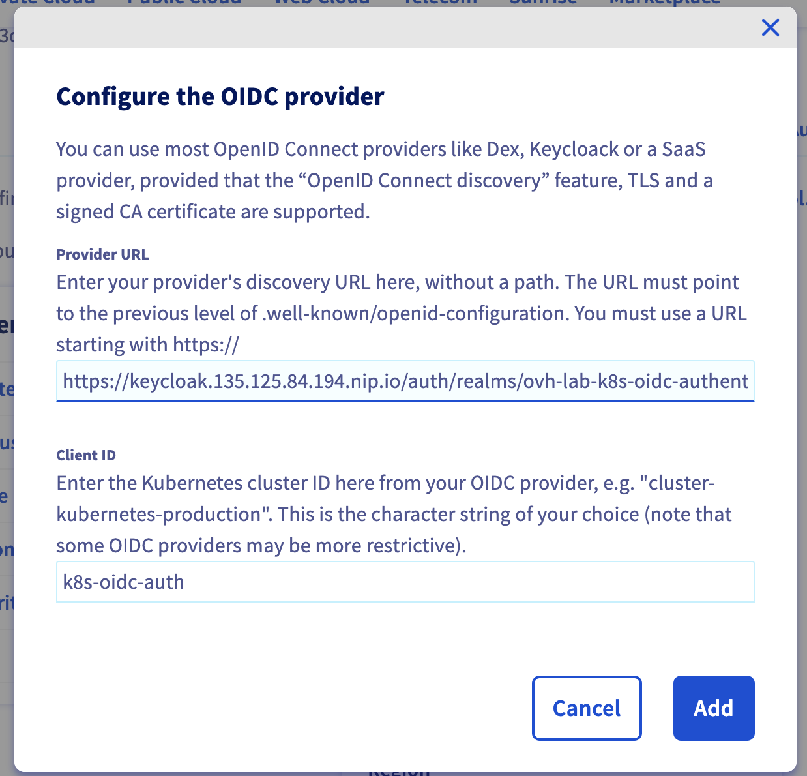
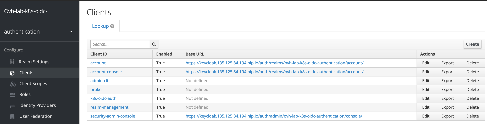

**Last updated 28th June, 2022.**

<style>
 pre {
     font-size: 14px;
 }
 pre.console {
   background-color: #300A24; 
   color: #ccc;
   font-family: monospace;
   padding: 5px;
   margin-bottom: 5px;
 }
 pre.console code {
   border: solid 0px transparent;
   font-family: monospace !important;
   font-size: 0.75em;
   color: #ccc;
 }
 .small {
     font-size: 0.75em;
 }
</style>

## Objective

The main objective of this tutorial is to secure your OVHcloud Managed Kubernetes Cluster with OpenID Connect (OIDC) and RBAC.

First of all, what is OIDC?


OIDC stands for __[OpenID Connect](https://en.wikipedia.org/wiki/OpenID)__. It is an open standard and decentralized authentication protocol.  
This protocol allows verifying the user identity when a user is trying to access a protected HTTPs endpoint.

Several OpenID Connect providers exists like Dex, Keycloak or a SaaS provider and today we will use Keycloak for our use case.

What is Keycloak?


__[Keycloak](https://www.keycloak.org/)__ is an open source Identity and Access Management solution aimed at modern applications and services.  
It makes it easy to secure applications and services with little to no code.  
More information can be found here: [Official Keycloak documentation](https://www.keycloak.org/documentation.html)

Why are we talking about OIDC and Keycloak?

That's because in this tutorial we want to:

- easily secure applications and services deployed in a Kubernetes cluster
- be able to configure a working Keycloak deployment on top of a Managed Kubernetes Service provided by OVHcloud
- configure the `OpenIdConnect` flags available for the `kube-apiserver` component of a Managed Kubernetes Service through the OVHcloud Control Panel
- be able to use the `kubectl` command line with the Keycloak OpenIdConnect provider configured

In this tutorial we are going to:

- install Keycloak on a freshly created OVHcloud Managed Kubernetes Service cluster
- configure Keycloak instance in our Kubernetes cluster as an OIDC provider

You can use the *Reset cluster* function in the Public Cloud section of the [OVHcloud Control Panel](https://ca.ovh.com/auth/?action=gotomanager&from=https://www.ovh.com/ca/en/&ovhSubsidiary=ca){.external} to reinitialize your cluster before following this tutorial.

## Requirements

This tutorial presupposes that you already have a working OVHcloud Managed Kubernetes cluster, and some basic knowledge of how to operate it. If you want to know more on those topics, please look at the [deploying a Hello World application](../deploying-hello-world/) documentation.

This tutorial has been written to be fully compliant with the release `v1.22` of Kubernetes.  
You may need to adapt it to be able to deploy a functional Keycloak instance in Kubernetes release prior to the `v1.22`. 

## Dependencies

### A cert-manager to enable HTTPS connection through Keycloak

* More information can be found here: [Official cert-manager documentation](https://cert-manager.io/docs/)
* Helm chart description: [cert-manager Helm chart](https://artifacthub.io/packages/helm/cert-manager/cert-manager)
* Helm Chart used for the deployment: `jetstack/cert-manager`

How to add the `cert-manager` Helm repository:

```bash
helm repo add jetstack https://charts.jetstack.io
helm repo update
```

Then install the `cert-manager` operator from its Helm chart:

```bash
helm install \
  ovh-cert-lab jetstack/cert-manager \
  --namespace cert-manager \
  --create-namespace \
  --version v1.6.1 \
  --set replicas=1 \
  --set rbac.create=true \
  --set prometheus.enabled=false \
  --set installCRDs=true
```

This command will install the cert-manager with the values we defined, creates a new cert-manager namespace, and install the new CRD (CustomResourceDefinitions):

<pre class="console"><code>$ helm install \
  ovh-cert-lab jetstack/cert-manager \
  --namespace cert-manager \
  --create-namespace \
  --version v1.6.1 \
  --set replicas=1 \
  --set rbac.create=true \
  --set prometheus.enabled=false \
  --set installCRDs=true
NAME: ovh-cert-lab
LAST DEPLOYED: Tue Jun 28 09:22:39 2022
NAMESPACE: cert-manager
STATUS: deployed
REVISION: 1
TEST SUITE: None
NOTES:
cert-manager v1.6.1 has been deployed successfully!

In order to begin issuing certificates, you will need to set up a ClusterIssuer
or Issuer resource (for example, by creating a 'letsencrypt-staging' issuer).

More information on the different types of issuers and how to configure them
can be found in our documentation:

https://cert-manager.io/docs/configuration/

For information on how to configure cert-manager to automatically provision
Certificates for Ingress resources, take a look at the `ingress-shim`
documentation:

https://cert-manager.io/docs/usage/ingress/
</code></pre>

Check cert-manager have been deployed correctly with `kubectl get all -n cert-manager` command:

<pre class="console"><code>$ kubectl get all -n cert-manager
NAME                                                        READY   STATUS    RESTARTS   AGE
pod/ovh-cert-lab-cert-manager-5df67445d5-h89zb              1/1     Running   0          25s
pod/ovh-cert-lab-cert-manager-cainjector-5b7bfc69b7-w78hp   1/1     Running   0          25s
pod/ovh-cert-lab-cert-manager-webhook-58585dd956-4bxgm      1/1     Running   0          25s
NAME                                        TYPE        CLUSTER-IP     EXTERNAL-IP   PORT(S)   AGE
service/ovh-cert-lab-cert-manager-webhook   ClusterIP   10.3.181.202   <none>        443/TCP   46d
NAME                                                   READY   UP-TO-DATE   AVAILABLE   AGE
deployment.apps/ovh-cert-lab-cert-manager              1/1     1            1           25s
deployment.apps/ovh-cert-lab-cert-manager-cainjector   1/1     1            1           25s
deployment.apps/ovh-cert-lab-cert-manager-webhook      1/1     1            1           25s
NAME                                                              DESIRED   CURRENT   READY   AGE
replicaset.apps/ovh-cert-lab-cert-manager-5df67445d5              1         1         1       25s
replicaset.apps/ovh-cert-lab-cert-manager-cainjector-5b7bfc69b7   1         1         1       25s
replicaset.apps/ovh-cert-lab-cert-manager-webhook-58585dd956      1         1         1       25s
</code></pre>

You should have new `Deployments`, `Services`, `ReplicaSets` and `Pods` running in your cluster.

Then, we will create an `ACME ClusterIssuer` used by the `cert-manager` operator to requesting certificates from ACME servers, including from Let’s Encrypt.

During this lab, we will use the Let's Encrypt `production` environment to generate all our testing certificates.  

> [!warning]
> **Warning!**
> Using the Let's Encrypt Staging environment is not recommended and not compliant with this tutorial.

Create a `ClusterIssuer` in a file named `issuer.yaml` with the following content:

```
apiVersion: cert-manager.io/v1
kind: ClusterIssuer
metadata:
  name: letsencrypt-production
spec:
  acme:
    # You must replace this email address with your own.
    # Let's Encrypt will use this to contact you about expiring
    # certificates, and issues related to your account.
    email: [YOUR_EMAIL]
    server: https://acme-v02.api.letsencrypt.org/directory
    privateKeySecretRef:
      # Secret resource that will be used to store the account's private key.
      name: acme-production-issuer-http01-account-key
    # Add a single challenge solver, HTTP01 using nginx
    solvers:
    - http01:
        ingress:
          class: nginx
```

> [!primary]
>
> Don’t forget to replace [YOUR_EMAIL] by a real value, it will be used for ACME challenges.

Apply the YAML manifest:

```bash
kubectl apply -f issuer.yaml
```

You should have a new `ClusterIssuer` deployed in your cluster:

<pre class="console"><code>$ kubectl apply -f issuer.yaml
clusterissuer.cert-manager.io/letsencrypt-production created

$ kubectl get clusterissuer letsencrypt-production -o yaml -n cert-manager | kubectl neat
apiVersion: cert-manager.io/v1
kind: ClusterIssuer
metadata:
  name: letsencrypt-production
spec:
  acme:
    email: lab@ovhcloud.com
    preferredChain: ""
    privateKeySecretRef:
      name: acme-production-issuer-http01-account-key
    server: https://acme-v02.api.letsencrypt.org/directory
    solvers:
    - http01:
        ingress:
          class: nginx
</code></pre>

> [!warning]
> **Warning!**
> You can use the [neat](https://github.com/itaysk/kubectl-neat) kubectl plugin in order to remove useless information in Kubernetes manifest files.

### An Ingress Nginx to publicly expose Keycloak

* More information can be found here: [Official ingress-nginx documentation](https://kubernetes.github.io/ingress-nginx/user-guide/nginx-configuration/)
* Helm chart description: [ingress-nginx Helm chart](https://artifacthub.io/packages/helm/ingress-nginx/ingress-nginx)
* Helm Chart used for the deployment: `ingress-nginx/ingress-nginx`

How to add `ingress-nginx` Helm repository:

```bash
helm repo add ingress-nginx https://kubernetes.github.io/ingress-nginx
helm repo update
```

Then install the `ingress-nginx` controller:

```bash
helm install \
  ovh-ingress-lab ingress-nginx/ingress-nginx \
  --namespace ingress-nginx \
  --create-namespace \
  --version 4.0.6
```

This command will install the `ingress-nginx` and creates a new `ingress-nginx` namespace:

<pre class="console"><code>$ helm install \
  ovh-ingress-lab ingress-nginx/ingress-nginx \
  --namespace ingress-nginx \
  --create-namespace \
  --version 4.0.6
NAME: ovh-ingress-lab
LAST DEPLOYED: Tue Jun 28 09:43:52 2022
NAMESPACE: ingress-nginx
STATUS: deployed
REVISION: 1
TEST SUITE: None
NOTES:
The ingress-nginx controller has been installed.
It may take a few minutes for the LoadBalancer IP to be available.
You can watch the status by running 'kubectl --namespace ingress-nginx get services -o wide -w ovh-ingress-lab-ingress-nginx-controller'

An example Ingress that makes use of the controller:

  apiVersion: networking.k8s.io/v1
  kind: Ingress
  metadata:
    annotations:
      kubernetes.io/ingress.class: nginx
    name: example
    namespace: foo
  spec:
    ingressClassName: example-class
    rules:
      - host: www.example.com
        http:
          paths:
            - path: /
              pathType: Prefix
              backend:
                service:
                  name: exampleService
                  port: 80
    # This section is only required if TLS is to be enabled for the Ingress
    tls:
      - hosts:
        - www.example.com
        secretName: example-tls

If TLS is enabled for the Ingress, a Secret containing the certificate and key must also be provided:

  apiVersion: v1
  kind: Secret
  metadata:
    name: example-tls
    namespace: foo
  data:
    tls.crt: <base64 encoded cert>
    tls.key: <base64 encoded key>
  type: kubernetes.io/tls
</code></pre>

You should have new resources in `ingress-nginx` namespace:

<pre class="console"><code>$ kubectl get all -n ingress-nginx
NAME                                                            READY   STATUS    RESTARTS   AGE
pod/ovh-ingress-lab-ingress-nginx-controller-6f94f9ff8c-w4fqs   1/1     Running   0          6m14s

NAME                                                         TYPE           CLUSTER-IP     EXTERNAL-IP     PORT(S)                      AGE
service/ovh-ingress-lab-ingress-nginx-controller             LoadBalancer   10.3.166.138   135.125.84.194   80:30026/TCP,443:31963/TCP   46d
service/ovh-ingress-lab-ingress-nginx-controller-admission   ClusterIP      10.3.180.230   <none>          443/TCP                      46d

NAME                                                       READY   UP-TO-DATE   AVAILABLE   AGE
deployment.apps/ovh-ingress-lab-ingress-nginx-controller   1/1     1            1           46d

NAME                                                                  DESIRED   CURRENT   READY   AGE
replicaset.apps/ovh-ingress-lab-ingress-nginx-controller-6f94f9ff8c   1         1         1       6m14s
replicaset.apps/ovh-ingress-lab-ingress-nginx-controller-8466446f66   0         0         0       46d
</code></pre>

If you need to customize your `ingress-nginx` configuration, please refer to the following documentation: [ingress-nginx values](https://github.com/kubernetes/ingress-nginx/blob/main/charts/ingress-nginx/values.yaml)

> [!primary]
>
> Installing this `ingress-nginx` controller will order a LoadBalancer provided by OVHcloud *(this load balancer will be monthly billed)*.  
For more information, please refer to the following documentation: [Using the OVHcloud Managed Kubernetes LoadBalancer](https://docs.ovh.com/ca/en/kubernetes/using-lb/)

To check if the `LoadBalancer` is up and running, execute the following CLI in a console:

```bash
kubectl --namespace ingress-nginx get services ovh-ingress-lab-ingress-nginx-controller -o wide
```

You should obtain a result like this:

<pre class="console"><code>$ kubectl --namespace ingress-nginx get services ovh-ingress-lab-ingress-nginx-controller -o wide

NAME                                       TYPE           CLUSTER-IP   EXTERNAL-IP       PORT(S)                      AGE    SELECTOR
ovh-ingress-lab-ingress-nginx-controller   LoadBalancer   10.3.166.138   135.125.84.194   80:32133/TCP,443:31761/TCP   116s   app.kubernetes.io/component=controller,app.kubernetes.io/instance=ovh-ingress-lab,app.kubernetes.io/name=ingress-nginx
</code></pre>

Once your LoadBalancer is up and running, get its IP address to configure your domain name zone:

```bash
export INGRESS_URL=$(kubectl get svc -n ingress-nginx ovh-ingress-lab-ingress-nginx-controller -o jsonpath='{.status.loadBalancer.ingress[0].ip}')
echo $INGRESS_URL
```

You should obtain a result like this:

<pre class="console"><code>$ export INGRESS_URL=$(kubectl get svc -n ingress-nginx ovh-ingress-lab-ingress-nginx-controller -o jsonpath='{.status.loadBalancer.ingress[0].ip}')

$ echo $INGRESS_URL
135.125.84.194
</code></pre>

If you are using the [OVHcloud Domain name product](https://www.ovhcloud.com/en-ca/domains/), you can follow this documentation to configure your DNS record to link it to the public IPv4 address associated to your LoadBalancer: [Editing an OVHcloud DNS zone](https://docs.ovh.com/ca/en/domains/web_hosting_how_to_edit_my_dns_zone/).

If you are using an external DNS provider, please configure your domain before reading the rest of this tutorial.

In our case, we have an `example.com` domain name.
The `nslookup` command output of our domain entry shows the following information:

```bash
$ nslookup keycloak.example.com
Server:		10.15.25.129
Address:	10.15.25.129#53

Non-authoritative answer:
Name:	keycloak.example.com
Address: 135.125.84.194
```

## Instructions

### How to configure and deploy the Codecentric Keycloak provider?

* More information can be found here: [Official Keycloak documentation](https://www.keycloak.org/documentation.html)
* Helm chart description: [codecentric Keycloak Helm chart](https://artifacthub.io/packages/helm/codecentric/keycloak)
* Helm Chart used for the deployment: `codecentric/keycloak`

> [!primary]
>
> A `PersistentVolume` will be created to host all PostgreSQL data.  
>
> This `PersistentVolume` will be provided through the Cinder storage class which is the default storage class used by Managed Kubernetes Service at OVHcloud *(this volume will be billed)*.  
>
> For more information, please refer to the following documentation: [Setting-up a Persistent Volume on OVHcloud Managed Kubernetes](https://docs.ovh.com/ca/en/kubernetes/setting-up-a-persistent-volume/#persistent-volumes-pv-and-persistent-volume-claims-pvc)

### Keycloak installation

How to add the `codeCentric` repository:

```bash
helm repo add codecentric https://codecentric.github.io/helm-charts
helm repo update
```

Create a files called `keycloack-values.yaml` with the following content:

```
# Keycloak chart configuration

replicas: 1
restartPolicy: "Always"
serviceAccount:
  create: true
  name: "sa-keyclok-lab"
prometheus:
  enabled: false
rbac:
  create: true
extraEnv: |
  - name: KEYCLOAK_USER
    value: "ovhcloud_keycloak_adm" # CHANGEME
  - name: KEYCLOAK_PASSWORD
    value: "ThisIsNotAsecuredPassword" # CHANGEME
  - name: KEYCLOAK_LOGLEVEL
    value: INFO
  - name: PROXY_ADDRESS_FORWARDING
    value: "true"
service:
  httpPort: 8080
  httpsPort: 8443
ingress:
  enabled: false

# PostegreSQL sub-chart configuration

postgresql:
  # This will create a Cinder volume to store the Keycloak PG data
  enabled: true
  persistence:
    enabled: true
  postgresqlUsername: "ovhcloud_postgresql_adm" # CHANGEME
  postgresqlPassword: "ThisIsNotAsecuredPassword" # CHANGEME
  volumePermissions:
    enabled: true
```

> [!primary]
>
> Replace every values with `CHANGEME` comment with strong usernames and passwords

Then install the `codecentric/keycloak` Helm chart:

```bash
helm install \
  ovh-keycloak-lab codecentric/keycloak \
  -n keycloak \
  --create-namespace \
  --version 15.1.0 \
  -f keycloack-values.yaml
```

You should obtain the following result:

<pre class="console"><code>$ helm install \
  ovh-keycloak-lab codecentric/keycloak \
  -n keycloak \
  --create-namespace \
  --version 15.1.0 \
  -f keycloack-values.yaml
NAME: ovh-keycloak-lab
LAST DEPLOYED: Tue Jun 28 13:24:48 2022
NAMESPACE: keycloak
STATUS: deployed
REVISION: 1
TEST SUITE: None
NOTES:
***********************************************************************
*                                                                     *
*                Keycloak Helm Chart by codecentric AG                *
*                                                                     *
***********************************************************************

Keycloak was installed with a Service of type ClusterIP

Create a port-forwarding with the following commands:

export POD_NAME=$(kubectl get pods --namespace keycloak -l "app.kubernetes.io/name=keycloak,app.kubernetes.io/instance=ovh-keycloak-lab" -o name)
echo "Visit http://127.0.0.1:8080 to use your application"
kubectl --namespace keycloak port-forward "$POD_NAME" 8080
</code></pre>

Check if the Keycloak `StatefulSet` is in `Ready` state:

```bash
kubectl -n keycloak get statefulsets.apps -o wide
```

In our example, after waiting a little time, our `StatefulSets` are in `Ready` state:

<pre class="console"><code>$ kubectl -n keycloak get statefulsets.apps -o wide

NAME                          READY   AGE    CONTAINERS                    IMAGES
ovh-keycloak-lab              1/1     2m2s   keycloak                      docker.io/jboss/keycloak:15.0.2
ovh-keycloak-lab-postgresql   1/1     2m2s   ovh-keycloak-lab-postgresql   docker.io/bitnami/postgresql:11.11.0-debian-10-r31
</code></pre>

When they are ready, create a file `nginx-ingress-definition.yaml` with the following content:

```
# Keycloak ingress route configuration

apiVersion: networking.k8s.io/v1
kind: Ingress
metadata:
  annotations:
    kubernetes.io/ingress.class: nginx
    # This annotation indicates the issuer to use
    cert-manager.io/cluster-issuer: letsencrypt-staging
    acme.cert-manager.io/http01-edit-in-place: "true"
  name: ovh-keycloak-lab
  namespace: keycloak
spec:
  rules:
  - host: keycloak.example.com # CHANGEME
    http:
      paths:
      - path: /
        pathType: Prefix
        backend:
          service:
            name: ovh-keycloak-lab-http
            port:
              number: 8080
  tls:
    - hosts:
        - keycloak.example.com # CHANGEME
      secretName: keycloak-tls
```

> [!primary]
>
> Replace `example.com` by your domain name

Then apply the YAML file to configure the Ingress route required to expose Keycloak on the Internet:

```bash
kubectl apply -f nginx-ingress-definition.yaml
```

### Keycloak configuration

If you are reading this chapter, it indicates that your Keycloak is now up and running.  
Let's go and open the Keycloak Web console: `https://keycloak.your-domain-name.tld/`.

In our example, the URL to our installed keycloak is `https://keycloak.example.com/`.
If you change it with your custom URL, you should see the Keycloak UI like this:


Then, click in `Administration Console` and login with the `username` and `password` configured in the `keycloack-values.yaml` file you filled and modified in **Keycloak installation** section of this guide.



#### Create a REALM

A __realm__ in Keycloak is the equivalent of a tenant or a namespace. It allows creating isolated groups of applications and users.  
By default, there is a single realm in Keycloak called `Master`. It is dedicated to manage Keycloak and should not be used for your own applications.

Let's create a dedicated realm for our tutorial:

1) Display the dropdown menu in the top-left corner where it is indicated `Master`, then click on the `Add realm`{.action} blue button
3) Fill in the form with this name: `ovh-lab-k8s-oidc-authentication`, then click on the `Create`{.action}{.action} blue button.



#### Create a CLIENT

A __client__ in Keycloak is an entity that can request a Keycloak server to authenticate a user.

1) From the previously created realm, click on the left-hand menu `Clients`{.action} under the `Configure` category


2) Click on `Create`{.action} in the top-right corner of the table
3) Fill in the form with the following parameters:

```text
Client ID: k8s-oidc-auth
Client Protocol: openid-connect
Root URL: https: https://keycloak.your-domain-name.tld/
```

In our example, the new Client informations are:


4) Then click on the `Save`{.action} button

5) In the new created client, Find the `Access Type` field and set its value to `confidential` to require a secret to initiate the login protocol. Then click on the `Save`{.action} blue button to save the change.


6) Then click on the `Credentials`{.action}{.action} tab. Find the `Valid Redirect URIs` field and set the following value: `*`
7) Find the `Admin URL` and the `Web Origins` fields and set their values to your defined domain name if it is not already done  
In our example: `https://keycloak.example.com/`. __\/!\ Be careful to use the HTTPS schema only /!\\__
8) Save your changes


#### Create a USER

1) From the previously created realm, click on the left-hand menu `Users`{.action} under the `Manage` category
2) Click on `Add user`{.action} in the top-right corner of the table
3) Fill in the form. Only the `Username` field is required, it's enough for this tutorial.

In our example, we created the following user:

```text
USERNAME: ovhcloud-keycloak-tutorial
PASSWORD: ovhcloud-keycloak-tutorial-awesome-password
```

4) Then click on the `Save`{.action} button

The first user connection required an initial password, so let's create it:

1) Click on the `Credentials`{.action} tab
2) Fill in the `Set Password` form
3) Disable the `Temporary` flag to prevent having to update the password on first login
4) Then click on the `Set Password`{.action} button and confirm your choice

### Configure Keycloak instance in your Kubernetes cluster as an OIDC provider

Now you have a working keycloak, and created a User, you can log in to the [OVHcloud Control Panel](https://ca.ovh.com/auth/?action=gotomanager&from=https://www.ovh.com/ca/en/&ovhSubsidiary=ca).
Go to the `Public Cloud`{.action} section, and then in the sidebar, click on `Managed Kubernetes Service`{.action}.



Click in your Kubernetes cluster you want to link to your OIDC provider.
At the right, you can find the `Access and security`{.action} section:



In this section, you can find the `OIDC provider`{.action}.
For the moment, you should have the information message: "No OIDC provider configured".

In order to add our OIDC provider, click on the `...`{.action} button, and then on `Configure an OIDC provider`{.action}.



You should have a new pop-up. Fill it with our Keycloak informations like this:



In our example, the Provider URL is: `https://keycloak.example.com/auth/realms/ovh-lab-k8s-oidc-authentication`.

Explanations:

- In `Provider URL` field you should copy/paste the URL to access to the previously defined realm: https://`${your-configured-root-url}`/auth/realms/`${your-configured-realm-name}`

In our example we used the `ovh-lab-k8s-oidc-authentication` realm
issuerUrl: `https://keycloak.example.com/auth/realms/ovh-lab-k8s-oidc-authentication`.

- In `Client ID` you should copy/paste the name of the Keycloak client previously defined.

In our example we defined the client named: `k8s-oidc-auth`.

Our Kubernetes cluster is now configured with our Keycloak instances, both are linked.

### OIDC integration and configuration

If it is not already done, you must install the `kubectl` plugin manager named [Krew](https://krew.sigs.k8s.io/).  
Then, install the [oidc-login plugin](https://github.com/int128/oidc-login) to extend the capacity of the `kubectl` command line and easily configure your environment to be able to use your Keycloak server.

```bash
kubectl krew install oidc-login
```

Once `oidc-login` is installed, go back to the Keycloak web interface to get your client secret.  

You can find this information here:

- Click on the `Clients`{.action} menu in the left column
- Click on your previously created client (`k8s-oidc-auth` in my example)
- Go to the `Credentials`{.action} tab ang get your `secret` value




Then, customize the following command line, with your information and execute it to be able to:

- Log in to your Keycloak provider through your browser
- Generate a token from it
- Configure your Kubectl context to access to Kubernetes APIs with the freshly generated token

Here with the information related to our example:

```bash
kubectl oidc-login setup \
--oidc-issuer-url="https://keycloak.example.com/auth/realms/ovh-lab-k8s-oidc-authentication" \
--oidc-client-id="k8s-oidc-auth" \
--oidc-client-secret="c9fbfe32-bff1-4180-b9ff-29108e42b2a5"
```

Your favorite browser will display an authentication page to your Keycloak server.  
Log in with the credentials defined during the `user creation` step of this tutorial.

Once the authentication succeeded, you can close your browser tab on go back to your console where a message is displayed.

The `oidc-login` plugin has given you some instructions to follow to finalize the configuration of your Kubectl environment.

In step 3 of the `oidc-login` output, you must create a `ClusterRoleBinding`:

```bash
# Example of output generated on our environment, please customize it with your information
kubectl create clusterrolebinding oidc-cluster-admin --clusterrole=cluster-admin --user='https://keycloak.example.com/auth/realms/ovh-lab-k8s-oidc-authentication#fdb220d7-ad75-4486-9866-b8f59bd6e661'
```

You can ignore the `step 4`, because we already configured the `kube-apiserver` through the OVHcloud Control Panel.  

Then, for the step 5, configure your `kubeconfig`:

```bash
# Example of output generated on our environment, please customize it with your information
kubectl config set-credentials oidc \
  --exec-api-version=client.authentication.k8s.io/v1beta1 \
  --exec-command=kubectl \
  --exec-arg=oidc-login \
  --exec-arg=get-token \
  --exec-arg=--oidc-issuer-url=https://keycloak.example.com/auth/realms/ovh-lab-k8s-oidc-authentication \
  --exec-arg=--oidc-client-id=k8s-oidc-auth \
  --exec-arg=--oidc-client-secret="c9fbfe32-bff1-4180-b9ff-29108e42b2a5"
```

And verify your cluster access (step 6 of the `oidc-login` output) witht the following command:

```bash
kubectl --user=oidc get nodes
```

For example:
<pre class="console"><code>$ kubectl --user=oidc get nodes
NAME                                         STATUS   ROLES    AGE   VERSION
nodepool-d18716fa-e910-4e77-a2-node-79add5   Ready    <none>   2d    v1.22.2
nodepool-d18716fa-e910-4e77-a2-node-aa7701   Ready    <none>   2d    v1.22.2
nodepool-d18716fa-e910-4e77-a2-node-f9f18e   Ready    <none>   2d    v1.22.2
</code></pre>

If you can see the nodes of your Managed Kubernetes Service, congratulations, your Keycloak instance is up and running!

## Upgrade the Keycloak deployment if needed

Enter the following command:

TODO: xxx

```bash
helm upgrade \
  ovhcloud-keycloak-tutorial codecentric/keycloak \
  -n keycloak \
  -f keycloack-values.yaml
```

## Rollout restarts the Keycloak StatefulSets if needed

```bash
kubectl -n keycloak rollout restart statefulset ovh-keycloak-lab
```

## Various troubleshooting

If the `cert-manager` namespace is stuck in deleting state, see the following documentation: [namespace-stuck-in-terminating-state](https://cert-manager.io/docs/installation/helm/#namespace-stuck-in-terminating-state)

## Cleanup

To clean up all existing resources related to the Keycloak Helm chart, you can execute the following command lines:

```bash
# Delete the Keycloak statefulsets
helm -n keycloak uninstall ovh-keycloak-lab
# Delete the data related to the Keycloak deployment
kubectl -n keycloak delete pvc data-ovh-keycloak-lab-postgresql-0
# Delete the Keycloak namespace
kubectl delete namespaces keycloak
```

To clean up all existing resources related to the `ingress-nginx` Helm chart, execute the following command lines:

```bash
# Delete the ingress-nginx deployments
helm -n ingress-nginx uninstall ovh-ingress-lab 
# Delete the ingress-nginx namespace
kubectl delete namespaces ingress-nginx
```

To clean up all existing resources related to the `cert-manager` Helm chart, execute the following command lines:

```bash
# Delete the cert-manager deployments
helm -n cert-manager uninstall ovh-cert-lab 
# Delete the cert-manager namespace
kubectl delete namespaces cert-manager
```

## Useful resources

- [Keycloack documentation](https://www.keycloak.org/documentation){.external}
- [ArtifactHUB keycloack](https://artifacthub.io/packages/helm/codecentric/keycloak){.external}  
- [Cert-manager Securing Ingress Resources](https://cert-manager.io/docs/usage/ingress/){.external}  
- [Keycloak on Kubernetes](https://www.keycloak.org/getting-started/getting-started-kube){.external}
- [Kubernetes API Access Control documentation](https://kubernetes.io/docs/reference/access-authn-authz/authentication/#option-1-oidc-authenticator){.external}

## Go further

Join our community of users on <https://community.ovh.com/en/>.