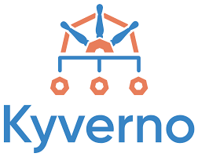

**Last updated 19th January, 2021.**

<style>
 pre {
     font-size: 14px;
 }
 pre.console {
   background-color: #300A24; 
   color: #ccc;
   font-family: monospace;
   padding: 5px;
   margin-bottom: 5px;
 }
 pre.console code {
   border: solid 0px transparent;
   font-family: monospace !important;
   font-size: 0.75em;
   color: #ccc;
 }
 .small {
     font-size: 0.75em;
 }
</style>

## Objective

[Kyverno](https://kyverno.io) (Greek for “govern”) is a policy engine designed specifically for Kubernetes. 

With Kyverno, policies are managed as Kubernetes resources and no new language is required to write policies (compared to [OPA Gatekeeper](https://github.com/open-policy-agent/gatekeeper)). This allows using familiar tools such as `kubectl`, `git`, and `kustomize` to manage policies. Kyverno policies can **validate**, **mutate**, and **generate** Kubernetes resources. 
The `kyverno` CLI can be used to test policies and validate resources as part of a CI/CD pipeline.



Kyverno runs as a [dynamic admission controller](https://kubernetes.io/docs/reference/access-authn-authz/extensible-admission-controllers/) in a Kubernetes cluster. 
Kyverno receives validating and mutating admission webhook HTTP callbacks from the Kubernetes API-Server and applies matching policies to return results that enforce admission policies or reject requests.

Kyverno policies can match resources using the resource kind, name, and label selectors. Wildcards are supported in names.

Mutating and Validating policies can be written as overlays (similar to Kustomize). 

Policy enforcement is captured using Kubernetes events. Kyverno also reports policy violations for existing resources.


Concretely, when you apply a resource on the Kubernetes cluster, the manifest you sent to Kubernetes API must pass many stages before they get created as a resource you desire. Two stages in which we are interesting are **Mutating Admission** and **Validating admission**.

TODO: faire une illustration pour expliquer
//1. mutating admission stage modifies the manifest you sent to the Kubernetes API
//your manifest is going to be validated based on their object schema (i.e. The fields are the right data type? Do required fields are filled? etc.)
//3. validation admission stage which will judge if your manifest meet the policy existing the cluster. If there’s no problem, congratulations! Your resource is going to be created. But if not, validating admission will either log the error or reject the creation of that resource depending on your configuration.

TODO: Concretely, you can imagine kyvero like a cop that will check when you apply a manifest if the resource you want you ask kubernetes to create meat/match with the rules you have defined.

Kyverno have many features includes:

- policies as Kubernetes resources (no new language to learn!)
- validate, mutate, or generate any resource
- match resources using label selectors and wildcards
- validate and mutate using overlays (like Kustomize!)
- synchronize configurations across namespaces
- block non-conformant resources using admission controls, or report policy violations
- test policies and validate resources using the Kyverno CLI, in your CI/CD pipeline, before applying to your cluster
- manage policies as code using familiar tools like git and kustomize

Kyverno allows cluster administrators to manage environment specific configurations independently of workload configurations and enforce configuration best practices for their clusters. Kyverno can be used to scan existing workloads for best practices, or can be used to enforce best practices by blocking or mutating API requests.

Read more about [Kyverno](https://kyverno.io/docs/introduction/).

As at OVHcloud, we like to provide you with the best products and services and for us security is important, that's why we wanted to help you discover Kyverno which will help you secure your OVHcloud Managed Kubernetes with policy management .

In this guide you will:
- install Knative
- write and deploy several policies
- test the behavior

You can use the *Reset cluster* function on the Public Cloud section of the [OVHcloud Control Panel](https://www.ovh.com/auth/?action=gotomanager&from=https://www.ovh.co.uk/&ovhSubsidiary=GB){.external} to reinitialize your cluster before following this tutorial.

## Requirements

This tutorial presupposes that you already have a working OVHcloud Managed Kubernetes cluster, and some basic knowledge of how to operate it. If you want to know more on those topics, please look at the [deploying a Hello World application](../deploying-hello-world/) documentation.

## Instructions

### Installing Kyverno CLI

The Kyverno Command Line Interface (CLI) is designed to **validate** and **test** policies behavior prior to adding them to a cluster.
So the best practice is to use the `kyverno` CLI in your CI/CD pipelines to assist with the resource authoring process to ensure they conform to standards prior to them being deployed.

You can install the CLI [using Krew](https://kyverno.io/docs/kyverno-cli/#install-via-krew) or [building the CLI from source](https://kyverno.io/docs/kyverno-cli/#building-the-cli-from-source) by example.

For this tutorial you will install the CLI from source:

```bash
git clone https://github.com/kyverno/kyverno
cd kyverno
make cli
cp ./cmd/cli/kubectl-kyverno/kyverno /usr/local/bin/kyverno
```

You should have results like this:

<pre class="console"><code>$ git clone https://github.com/kyverno/kyverno
Cloning into 'kyverno'...
cdremote: Enumerating objects: 64593, done.
remote: Counting objects: 100% (984/984), done.
remote: Compressing objects: 100% (496/496), done.
Receiving objects:   6% (3876/64593), 876.01 KiB | 1.60 MiB/s
llceiving objects:   6% (4222/64593), 876.01 KiB | 1.60 MiB/s
remote: Total 64593 (delta 531), reused 832 (delta 483), pack-reused 63609
Receiving objects: 100% (64593/64593), 55.81 MiB | 3.43 MiB/s, done.
Resolving deltas: 100% (35868/35868), done.

$ cd kyverno

$ make cli
GOOS=darwin go build -o /Users/avache/git/github.com/kyverno/kyverno/cmd/cli/kubectl-kyverno/kyverno -ldflags="-s -w -X github.com/kyverno/kyverno/pkg/version.BuildVersion=v1.5.0-rc1-223-gf0359f82 -X github.com/kyverno/kyverno/pkg/version.BuildHash=main/f0359f8272a181923db0704696803d44a43f69f8 -X github.com/kyverno/kyverno/pkg/version.BuildTime=2022-01-19_12:10:05" /Users/avache/git/github.com/kyverno/kyverno/cmd/cli/kubectl-kyverno/main.go
go: downloading k8s.io/klog v1.0.0
go: downloading github.com/spf13/cobra v1.2.1
go: downloading sigs.k8s.io/controller-runtime v0.10.3
go: downloading k8s.io/apiextensions-apiserver v0.22.4
go: downloading k8s.io/apimachinery v0.22.4
go: downloading k8s.io/klog/v2 v2.10.0
go: downloading sigs.k8s.io/yaml v1.3.0
go: downloading github.com/fatih/color v1.12.0
go: downloading github.com/go-git/go-billy/v5 v5.0.0
go: downloading github.com/go-git/go-git/v5 v5.2.0
go: downloading github.com/go-logr/logr v0.4.0
go: downloading github.com/kataras/tablewriter v0.0.0-20180708051242-e063d29b7c23
go: downloading github.com/lensesio/tableprinter v0.0.0-20201125135848-89e81fc956e7
go: downloading k8s.io/api v0.22.4
go: downloading k8s.io/cli-runtime v0.22.4
go: downloading github.com/evanphx/json-patch v4.11.0+incompatible
go: downloading k8s.io/client-go v0.22.4
go: downloading github.com/googleapis/gnostic v0.5.5
go: downloading github.com/kyverno/json-patch/v5 v5.5.1-0.20210915204938-7578f4ee9c77
go: downloading github.com/orcaman/concurrent-map v0.0.0-20190826125027-8c72a8bb44f6
go: downloading gopkg.in/yaml.v3 v3.0.0-20210107192922-496545a6307b
go: downloading k8s.io/kube-openapi v0.0.0-20211115234752-e816edb12b65
go: downloading github.com/distribution/distribution v2.7.1+incompatible
...
go: downloading github.com/dimchansky/utfbom v1.1.1

$ cp ./cmd/cli/kubectl-kyverno/kyverno /usr/local/bin/kyverno
</code></pre>

> [!warning]
>The `kyverno` CLI installation using Krew is not working for the moment [for MacBook Air M1 device](https://github.com/kyverno/kyverno/issues/3020).
>

After the installation, check that the `kyverno` CLI is working:

```bash
kyverno version
```

You should have a behavior like this:

<pre class="console"><code>$ kyverno version
Version: v1.5.0-rc1-223-gf0359f82
Time: 2022-01-19_12:10:05
Git commit ID: main/f0359f8272a181923db0704696803d44a43f69f8

</code></pre>

### Installing Kyverno

For this tutorial we are using the [Kyverno Helm chart](https://github.com/kyverno/kyverno/tree/main/charts/kyverno).

Add the Kyverno Helm repository:

```bash
helm repo add kyverno https://kyverno.github.io/kyverno/
helm repo update
```

These commands will add the Kyverno Helm repository to your local Helm chart repository and update the installed chart repositories:

<pre class="console"><code>$ helm repo add kyverno https://kyverno.github.io/kyverno/
helm repo update
"kyverno" has been added to your repositories
Hang tight while we grab the latest from your chart repositories...
...Successfully got an update from the "nvidia" chart repository
...
...Successfully got an update from the "kyverno" chart repository
...
Update Complete. ⎈Happy Helming!⎈
</code></pre>

Install the latest version of Kyverno with `helm install` command:

```bash
helm install kyverno kyverno/kyverno --namespace kyverno --create-namespace
```

This command will install the latest version of Kyverno and create a new `kyverno` namespace:

<pre class="console"><code>$ helm install kyverno kyverno/kyverno --namespace kyverno --create-namespace
NAME: kyverno
LAST DEPLOYED: Wed Jan 19 11:41:15 2022
NAMESPACE: kyverno
STATUS: deployed
REVISION: 1
NOTES:
Thank you for installing kyverno v2.1.6 😀

Your release is named kyverno, app version v1.5.4
</code></pre>

You can check if the Kyverno pod is correctly running:

<pre class="console"></code>$ kubectl get pods -n kyverno
NAME                       READY   STATUS    RESTARTS   AGE
kyverno-554ffb4c96-f2lvs   1/1     Running   0          50s
</code></pre>

## Create and deploy policies

Kyverno is running on your OVHcloud Managed Kubernetes cluster so now you can simply create and deploy policies with the rules you want to put in place in our cluster.

In this guide we will show you how to create several policies that will:

- deny to deploy resources in the `default` namespace
- deny to deploy resources if the image tag is equals to `latest`
- sets the **imagePullPolicy** to **IfNotPresent** if the image tag is equals to `latest`

### Policy 1: Forbid to deploy deployments in the `default` namespace

For our first example we want to deny to deploy resources in the `default` namespace.

Why? Because it's a good practice to isolate workloads/applications with Namespaces. One namespace per project/team/...
So imagine if several diferents teams deploy different applications in the `default` namespace, they will not be isolated.

Create a new policy in a `disallow-default-namespace.yaml` file:

```yaml
apiVersion: kyverno.io/v1
kind: ClusterPolicy
metadata:
  name: disallow-default-namespace
  annotations:
    pod-policies.kyverno.io/autogen-controllers: none
    policies.kyverno.io/title: Disallow Default Namespace
    policies.kyverno.io/category: Multi-Tenancy
    policies.kyverno.io/severity: medium
    policies.kyverno.io/subject: Pod
    policies.kyverno.io/description: >-
      Kubernetes Namespaces are an optional feature that provide a way to segment and
      isolate cluster resources across multiple applications and users. As a best
      practice, workloads should be isolated with Namespaces. Namespaces should be required
      and the default (empty) Namespace should not be used. This policy validates that Pods
      specify a Namespace name other than `default`.
spec:
  validationFailureAction: enforce
  rules:
  - name: validate-namespace
    match:
      resources:
        kinds:
        - Pod
    validate:
      message: "Using 'default' namespace is not allowed."
      pattern:
        metadata:
          namespace: "!default"
  - name: require-namespace
    match:
      resources:
        kinds:
        - Pod
    validate:
      message: "A namespace is required."
      pattern:
        metadata:
          namespace: "?*"
  - name: validate-podcontroller-namespace
    match:
      resources:
        kinds:
        - DaemonSet
        - Deployment
        - Job
        - StatefulSet
    validate:
      message: "Using 'default' namespace is not allowed for pod controllers."
      pattern:
        metadata:
          namespace: "!default"
  - name: require-podcontroller-namespace
    match:
      resources:
        kinds:
        - DaemonSet
        - Deployment
        - Job
        - StatefulSet
    validate:
      message: "A namespace is required for pod controllers."
      pattern:
        metadata:
          namespace: "?*"
```

> [!info]
>
> The **validationFailureAction** policy attribute controls admission is set to **enforce** to block **resource creation or updates** when the resource are non-compliant. Using the default value **audit** will report violations (in a **PolicyReport** or **ClusterPolicyReport**) but not block requests.
>

To deploy the Kyverno policy in the cluster, just copy/paste the following command to apply the YAML file:

```yaml
kubectl apply -f disallow-default-namespace.yaml
```

After applying the policy, check if the policy have been correctly applied on the cluster:

<pre class="console"><code>$ kubectl apply -f disallow-default-namespace.yaml
clusterpolicy.kyverno.io/disallow-default-namespace created

$ kubectl get clusterpolicy
NAME                         BACKGROUND   ACTION     READY
disallow-default-namespace   true         enforce    true
</code></pre>

> [!info]
>
> With Kyverno installation, [new CRDs](https://kyverno.io/docs/crds/) have been added. The one who interested us is the new resource type `ClusterPolicy`. So in order to list, display, edit and remove Kyverno policies, you can execute `kubectl` command with `ClusterPolicy` resource object type.
>

Now you will try to deploy a simple application in the `default` namespace.
For that, create a file call `my-pod.yaml` with the following content:

```yaml
apiVersion: v1
kind: Pod
metadata:
  name: my-pod
spec:
  containers:
  - name: hello-world
    image: ovhplatform/hello
    ports:
    - containerPort: 80
```

Apply it without defining any namespace (namespace is `default` by default):

```bash
kubectl apply -f my-pod.yaml
```

<pre class="console"><code>$ kubectl apply -f my-pod.yaml
Error from server: error when creating "my-pod.yaml": admission webhook "validate.kyverno.svc-fail" denied the request:

resource Pod/default/my-pod was blocked due to the following policies

disallow-default-namespace:
  validate-namespace: 'validation error: Using ''default'' namespace is not allowed.
    Rule validate-namespace faisled at path /metadata/namespace/'
</code></pre>

Perfect, you no longer have the abbility to deploy a Pod/Deployment/ReplicaSet/Job/StatefulSet in the `default` namespace.

### xx

xxx


xx


### Debugging / validating

TODO: xxx utiliation de la cli, parfait dans une chaine de ci cd notamment, ou en debug en local sur votre machine de dev/test avant d deployer votre policy sur le cluster distant

xxxx

```yaml
xxxx
```

xxxx

<pre class="console"><code>
$ kyverno validate disallow-default-namespace.yaml
----------------------------------------------------------------------
Policy disallow-default-namespace is valid.
</code></pre>

xxx


```bash
kyverno test xxx
```

xx

TODO: avec un vrai exemple a moi ...

<pre class="console"><code>
kyverno test https://github.com/kyverno/policies/pod-security --git-branch main
    <snip>

    Executing require-non-root-groups...
    applying 1 policy to 2 resources...

    │───│─────────────────────────│──────────────────────────│──────────────────────────────────│────────│
    │ # │ POLICY                  │ RULE                     │ RESOURCE                         │ RESULT │
    │───│─────────────────────────│──────────────────────────│──────────────────────────────────│────────│
    │ 1 │ require-non-root-groups │ check-runasgroup         │ default/Pod/fs-group0            │ Pass   │
    │ 2 │ require-non-root-groups │ check-supplementalGroups │ default/Pod/fs-group0            │ Pass   │
    │ 3 │ require-non-root-groups │ check-fsGroup            │ default/Pod/fs-group0            │ Pass   │
    │ 4 │ require-non-root-groups │ check-supplementalGroups │ default/Pod/supplemental-groups0 │ Pass   │
    │ 5 │ require-non-root-groups │ check-fsGroup            │ default/Pod/supplemental-groups0 │ Pass   │
    │ 6 │ require-non-root-groups │ check-runasgroup         │ default/Pod/supplemental-groups0 │ Pass   │
    │───│─────────────────────────│──────────────────────────│──────────────────────────────────│────────│
    <snip>
</code></pre>


### Troubleshooting

If you have any problem with Kyverno, for example you deployed a policy and don't know why it's not working, you can go to the [Kyverno troubleshooting page](https://kyverno.io/docs/troubleshooting/).

### What's next?

You now have a policy management on your Kubernetes cluster and you deployed few policies to test the behavior of Kyverno.
In order to see more examples of policies, you can go to [Kyverno policies repository](https://github.com/kyverno/policies/). This repository contains Kyverno policies for a wide array of usage on various Kubernetes and ecosystem resources and subjects.

If you have any questions or troubles about Kyverno, you can also go to [Kyverno Slack community](https://slack.k8s.io/#kyverno).

Having a policy management is a good practice to follow. It will help you to keep your cluster clean and secure. Next time we will see another tutorial that will help you to secure your OVHcloud Managed Kubernetes clusters.

### Cleanup

TODO: xxx


If you want, you can uninstall Knative apps, serving and core components.

First, delete our Hello World app:

```
kubectl delete -f service.yaml -n knative-apps
```

Then, delete Knative CRDs:

```
kubectl api-resources -o name | grep knative | xargs kubectl delete crd
```

Then, delete Knative resources:

```
kubectl -n knative-serving delete po,svc,daemonsets,replicasets,deployments,rc,secrets --all
kubectl -n kourier-system delete po,svc,daemonsets,replicasets,deployments,rc,secrets --all
```

Finally, delete namespaces:

```
kubectl delete namespace knative-serving
kubectl delete namespace kourier-system
kubectl delete namespace knative-apps
```

## Go further

Join our community of users on <https://community.ovh.com/en/>.