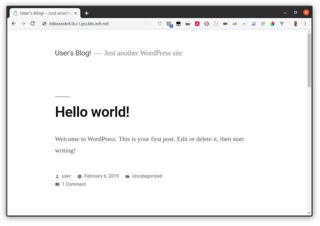

**Last updated 25th February, 2019.**


<style>
 pre {
     font-size: 14px;
 }
 pre.console {
   background-color: #300A24; 
   color: #ccc;
   font-family: monospace;
   padding: 5px;
   margin-bottom: 5px;
 }
 pre.console code {
   border: solid 0px transparent;
   font-family: monospace !important;
 }
 .small {
     font-size: 0.75em;
 }
</style>

In this tutorial we are going to guide you with the setup of [Nginx Ingress](https://github.com/kubernetes/ingress-nginx) on your OVH Managed Kubernetes Service.


## Before you begin

This tutorial presupposes that you already have a working OVH Managed Kubernetes cluster, and some basic knowledge of how to operate it. If you want to know more on those topics, please look at the [OVH Managed Kubernetes Service Quickstart](../deploying-hello-world/).

You also need to have [Helm](https://docs.helm.sh/) installer on your workstation and your cluster, please refer to the [How to install Helm on OVH Managed Kubernetes Service](../installing-helm/) tutorial.


## Installing the Nginx Ingress Controller Helm chart

For this tutorial we are using the [Nginx Ingress Controller  Helm chart](https://github.com/helm/charts/tree/master/stable/nginx-ingress) found on Helm repositories.

The chart is fully configurable, but here we are using the default configuration.


```
helm install stable/nginx-ingress
```

The installing processus will begin:

<pre class="console"><code>$ helm install  stable/nginx-ingress
NAME:   winning-lizard
LAST DEPLOYED: Thu Feb 14 23:01:46 2019
NAMESPACE: default
STATUS: DEPLOYED

RESOURCES:
==> v1beta1/RoleBinding
NAME                          AGE
winning-lizard-nginx-ingress  1s

==> v1beta1/ClusterRole
NAME                          AGE
winning-lizard-nginx-ingress  1s

==> v1beta1/ClusterRoleBinding
NAME                          AGE
winning-lizard-nginx-ingress  1s

==> v1beta1/Role;
NAME                          AGE
winning-lizard-nginx-ingress  1s

==> v1beta1/Deployment
NAME                                          DESIRED  CURRENT  UP-TO-DATE  AVAILABLE  AGE
winning-lizard-nginx-ingress-controller       1        1        1           0          1s
winning-lizard-nginx-ingress-default-backend  1        1        1           0          1s

==> v1/Pod(related)
NAME                                                          READY  STATUS             RESTARTS  AGE
winning-lizard-nginx-ingress-controller-95858789c-57dgj       0/1    ContainerCreating  0         1s
winning-lizard-nginx-ingress-default-backend-5964fdb88-djcvw  0/1    ContainerCreating  0         1s

==> v1/ConfigMap
NAME                                     DATA  AGE
winning-lizard-nginx-ingress-controller  1     1s

==> v1/ServiceAccount
NAME                          SECRETS  AGE
winning-lizard-nginx-ingress  1        1s

==> v1/Service
NAME                                          TYPE          CLUSTER-IP    EXTERNAL-IP  PORT(S)                     AGE
winning-lizard-nginx-ingress-controller       LoadBalancer  10.3.106.37   &lt;pending>    80:30782/TCP,443:30619/TCP  1s
winning-lizard-nginx-ingress-default-backend  ClusterIP     10.3.105.236  &lt;none>       80/TCP                      1s
</code></pre>


At the end of the install, as usual with most helm charts, you get the configuration information and some tips to
test your `nginx-ingress`:

<pre class="console"><code>NOTES:
The nginx-ingress controller has been installed.
It may take a few minutes for the LoadBalancer IP to be available.
You can watch the status by running 'kubectl --namespace default get services -o wide -w winning-lizard-nginx-ingress-controller'

An example Ingress that makes use of the controller:

  apiVersion: extensions/v1beta1
  kind: Ingress
  metadata:
    annotations:
      kubernetes.io/ingress.class: nginx
    name: example
    namespace: foo
  spec:
    rules:
      - host: www.example.com
        http:
          paths:
            - backend:
                serviceName: exampleService
                servicePort: 80
              path: /
    # This section is only required if TLS is to be enabled for the Ingress
    tls:
        - hosts:
            - www.example.com
          secretName: example-tls

If TLS is enabled for the Ingress, a Secret containing the certificate and key must also be provided:

  apiVersion: v1
  kind: Secret
  metadata:
    name: example-tls
    namespace: foo
  data:
    tls.crt: &lt;base64 encoded cert>
    tls.key: &lt;base64 encoded key>
  type: kubernetes.io/tls
</code></pre>


As the `LoadBalancer` creation is asynchronous, and the provisioning of the load balancer can take several minutes, you will surely get a `&lt;pending>` `EXTERNAL-IP`. 

If you try again in a few minutes you should get an `EXTERNAL-IP`:

<pre class="console"><code>$ kubectl  get services  winning-lizard-nginx-ingress-controller
NAME                                      TYPE           CLUSTER-IP    EXTERNAL-IP                        PORT(S)                      AGE
winning-lizard-nginx-ingress-controller   LoadBalancer   10.3.106.37   6d6xxxx8r8.lb.c1.gra.k8s.ovh.net   80:30782/TCP,443:30619/TCP   6m
</code></pre>

You can then access your `nginx-ingress` at `http://[YOUR_LOAD_BALANCER_URL]` via HTTP or `https://[YOUR_LOAD_BALANCER_URL]` via HTTPS.

In order to test your `nginx-ingress`, I suggest you to [install a Wordpress](https://labs.ovh.com/kubernetes-k8s/documentation/tutorial/installing-wordpress) on your cluster, and then create a YAML file for the Ingress that uses the controller:


```
apiVersion: extensions/v1beta1
kind: Ingress
metadata:
  annotations:
    kubernetes.io/ingress.class: nginx
  name: ingress
  namespace: default
spec:
  rules:
    - host: [YOUR_LOAD_BALANCER_URL]
      http:
        paths:
          - backend:
              serviceName: [YOUR_WORDPRESS_SERVICE_NAME]
              servicePort: 80
            path: /
```

> [!primary]
> Don't forget to replace `[YOUR_LOAD_BALANCER_URL]`, `[YOUR_WORDPRESS_SERVICE_NAME]` 

Apply the file:

```
kubectl apply -f ./ingress.yml
```

And the Ingress is created. 

<pre class="console"><code>$ kubectl apply -f ./ingress.yml 
ingress.extensions/ingress created
</code></pre>

So now if you point your browser to `http://[YOUR_LOAD_BALANCER_URL]`  you will see your Wordpress:

{.thumbnail}