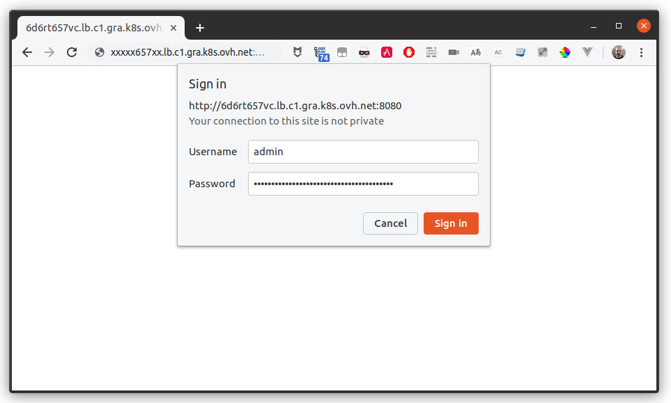
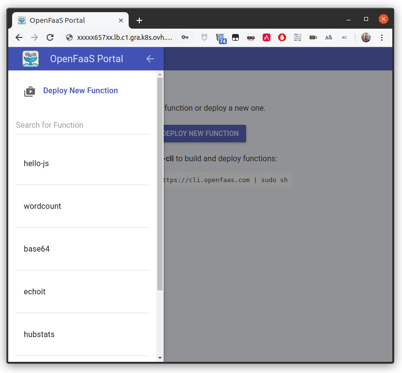

**Last updated May 12<sup>th</sup>, 2020.**

<style>
 pre {
     font-size: 14px;
 }
 pre.console {
   background-color: #300A24; 
   color: #ccc;
   font-family: monospace;
   padding: 5px;
   margin-bottom: 5px;
 }
 pre.console code {
   border: solid 0px transparent;
   font-family: monospace !important;
   font-size: 0.75em;
   color: #ccc;
 }
 .small {
     font-size: 0.75em;
 }
</style>


In this tutorial we are going to guide you with the install of a *Functions as a Service* (FaaS) platform on OVHcloud Managed Kubernetes service. 

The question of *how to install a FaaS platform on OVH* comes recurrently, and in this tutorial you will get some answers with a quick and painless solution: install the FaaS platform over OVHcloud Managed Kubernetes. 

That's the beauty of the rich Kubernetes ecosystem, you can find projects to address many different use case, from the [game server with Agones](https://www.ovh.com/fr/blog/deploying-game-servers-with-agones-on-ovh-managed-kubernetes/) to a FaaS platform...

We have tested several FaaS platform on OVHcloud Managed Kubernetes. Our objective was a solution:

- Easy to deploy, ideally a simple [Helm chart](https://github.com/helm/helm){.external}
- Manageable with both an UI and a CLI, because different customers have different needs
- Auto-scalable, both is ascending and descending senses
- With a comprehensive documentation

We tested lots of platforms, like [Kubeless](https://kubeless.io/){.external}, [OpenWhisk](https://github.com/apache/incubator-openwhisk){.external}, [OpenFaaS](https://github.com/openfaas/faas){.external} and [Fission](https://github.com/fission/fission){.external}, and I must said that all of them performed quite well. 

At the end, the one that scored the best on our objectives was OpenFaaS, so we decided to use it as reference for this tutorial.


## Before you begin

This tutorial presupposes that you already have a working OVHcloud Managed Kubernetes cluster, and some basic knowledge of how to operate it. If you want to know more on those topics, please look at the [deploying a Hello World application](../deploying-hello-world/) documentation.

You also need to have [Helm](https://docs.helm.sh/){.external} installed on your workstation and your cluster, please refer to the [How to install Helm on OVHcloud Managed Kubernetes Service](../installing-helm/) tutorial.


## OpenFaaS, a Kubernetes-native FaaS platform

{.thumbnail}

[OpenFaaS](https://github.com/openfaas/faas){.external} is an open source framework for building Serverless functions with Docker and Kubernetes. The project is mature, very popular and active with more than 14k stars on GitHub, a hundred of contributors, and lots of users, both corporate and private.

OpenFaaS is very simple to deploy (with an Helm chart,including an Operator allowing use of CRDs i.e. `kubectl get functions`), it has both a CLI and an UI, it manages well the auto-scaling and its doc is really complete (with in bonus a nice Slack channel to discuss about it!). 

Technically, OpenFaaS is composed of several functional blocks: 

- The *Function Watchdog*, a tiny golang HTTP server that transforms any Docker image into a serverless function

- The *API Gateway*, providing an external route into functions and collecting metrics 

- The *UI Portal*, allowing to create and invoke functions

- The *CLI* (essentially a REST client for the *API Gateway*), used to deploy any container as a function

Functions can be written on  many languages (I have mainly tested on JavaScript, Go and Python), using handy templates or simple a Dockerfile. 

{.thumbnail}


## Deploying OpenFaaS on OVHcloud Managed Kubernetes

There are several ways to install Agones in a Kubernetes cluster. In this post we choose the easiest one: installing with [Helm](https://helm.sh/){.external}.

The official Helm chart for OpenFaas is [available on faas-netes repository](https://github.com/openfaas/faas-netes/blob/master/chart/openfaas){.external}.


### Adding the OpenFaaS helm chart

The OpenFaaS Helm chart isn't available in Helm's standard `stable` repository. You need to add their repository to your Helm install:

```
helm repo add openfaas https://openfaas.github.io/faas-netes/
helm repo update
```

### Creating the namespaces

OpenFaaS guidelines advise to create two [namespaces](https://kubernetes.io/docs/concepts/overview/working-with-objects/namespaces/), one for OpenFaaS core services and one for the functions:

```
kubectl apply -f https://raw.githubusercontent.com/openfaas/faas-netes/master/namespaces.yml
```

### Generating secrets

A FaaS platform open to the internet seems a bad idea. We are generating secrets  to enable authentication on the gateway.

```
# generate a random password
PASSWORD=$(head -c 12 /dev/urandom | shasum| cut -d' ' -f1)

kubectl -n openfaas create secret generic basic-auth \
--from-literal=basic-auth-user=admin \
--from-literal=basic-auth-password="$PASSWORD"
```

>[!primary] 
> You will need this password later on the tutorial, for example to access the UI portal. You can see it at any moment in the terminal session by doing `echo $PASSWORD`.   

### Deploying the Helm chart

The Helm chart can be deployed in three modes: `LoadBalancer`, `NodePort` and `Ingress`. For us the simplest way is simply using our external Load Balancer, so we will deploy it in `LoadBalancer` by setting the `--set serviceType=LoadBalancer` option.

> [!primary]
> If you want to better understand the difference between these three modes, you can read our [Getting external traffic into Kubernetes – ClusterIp, NodePort, LoadBalancer, and Ingress](https://www.ovh.com/fr/blog/getting-external-traffic-into-kubernetes-clusterip-nodeport-loadbalancer-and-ingress/) blog post

Deploy the Helm chart:

```
helm upgrade openfaas --install openfaas/openfaas \
    --namespace openfaas  \
    --set basic_auth=true \
    --set functionNamespace=openfaas-fn \
    --set serviceType=LoadBalancer
```

As suggested in the install message, you can verify that OpenFaaS has started by running:

```
kubectl --namespace=openfaas get deployments -l "release=openfaas, app=openfaas"
```

If it's working you should see the list of OpenFaaS `deployment` objects, marked as available:


<pre class="console"><code>$ kubectl --namespace=openfaas get deployments -l "release=openfaas, app=openfaas"
NAME           DESIRED   CURRENT   UP-TO-DATE   AVAILABLE   AGE
alertmanager   1         1         1            1           33s
faas-idler     1         1         1            1           33s
gateway        1         1         1            1           33s
nats           1         1         1            1           33s
prometheus     1         1         1            1           33s
queue-worker   1         1         1            1           33s
</code></pre>


## Install the FaaS CLI and log into the API Gateway

The easiest way to interact with your new OpenFaaS platform is intalling `faas-cli`, the command line client for OpenFaaS (on a Linux or Mac, or in a WSL linux terminal in Windows):

```
curl -sL https://cli.openfaas.com | sh
```

You can now use the CLI to log into the gateway. The CLI need the public URL of the OpenFaaS `LoadBalancer`, you can get it via `kubectl`:

```
kubectl get svc -n openfaas gateway-external -o wide
```

> [!warning]
> At this moment you can get an `EXTERNAL-IP &lt;none>`, or `EXTERNAL-IP &lt;PENDING>`.
>
> <pre class="console"><code>$ kubectl get svc -n openfaas gateway-external -o wide
> NAME               TYPE           CLUSTER-IP    EXTERNAL-IP                        PORT(S)          AGE    
> gateway-external   LoadBalancer   10.3.xxx.yyy  PENDING                           8080:30012/TCP   10s   
> </code></pre>
>
>The problem come from the the `LoadBalancer` creation, that is asynchronous, and the provisioning of the load balancer can take several minutes.
> Please try again in a few minutes, and you will normally see the newly assigned URL.


Export the URL to a `OPENFAAS_URL` variable

```
export OPENFAAS_URL=[THE_URL_OF_YOUR_LOADBALANCER]:[THE_EXTERNAL_PORT]
```

> [!primary]
> You will need this URL later on the tutorial, for example to access the UI portal. You can see it at any moment in the terminal session by doing `echo $OPENFAAS_URL`. 

And connect to the gateway:

```
echo -n $PASSWORD | ./faas-cli login -g $OPENFAAS_URL -u admin --password-stdin
```

Now you're connected to the gateway, and you can send commands to the OpenFaaS platform. 

By default, there is no function installed on your OpenFaaS platform, as you can verify with the `faas-cli list` command.


In my own deployment (URLs and IP changed), the precedent operations gave:


<pre class="console"><code>$ kubectl get svc -n openfaas gateway-external -o wide
NAME               TYPE           CLUSTER-IP    EXTERNAL-IP                        PORT(S)          AGE     SELECTOR
gateway-external   LoadBalancer   10.3.xxx.yyy   xxxrt657xx.lb.c1.gra.k8s.ovh.net   8080:30012/TCP   9m10s   app=gateway

$ export OPENFAAS_URL=xxxrt657xx.lb.c1.gra.k8s.ovh.net:8080

$ echo -n $PASSWORD | ./faas-cli login -g $OPENFAAS_URL -u admin --password-stdin
Calling the OpenFaaS server to validate the credentials...
WARNING! Communication is not secure, please consider using HTTPS. Letsencrypt.org offers free SSL/TLS certificates.
credentials saved for admin http://xxxrt657xx.lb.c1.gra.k8s.ovh.net:8080
 
$ ./faas-cli version
  ___                   _____           ____
 / _ \ _ __   ___ _ __ |  ___|_ _  __ _/ ___|
| | | | '_ \ / _ \ '_ \| |_ / _` |/ _` \___ \
| |_| | |_) |  __/ | | |  _| (_| | (_| |___) |
 \___/| .__/ \___|_| |_|_|  \__,_|\__,_|____/
      |_|

CLI:
 commit:  f7c29ea19b5df9d7aa87e9c70aacf4d9315da2cd
 version: 0.12.4

Gateway
 uri:     http://xxxrt657xx.lb.c1.gra.k8s.ovh.net:8080
 version: 0.18.17
 sha:     18f6c720b50db7da5f9c410f9fd3369ed7aff379
 commit:  Extract a caching function_query type


Provider
 name:          faas-netes
 orchestration: kubernetes
 version:       0.10.5
 sha:           9be50543b372381a505e9e54a1356bb076c8f01f

$ ./faas-cli list
Function                      	Invocations    	Replicas
</code></pre>


## Deploying and invoking functions

You can easily deploy functions on your OpenFaaS platform using the CLI, with the command `faas-cli up`:

Let's use [some sample functions](https://raw.githubusercontent.com/openfaas/faas/master/stack.yml) from the OpenFaaS repository:

```
./faas-cli deploy -f https://raw.githubusercontent.com/openfaas/faas/master/stack.yml
```

Doing a `faas-cli list` command now will show the deployed functions:

<pre class="console"><code>$ ./faas-cli list
Function                      	Invocations    	Replicas
base64                        	0              	1    
echoit                        	0              	1    
hubstats                      	0              	1    
markdown                      	0              	1    
nodeinfo                      	0              	1    
wordcount                     	0              	1    
</code></pre>

Let's invoke one of those functions, for example `wordcount` (a function that takes the syntax of the unix [`wc`](https://en.wikipedia.org/wiki/Wc_(Unix){.external}) command, giving us the number of lines, words and characters on the input data):

```
echo 'I love when a plan comes together' | ./faas-cli invoke wordcount
```

<pre class="console"><code>
$ echo 'I love when a plan comes together' | ./faas-cli invoke wordcount
       1         7        34
</code></pre>


## Invoking a function without the CLI

You can use the `faas-cli describe` command to get the public URL of your function, and then call it directly with your favorite HTTP library (or the good old `curl`):

<pre class="console"><code>$ ./faas-cli describe wordcount
Name:                wordcount
Status:              Ready
Replicas:            1
Available replicas:  1
Invocations:         1
Image:               functions/alpine:latest
Function process:    
URL:                 http://xxxxx657xx.lb.c1.gra.k8s.ovh.net:8080/function/wordcount
Async URL:           http://xxxxx657xx.lb.c1.gra.k8s.ovh.net:8080/async-function/wordcount
Labels:              faas_function : wordcount
Annotations:         prometheus.io.scrape : false

$ curl -X POST --data-binary "I love when a plan comes together" "http://xxxxx657xx.lb.c1.gra.k8s.ovh.net:8080/function/wordcount"
       0         7        33
</code></pre>


## Containers everywhere...

The main interest of a FaaS platform is to be able to deploy your own functions.
In OpenFaaS you can write your these function on many languages, not only the usual suspects (JavaScript, Python, Go...). That's is done because on OpenFaaS you can deploy basically any container as a function. As a side effect of it, you need to package your functions as containers in order to deploy them.

That also means that in order to create your own functions, you need to have [Docker](https://www.docker.com/){.external} installed in your workstation, and you will need to push the images in a Docker registry, either the official one or a private one.

If you need a private registry, you can use our [OVHcloud Managed Private Registry](../../private-registry). For this tutorial we are choosing to deploy our image on the official Docker registry.


## Writing our first function

For our first example, we are going to create a deploy a *hello word* function in JavaScript using [NodeJS](https://nodejs.org/){.external}. Let's begin by creating and scaffolding the function folder:

```
mkdir hello-js-project
cd hello-js-project
../faas-cli new hello-js --lang node
```

The CLI will download a JS function template from OpenFaaS repository, generate a function description file (`hello-js.yml` in our case) and a folder for the function source code (`hello-js`). For NodeJS, you will find a `package.json` (for example to declare eventual dependencies to your function) and a `handler.js` (the function main code) in this folder.

Edit `hello-js.yml` to set the name of the image you'll want to upload to docker registry:

`hello-js.yml` 
```yaml
version: 1.0
provider:
  name: openfaas
  gateway: http://xxxxx657xx.lb.c1.gra.k8s.ovh.net:8080
functions:
  hello-js:
    lang: node
    handler: ./hello-js
    image: ovhplatform/openfaas-hello-js:latest
```

The function described in the `handler.js` file is really simple. It exports a function with two parameters, a `context` where you will receive the request data, and a `callback` that you will call at the end of yur function and where you will pass the response data.

```javascript
"use strict"

module.exports = (context, callback) => {
    callback(undefined, {status: "done"});
}
```

Let's edit it to send back our *hello world* message:

```javascript
"use strict"

module.exports = (context, callback) => {
    callback(undefined, {message: 'Hello world'});
}
```

Now you can build the Docker image and push it to the public Docker registry:

```sh
# Build the image
../faas-cli build -f hello-js.yml
# Login at Docker Registry, needed to push the image
docker login     
# Push the image to the registry
../faas-cli push -f hello-js.yml
```

With the image in the registry, let's deploy and invoke the function with the OpenFaaS CLI:

```sh
# Deploy the function
../faas-cli deploy -f hello-js.yml
# Invoke the function
../faas-cli invoke hello-js
```

Congratulations, you have written and deployed your first OpenFaaS function.

## Using the OpenFaaS UI Portal

You can test the UI portal by pointing your browser to your OpenFaaS gateway URL (the one you have set on the `$OPENFAAS_URL` variable), and when asked, using the user `admin` and the password you have set on the `$PASSWORD` variable.

{.thumbnail}

In the UI Portal you will find the list of the deployed functions, and for each function you can find it description, invoke it and see the result.

{.thumbnail}

{.thumbnail}


## Where do we go from here?

So now you have a working OpenFaaS platform on your OVHcloud Managed Kubernetes cluster.

To learn more about OpenFaaS, and how you can get a maximum profit from it, please refer to the [official OpenFaaS documentation](https://docs.openfaas.com/){.external}. You can also follow the [OpenFaaS workshops](https://github.com/openfaas/workshop){.external} to learn in a more practical way.  


