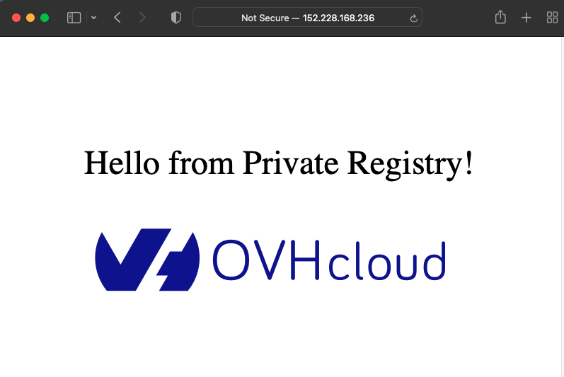

**Last updated 23th February, 2022.**

<style>
 pre {
     font-size: 14px;
 }
 pre.console {
   background-color: #300A24; 
   color: #ccc;
   font-family: monospace;
   padding: 5px;
   margin-bottom: 5px;
 }
 pre.console code {
   border: solid 0px transparent;
   font-family: monospace !important;
   font-size: 0.75em;
   color: #ccc;
 }
 .small {
     font-size: 0.75em;
 }
</style>

## Objective

[Operators](https://kubernetes.io/docs/concepts/extend-kubernetes/operator/) are one way to extend Kubernetes to automate some actions in the cluster.


In few words an operator offers OPS actions programmatically and avoid repetitive human activities that are devoid of added value.
The tasks that an operator can do are various and can be on resources deployed in Kubernetes (like a Pod for example) or outside (like a database for example).
In this guide, we are focusing on resources inside a Kubernetes cluster.

An operator is based on a [Custom Resource](https://kubernetes.io/docs/concepts/extend-kubernetes/api-extension/custom-resources/) that allows to extend Kubernetes API.
Thanks to the control loop of Kubernetes the operator maintains the right state of the resources.
Then, the operator's job is to monitor the state of the internal or external objects that it manages.

An operator can have various capabilities:

* basic application setup and configuration,
* upgrade the application (with rollback if needed),
* backup and recovery if the operator handles a state,
* auto-remediation of the application if a problem occurs,
* monitoring and observability for its own metrics,
* auto scaling, auto tuning, ...  

A good summary of the capabilities of an operator can be found on the [operator framework website](https://operatorframework.io/operator-capabilities/).

As an operator is a custom API in Kubernetes, you need to develop it, thankfully there are frameworks to help you to develop your own operator.
The most important [framework](https://operatorframework.io/operator-capabilities/) allows you to develop an operator with Ansible, Helm and Go.
Another kind of frameworks exists to use other languages, like Java for instance with the [Java operator SDK](https://github.com/java-operator-sdk/java-operator-sdk).

As we can see with the below tutorial, the capability of the developed operator depends on the language, for example develop an operator with Helm offers less capabilities (but it's simpler).

## Requirements

This tutorial assumes that you already have a Kubernetes cluster managed by OVHcloud, and some basic knowledge of how to operate it. If you want to know more on those topics, please look at the [deploying a Hello World application](../deploying-hello-world/) documentation.

## Instructions

In this tutorial, we create a simple operator that manages the installation of an Nginx server and monitors it.  
Our operator will allow us to:
 - install a Ngnix server with the required number of Pods,
 - upgrade the number of Pods,
 - change the HTTP port,
 - recreate the service if it is deleted.

We'll develop this operator with the [operator SDK](https://sdk.operatorframework.io).  
The operator SDK provides several tools:
 - a [CLI](https://sdk.operatorframework.io/docs/cli/) to develop and run locally the developed operator,
 - several helpers in different languages (Helm, Ansible and Go) to easily develop an operator.  
In this article we use the [Helm helper](https://sdk.operatorframework.io/docs/building-operators/helm/quickstart/).  
We'll see in other articles how to develop operators with other languages (Go for example).

### Install the CLI

The SDK includes a [CLI](https://sdk.operatorframework.io/docs/cli/) (**C**ommand **L**ine **I**nterface).
In order to install the CLI, follow the instructions depending on your OS.  
You can, for example, install it through Homebrew:

```bash
brew install operator-sdk
```


Then test if the CLI is correctly installed on your computer:
<pre class="console"><code>
$ operator-sdk version

operator-sdk version: "v1.17.0", commit: "704b02a9ba86e85f43edb1b20457859e9eedc6e6", kubernetes version: "v1.21", go version: "go1.17.6", GOOS: "darwin", GOARCH: "arm64"
</code></pre>

### Develop an operator with Helm
In this guide, you will use [Helm](https://helm.sh/) to create your first operator.
Helm is a package manager and provides templates to deploy applications in Kubernetes.

The CLI offers to scaffold an entire project.
We are not using the scaffolding for this tutorial because it generates a lot of files.
This is useful for a comprehensive and professional operator, but would make harder the comprehension of our _hello world_.

More information on the project layout generated by the CLI can be found in the [official documentation](https://sdk.operatorframework.io/docs/overview/project-layout/).

#### The Helm chart
An operator based on Helm is like a classic Helm chart, it will follow the same structure and organization.
Your first Helm operator will follow the following code organization:

```bash
├── helm-charts
│   └── ovh-nginx
│       ├── Chart.yaml
│       ├── templates
│       │   ├── _helpers.tpl
│       │   ├── deployment.yaml
│       │   └── service.yaml
│       └── values.yaml
```

First, create a `helm-charts` folder and then a `ovh-nginx` folder inside it.
Go inside `helm-charts/ovh-nginx` folders.

Then,  create a `template` folder.
In this `template` folder, create a file named `deployment.yaml` with the following content:
```yaml
apiVersion: apps/v1
kind: Deployment
metadata:
  name: {{ include "ovh-nginx.fullname" . }}
  labels:
    {{- include "ovh-nginx.labels" . | nindent 4 }}
spec:
  replicas: {{ .Values.replicaCount }} # Thanks to Helm the replica field will be dynamic
  selector:
    matchLabels:
      {{- include "ovh-nginx.selectorLabels" . | nindent 6 }}
  template:
    metadata:
      labels:
        {{- include "ovh-nginx.selectorLabels" . | nindent 8 }}
    spec:
      containers:
        - name: {{ .Chart.Name }}
          image: "{{ .Values.image.repository }}:{{ .Values.image.tag | default .Chart.AppVersion }}"
          imagePullPolicy: {{ .Values.image.pullPolicy }}
          resources:
            requests:
              memory: "2Mi"
              cpu: "0"
            limits:
              memory: "32Mi"
              cpu: "500m"          
          ports:
            - name: http
              containerPort: 80
              protocol: TCP
          livenessProbe:
            httpGet:
              path: /
              port: http
          readinessProbe:
            httpGet:
              path: /
              port: http
```

Then, in `template` folder, you can create the Service in a file `service.yaml` with the following content:
```yaml
apiVersion: v1
kind: Service
metadata:
  name: {{ include "ovh-nginx.fullname" . }}
  labels:
    {{- include "ovh-nginx.labels" . | nindent 4 }}
spec:
  type: {{ .Values.service.type }}
  ports:
    - port: {{ .Values.service.port }} # Thanks to Helm the HTTP port field will be dynamic
      targetPort: http
      protocol: TCP
      name: http
  selector:
    {{- include "ovh-nginx.selectorLabels" . | nindent 4 }}
```

Then, in `template` folder, create a helper to simplify the templates, to fo that create a `helper.tpl` file with the content:
```
{{/*
Expand the name of the chart.
*/}}
{{- define "ovh-nginx.name" -}}
{{- default .Chart.Name | trunc 63 | trimSuffix "-" }}
{{- end }}

{{/*
Create a default fully qualified app name.
We truncate at 63 chars because some Kubernetes name fields are limited to this (by the DNS naming spec).
If release name contains chart name it will be used as a full name.
*/}}
{{- define "ovh-nginx.fullname" -}}
{{- printf "%s-%s" .Release.Name .Chart.Name | trunc 63 | trimSuffix "-" }}
{{- end }}

{{/*
Create chart name and version as used by the chart label.
*/}}
{{- define "ovh-nginx.chart" -}}
{{- printf "%s-%s" .Chart.Name .Chart.Version | replace "+" "_" | trunc 63 | trimSuffix "-" }}
{{- end }}

{{/*
Common labels
*/}}
{{- define "ovh-nginx.labels" -}}
helm.sh/chart: {{ include "ovh-nginx.chart" . }}
{{ include "ovh-nginx.selectorLabels" . }}
{{- if .Chart.AppVersion }}
app.kubernetes.io/version: {{ .Chart.AppVersion | quote }}
{{- end }}
app.kubernetes.io/managed-by: {{ .Release.Service }}
{{- end }}

{{/*
Selector labels
*/}}
{{- define "ovh-nginx.selectorLabels" -}}
app.kubernetes.io/name: {{ include "ovh-nginx.name" . }}
app.kubernetes.io/instance: {{ .Release.Name }}
{{- end }}
```

Your values needed to be defined in a `values.yaml` file in the `ovh-nginx` folder with the content:
```yaml
# To allow our operator to change the number of replicas
replicaCount: 1

image:
  repository: ovhplatform/hello
  pullPolicy: IfNotPresent
  tag: "1.0"

service:
  type: LoadBalancer
  # To allow our operator to change the port
  port: 80
```
> [!info]
>
> Only fields in values.yaml file can be managed by the operator.
>

Finally, in the `ovh-nginx` folder,  create the `Chart.yaml` file with the content:
```yaml
apiVersion: v2
appVersion: 1.0
description: A Helm chart to deploy the OVHcloud hello world Nginx server
name: ovh-nginx
type: application
version: 0.1.0
```

At this point we have a standard helm chart.
It can be used with the Helm client (`helm upgrade` for instance) to deploy the Nginx server. 
In the following sections you'll see how to delegate this to an operator.

### The custom resource definition
The [custom resources definition](https://kubernetes.io/docs/tasks/extend-kubernetes/custom-resources/custom-resource-definitions/) (CRDs) is the main point of the operator.
It allows you to extend the default API of Kubernetes.
In other words, once you have defined a CRD you'll can create new resources, called Custom Resources (CRs) to distinguished them with the official Kubernetes resources.
The CRD is a kind of schema for the CR based on the CRD.


Let's have a look at our CRD (`tutorials.ovhcloud.com_ovhnginxoperators.yaml`):
```yaml
apiVersion: apiextensions.k8s.io/v1
kind: CustomResourceDefinition # The API to declare new API (CRD)
metadata:
  name: ovhnginxs.tutorials.ovhcloud.com
spec:
  group: tutorials.ovhcloud.com
  names:
    kind: OvhNginx  # The name of our CRD 
    listKind: OvhNginxList
    plural: ovhnginxs
    singular: ovhnginx # To get the created CR with kubectl
  scope: Namespaced
  versions:
  - name: v1
    schema:
      openAPIV3Schema:
        type: object
        properties:
          spec: # List of the properties in the CR, must match the values.yaml structure
            type: object
            properties:
              service:
                type: object
                properties:
                  port:  # To change the port of the Nginx server
                    type: integer
              replicaCount:  # To change the number of Pod
                type: integer
    served: true
    storage: true
    subresources:
      status: {}
```

With the CRD we create a _watches.yaml_ file that indicates to the Operator which helm chart and CRD use:
```yaml
- group: tutorials.ovhcloud.com
  version: v1
  kind: OvhNginx
  chart: helm-charts/ovh-nginx
```
Put all the files in the following tree structure:
```bash
tree
.
├── helm-charts
│   └── ovh-nginx
│       ├── Chart.yaml
│       ├── templates
│       │   ├── _helpers.tpl
│       │   ├── deployment.yaml
│       │   └── service.yaml
│       └── values.yaml
├── manifests
│   ├── crd
│   │   └── tutorials.ovhcloud.com_ovhnginxoperators.yaml
└── watches.yaml
```

### Test it locally (almost)

Before packaging and deploying our operator in a real Kubernetes cluster we can test it locally.
You still need a Kubernetes cluster to deploy your CRD and the Nginx server managed by the operator.
First, create the CRD in your Kubernetes cluster:
```bash
❯ kubectl apply -f manifests/crd/tutorials.ovhcloud.com_ovhnginxoperators.yaml
customresourcedefinition.apiextensions.k8s.io/ovhnginxs.tutorials.ovhcloud.com created

❯ kubectl get crds/ovhnginxs.tutorials.ovhcloud.com
NAME                               CREATED AT
ovhnginxs.tutorials.ovhcloud.com   2022-02-18T13:51:14Z
```

At this point there is not need to deploy the operator in the Kubernetes cluster, you can run it locally on your computer:
```bash
❯ helm-operator run

{"level":"info","ts":1645197230.698494,"logger":"cmd","msg":"Version","Go Version":"go1.17.6","GOOS":"darwin","GOARCH":"arm64","helm-operator":"v1.17.0","commit":"704b02a9ba86e85f43edb1b20457859e9eedc6e6"}
{"level":"info","ts":1645197230.699863,"logger":"cmd","msg":"Watch namespaces not configured by environment variable WATCH_NAMESPACE or file. Watching all namespaces.","Namespace":""}
{"level":"info","ts":1645197231.877758,"logger":"controller-runtime.metrics","msg":"Metrics server is starting to listen","addr":":8080"}
{"level":"info","ts":1645197231.888722,"logger":"helm.controller","msg":"Watching resource","apiVersion":"tutorials.ovhcloud.com/v1","kind":"OvhNginx","namespace":"","reconcilePeriod":"1m0s"}
{"level":"info","ts":1645197231.890322,"msg":"Starting server","kind":"health probe","addr":"[::]:8081"}
{"level":"info","ts":1645197231.8903291,"msg":"Starting server","path":"/metrics","kind":"metrics","addr":"[::]:8080"}
{"level":"info","ts":1645197231.8913422,"logger":"controller.ovhnginx-controller","msg":"Starting EventSource","source":"kind source: *unstructured.Unstructured"}
{"level":"info","ts":1645197231.891497,"logger":"controller.ovhnginx-controller","msg":"Starting Controller"}
{"level":"info","ts":1645197231.993102,"logger":"controller.ovhnginx-controller","msg":"Starting workers","worker count":8}
```

And now you are ready to test it with the creation of your first CR (_tutorials_v1_ovhnginxoperator.yaml_):
```yaml
apiVersion: tutorials.ovhcloud.com/v1
kind: OvhNginx
metadata:
  name: mynginx-sample
spec:
  replicaCount: 1
  service:
    port: 80
```

Before creating the CR, create a namespace. This will be the namespace where the CR will be created and the Nginx server deployed:
```bash
❯ kubectl create ns test-ovh-nginx-operator
namespace/test-ovh-nginx-operator created

❯ kubectl get ns                           
NAME                      STATUS   AGE
default                   Active   11d
kube-node-lease           Active   11d
kube-public               Active   11d
kube-system               Active   11d
test-ovh-nginx-operator   Active   8s
```

Then create the CR:
```bash
❯ kubectl apply -f manifests/samples/tutorials_v1_ovhnginxoperator.yaml
ovhnginx.tutorials.ovhcloud.com/mynginx-sample created

❯ kubectl get ovhnginx
NAME             AGE
mynginx-sample   79s

```

What about our operator?
It's detects the new CR and does a few things!!!
```bash
{"level":"info","ts":1645197784.822017,"logger":"controller.ovhnginx-controller","msg":"Starting EventSource","source":"kind source: *unstructured.Unstructured"}
{"level":"info","ts":1645197784.822165,"logger":"helm.controller","msg":"Watching dependent resource","ownerApiVersion":"tutorials.ovhcloud.com/v1","ownerKind":"OvhNginx","apiVersion":"apps/v1","kind":"Deployment"}
{"level":"info","ts":1645197784.82237,"logger":"controller.ovhnginx-controller","msg":"Starting EventSource","source":"kind source: *unstructured.Unstructured"}
{"level":"info","ts":1645197784.822401,"logger":"helm.controller","msg":"Watching dependent resource","ownerApiVersion":"tutorials.ovhcloud.com/v1","ownerKind":"OvhNginx","apiVersion":"v1","kind":"Service"}
{"level":"info","ts":1645197784.822422,"logger":"helm.controller","msg":"Installed release","namespace":"test-ovh-nginx-operator","name":"mynginx-sample","apiVersion":"tutorials.ovhcloud.com/v1","kind":"OvhNginx","release":"mynginx-sample"}
```

Let's take a look at our Kubernetes cluster:
```bash
❯ kubectl get pods
NAME                                        READY   STATUS    RESTARTS   AGE
mynginx-sample-ovh-nginx-65b64c6585-wtc5g   1/1     Running   0          72s

❯ kubectl get service
NAME                       TYPE           CLUSTER-IP     EXTERNAL-IP       PORT(S)        AGE
mynginx-sample-ovh-nginx   LoadBalancer   XXX.XXX.XXX.XXX   YYY.YYY.YYY.YYY   80:30356/TCP   105s
```

Ok, that sounds okay, but let's have a look at `http://yyy.yyy.yyy.yyy/` page:  


You can now safely delete your CR:
```bash
❯ kubectl delete ovhnginxs.tutorials.ovhcloud.com/mynginx-sample
ovhnginx.tutorials.ovhcloud.com "mynginx-sample" deleted

❯ kubectl get pods
No resources found in test-ovh-nginx-operator namespace.

❯ kubectl get services
No resources found in test-ovh-nginx-operator namespace.
```

At this point of the tutorial your tree structure is like this:
```bash
.
├── helm-charts
│   └── ovh-nginx
│       ├── Chart.yaml
│       ├── templates
│       │   ├── _helpers.tpl
│       │   ├── deployment.yaml
│       │   └── service.yaml
│       └── values.yaml
├── manifests
│   ├── crd
│   │   └── tutorials.ovhcloud.com_ovhnginxoperators.yaml
│   └── samples
│       └── tutorials_v1_ovhnginxoperator.yaml
└── watches.yaml
```

### Deploy the operator in Kubernetes

Maybe you think:
> ok my operator turns on my computer, but how can I deploy it on my Kubernetes cluster?

And you're right, the goal of our operator is to be independent and manage automatically all requests !

> [!info]
>
> To be more readable the following resources are simplest that the one you will have to create in the real world, specifically the security configuration.
>

It's quite simple to package and deploy our operator.
The first step is to create a Dockerfile:
```dockerfile
FROM quay.io/operator-framework/helm-operator:v1.17.0

ENV HOME=/opt/helm
COPY watches.yaml ${HOME}/watches.yaml
COPY helm-charts  ${HOME}/helm-charts
WORKDIR ${HOME}
```

Build the image:
```bash
docker build -t ovhplateform/ovh-nginx-operator:1.0.0 . 
```

And push it on your favorite registry:
```bash
docker push ovhplateform/ovh-nginx-operator:1.0.0
```

The last step consistes deploying your operator thanks a Kubernetes manifest (_ovh-nginx-operator.yaml_) like this one:
```yaml
# The namespace where the operator is deployed
apiVersion: v1
kind: Namespace
metadata:
  name: ovh-nginx-operator
---
# Authorisations for the operator
apiVersion: rbac.authorization.k8s.io/v1
kind: ClusterRole
metadata:
  name: ovhnginxoperator-admin-role
rules:
- apiGroups:
  - tutorials.ovhcloud.com
  resources:
  - ovhnginxs
  - ovhnginxs/status
  - ovhnginxs/finalizers  
  verbs:
  - create
  - delete
  - get
  - list
  - patch
  - update
  - watch
- apiGroups:
  - ""
  resources:
  - secrets
  - "serviceaccounts"
  - "services"  
  verbs:
  - "*"
- apiGroups:
  - "apps"
  verbs:
    - "*"
  resources:
  - "deployments"
---
# The service account used for the Pod where is the operator
apiVersion: v1
kind: ServiceAccount
metadata:
  name: ovh-nginx-operator-sa
  namespace: ovh-nginx-operator
---
# The affected authorisation to the service account
apiVersion: rbac.authorization.k8s.io/v1
kind: ClusterRoleBinding
metadata:
  name: ovh-nginx-operator-admin
subjects:
- kind: ServiceAccount
  name: ovh-nginx-operator-sa
  namespace: ovh-nginx-operator
roleRef:
  kind: ClusterRole
  name: ovhnginxoperator-admin-role
  apiGroup: ""
---
# The deployment for the operator
apiVersion: apps/v1
kind: Deployment
metadata:
  name: ovh-nginx-operator
  namespace: ovh-nginx-operator
spec:
  selector:
    matchLabels:
      app: ovh-nginx-operator
  replicas: 1 
  strategy:
    type: Recreate 
  template:
    metadata:
      labels:
        app: ovh-nginx-operator
    spec:
      serviceAccountName: ovh-nginx-operator-sa
      containers:
      - name: operator
        image: ovhplateform/ovh-nginx-operator:1.0.0
        imagePullPolicy: Always
```
And apply the file to the Kubernetes cluster:
```bash
❯ kubectl apply -f manifests/ovh-nginx-operator.yaml

❯ kubectl get pods --namespace ovh-nginx-operator
NAME                                  READY   STATUS    RESTARTS   AGE
ovh-nginx-operator-5487958499-v9q46   1/1     Running   0          70s
```

It's time to test the operator, let's play with the customized resource:
```bash
❯ kubectl apply -f manifests/samples/tutorials_v1_ovhnginxoperator.yaml
ovhnginx.tutorials.ovhcloud.com/mynginx-sample created

❯ kubectl get pods --namespace test-ovh-nginx-operator
NAME                                        READY   STATUS    RESTARTS   AGE
mynginx-sample-ovh-nginx-65b64c6585-5ddpm   1/1     Running   0          44s

❯ kubectl get services --namespace test-ovh-nginx-operator
NAME                       TYPE           CLUSTER-IP     EXTERNAL-IP     PORT(S)        AGE
mynginx-sample-ovh-nginx   LoadBalancer   XXX.XXX.XXX.XXX   YYY.YYY.YYY.YYY   80:30403/TCP   2m36s
```

Update the CR like this and apply it again:
```yaml
apiVersion: tutorials.ovhcloud.com/v1
kind: OvhNginx
metadata:
  name: mynginx-sample
spec:
  replicaCount: 2
  service:
    port: 8080
```

```bash
❯ kubectl get pods --namespace test-ovh-nginx-operator
NAME                                        READY   STATUS    RESTARTS   AGE
mynginx-sample-ovh-nginx-65b64c6585-4nc88   1/1     Running   0          4m29s
mynginx-sample-ovh-nginx-65b64c6585-5ddpm   1/1     Running   0          28m

❯ kubectl get services --namespace test-ovh-nginx-operator
NAME                       TYPE           CLUSTER-IP     EXTERNAL-IP     PORT(S)          AGE
mynginx-sample-ovh-nginx   LoadBalancer   XXX.XXX.XXX.XXX   YYY.YYY.YYY.YYYY   8080:30403/TCP   30m
```

You can also play to delete the service and see that the operator recreates it !

Other tutorials on operators will be soon available to discover additional ways to develop an operator.

## Go further

Join our community of users on <https://community.ovh.com/en/>.  
The [operator](https://kubernetes.io/docs/concepts/extend-kubernetes/operator/) pattern in Kubernetes.  
The operator [SDK](https://operatorframework.io/operator-capabilities/).