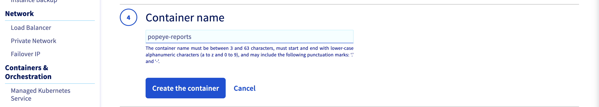
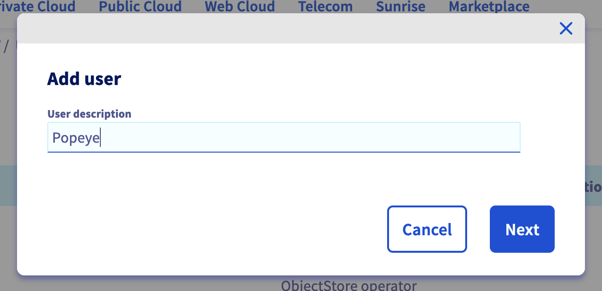
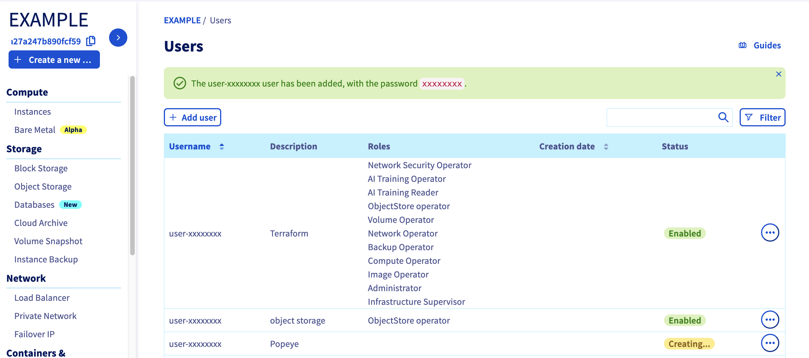
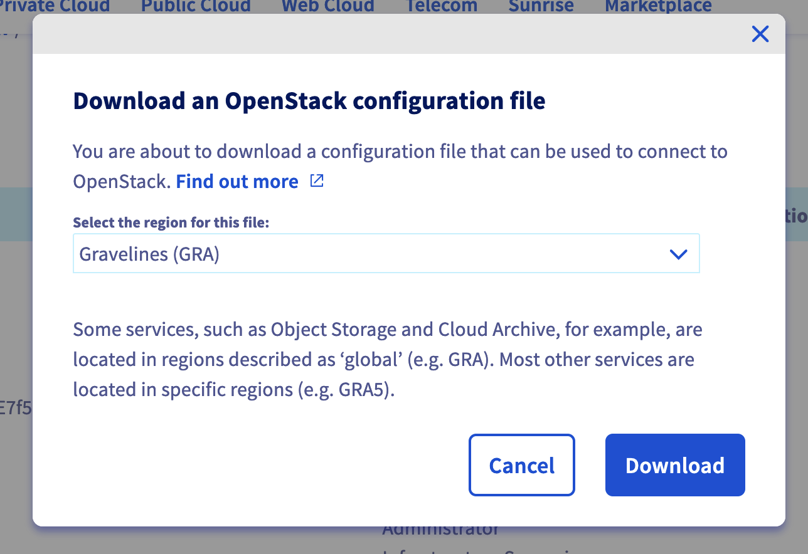

**Last updated 15th April 2022**

<style>
 pre {
     font-size: 14px;
 }
 pre.console {
   background-color: #300A24; 
   color: #ccc;
   font-family: monospace;
   padding: 5px;
   margin-bottom: 5px;
 }
 pre.console code {
   border: solid 0px transparent;
   font-family: monospace !important;
   font-size: 0.75em;
   color: #ccc;
 }
 .small {
     font-size: 0.75em;
 }
</style>

## Objective

[Popeye](https://github.com/derailed/popeye) is a tool that scans Kubernetes clusters and reports potential issues with deployed resources and configurations. 


It sanitizes your cluster based on what is deployed. By scanning your cluster, it detects misconfigurations and helps you to ensure that best practices are in place, thus preventing future headaches. It aims at reducing the cognitive overload one faces when operating a Kubernetes cluster in the wild.

Popeye also reports potential resources over/under allocations and attempts to warn you about your cluster running out of capacity.

Popeye scans your cluster for best practices and potential issues. Currently, Popeye looks at `nodes`, `namespaces`, `pods` and `services`.

For your information, Popeye is a read-only tool, it only retrieves informations in order to help you to securize and sanitize your cluster, it does not modify or delete resources on a Kubernetes cluster.

Read more about [Popeye](https://github.com/derailed/popeye).

At OVHcloud, we like to provide you with the best products and services. For us, security is important, that's why we want to help you discover Popeye which will help you secure your OVHcloud Managed Kubernetes with helpful reports.

In this guide you will:

- Install Popeye (locally)
- Generate and export reports
- Fix common issues
- Store report on OVHcloud Object Storage

You can use the *Reset cluster* function in the Public Cloud section of the [OVHcloud Control Panel](https://ca.ovh.com/auth/?action=gotomanager&from=https://www.ovh.com/ca/fr/&ovhSubsidiary=qc){.external} to reinitialize your cluster before following this tutorial.

## Requirements

This tutorial presupposes that you already have a working OVHcloud Managed Kubernetes cluster, and some basic knowledge of how to operate it.

Moreover, follow the [deploying a Hello World application](../deploying-an-application/) documentation in order to have an example application running on your cluster.

At this time you should have a running Kubernetes cluster with hello-world deployment and pod like below:

<pre class="console"><code>$ kubectl get po,deploy
NAME                                          READY   STATUS    RESTARTS   AGE
pod/hello-world-deployment-66d599d4c6-bh5w8   1/1     Running   0          4d2h

NAME                                     READY   UP-TO-DATE   AVAILABLE   AGE
deployment.apps/hello-world-deployment   1/1     1            1           4d22h
</code></pre>

## Instructions

### Installing Popeye CLI

You can [install Popeye](https://github.com/derailed/popeye#installation) on your computer from the binaries, the source, HomeBrew and even use it directly from a Docker image.

For this tutorial you will install it via HomeBrew:

```bash
brew install derailed/popeye/popeye
```

The output should be like this:

<pre class="console"><code>$ brew install derailed/popeye/popeye
Running `brew update --preinstall`...
...
==> Tapping derailed/popeye
Cloning into '/Users/avache/homebrew/Library/Taps/derailed/homebrew-popeye'...
remote: Enumerating objects: 233, done.
remote: Counting objects: 100% (104/104), done.
remote: Compressing objects: 100% (52/52), done.
remote: Total 233 (delta 25), reused 0 (delta 0), pack-reused 129
Receiving objects: 100% (233/233), 25.13 KiB | 12.57 MiB/s, done.
Resolving deltas: 100% (57/57), done.
Tapped 1 formula (12 files, 37KB).
==> Downloading https://github.com/derailed/popeye/releases/download/v0.10.0/popeye_Darwin_arm64.tar.gz
==> Downloading from https://objects.githubusercontent.com/github-production-release-asset-2e65be/176379662/c65e86e0-4e3e-4591-9bb7-62b7bddd46e4?X-Amz-Algorithm=AWS4-HMAC-SHA256&X-Amz-Credential=AKIAIWNJY
######################################################################## 100.0%
==> Installing popeye from derailed/popeye
...
==> Running `brew cleanup popeye`...
Disable this behaviour by setting HOMEBREW_NO_INSTALL_CLEANUP.
Hide these hints with HOMEBREW_NO_ENV_HINTS (see `man brew`).
</code></pre>

After the installation, check that the `popeye` CLI is working correctly:

```bash
popeye version
```

You should have a behavior like this:

<pre class="console"><code>$ popeye version
 ___     ___ _____   _____                       K          .-'-.
| _ \___| _ \ __\ \ / / __|                       8     __|      `\
|  _/ _ \  _/ _| \ V /| _|                         s   `-,-`--._   `\
|_| \___/_| |___| |_| |___|                       []  .->'  a     `|-'
  Biffs`em and Buffs`em!                            `=/ (__/_       /
                                                      \_,    `    _)
                                                         `----;  |
Version:   0.10.0
Commit:    d1d807b721b0393e7b69e970bdf947895c61d8f4
Date:      2022-04-14T15:51:42Z
Logs:      /var/folders/lq/xp6s4vbn13s5vj_kq3cch50w0000gn/T/popeye.log
</code></pre>

Popeye is correctly installed on your computer, you can now use it to see if your cluster matches with Kubernetes security best practices.

### Generate Popeye reports

The `popeye` CLI works like `kubectl` command. So when you execute the CLI, it searches your cluster configuration.

To generate a report, simply execute the CLI:

```bash
popeye
```

This command run tests on all nodes and namespaces by default:


As you can see, by default, our OVHcloud Managed Kubernetes cluster (and with an hello world application deployed) has a 83 score.

Though it's a good score, let's take a look on what should be improved or fixed.

The report can be very big. So, in order to take a look at what you should improve or fix, a good practice is to run the `popeye` command only on a specified namespace.

This way, you can better improve and fix your cluster resources step by step.

As we deployed an hello world app in the `default` namespace, you can run `popeye` on the default namespace and generate a report only for `deployments`:

```bash
popeye -n default -s deploy
```

<pre class="console"><code>$ popeye -n default -s deploy
...
GENERAL [MY-TEST-CLUSTER2]
┅┅┅┅┅┅┅┅┅┅┅┅┅┅┅┅┅┅┅┅┅┅┅┅┅┅┅┅┅┅┅┅┅┅┅┅┅┅┅┅┅┅┅┅┅┅┅┅┅┅┅┅┅┅┅┅┅┅┅┅┅┅┅┅┅┅┅┅┅┅┅┅┅┅┅┅┅┅┅┅┅┅┅┅┅┅┅┅┅┅┅┅┅┅┅┅┅┅┅┅┅
  · Connectivity...................................................................................✅
  · MetricServer...................................................................................✅


DEPLOYMENTS (1 SCANNED)                                                        💥 1 😱 0 🔊 0 ✅ 0 0٪
┅┅┅┅┅┅┅┅┅┅┅┅┅┅┅┅┅┅┅┅┅┅┅┅┅┅┅┅┅┅┅┅┅┅┅┅┅┅┅┅┅┅┅┅┅┅┅┅┅┅┅┅┅┅┅┅┅┅┅┅┅┅┅┅┅┅┅┅┅┅┅┅┅┅┅┅┅┅┅┅┅┅┅┅┅┅┅┅┅┅┅┅┅┅┅┅┅┅┅┅┅
  · default/hello-world-deployment.................................................................💥
    🐳 hello-world
      💥 [POP-100] Untagged docker image in use.
      😱 [POP-106] No resources requests/limits defined.
      🔊 [POP-108] Unnamed port 80.


SUMMARY
┅┅┅┅┅┅┅┅┅┅┅┅┅┅┅┅┅┅┅┅┅┅┅┅┅┅┅┅┅┅┅┅┅┅┅┅┅┅┅┅┅┅┅┅┅┅┅┅┅┅┅┅┅┅┅┅┅┅┅┅┅┅┅┅┅┅┅┅┅┅┅┅┅┅┅┅┅┅┅┅┅┅┅┅┅┅┅┅┅┅┅┅┅┅┅┅┅┅┅┅┅
Your cluster score: 0 -- F
</code></pre>

In this report, you can see that the best practices to follow are:

- use a tagged Docker image
- set resources requests and limits
- define containers port name

There are 3 simple best practices to follow.
Let's fix them.

Copy the original `hello.yml` file (that you can find in the [deploying a Hello World application](../deploying-an-application/) guide) into a new one:

```bash
cp hello.yml hello-fixed.yml
```

Then edit the new file `hello-fixed.yml` with the following content:

```yaml
apiVersion: v1
kind: Service
metadata:
  name: hello-world
  labels:
    app: hello-world
spec:
  type: LoadBalancer
  ports:
  - port: 80
    targetPort: 80
    protocol: TCP
    name: http
  selector:
    app: hello-world
---
apiVersion: apps/v1
kind: Deployment
metadata:
  name: hello-world-deployment
  labels:
    app: hello-world
spec:
  replicas: 1
  selector:
    matchLabels:
      app: hello-world
  template:
    metadata:
      labels:
        app: hello-world
    spec:
      containers:
      - name: hello-world
        image: ovhplatform/hello:1.0
        resources:
          requests:
            memory: "2Mi"
            cpu: "0"
          limits:
            memory: "32Mi"
            cpu: "4"
        ports:
        - name: http
          containerPort: 80
```

In the deployment section of this YAML file, you will:

- set the image tag to 1.0 (the specified version of the image you want to run on a container in the cluster)
- set resources requests and limits
- set the port name to "http"

Apply the new Kubernetes manifest:

```
kubectl apply -f hello-fixed.yml -n default
```

You should have the following results on your machine:

<pre class="console"><code>$ kubectl apply -f hello-fixed.yml -n default

service/hello-world unchanged
deployment.apps/hello-world-deployment configured
</code></pre>

You can generate a new report and check if the warning messages disapear and if the score increases with the `popeye` command:

```bash
popeye -n default -s deploy
```

The report should be better now:

<pre class="console"><code>$ popeye -n default -s deploy
...
GENERAL [MY-TEST-CLUSTER2]
┅┅┅┅┅┅┅┅┅┅┅┅┅┅┅┅┅┅┅┅┅┅┅┅┅┅┅┅┅┅┅┅┅┅┅┅┅┅┅┅┅┅┅┅┅┅┅┅┅┅┅┅┅┅┅┅┅┅┅┅┅┅┅┅┅┅┅┅┅┅┅┅┅┅┅┅┅┅┅┅┅┅┅┅┅┅┅┅┅┅┅┅┅┅┅┅┅┅┅┅┅
  · Connectivity...................................................................................✅
  · MetricServer...................................................................................✅


DEPLOYMENTS (1 SCANNED)                                                      💥 0 😱 0 🔊 0 ✅ 1 100٪
┅┅┅┅┅┅┅┅┅┅┅┅┅┅┅┅┅┅┅┅┅┅┅┅┅┅┅┅┅┅┅┅┅┅┅┅┅┅┅┅┅┅┅┅┅┅┅┅┅┅┅┅┅┅┅┅┅┅┅┅┅┅┅┅┅┅┅┅┅┅┅┅┅┅┅┅┅┅┅┅┅┅┅┅┅┅┅┅┅┅┅┅┅┅┅┅┅┅┅┅┅
  · default/hello-world-deployment.................................................................✅


SUMMARY
┅┅┅┅┅┅┅┅┅┅┅┅┅┅┅┅┅┅┅┅┅┅┅┅┅┅┅┅┅┅┅┅┅┅┅┅┅┅┅┅┅┅┅┅┅┅┅┅┅┅┅┅┅┅┅┅┅┅┅┅┅┅┅┅┅┅┅┅┅┅┅┅┅┅┅┅┅┅┅┅┅┅┅┅┅┅┅┅┅┅┅┅┅┅┅┅┅┅┅┅┅
Your cluster score: 100 -- A
...
</code></pre>

### Export reports locally

You can generate and save a report with the `--save` command

```bash
popeye --save
```

This will save the report in your working directory:

<pre class="console"><code>$ popeye --save
/var/folders/lq/xp6s4vbn13s5vj_kq3cch50w0000gn/T/popeye/sanitizer_my-test-cluster2_1644586682462302000.txt
</code></pre>

### Export reports on an OVHcloud Object Storage container

You can also export the generated report to an OVHcloud Object Storage container, as they are compatible with S3 API. It's like a AWS S3 bucket but on the OVHcloud infrastructure.

First, you need to have an Object Storage container, if you don't already had one, you can follow the [Creating an Object Storage container](https://docs.ovh.com/ca/fr/storage/object-storage/pcs/create-container/) guide.

For this guide, our Object Storage container is named `popeye` and its region is `GRA`.



#### Creating an OpenStack user with Object Storage rights

In order to store your Popeye reports on an OVHcloud Object Storage, and generally if you want to interact with the Object Storage, you need to have the rights to manage an Object Storage.

In order to do that you will create an OpenStack user.

Log in to the [OVHcloud Control Panel](https://ca.ovh.com/auth/?action=gotomanager&from=https://www.ovh.com/ca/fr/&ovhSubsidiary=qc), go to the Public Cloud section and select the Public Cloud project concerned.

Access the administration UI for your OVHcloud Managed Kubernetes clusters by clicking on `Users & Roles`{.action} in the left-hand menu and click on `+ Add user`{.action}.

{.thumbnail}

Enter a description for the user you want to create, for example `Popeye` and click on `Next`{.action}.

{.thumbnail}

Check the `ObjectStore operator` role and click on `Confirm`{.action}.

{.thumbnail}

Your user is being created.
Username and password will be automatically generated and displayed in your Control Panel.

{.thumbnail}

#### Get OpenStack RC file 

In order to interact with the Object Storage through S3 API, you need to generate your OpenStack credentials.

Click on `Download OpenStack's RC file`{.action} to retrieve the OpenStack RC file.

{.thumbnail}

Then select the region of your Object Storage container (`GRA` for this guide) and click on the `Download`{.action} button.

{.thumbnail}

At this step, you should have an `openrc.sh` file like this:

```
cat openrc.sh
```

<pre class="console"><code>$ cat openrc.sh
#!/bin/bash

# To use an Openstack cloud you need to authenticate against keystone, which
# returns a **Token** and **Service Catalog**. The catalog contains the
# endpoint for all services the user/tenant has access to - including nova,
# glance, keystone, swift.
#
export OS_AUTH_URL=https://auth.cloud.ovh.net/v3
export OS_IDENTITY_API_VERSION=3

export OS_USER_DOMAIN_NAME=${OS_USER_DOMAIN_NAME:-"Default"}
export OS_PROJECT_DOMAIN_NAME=${OS_PROJECT_DOMAIN_NAME:-"Default"}


# With the addition of Keystone we have standardized on the term **tenant**
# as the entity that owns the resources.
export OS_TENANT_ID=a123b456c789d901
export OS_TENANT_NAME="11111111111"

# In addition to the owning entity (tenant), openstack stores the entity
# performing the action as the **user**.
export OS_USERNAME="user-xxxxxxxx"

# With Keystone you pass the keystone password.
echo "Please enter your OpenStack Password: "
read -sr OS_PASSWORD_INPUT
export OS_PASSWORD=$OS_PASSWORD_INPUT

# If your configuration has multiple regions, we set that information here.
# OS_REGION_NAME is optional and only valid in certain environments.
export OS_REGION_NAME="GRA"
# Don't leave a blank variable, unset it if it was empty
if [ -z "$OS_REGION_NAME" ]; then unset OS_REGION_NAME; fi
</code></pre>

Source the `openrc.sh` file to set the OpenStack environment variables:

```
source openrc.sh
```

You should execute this command and enter your password:

<pre class="console"><code>$ source openrc.sh
Please enter your OpenStack Password:
</code></pre>

#### Install CLI tools

Now, you need to install the CLI tools:

```
pip install python-openstackclient awscli awscli-plugin-endpoint
```

The command install `openstack client` to generate your credentials, `aws CLI` and mandatory `endpoint plugin for aws CLI`:

<pre class="console"><code>$ pip install python-openstackclient awscli awscli-plugin-endpoint
DEPRECATION: Configuring installation scheme with distutils config files is deprecated and will no longer work in the near future. If you are using a Homebrew or Linuxbrew Python, please see discussion at https://github.com/Homebrew/homebrew-core/issues/76621
Collecting python-openstackclient
  Using cached python_openstackclient-5.7.0-py3-none-any.whl (970 kB)
Collecting awscli
  Using cached awscli-1.22.54-py3-none-any.whl (3.8 MB)
Collecting awscli-plugin-endpoint
...
Successfully installed PrettyTable-3.1.0 PyYAML-5.4.1 appdirs-1.4.4 attrs-21.4.0 autopage-0.5.0 awscli-1.22.54 awscli-plugin-endpoint-0.4 botocore-1.23.54 certifi-2021.10.8 cffi-1.15.0 charset-normalizer-2.0.12 cliff-3.10.0 cmd2-2.3.3 colorama-0.4.3 cryptography-36.0.1 debtcollector-2.4.0 decorator-5.1.1 docutils-0.15.2 dogpile.cache-1.1.5 idna-3.3 iso8601-1.0.2 jmespath-0.10.0 jsonpatch-1.32 jsonpointer-2.2 keystoneauth1-4.4.0 msgpack-1.0.3 munch-2.5.0 netaddr-0.8.0 netifaces-0.11.0 openstacksdk-0.61.0 os-service-types-1.7.0 osc-lib-2.4.2 oslo.config-8.7.1 oslo.i18n-5.1.0 oslo.serialization-4.2.0 oslo.utils-4.12.1 packaging-21.3 pbr-5.8.1 pyasn1-0.4.8 pycparser-2.21 pyparsing-3.0.7 pyperclip-1.8.2 python-cinderclient-8.2.0 python-dateutil-2.8.2 python-keystoneclient-4.4.0 python-novaclient-17.6.0 python-openstackclient-5.7.0 pytz-2021.3 requests-2.27.1 requestsexceptions-1.4.0 rfc3986-2.0.0 rsa-4.7.2 s3transfer-0.5.1 simplejson-3.17.6 stevedore-3.5.0 urllib3-1.26.8 wcwidth-0.2.5 wrapt-1.13.3
</code></pre>

```
mkdir ~/.aws
```

Create the AWS CLI config file and set up the good endpoint to our Object Storage stored in the GRA region:

```
vi ~/.aws/config

[plugins]
endpoint = awscli_plugin_endpoint

[profile default]
region = GRA
s3 =
  endpoint_url = https://s3.gra.cloud.ovh.net
  signature_version = s3v4
s3api =
  endpoint_url = https://s3.gra.cloud.ovh.net
```

Generate AWS credentials:

<pre class="console"><code>$ openstack ec2 credentials create
+------------+--------------------------------------------------------------------------------------------------------------------------------------+
| Field      | Value                                                                                                                                |
+------------+--------------------------------------------------------------------------------------------------------------------------------------+
| access     | ec975c94081f40ba93465b648a197648                                                                                                     |
| links      | {'self': 'https://auth.cloud.ovh.net/v3/users/e992e71a8750424ab612e69219935483/credentials/OS-EC2/a24165f79cf84ef596724f9ef16f244d'} |
| project_id | 11111111111                                                                                                     |
| secret     | 857006040f054ef0b83f15bffe5a01a9                                                                                                     |
| trust_id   | None                                                                                                                                 |
| user_id    | e992e71a8750424ab612e69219935483                                                                                                     |
+------------+--------------------------------------------------------------------------------------------------------------------------------------+
</code></pre>

Thanks to these credentials, you can now set them up in your `.aws/credentials` file:

```
vi ~/.aws/credentials

[default]
aws_access_key_id = <access_key>
aws_secret_access_key = <secret_key>
```

You should have a content like this:

<pre class="console"><code>[default]
aws_access_key_id=ec975c94081f40ba93465b648a197648
aws_secret_access_key=857006040f054ef0b83f15bffe5a01a9
</code></pre>

Now you can test to list your existing Object Storage containers through the `aws s3` CLI:

```bash
aws s3 ls
```

You should have `popeye` container/bucket in minimum in the following list:

<pre class="console"><code>$ aws s3 ls
2009-02-03 17:45:09 popeye
</code></pre>


#### Store Popeye report in your Object Storage

Now you can generate a Popeye report and save it in your Object Storage container thanks to the `--s3-bucket`, `--s3-region` and `--s3-endpoint` options:

<pre class="console"><code>$ popeye --s3-bucket s3://popeye --s3-region GRA --s3-endpoint https://s3.gra.cloud.ovh.net
2022/04/15 15:45:09 DEBUG: Request s3/PutObject Details:
---[ REQUEST POST-SIGN ]-----------------------------
PUT /sanitizer_my-test-cluster2_1650030309811151000.txt HTTP/1.1
Host: popeye.s3.gra.cloud.ovh.net
User-Agent: aws-sdk-go/1.35.21 (go1.18.1; darwin; arm64) S3Manager
Content-Length: 83636
Authorization: AWS4-HMAC-SHA256 Credential=a24165f79cf84ef596724f9ef16f244d/20220415/GRA/s3/aws4_request, SignedHeaders=content-length;content-md5;host;x-amz-content-sha256;x-amz-date, Signature=547be22a29f3758c79be2df731fa03b8f1c0e6fd7a871ab9edbd98390d61654e
Content-Md5: hPFd7o0hPDYcVctkwKGkCQ==
X-Amz-Content-Sha256: c72f5ff454c17d89fa88571830e1d0604a298fdec31726dc23838388ddabca59
X-Amz-Date: 20220415T134509Z
Accept-Encoding: gzip


-----------------------------------------------------
2022/04/15 15:45:10 DEBUG: Response s3/PutObject Details:
---[ RESPONSE ]--------------------------------------
HTTP/1.1 200 OK
Content-Length: 0
Content-Type: text/html; charset=UTF-8
Date: Fri, 15 Apr 2022 13:45:10 GMT
Etag: "84f15dee8d213c361c55cb64c0a1a409"
Last-Modified: Fri, 15 Apr 2022 13:45:11 GMT
X-Amz-Id-2: txd66f17782e2847c6a5f29-00625976e6
X-Amz-Request-Id: txd66f17782e2847c6a5f29-00625976e6
X-Iplb-Instance: 12309
X-Iplb-Request-Id: 6DBEFE3A:FC88_3626E64B:01BB_625976E6_94E4D5:7BD3
X-Openstack-Request-Id: txd66f17782e2847c6a5f29-00625976e6
X-Trans-Id: txd66f17782e2847c6a5f29-00625976e6


-----------------------------------------------------
</code></pre>

You can check on your OVHcloud Object Storage `popeye` container that the report has been correctly stored:


## Go further

Join our community of users on <https://community.ovh.com/en/>.
