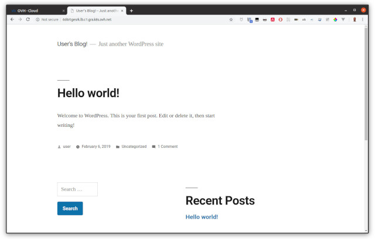
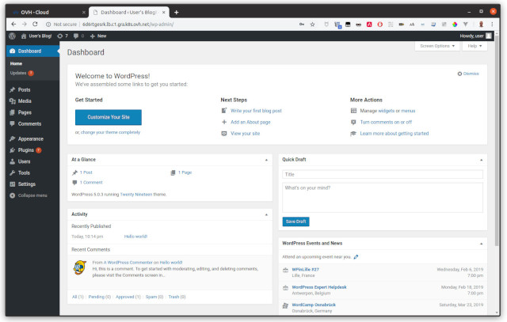

**Last updated 25th February, 2019.**

<style>
 pre {
     font-size: 14px;
 }
 pre.console {
   background-color: #300A24; 
   color: #ccc;
   font-family: monospace;
   padding: 5px;
   margin-bottom: 5px;
 }
 pre.console code {
   border: solid 0px transparent;
   font-family: monospace !important;
 }
 .small {
     font-size: 0.75em;
 }
</style>

In this tutorial we are going to guide you with the install of [Wordpress](https://wordpress.org/) on your OVH Managed Kubernetes Service.

## Before you begin

This tutorial presupposes that you already have a working OVH Managed Kubernetes cluster, and some basic knowledge of how to operate it. If you want to know more on those topics, please look at the [OVH Managed Kubernetes Service Quickstart](../deploying-hello-world/).

You also need to have [Helm](https://docs.helm.sh/) installer on your workstation and your cluster, please refer to the [How to install Helm on OVH Managed Kubernetes Service](../installing-helm/) tutorial.


## Installing the Wordpress Helm chart

For this tutorial we are using the [Wordpress Helm chart](https://github.com/helm/charts/tree/master/stable/wordpress) found on Helm repositories.
The chart is fully configurable, but here we are using the default configuration, with only the minimal set of customization to make it work well on OVH Managed Kubernetes Service.


> [!primary]
> ### Customizing your install
> 
> Maybe you would like your username to be different, or be able to set your password, or choose an external database instead of deploying the MariaDB container... 
>
> In order to customize your install, without having to leave the simplicity of using helm and the Wordpress helm chart, you can simply set some of the [configurable parameters of the WordPress chart](https://github.com/helm/charts/tree/master/stable/wordpress#configuration). Then you can add it to your `helm install` with the `--set` option (`--set param1=value1,param2=value2`)
>

```
helm install stable/wordpress --set allowOverrideNone=yes -n my-first-k8s-wordpress
```

This will install the needed elements (a MariaDB pod for the database, a Wordpress pod for the webserver with the Worpdress PHP code),
allocate the persistent volumes and initialize the services. And at the end, it will give you the connection parameters for your new Wordpress:


<pre class="console"><code>$ helm install stable/wordpress --set allowOverrideNone=yes -n my-first-k8s-wordpress
NAME:   my-first-k8s-wordpress
LAST DEPLOYED: Wed Feb  6 22:36:51 2019
NAMESPACE: default
STATUS: DEPLOYED

RESOURCES:
==> v1beta1/StatefulSet
NAME                            DESIRED  CURRENT  AGE
my-first-k8s-wordpress-mariadb  1        1        2s

==> v1/Pod(related)
NAME                                               READY  STATUS             RESTARTS  AGE
my-first-k8s-wordpress-wordpress-54947f46cb-j8mjg  0/1    ContainerCreating  0         1s
my-first-k8s-wordpress-mariadb-0                   0/1    Pending            0         1s

==> v1/Secret
NAME                              TYPE    DATA  AGE
my-first-k8s-wordpress-mariadb    Opaque  2     2s
my-first-k8s-wordpress-wordpress  Opaque  1     2s

==> v1/ConfigMap
NAME                                  DATA  AGE
my-first-k8s-wordpress-mariadb        1     2s
my-first-k8s-wordpress-mariadb-tests  1     2s

==> v1/PersistentVolumeClaim
NAME                              STATUS  VOLUME                                    CAPACITY  ACCESS MODES  STORAGECLASS       AGE
my-first-k8s-wordpress-wordpress  Bound   pvc-50c18704-2a57-11e9-b318-563f8efe6191  10Gi      RWO           cinder-high-speed  2s

==> v1/Service
NAME                              TYPE          CLUSTER-IP   EXTERNAL-IP  PORT(S)                     AGE
my-first-k8s-wordpress-mariadb    ClusterIP     10.3.203.13  &lt;none>       3306/TCP                    2s
my-first-k8s-wordpress-wordpress  LoadBalancer  10.3.1.135   &lt;pending>    80:30268/TCP,443:30267/TCP  2s

==> v1beta1/Deployment
NAME                              DESIRED  CURRENT  UP-TO-DATE  AVAILABLE  AGE
my-first-k8s-wordpress-wordpress  1        1        1           0          2s
</code></pre>

Then it will show you basic information of how to connect to your new Wordpress:

<pre class="console"><code>NOTES:
1. Get the WordPress URL:

  NOTE: It may take a few minutes for the LoadBalancer IP to be available.
        Watch the status with: 'kubectl get svc --namespace default -w my-first-k8s-wordpress-wordpress'
  export SERVICE_IP=$(kubectl get svc --namespace default my-first-k8s-wordpress-wordpress --template "{{ range (index .status.loadBalancer.ingress 0) }}{{.}}{{ end }}")
  echo "WordPress URL: http://$SERVICE_IP/"
  echo "WordPress Admin URL: http://$SERVICE_IP/admin"

2. Login with the following credentials to see your blog

  echo Username: user
  echo Password: $(kubectl get secret --namespace default my-first-k8s-wordpress-wordpress -o jsonpath="{.data.wordpress-password}" | base64 --decode)
</code></pre>

As the instructions say, you will need to wait a few moments to get the `LoadBalancer` URL. 
You can test if the `LoadBalancer` is ready using:

```
kubectl get svc --namespace default -w my-first-k8s-wordpress-wordpress
```


After some minutes, you will the `LoadBalancer` URL:


<pre class="console"><code>$ kubectl get svc --namespace default -w my-first-k8s-wordpress-wordpress
NAME                               TYPE           CLUSTER-IP   EXTERNAL-IP   PORT(S)                      AGE
my-first-k8s-wordpress-wordpress   LoadBalancer   10.3.1.135   &lt;pending>     80:30268/TCP,443:30267/TCP   2m53s
my-first-k8s-wordpress-wordpress   LoadBalancer   10.3.1.135   XXXXXXX.lb...   80:30268/TCP,443:30267/TCP   3m31s
</code></pre>

Then you can follow the instructions to get the Admin URL:

<pre class="console"><code>$ export SERVICE_IP=$(kubectl get svc --namespace default my-first-k8s-wordpress-wordpress --template "{{ range (index .status.loadBalancer.ingress 0) }}{{.}}{{ end }}")
$ echo "WordPress URL: http://$SERVICE_IP/"
WordPress URL: http://XXXXXXX.lb.c1.gra.k8s.ovh.net/
$ echo "WordPress Admin URL: http://$SERVICE_IP/admin"
WordPress Admin URL: http://XXXXXXX.lb.c1.gra.k8s.ovh.net/admin
</code></pre>

And putting the URL in your browser will take you to the new blog:

{.thumbnail}

You also use the instructions given by the helm install to get the default username and password for your blog.

In my case:

<pre class="console"><code>$ echo Username: user
Username: user
$ echo Password: $(kubectl get secret --namespace default mollified-lynx-wordpress -o jsonpath="{.data.wordpress-password}" | base64 --decode)
Password: 0pdfhdfhfe5
</code></pre>

{.thumbnail}


You have a working Wordpress on your OVH Managed Kubernetes Service, congratulations!


