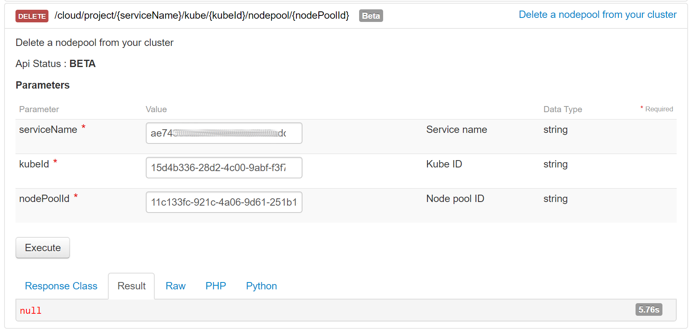

**Last updated 4th August 2022.**

## Objective

OVHcloud Managed Kubernetes service provides you Kubernetes clusters without the hassle of installing or operating them. This guide will cover one of the first steps after ordering a cluster: managing nodes and node pools, using the OVHcloud API.

In this guide, we are assuming you're using the [OVHcloud API](https://api.ovh.com/) to manage your Kubernetes cluster. If you are using a different method, like the [OVHcloud Control Panel](https://www.ovh.com/auth?onsuccess=https%3A%2F%2Fwww.ovh.com%2Fmanager%2Fpublic-cloud&ovhSubsidiary=gb), please refer to the relevant documentation: [Managing nodes and node pools](../managing-nodes/) guide.

## Requirements

- An OVHcloud Managed Kubernetes cluster

## Nodes and node pools

In your OVHcloud Managed Kubernetes cluster, nodes are grouped in node pools (group of nodes sharing the same configuration).

In the cluster creation call, you can specify the specs of a first node pool that will be created with it. Then, you can update this node pool, or add additional node pools of different sizes and types.

Upon creation, a node pool is defined by its name (`name`), the type of instance within our available catalog (`flavorName`), the number of identical nodes that you want in that node pool (`desiredNodes`), and potentially self-defined boundaries to limit the value of desired nodes (`minNodes` and `maxNodes`).

You can also enable the `autoscale` feature, and the `desiredNodes` will be automatically updated at runtime within the `minNodes` and `maxNodes` boundaries, depending on the resource reservations of your workload (see [Using the cluster autoscaler](../using-cluster-autoscaler/)).

Setting the `antiAffinity` boolean ensures that nodes in that node pool will be created on different hypervisors (baremetal machines) and therefore ensure the best availability for your workload. The maximum number of nodes is set to 5 if this feature is activated on a nodepool (you can of course create multiple node pools with each 5 anti-affinity nodes max).

Setting the `template` property will allow you to define some specs (annotations, finalizers, labels, taints, schedulability) that will be applied to each node under this node pool.

Finally `monthlyBilled` boolean ensures that all nodes in a node pool will be spawned in monthly billing mode and therefore benefit from the monthly discount.

After creation, the `desiredNodes`, `minNodes`, `maxNodes`, `autoscale` and `template` properties can also be edited at any time.

In this guide we explain how to do some basic operations with nodes and node pools using the [OVHcloud API](https://api.ovh.com/): adding nodes to an existing node pool, creating a new node pool, etc.

## Upsizing and downsizing a Node Pool

Editing the `desiredNodes` property to a different value will trigger the node pool upsizing or downsizing.

When downsizing, the last created nodes will be drained then deleted in parallel. You can also specify which nodes should be removed by filling the optional `nodesToRemove` property, which can be a list of node names, node IDs or openstack instance IDs.

When upsizing, all new nodes will be created in parallel.

## The API Explorer

To simplify things, we are using the [API Explorer](https://api.ovh.com/console/), which allows to explore, learn and interact with the API in an interactive way.

Log in to the API Explorer using your OVH NIC.

{.thumbnail}

If you go to the [Cloud section](https://api.ovh.com/console/#/cloud) of the API Explorer, you will see the available `/cloud/project/{serviceName}/kube` endpoint.

## List your OVHcloud Managed Kubernetes clusters

The `GET /cloud/project` API endpoint lists all the available Public Cloud Services associated to your OVHcloud account:

{.thumbnail}

Choose the Public Cloud Service corresponding to your OVHcloud Managed Kubernetes. In this example, we will refer to it as `serviceName`

The `GET /cloud/project/{serviceName}/kube` API endpoint lists all the available clusters in your chosen project:

{.thumbnail}

By calling it, you can view a list of your Kubernetes clusters ID. Note down the ID of the cluster you want to use. In this example, we will refer to it as `kubeId`

## Getting your cluster information

The `GET  /cloud/project/{serviceName}/kube/{kubeId}` API endpoint provides important information about your OVHcloud Managed Kubernetes cluster, including its status and URL.

{.thumbnail}

## Listing node pools

The `GET /cloud/project/{serviceName}/kube/{kubeId}/nodepool` API endpoint lists all the available node pools:

{.thumbnail}

## Create a node pool

Use the `POST /cloud/project/{serviceName}/kube/{kubeId}/nodepool` API endpoint to create a new node pool:

You will need to give it a `flavorName` parameter, with the flavor of the instance you want to create. For this tutorial choose a general purpose node, like the `b2-7` flavor.

If you want your node pool to have at least one node, set the `desiredNodes` to a value above 0.

The API will return you the new node pool information.

## Get information on a node pool

Use the `GET  /cloud/project/{serviceName}/kube/{kubeId}/nodepool/{nodePoolId}` API endpoint to get information on a specific node pool:

## Updating the node pool

To upsize or downsize your node pool, you can use the `PUT /cloud/project/{serviceName}/kube/{kubeId}/nodepool/{nodePoolId}` API endpoint, and set the `desiredNodes` to the new pool size. You can also modify some other properties:

## Deleting a node pool

To delete a node pool, use the `/DELETE /cloud/project/{serviceName}/kube/{kubeId}/nodepool/{nodePoolId}` API endpoint:

## Go further

To have an overview of OVHcloud Managed Kubernetes service, you can go to the [OVHcloud Managed Kubernetes page](https://www.ovh.com/public-cloud/kubernetes/).

Otherwise to skip it and push to deploy your first application on your Kubernetes cluster, we invite you to follow our guide to [configuring default settings for `kubectl`](../configuring-kubectl/) and [deploying an application](../deploying-an-application/) .

Join our [community of users](https://community.ovh.com/en/).
