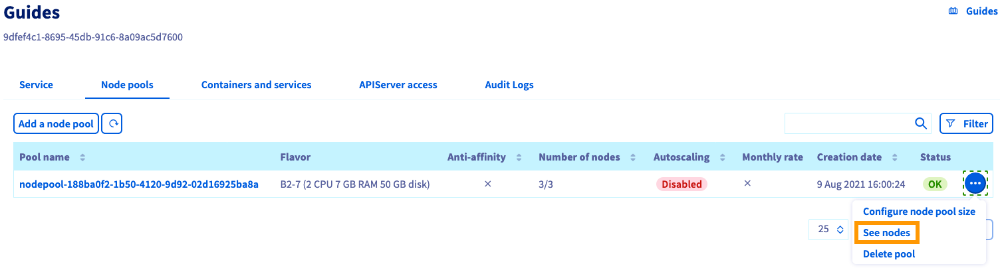

**Last updated 12th October 2022**

## Objective

OVHcloud Managed Kubernetes service provides you Kubernetes clusters without the hassle of installing or operating them. This guide will cover one of the first steps after ordering a cluster: managing nodes and node pools.

## Requirements

- An OVHcloud Managed Kubernetes cluster

## Nodes and node pools

In your OVHcloud Managed Kubernetes cluster, nodes are grouped in node pools (group of nodes sharing the same configuration).

When you order a new cluster, it is created with a default node pool. Refer to our guide on [creating a cluster](../creating-a-cluster/) for more information.

In this guide we explain how to do some basic operations with nodes and node pools using the Public Cloud section of the [OVHcloud Control Panel](https://www.ovh.com/auth?onsuccess=https%3A%2F%2Fwww.ovh.com%2Fmanager%2Fpublic-cloud&ovhSubsidiary=gb).

## Instructions

Access our administration UI for your OVHcloud Managed Kubernetes clusters by clicking on `Managed Kubernetes Service`{.action} in the left-hand menu in the Public Cloud section of the [OVHcloud Control Panel](https://www.ovh.com/auth?onsuccess=https%3A%2F%2Fwww.ovh.com%2Fmanager%2Fpublic-cloud&ovhSubsidiary=gb). In the table, select a cluster by clicking on the cluster name.

{.thumbnail}

In this administration UI you have several tabs:

- **Service**: Here you will have a global view of your cluster, with important information like the status, the API URL or the `kubectl` configuration file.

- **Node pools**: You will find here the active node pools of your cluster. You will be able to add, resize or remove node pools.

- **APIServer access**: You can add IPv4 ranges in order to restrict access to your cluster’s APIServer.

- **Audit Logs**: Here, you will find the logs for your Kubernetes cluster’s control-plane.

### Configuring a node pool

To access the nodes configuration, switch to the *Node pools* tab. Click on the `...`{.action} button in the row of the node pool concerned, then select `See nodes`{.action}.

{.thumbnail}

Here you can change the billing method for a node or delete a node by clicking on the respective `...`{.action} button of a node.

{.thumbnail}

### Adding nodes to an existing node pool

In the *Node pools* tab, click on the `...`{.action} button in the row of the node pool concerned, then select `Configure node pool size`{.action}.

{.thumbnail}

In the popup window, you can re-size your node pool by adding nodes. You can alternatively enable the autoscaling feature which allows you to set the minimum and maximum pool size instead.

{.thumbnail}

### Creating additional node pools

In the *Node pools* tab, click on the button `Add a node pool`{.action}.

{.thumbnail}

Fill the fields to create a new node pool.

> [!warning]
> The **name of node pool** should be in lowercase. The “_” and “.” characters are not allowed. The node pool name cannot begin with a number.

The subsequent node pool configuration steps are described in [Creating a cluster](../creating-a-cluster/).

> [!primary]
> To learn more about the flavors of the current OVHcloud range, [refer to this page](https://www.ovhcloud.com/pt/public-cloud/prices/).

### Deleting a node pool

In the *Node pools* tab, click on the `...`{.action} button in the row of the node pool concerned, then select `Delete pool`{.action}.

{.thumbnail}

Confirm the decision by typing `DELETE` into the field, then click on the `Delete`{.action} button.

{.thumbnail}

## Go further

To have an overview of OVHcloud Managed Kubernetes service, you can go to the [OVHcloud Managed Kubernetes page](https://www.ovhcloud.com/pt/public-cloud/kubernetes/).

To deploy your first application on your Kubernetes cluster, we invite you to follow our guide to [configuring default settings for `kubectl`](../configuring-kubectl/) and [deploying a Hello World application](../deploying-hello-world/) .

Join our community of users on <https://community.ovh.com/en/>.
