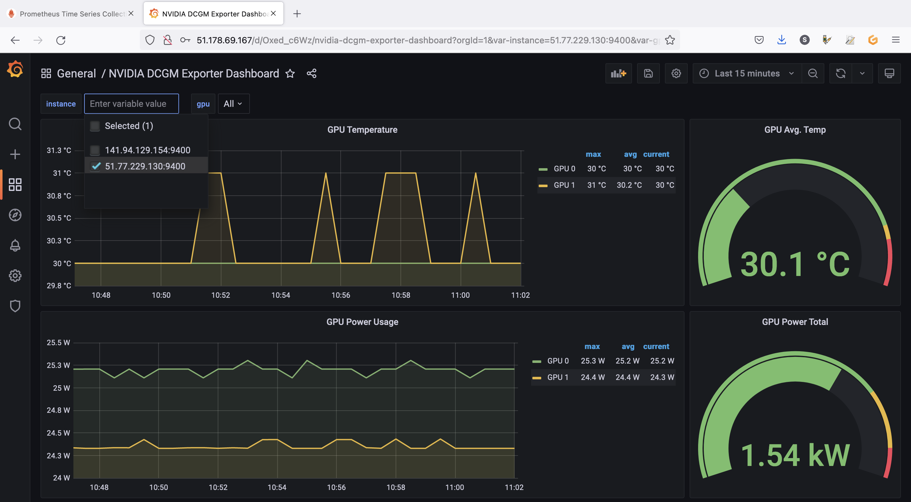
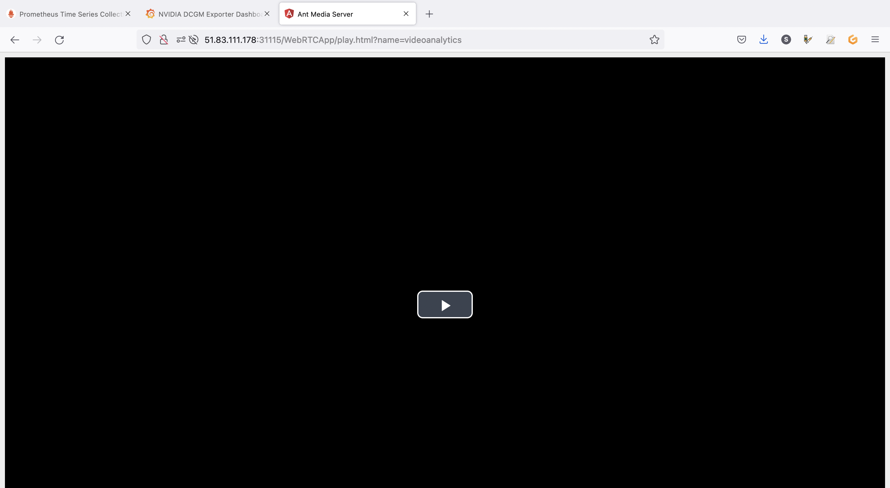
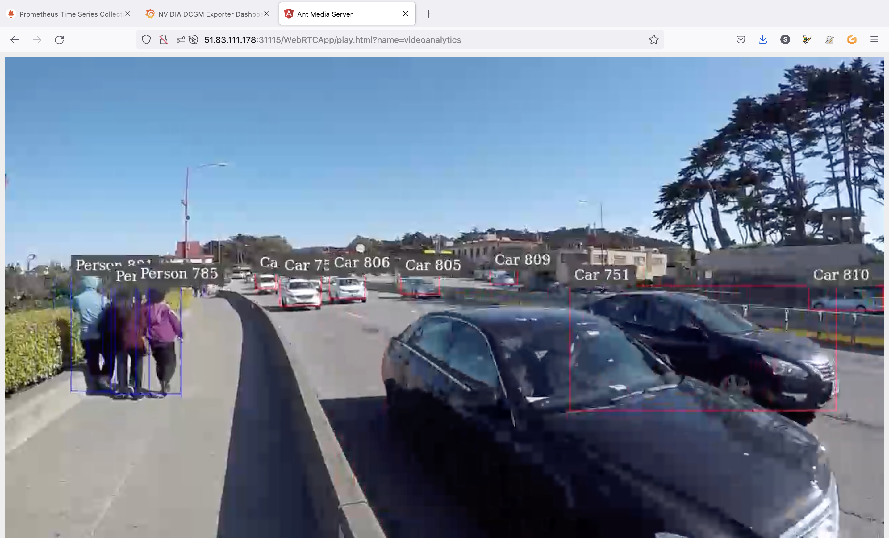
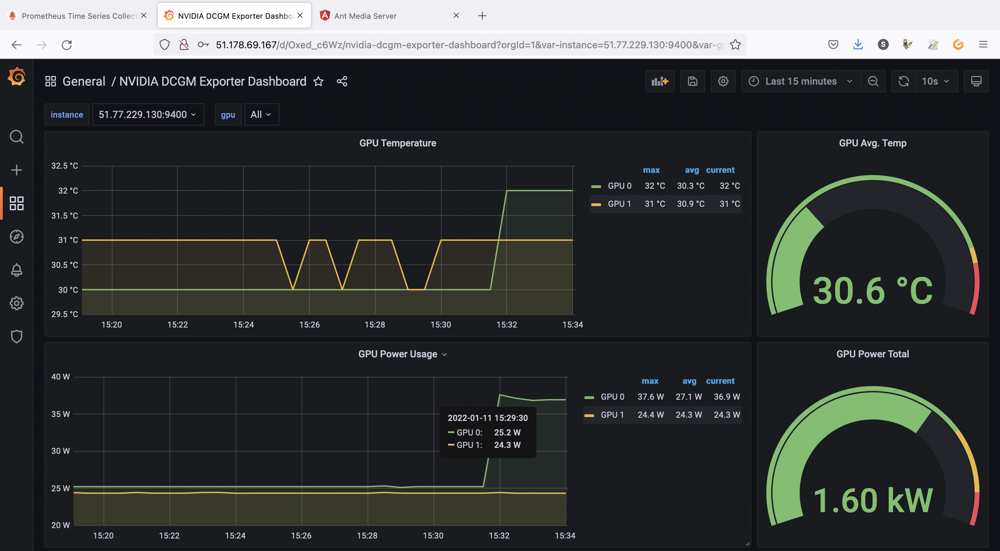

<style>
 pre {
     font-size: 14px;
 }
 pre.console {
   background-color: #300A24;
   color: #ccc;
   font-family: monospace;
   padding: 5px;
   margin-bottom: 5px;
 }
 pre.console code {
   border: solid 0px transparent;
   font-family: monospace !important;
   font-size: 0.75em;
   color: #ccc;
 }
 .small {
     font-size: 0.75em;
 }
</style>

**Last updated January 13, 2021.**

## Objective

In this tutorial we will show you how to monitor a GPU application on an OVHcloud Managed Kubernetes cluster.

{.thumbnail}

GPUs provide compute power to drive AI/ML & Deep Learning tasks with intensive calculations such as image/object recognition, natural language processing (NLP), as well as other compute-intensive tasks such as video transcoding and image processing. Using GPUs with Kubernetes allows you to extend the scalability of Kubernetes to AI/ML applications.
It is however always important to keep the costs of GPU in mind. If each application uses a dedicated GPU in model prediction scenarios, computing resources can be wasted. It is therefore important to monitor GPU usage in order to be responsive and to be able to make the right decisions and optimize usage.

## Before you begin

This tutorial presupposes that you already have a working OVHcloud Managed Kubernetes cluster, and some basic knowledge of how to operate it. If you want to know more on those topics, please look at the [OVHcloud Managed Kubernetes Service Quickstart](../deploying-hello-world/).

You also need to have [Helm](https://docs.helm.sh/){.external} installed on your workstation and your cluster, please refer to the [How to install Helm on OVHcloud Managed Kubernetes Service](../installing-helm/) tutorial.

And you also need to follow [Deploying a GPU application on OVHcloud Managed Kubernetes](../deploying-gpu-application) tutorial to install NVIDIA GPU operator and configure your cluster correctly with needed components for this guide.

## Instructions

In this guide you will:

- install Prometheus operator (it will install [Prometheus](https://prometheus.io/){.external} & [Grafana](https://grafana.com/){.external})
- use [NVIDIA’s Data Center GPU Manager (DCGM)](https://developer.nvidia.com/dcgm){.external} to expose GPU metrics for Prometheus
- deploy an application to demonstrate GPU accelerated Inference and generate traffic
- visualize metrics

### DCGM & DCGM Exporter

NVIDIA Data Center GPU Manager (DCGM) is a set of tools for managing and monitoring NVIDIA GPUs in cluster environments. It's a low overhead tool suite that performs a variety of functions on each host system including active health monitoring, diagnostics, system validation, policies, power and clock management, group configuration and accounting.

To gather GPU telemetry in Kubernetes, the NVIDIA GPU Operator deploys the `dcgm-exporter`, based on DCGM exposes GPU metrics for `Prometheus` and can be visualized using `Grafana`. 
`dcgm-exporter` is architected to take advantage of `KubeletPodResources API` and exposes GPU metrics in a format that can be scraped by `Prometheus`.

As you have already followed the [Deploying a GPU application on OVHcloud Managed Kubernetes](../deploying-gpu-application) tutorial, you should already have `dcgm-exporter` running in your cluster.

<pre class="console"><code>$ kubectl get pod -n gpu-operator -l app=nvidia-dcgm-exporter
NAME                         READY   STATUS    RESTARTS   AGE
nvidia-dcgm-exporter-2rs2t   1/1     Running   0          18d
nvidia-dcgm-exporter-rcq6t   1/1     Running   0          18d
</code></pre>

### Prometheus operator

The [Prometheus Operator](https://github.com/prometheus-operator/prometheus-operator){.external} provides Kubernetes native deployment and management of Prometheus and related monitoring components.

{.thumbnail}

The purpose of this project is to simplify and automate the configuration of a Prometheus based monitoring stack for Kubernetes clusters. The Prometheus operator also deploys a Grafana dashboard, to visualize our metrics in a user-friendly way.

If you are interested about the operator, feel free to read the [Prometheus operator official documentation](https://github.com/prometheus-operator/prometheus-operator){.external}.

### Installing the Prometheus operator

For this tutorial we are using the [Prometheus Operator Helm chart](https://github.com/prometheus-community/helm-charts/tree/main/charts/kube-prometheus-stack){.external} found on [Prometheus Community repository](https://github.com/prometheus-community){.external}.

Add the Prometheus Helm repository:

```bash
helm repo add prometheus-community https://prometheus-community.github.io/helm-charts
helm repo update
```

This will add the Prometheus repository and update all of your repositories: 

<pre class="console"><code>$ helm repo add prometheus-community https://prometheus-community.github.io/helm-charts
"prometheus-community" has been added to your repositories

$ helm repo update
Hang tight while we grab the latest from your chart repositories...
...
...Successfully got an update from the "prometheus-community" chart repository
...
Update Complete. ⎈Happy Helming!⎈
</code></pre>

You need to modify some settings. To do this, you will inspect the chart to retrieve these values ​​in a file:

```bash
helm inspect values prometheus-community/kube-prometheus-stack > /tmp/kube-prometheus-stack.values
```

Open the `/tmp/kube-prometheus-stack.values` file in your favorite editor.

Then, into it, search for `additionalScrapeConfigs` (the value should be empty `[]` by default). You will add a `ConfigMap` to this section.

Before:
```yaml
    additionalScrapeConfigs: []
```

After:
```yaml
    additionalScrapeConfigs:
    - job_name: gpu-metrics
      scrape_interval: 1s
      metrics_path: /metrics
      scheme: http
      kubernetes_sd_configs:
      - role: endpoints
        namespaces:
          names:
          - gpu-operator
      relabel_configs:
      - source_labels: [__meta_kubernetes_pod_node_name]
        action: replace
        target_label: kubernetes_node
```

Don't close this file before retrieving or modifying `adminPassword` key.

By default, Grafana password should be like this:

```yaml
  adminPassword: prom-operator
```

Please, copy the Grafana admin password, you will use it later in this tutorial.

You are now ready to install Prometheus and Grafana.

```bash
helm install prometheus-community/kube-prometheus-stack \
--create-namespace --namespace prometheus \
--generate-name \
--values /tmp/kube-prometheus-stack.values \
--set prometheus.service.type=LoadBalancer \
--set prometheus.prometheusSpec.serviceMonitorSelectorNilUsesHelmValues=false \
--set grafana.service.type=LoadBalancer
```

As you can see, a new `prometheus` namespace will be created and we specified that we want to deploy a LoadBalancer in order to access externally to Prometheus and Grafana easily.

You should have a behavior like this:

<pre class="console"><code>$ helm install prometheus-community/kube-prometheus-stack \
--create-namespace --namespace prometheus \
--generate-name \
--values /tmp/kube-prometheus-stack.values \
--set prometheus.service.type=LoadBalancer \
--set prometheus.prometheusSpec.serviceMonitorSelectorNilUsesHelmValues=false \
--set grafana.service.type=LoadBalancer
NAME: kube-prometheus-stack-1641827066
LAST DEPLOYED: Mon Jan 10 16:04:32 2022
NAMESPACE: prometheus
STATUS: deployed
REVISION: 1
NOTES:
kube-prometheus-stack has been installed. Check its status by running:
  kubectl --namespace prometheus get pods -l "release=kube-prometheus-stack-1641827066"

Visit https://github.com/prometheus-operator/kube-prometheus for instructions on how to create & configure Alertmanager and Prometheus instances using the Operator.
</code></pre>

You can also verify by checking the Pods in the new `prometheus` namespace:

<pre class="console"><code>$ kubectl get pods -n prometheus
NAME                                                              READY   STATUS    RESTARTS   AGE
alertmanager-kube-prometheus-stack-1641-alertmanager-0            2/2     Running   0          5m46s
kube-prometheus-stack-1641-operator-95b87c9cc-rvdmr               1/1     Running   0          5m49s
kube-prometheus-stack-1641827066-grafana-8686b97b9d-67g92         3/3     Running   0          5m49s
kube-prometheus-stack-1641827066-kube-state-metrics-78b54fbvbn4   1/1     Running   0          5m49s
kube-prometheus-stack-1641827066-prometheus-node-exporter-5jlpp   1/1     Running   0          5m49s
kube-prometheus-stack-1641827066-prometheus-node-exporter-qhmvw   1/1     Running   0          5m49s
kube-prometheus-stack-1641827066-prometheus-node-exporter-xtc2g   1/1     Running   0          5m49s
prometheus-kube-prometheus-stack-1641-prometheus-0                2/2     Running   0          5m46s
</code></pre>

And you can check that `Prometheus` and `Grafana` have an external IP:

<pre class="console"><code>$ kubectl get svc -n prometheus
NAME                                                        TYPE           CLUSTER-IP     EXTERNAL-IP       PORT(S)                      AGE
alertmanager-operated                                       ClusterIP      None           <none>            9093/TCP,9094/TCP,9094/UDP   6m22s
kube-prometheus-stack-1641-alertmanager                     ClusterIP      10.3.102.144   <none>            9093/TCP                     6m25s
kube-prometheus-stack-1641-operator                         ClusterIP      10.3.54.22     <none>            443/TCP                      6m26s
kube-prometheus-stack-1641-prometheus                       LoadBalancer   10.3.71.71     152.228.168.191   9090:31518/TCP               6m26s
kube-prometheus-stack-1641827066-grafana                    LoadBalancer   10.3.79.246    51.178.69.167     80:31923/TCP                 6m25s
kube-prometheus-stack-1641827066-kube-state-metrics         ClusterIP      10.3.154.226   <none>            8080/TCP                     6m25s
kube-prometheus-stack-1641827066-prometheus-node-exporter   ClusterIP      10.3.215.121   <none>            9100/TCP                     6m26s
prometheus-operated                                         ClusterIP      None           <none>            9090/TCP                     6m22s
</code></pre>

If it's not the case, please wait until the Load Balancers are correctly created.

### Visualize the metrics

Now you can retrieve Prometheus and Grafana URL thanks to the following commands:

```bash
export PROMETHEUS_URL=$(kubectl get svc kube-prometheus-stack-1641-prometheus -n prometheus -o jsonpath='{.status.loadBalancer.ingress[0].ip}')

echo Prometheus URL: http://$PROMETHEUS_URL:9090

export GRAFANA_URL=$(kubectl get svc kube-prometheus-stack-1641827066-grafana -n prometheus -o jsonpath='{.status.loadBalancer.ingress[0].ip}')

echo Grafana URL: http://$GRAFANA_URL
```

You should obtain the following result:

<pre class="console"><code>$ export PROMETHEUS_URL=$(kubectl get svc kube-prometheus-stack-1641-prometheus -n prometheus -o jsonpath='{.status.loadBalancer.ingress[0].ip}')

$ echo Prometheus URL: http://$PROMETHEUS_URL:9090
Prometheus URL: http://152.228.168.191:9090

$ export GRAFANA_URL=$(kubectl get svc kube-prometheus-stack-1641827066-grafana -n prometheus -o jsonpath='{.status.loadBalancer.ingress[0].ip}')

$ echo Grafana URL: http://$GRAFANA_URL
Grafana URL: http://51.178.69.167
</code></pre>

Open your browser and go to the Prometheus interface.

As you already deployed DCGM with NVIDIA GPU Operator, DCGM should already have started publishing metrics to Prometheus. The metrics availability can be verified by typing `DCGM_FI_DEV_GPU_UTIL` in the search bar. Click on the `Execute`{.action} button to determine if the GPU metrics are visible:

{.thumbnail}

You can check the GPU usage with several metrics in Prometheus:

- `DCGM_FI_DEV_GPU_UTIL`: GPU utilization.
- `DCGM_FI_DEV_SM_CLOCK`: SM clock frequency (in MHz).
- `DCGM_FI_DEV_MEM_CLOCK`: Memory clock frequency (in MHz).
- `DCGM_FI_DEV_MEMORY_TEMP`: Memory temperature (in C).

You can find the full list of metrics exported by DCGM-exporter in the [NVIDIA website](https://docs.nvidia.com/datacenter/dcgm/1.6/dcgm-api/group__dcgmFieldIdentifiers.html){.external}.

You can also go to the Grafana interface. Open your browser and point to `http://$GRAFANA_URL` value using the credentials bellow:

- Login: `admin`
- Password: `prom-operator` (by default)

{.thumbnail}

{.thumbnail}

### DCGM Dashboard in Grafana

You have a running Prometheus and Grafana, now you need to add a dashboard for `DCGM`.
To do that, you can use a standard dashboard that NVIDIA released, which can also be customized.

To add the dashboard, in the Grafana sidebar, click on `+`{.action} -> `Import`{.action}:

{.thumbnail}

Import the NVIDIA dashboard from https://grafana.com/grafana/dashboards/12239, click on the `Load`{.action} button:

{.thumbnail}

Then choose `Prometheus`{.action} as the data source in the drop down menu and click on the `Import`{.action} button:

{.thumbnail}

You should now see your new dashboard:

{.thumbnail}

If you followed the [Deploying a GPU application on OVHcloud Managed Kubernetes](../deploying-gpu-application) tutorial, you should see metrics like in our example.

You can click on the `instance`{.action} drop down menu in order to visualize GPU metrics for another Node for example:

{.thumbnail}

### Visualize metrics for running applications

Now we have a monitoring working stack and a dashboard to visualize our data, it's time to run an application in order to retrieve GPU metrics and viualize interesting data.

As a complex and interesting application using GPU, you can use the standard [DeepStream Intelligent Video Analytics Demo](https://catalog.ngc.nvidia.com/orgs/nvidia/helm-charts/video-analytics-demo){.external} available on the [NVIDIA NGC registry](https://catalog.ngc.nvidia.com/){.external}. 

This is an easy to deploy video analytics demo that allows you to demo GPU accelerated video analytics. The container is based on the NVIDIA DeepStream container and leverages its built-in SEnet with resnet18 backend.

The `Intelligent Video Analytics` demo:

- is an easy to use demo to demonstrate GPU accelerated Inference
- is based on the `NGC Deepstream Container`
- leverages `Kubernetes`, `Helm`, `NGC` & `DeepStream`
- does not require a `Video Management System (VMS)`

You can deploy the application through NVIDIA Helm chart:

```bash
helm fetch https://helm.ngc.nvidia.com/nvidia/charts/video-analytics-demo-0.1.4.tgz && \
helm install video-analytics-demo-0.1.4.tgz --generate-name
```

You should have a result like this:

<pre class="console"><code>$ helm fetch https://helm.ngc.nvidia.com/nvidia/charts/video-analytics-demo-0.1.4.tgz && \
helm install video-analytics-demo-0.1.4.tgz --generate-name
NAME: video-analytics-demo-0-1641911286
LAST DEPLOYED: Tue Jan 11 15:28:09 2022
NAMESPACE: default
STATUS: deployed
REVISION: 1
NOTES:
1. Get the RTSP URL by running these commands:
  export NODE_PORT=$(kubectl get --namespace default -o jsonpath="{.spec.ports[0].nodePort}" services video-analytics-demo-0-1641911286)
  export NODE_IP=$(kubectl get nodes --namespace default -o jsonpath="{.items[0].status.addresses[0].address}")
  echo rtsp://$NODE_IP:$NODE_PORT/ds-test

2.Get the WebUI URL by running these commands:
  export ANT_NODE_PORT=$(kubectl get --namespace default -o jsonpath="{.spec.ports[0].nodePort}" services video-analytics-demo-0-1641911286-webui)
  export NODE_IP=$(kubectl get nodes --namespace default -o jsonpath="{.items[0].status.addresses[0].address}")
  echo http://$NODE_IP:$ANT_NODE_PORT/WebRTCApp/play.html?name=videoanalytics
  Disclaimer:
  Note: Due to the output from DeepStream being real-time via RTSP, you may experience occasional hiccups in the video stream depending on network conditions.
</code></pre>

You can check if the application is running correctly:

<pre class="console"><code>$ kubectl get pod -n default
NAME                                                       READY   STATUS      RESTARTS   AGE
cuda-vectoradd                                             0/1     Completed   0          18d
dcgmproftester                                             0/1     Completed   0          18d
gpu-demo                                                   1/1     Running     0          18d
video-analytics-demo-0-1641911286-6dd579cd6-8rsl6          1/1     Running     0          2m49s
video-analytics-demo-0-1641911286-webui-7fb477cbbf-jcz9p   1/1     Running     0          2m49s
</code></pre>

`video-analytics-demo-*` and `video-analytics-demo-*-webui-*` Pods are running.

The demo can be viewed in the browser by pointing to the address given in the following instructions:

```bash
export ANT_NODE_PORT=$(kubectl get --namespace default -o jsonpath="{.spec.ports[0].nodePort}" services video-analytics-demo-0-1641911286-webui)

export NODE_IP=$(kubectl get nodes --namespace default -o jsonpath="{.items[0].status.addresses[0].address}")

echo Demo URL: http://$NODE_IP:$ANT_NODE_PORT/WebRTCApp/play.html\?name\=videoanalytics
```

Result:

<pre class="console"><code>$ export ANT_NODE_PORT=$(kubectl get --namespace default -o jsonpath="{.spec.ports[0].nodePort}" services video-analytics-demo-0-1641911286-webui)

$ export NODE_IP=$(kubectl get nodes --namespace default -o jsonpath="{.items[0].status.addresses[0].address}")

$ echo Demo URL: http://$NODE_IP:$ANT_NODE_PORT/WebRTCApp/play.html\?name\=videoanalytics\~
Video Demo: http://51.83.111.178:31115/WebRTCApp/play.html?name=videoanalytics~
</code></pre>

Open the application URL in your browser:

{.thumbnail}

Click on the `play`{.action} button (the button with a triangle) to start the application:

{.thumbnail}

As you can see, the application, that can be used for smart cities use cases, uses the power of GPU in order to detect objects like persons and cars.

Now you can check the metrics in Grafana and watch the evolution of the charts:

{.thumbnail}
{.thumbnail}
{.thumbnail}

The screenshots are showing GPU utilization and memory allocation on the GPU as long as the application is running.

You can close the application when you finish the tests in order to stop GPU consumption.

## Cleanup

First, execute `helm list` command in every namespaces (with `-A` option) in your Kubernetes cluster to see what you've installed.

<pre class="console"><code>$ helm list -A
NAME                             	NAMESPACE   	REVISION	UPDATED                             	STATUS  	CHART                       	APP VERSION
gpu-operator                     	gpu-operator	1       	2021-12-24 10:05:29.050692 +0100 CET	deployed	gpu-operator-v1.9.0         	v1.9.0
kube-prometheus-stack-1641827066 	prometheus  	1       	2022-01-10 16:04:32.150408 +0100 CET	deployed	kube-prometheus-stack-30.0.0	0.53.1
video-analytics-demo-0-1641911286	default     	1       	2022-01-11 15:28:09.463775 +0100 CET	deployed	video-analytics-demo-0.1.4  	1.2
</code></pre>

Now, you can delete what you've installed in this tutorial, thanks to `helm uninstall` commands:

```bash
helm uninstall kube-prometheus-stack-1641827066 -n prometheus

helm uninstall video-analytics-demo-0-1641911286 -n default
```

You should have a behavior like this:

<pre class="console"><code>$ helm uninstall kube-prometheus-stack-1641827066 -n prometheus
release "kube-prometheus-stack-1641827066" uninstalled

$ helm uninstall video-analytics-demo-0-1641911286 -n default
release "video-analytics-demo-0-1641911286" uninstalled
</code></pre>

## Go further

Prometheus and Grafana are very powerful monitoring tools, but also have alerting systems. Don't hesitate to dig in order to create alerts for example.

To learn more about using your Kubernetes cluster the practical way, we invite you to look at our [OVHcloud Managed Kubernetes documentation](../).

Join our [community of users](https://community.ovh.com/en/).