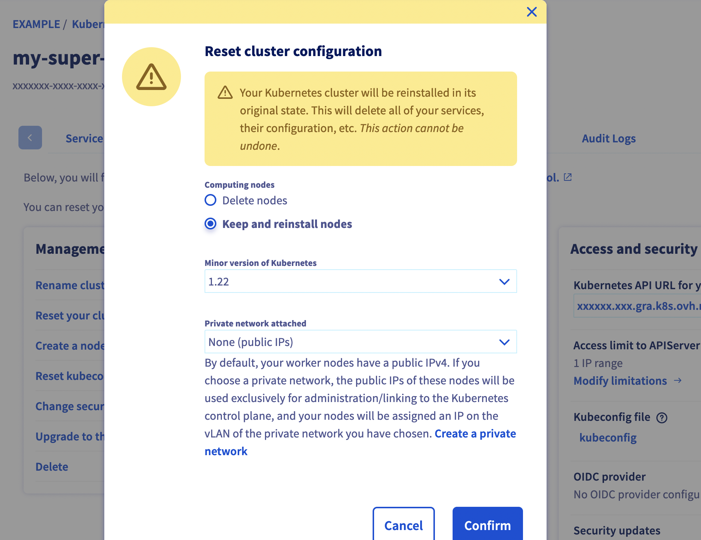

**Last updated July 27th, 2022.**

## Objective

OVHcloud Managed Kubernetes service provides you Kubernetes clusters without the hassle of installing or operating them. 

**Find out how to reset an OVHcloud Managed Kubernetes cluster.**

## Requirements

- an OVHcloud Managed Kubernetes cluster

## Instructions

### Step 1 - Ask for cluster reset on the OVHcloud Control Panel 

Log in to the [OVHcloud Control Panel](https://www.ovh.com/auth/?action=gotomanager&from=https://www.ovh.pl/&ovhSubsidiary=pl), go to the `Public Cloud`{.action} section and select the Public Cloud project concerned.

Access the administration UI for your OVHcloud Managed Kubernetes clusters by clicking on `Managed Kubernetes Service`{.action} in the left-hand menu.

{.thumbnail}

Click on your Kubernetes cluster.

{.thumbnail}

In the *Service* tab of the administration UI, click on *Reset your cluster*.

### Step 2 - Choose the type of reset you want

You have two options on the reset menu, *Delete* and *Reinstall*. 

- Choosing *Delete nodes* means that the current cluster nodes are deleted, and the cluster is reinitialized to an empty state.

- Choosing *Keep and reinstall nodes* means that the cluster is reinitialized without destroying the nodes.

{.thumbnail}

You can also choose the minor version of the cluster and the private network attached.

Click on the `Confirm`{.action} button to continue.

### Step 3 - Wait for the resetting to end 

Depending on the chosen kind of reset, the process can take several minutes. During that time, a message on the manager warns you that the cluster is under resetting:

{.thumbnail}

## Go further

To have an overview of OVHcloud Managed Kubernetes service, you can go to the [OVHcloud Managed Kubernetes page](https://www.ovhcloud.com/pl/public-cloud/kubernetes/).

Otherwise to skip it and learn more about using your Kubernetes cluster the practical way, we invite you to look at our [tutorials](../).

Join our [community of users](https://community.ovh.com/en/).
