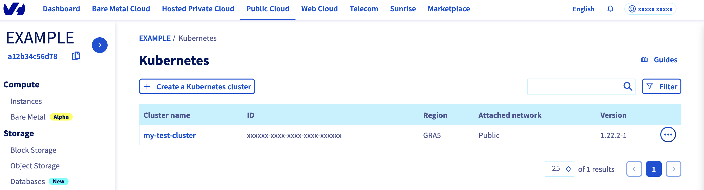
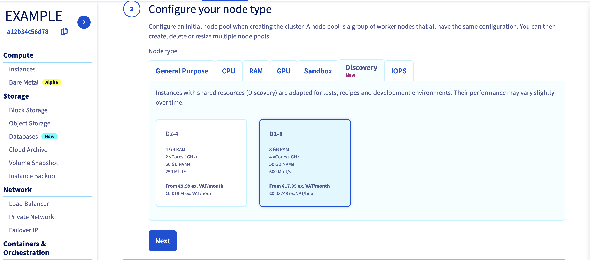
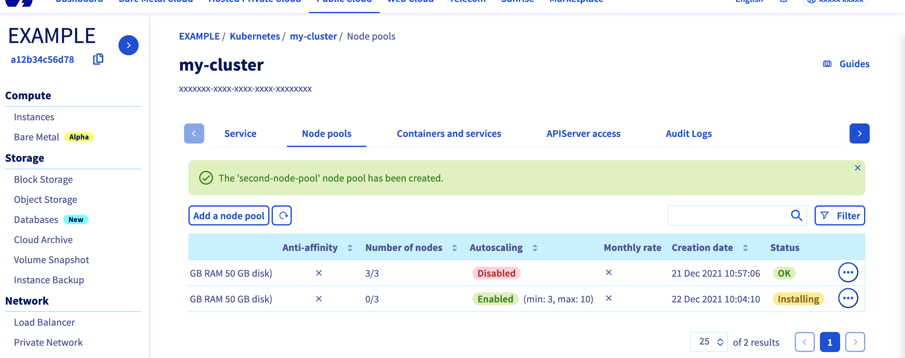
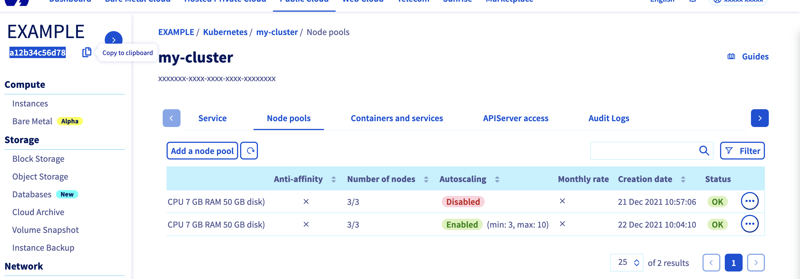
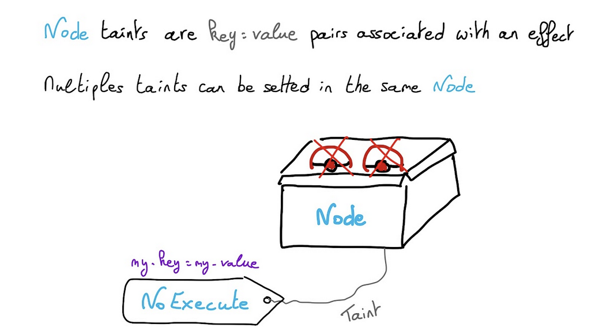

<style>
 pre {
     font-size: 14px;
 }
 pre.console {
   background-color: #300A24;
   color: #ccc;
   font-family: monospace;
   padding: 5px;
   margin-bottom: 5px;
 }
 pre.console code {
   border: solid 0px transparent;
   font-family: monospace !important;
   font-size: 0.75em;
   color: #ccc;
 }
 .small {
     font-size: 0.75em;
 }
</style>

**Last updated 23 December 2021.**

## Objective

We previously showed you how to deploy your applications to specific `Nodes` and `Nodes Pools`, with `labels` and `NodeAffinity` Kubernetes concepts. In this new tutorial we will show you how to do some common operations on `Nodes` and `Nodes Pools` like `taint`, `cordon` and `drain`, on your OVHcloud Managed Kubernetes Service.

Thanks to the Node Pool's labels propagation to Nodes, you will:

- create a Managed Kubernetes cluster
- create a node pool
- create another node pool, with a different configuration and with autoscaling activated
- taint a node
- cordon a node
- drain a node

## Why?

A node is a virtual (VM) or physical machine.

Your applications, your workloads will run on Pods, and Pods are running on Nodes.

But sometimes, Kubernetes scheduler can't deploy a Pod on a Node, for several reasons:

- Node is not ready
- Node is unreachable
- Out of disk
- Network is unavailable
- …

For these use cases, and other ones as well, you can do operations on Nodes. And thanks to the Node Pool's labels propagation to Nodes, you can target only Nodes within a particular Node Pool.

## Requirements

- a [Public Cloud project](https://www.ovhcloud.com/pt/public-cloud/) in your OVHcloud account
- access to the [OVHcloud Control Panel](https://www.ovh.com/auth/?action=gotomanager&from=https://www.ovh.pt/&ovhSubsidiary=pt)

## Instructions

### Cluster creation

Follow the [cluster creation](../label-nodeaffinity-node-pools/#cluster-creation) step by step guide.

### Second node pool creation

Now, your Kubernetes cluster is up and running. You can see it in your OVHcloud Control Panel.

{.thumbnail}

Click on your cluster, then on the `Node pools`{.action} tab.

We will create our second Node pool.
Click on the `Add a node pool`{.action} button.

Then enter a name for your second node pool, `second-node-pool` for example.

{.thumbnail}

Select a flavor for your new node pool, we can choose "D2-8", a different flavor than our other node pool.

{.thumbnail}

In the next step, define the size of your second node pool.
This time, we can enable the `Autoscaling`{.action} feature.
Define the minimum and maximum pool size in that case, 3 in minimum and 10 in maximum, for example.

> [!primary]
> By enabling anti-affinity, current and future nodes will be launched on different hypervisors (physical servers), guaranteeing higher fault tolerance.
> 

{.thumbnail}

Choose `Hourly` billing mode for this second node pool.

{.thumbnail}

The node pool creation is now in progress. It should be available within a few minutes in your OVHcloud Control Panel.

The second node pool will be first in `Installing` status.
Wait until its status changes to `OK`.

{.thumbnail}

{.thumbnail}

### Check everything is correctly configured

To do some operations on your Nodes, through `kubectl` CLI, we invite you to follow our guide to [configuring default settings](../configuring-kubectl/).

When you can access the cluster through `kubectl` command, let's display our node pools:

```bash
$ kubectl get nodepool
NAME                                            FLAVOR   AUTO SCALED   MONTHLY BILLED   ANTI AFFINITY   DESIRED   CURRENT   UP-TO-DATE   AVAILABLE   MIN   MAX   AGE
nodepool-9680a2e9-3e58-48c7-b447-69f5a05c1828   b2-7     false         false            false           3         3         3            3           0     100   2d
second-node-pool                                d2-8     true          false            false           3         3         3            3           3     10    5m19s
```

Our two node pools exist and we can see the different configuration and autoscaling mode.

Let's display our nodes. We should have 3 nodes running in our first node pool and 3 nodes in our "second-node-pool" node pool:

```bash
$ kubectl get nodes
NAME                                         STATUS   ROLES    AGE     VERSION
nodepool-9680a2e9-3e58-48c7-b4-node-874105   Ready    <none>   2d      v1.22.2
nodepool-9680a2e9-3e58-48c7-b4-node-b5c9e2   Ready    <none>   2d      v1.22.2
nodepool-9680a2e9-3e58-48c7-b4-node-c65648   Ready    <none>   2d      v1.22.2
second-node-pool-node-519613                 Ready    <none>   3m30s   v1.22.2
second-node-pool-node-5fda8f                 Ready    <none>   3m28s   v1.22.2
second-node-pool-node-c355db                 Ready    <none>   3m35s   v1.22.2
```

### Cordon a Node

Cordoning a node means making the node unschedulable. This means that this node cannot accommodate any more pods as long as it is marked as `Unschedulable`. 


Instead of cordoning each node manually:

```bash
kubectl cordon my-node
```

You can cordon all the nodes in a node pool. We will show you how to cordon all nodes for `second-node-pool` for example thanks to `label`.

```bash
kubectl cordon -l "nodepool=second-node-pool"
```

In our example, here is the result we got:

<pre class="console"><code>$ kubectl cordon -l "nodepool=second-node-pool"

node/second-node-pool-node-519613 cordoned
node/second-node-pool-node-5fda8f cordoned
node/second-node-pool-node-c355db cordoned

$ kubectl get nodes
NAME                                         STATUS                     ROLES    AGE     VERSION
nodepool-9680a2e9-3e58-48c7-b4-node-874105   Ready                      <none>   2d      v1.22.2
nodepool-9680a2e9-3e58-48c7-b4-node-b5c9e2   Ready                      <none>   2d      v1.22.2
nodepool-9680a2e9-3e58-48c7-b4-node-c65648   Ready                      <none>   2d      v1.22.2
second-node-pool-node-519613                 Ready,SchedulingDisabled   <none>   4m23s   v1.22.2
second-node-pool-node-5fda8f                 Ready,SchedulingDisabled   <none>   4m21s   v1.22.2
second-node-pool-node-c355db                 Ready,SchedulingDisabled   <none>   4m28s   v1.22.2
</code></pre>

All the nodes in `second-node-pool` are now marked as `Unschedulable`.
This means you can't deploy Pods on these nodes, on this node pool.

### UnCordon a Node

You can also undo your action with the`uncordon` command.

```bash
kubectl uncordon -l "nodepool=second-node-pool"
```

In our example:

<pre class="console"><code>$ kubectl uncordon -l "nodepool=second-node-pool"

node/second-node-pool-node-519613 uncordoned
node/second-node-pool-node-5fda8f uncordoned
node/second-node-pool-node-c355db uncordoned

$ kubectl get nodes
NAME                                         STATUS   ROLES    AGE     VERSION
nodepool-9680a2e9-3e58-48c7-b4-node-874105   Ready    <none>   2d      v1.22.2
nodepool-9680a2e9-3e58-48c7-b4-node-b5c9e2   Ready    <none>   2d      v1.22.2
nodepool-9680a2e9-3e58-48c7-b4-node-c65648   Ready    <none>   2d      v1.22.2
second-node-pool-node-519613                 Ready    <none>   4m53s   v1.22.2
second-node-pool-node-5fda8f                 Ready    <none>   4m51s   v1.22.2
second-node-pool-node-c355db                 Ready    <none>   4m58s   v1.22.2
</code></pre>

Nodes are in `Ready` state again.

### Drain a Node

You can use `kubectl drain` command to safely evict all of your pods from a node before you perform maintenance on the node or reduce the number of nodes for example. Safe evictions allow the pod's containers to gracefully terminate and will respect the `PodDisruptionBudgets` you have specified (if relevant).

A `PDB` limits the number pods of a replicated application that are down/terminated simultaneously from voluntary disruptions, allowing for higher availability while permitting the cluster administrator to manage the clusters nodes. If you are interested about this topic, we recommend you to read the Kubernetes official documentation: [Specifying a Disruption Budget for your Application](https://kubernetes.io/docs/tasks/run-application/configure-pdb/).


You can drain all the nodes for `second-node-pool` thanks to `label`.

```bash
kubectl drain -l "nodepool=second-node-pool"
```

In our example:

<pre class="console"><code>$ kubectl drain -l "nodepool=second-node-pool"

node/second-node-pool-node-519613 cordoned
node/second-node-pool-node-5fda8f cordoned
node/second-node-pool-node-c355db cordoned

There are pending nodes to be drained:
 second-node-pool-node-519613
 second-node-pool-node-5fda8f
 second-node-pool-node-c355db
error: cannot delete DaemonSet-managed Pods (use --ignore-daemonsets to ignore): kube-system/canal-kpwzv, kube-system/kube-proxy-7886r, kube-system/wormhole-972p5

$ kubectl get nodes
NAME                                         STATUS                     ROLES    AGE     VERSION
nodepool-9680a2e9-3e58-48c7-b4-node-874105   Ready                      <none>   2d      v1.22.2
nodepool-9680a2e9-3e58-48c7-b4-node-b5c9e2   Ready                      <none>   2d      v1.22.2
nodepool-9680a2e9-3e58-48c7-b4-node-c65648   Ready                      <none>   2d      v1.22.2
second-node-pool-node-519613                 Ready,SchedulingDisabled   <none>   5m37s   v1.22.2
second-node-pool-node-5fda8f                 Ready,SchedulingDisabled   <none>   5m35s   v1.22.2
second-node-pool-node-c355db                 Ready,SchedulingDisabled   <none>   5m42s   v1.22.2
</code></pre>

As you can see, Kubernetes can't remove `DaemonSet` objects, so in order to not have this error message, you can add the `--ignore-daemonsets` option:

```bash
kubectl drain -l "nodepool=second-node-pool" --ignore-daemonsets
```

As shown in the console output, draining a node also cordons it. You can do whatever you want on Nodes as you are sure they do not run any workloads. Do not forget to uncordon the Nodes of the node pool, to allow workloads to be run again:

```bash
kubectl uncordon -l "nodepool=second-node-pool"
```

Nodes are again in `Ready` state.

<pre class="console"><code>$ kubectl uncordon -l "nodepool=second-node-pool"

node/second-node-pool-node-519613 uncordoned
node/second-node-pool-node-5fda8f uncordoned
node/second-node-pool-node-c355db uncordoned

$ kubectl get nodes
NAME                                         STATUS   ROLES    AGE     VERSION
nodepool-9680a2e9-3e58-48c7-b4-node-874105   Ready    <none>   2d      v1.22.2
nodepool-9680a2e9-3e58-48c7-b4-node-b5c9e2   Ready    <none>   2d      v1.22.2
nodepool-9680a2e9-3e58-48c7-b4-node-c65648   Ready    <none>   2d      v1.22.2
second-node-pool-node-519613                 Ready    <none>   6m8s    v1.22.2
second-node-pool-node-5fda8f                 Ready    <none>   6m6s    v1.22.2
second-node-pool-node-c355db                 Ready    <none>   6m13s   v1.22.2
</code></pre>

### Taint a Node

Node taints are `key:value` pairs associated with an effect.
Multiple taints can be setted in the same Node.



* With `NoSchedule` taint, pods that don’t tolerate the taint can’t be scheduled on the node.
* With `PreferNoSchedule` taint, Kubernetes avoid scheduled Pods that don’t tolerate the taint.
* With `NoExecute` taint, Pods are evicted from the Node if they are already running, additionally to not being schedulable.

You can add a taint in all the nodes for `second-node-pool` thanks to `label`.

Pause a node, don’t accept new workloads on it:

```bash
kubectl taint node -l "nodepool=second-node-pool" my-key=my-value:NoSchedule
```

You can display the taints for all nodes:

```bash
kubectl get nodes  -o=jsonpath='{range .items[*]}{.metadata.name}{"\n"}{.spec.taints}{"\n"}{end}'
```

In our example:

<pre class="console"><code>$ kubectl taint node -l "nodepool=second-node-pool" my-key=my-value:NoSchedule

node/second-node-pool-node-519613 tainted
node/second-node-pool-node-5fda8f tainted
node/second-node-pool-node-c355db tainted

$ kubectl get nodes  -o=jsonpath='{range .items[*]}{.metadata.name}{"\n"}{.spec.taints}{"\n"}{end}'
nodepool-9680a2e9-3e58-48c7-b4-node-874105
nodepool-9680a2e9-3e58-48c7-b4-node-b5c9e2
nodepool-9680a2e9-3e58-48c7-b4-node-c65648
second-node-pool-node-519613
[{"effect":"NoSchedule","key":"my-key","value":"my-value"}]
second-node-pool-node-5fda8f
[{"effect":"NoSchedule","key":"my-key","value":"my-value"}]
second-node-pool-node-c355db
[{"effect":"NoSchedule","key":"my-key","value":"my-value"}]
</code></pre>

You can unpause a node:

```bash
kubectl taint node -l "nodepool=second-node-pool" my-key:NoSchedule-
```

In our example:

<pre class="console"><code>$ kubectl taint node -l "nodepool=second-node-pool" my-key:NoSchedule-

node/second-node-pool-node-519613 untainted
node/second-node-pool-node-5fda8f untainted
node/second-node-pool-node-c355db untainted
</code></pre>

### Taint a Node and create a pod only on these tainted Nodes

Another useful feature could be to taint a Node and to deploy an application only on particular nodes. 
For example you can dedicate a set of nodes for exclusive use by a particular set of users or define a subset of nodes with specialized hardware.

In order to do that, you can taint `second-node-pool` nodes with a particular key and value `flavor=d2-8` for example:

```bash
kubectl taint node -l "nodepool=second-node-pool" flavor=d2-8:NoSchedule
```

In our example:

<pre class="console"><code>$ kubectl taint node -l "nodepool=second-node-pool" flavor=d2-8:NoSchedule
node/second-node-pool-node-519613 tainted
node/second-node-pool-node-5fda8f tainted
node/second-node-pool-node-c355db tainted

$ kubectl get nodes  -o=jsonpath='{range .items[*]}{.metadata.name}{"\n"}{.spec.taints}{"\n"}{end}'
nodepool-9680a2e9-3e58-48c7-b4-node-874105
nodepool-9680a2e9-3e58-48c7-b4-node-b5c9e2
nodepool-9680a2e9-3e58-48c7-b4-node-c65648
second-node-pool-node-519613
[{"effect":"NoSchedule","key":"flavor","value":"d2-8"}]
second-node-pool-node-5fda8f
[{"effect":"NoSchedule","key":"flavor","value":"d2-8"}]
second-node-pool-node-c355db
[{"effect":"NoSchedule","key":"flavor","value":"d2-8"}]
</code></pre>

And then you can create a Pod that can be scheduled only on Nodes which have the taint `flavor=d2-8:NoSchedule`.

Create a `my-pod.yaml` YAML manifest file with the following content:

```yaml
apiVersion: v1
kind: Pod
metadata:
  name: my-pod
spec:
  containers:
  - name: hello-world
    image: ovhplatform/hello
    ports:
    - containerPort: 80
  tolerations:
  - key: "flavor"
    value: "d2-8"
    effect: "NoSchedule"
```

Then deploy it:

```bash
kubectl apply -f my-pod.yaml
```

And check your new Pod is running in a `second-node-pool`'s Node:

```bash
kubectl get pod -o wide
```

In our example:

<pre class="console"><code>$ kubectl apply -f my-pod.yaml

pod/my-pod created

$ kubectl get pod -o wide
NAME     READY   STATUS    RESTARTS   AGE   IP         NODE                           NOMINATED NODE   READINESS GATES
my-pod   1/1     Running   0          6s    10.2.7.2   second-node-pool-node-519613   <none>           <none>
</code></pre>

Thanks to the `-o wide` option, you can verify that your Pod is running on `second-node-pool-node-519613` node.

## Where do we go from here?

In this tutorial you saw how to do some operations on Nodes, taint, drain, cordon, uncordon and how to deploy Pods on particular nodes in your OVHcloud Managed Kubernetes cluster.

To learn more about using your Kubernetes cluster the practical way, we invite you to look at our [OVHcloud Managed Kubernetes documentation site](../).

Join our [community of users](https://community.ovh.com/en/).
