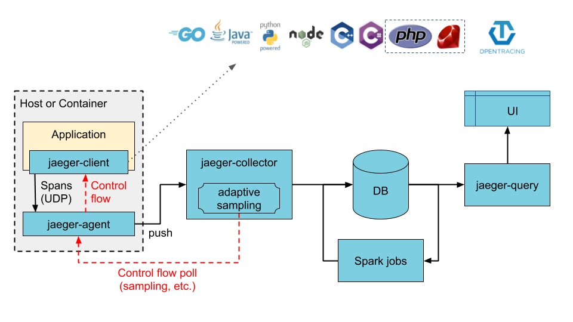

<style>
 pre {
     font-size: 14px;
 }
 pre.console {
   background-color: #300A24; 
   color: #ccc;
   font-family: monospace;
   padding: 5px;
   margin-bottom: 5px;
 }
 pre.console code {
   border: solid 0px transparent;
   font-family: monospace !important;
   font-size: 0.75em;
   color: #ccc;
 }
 .small {
     font-size: 0.75em;
 }
</style>

**Last updated March 17, 2022.**

## Objective

[Jaeger](https://www.jaegertracing.io/) is an open-source distributed tracing platform.


It can be used for monitoring microservices-based distributed systems:

- Distributed context propagation
- Distributed transaction monitoring
- Root cause analysis
- Service dependency analysis
- Performance / latency optimization

TODO: xxx


With Jaeger ...



Read more about [Jaeger architecture and components](https://www.jaegertracing.io/docs/1.32/architecture/).

TODO: xxx

xxx

In this guide you will:

- Install Jaeger
- TODO: xxx create a Go application
- TODO: xxx deploy ?
- TODO: xxx

You can use the *Reset cluster* function on the Public Cloud section of the [OVHcloud Control Panel](https://www.ovh.com/auth/?action=gotomanager&from=https://www.ovh.co.uk/&ovhSubsidiary=ie){.external} to reinitialize your cluster before following this tutorial.

## Requirements

This tutorial presupposes that you already have a working OVHcloud Managed Kubernetes cluster, and some basic knowledge of how to operate it. If you want to know more on those topics, please look at the [OVHcloud Managed Kubernetes Service Quickstart](../deploying-hello-world/).

You also need to have [Helm](https://docs.helm.sh/){.external} installed on your workstation and your cluster. Please refer to the [How to install Helm on OVHcloud Managed Kubernetes Service](../installing-helm/) tutorial.

## Instructions

TODO: xxx

### Installing Jaeger

For this tutorial we are using the [Jaeger Helm chart](https://github.com/jaegertracing/helm-charts).

Add the Jaeger Helm repository:

```bash
helm repo add jaegertracing https://jaegertracing.github.io/helm-charts
helm repo update
```

These commands will add the Jaeger Helm repository to your local Helm chart repository and update the installed chart repositories:

<pre class="console"><code>$ helm repo add jaegertracing https://jaegertracing.github.io/helm-charts
helm repo update
"jaegertracing" has been added to your repositories
Hang tight while we grab the latest from your chart repositories...
...Successfully got an update from the "sealed-secrets" chart repository
...
...Successfully got an update from the "prometheus-community" chart repository
Update Complete. ⎈Happy Helming!⎈
</code></pre>

The Jaeger repository provides two charts: `jaeger` and `jaeger-operator`. For the guide, you will deploy the jaeger-operator chart, which makes it easy to configure a minimal installation. 

To learn more about the Jaeger Operator for Kubernetes, consult the [official documentation](https://www.jaegertracing.io/docs/latest/operator/).

Install the latest version of Jaeger with `helm install` command:

```bash
helm install jaeger-operator jaegertracing/jaeger-operator --namespace observability --create-namespace --set rbac.clusterRole=true
```

This command will install the latest version of Jaeger operator and `observability` namespace:

<pre class="console"><code>$ helm install jaeger-operator jaegertracing/jaeger-operator --namespace observability --create-namespace --set rbac.clusterRole=true
manifest_sorter.go:192: info: skipping unknown hook: "crd-install"
NAME: jaeger-operator
LAST DEPLOYED: Thu Mar 17 12:06:49 2022
NAMESPACE: observability
STATUS: deployed
REVISION: 1
TEST SUITE: None
NOTES:
jaeger-operator is installed.


Check the jaeger-operator logs
  export POD=$(kubectl get pods -l app.kubernetes.io/instance=jaeger-operator -lapp.kubernetes.io/name=jaeger-operator --namespace observability --output name)
  kubectl logs $POD --namespace=observability
</code></pre>

Thanks to the variable overriding `rbac.clusterRole=true`, you ask the operator to watch all namespaces.

Check the Jaeger Operator is running:

```bash
kubectl get pod -n observability
```

<pre class="console"><code>$ kubectl get pod -n observability
NAME                               READY   STATUS    RESTARTS   AGE
jaeger-operator-67f8dd68c9-5qj26   1/1     Running   0          3m5s
</code></pre>

The simplest possible way to create a Jaeger instance is by creating a YAML file that will install the default AllInOne image. This “all-in-one” image includes: agent, collector, query, ingester and Jaeger UI in a single pod, using in-memory storage by default.

For this guide you will deploy Jaeger components through this simple way, which can be uses for development, testing and demo purposes but for [production strategy](https://www.jaegertracing.io/docs/1.32/operator/#deployment-strategies) you can read the official documentation.

Once the `jaeger-operator` pod in the namespace `observability` is ready, create a `simplest.yaml` file with the following content:

```yaml
apiVersion: jaegertracing.io/v1
kind: Jaeger
metadata:
  name: simplest
spec:
  query:
    serviceType: LoadBalancer
```

In this YAML manifest file we specify that you want to access the Jaeger UI (`jaeger-query`) through a Load Balancer.

And apply it:

```bash
kubectl apply -f simplest.yaml
```

Theses commands will create a Jaeger instance named `simplest` in the namespace `observability`:

<pre class="console"><code>$ kubectl apply -f simplest.yaml
jaeger.jaegertracing.io/simplest created
</code></pre>

You can now check if the Jaeger instance is running with the following commands:

```bash
kubectl get jaegers
kubectl get pods -l app.kubernetes.io/instance=simplest
```

Theses commands will check if the instances that were created, list the jaeger objects and list the pods that are running:

<pre class="console"><code>$ kubectl get jaegers
NAME       STATUS    VERSION   STRATEGY   STORAGE   AGE
simplest   Running   1.30.0    allinone   memory    4s

$ kubectl get pods -l app.kubernetes.io/instance=simplest
NAME                        READY   STATUS    RESTARTS   AGE
simplest-59ccc99bcc-zpscb   1/1     Running   0          80s
</code></pre>

### Access to Jaeger UI

Now you can retrieve Jaeger UI URL with the following command:

```bash
export JAEGER_URL=$(kubectl get svc simplest-query -o jsonpath='{.status.loadBalancer.ingress[].ip}')
echo Jaeger URL: http://$JAEGER_URL:16686
```

You should obtain the following result:

<pre class="console"><code>$ export JAEGER_URL=$(kubectl get svc simplest-query -o jsonpath='{.status.loadBalancer.ingress[].ip}')

$ echo Jaeger URL: http://$JAEGER_URL:16686
Jaeger URL: http://51.210.210.101:16686
</code></pre>

Open your browser and go to the Jaeger interface.


### TODO: xxx

TODO: xxx

Next. we need to create a resource describing the Jaeger instance we want the Operator to manage. To do so, we will follow Jaeger’s official documentation:


You can check if the Kyverno pod is correctly running:

<pre class="console"><code>$ kubectl get pods -n kyverno
NAME                       READY   STATUS    RESTARTS   AGE
kyverno-554ffb4c96-f2lvs   1/1     Running   0          50s
</code></pre>

And you can check that Kyverno installed several webhooks on your cluster:

<pre class="console"><code>$ kubectl get validatingwebhookconfigurations,mutatingwebhookconfigurations
NAME                                                                                                  WEBHOOKS   AGE
validatingwebhookconfiguration.admissionregistration.k8s.io/kyverno-policy-validating-webhook-cfg     1          52s
validatingwebhookconfiguration.admissionregistration.k8s.io/kyverno-resource-validating-webhook-cfg   2          52s

NAME                                                                                              WEBHOOKS   AGE
mutatingwebhookconfiguration.admissionregistration.k8s.io/kyverno-policy-mutating-webhook-cfg     1          52s
mutatingwebhookconfiguration.admissionregistration.k8s.io/kyverno-resource-mutating-webhook-cfg   2          52s
mutatingwebhookconfiguration.admissionregistration.k8s.io/kyverno-verify-mutating-webhook-cfg     1          52s
</code></pre>

### Create and deploy policies

Kyverno is running on your OVHcloud Managed Kubernetes cluster, so now you can simply create and deploy policies with the rules you want to put in place in your cluster.

In this guide we will show you how to create several policies that will:

- Deny deploying resources in the `default` namespace
- Create automatically a ConfigMap in all namespaces except `kube-system`, `kube-public` and `kyverno`
- Add automatically a label to Pods, Services, ConfigMaps, and Secrets in a given namespace

#### Policy 1: Disallow deployments in the `default` namespace

For our first example we want to deny deploying resources in the `default` namespace.

Why? Because it's a good practice to isolate workloads/applications with Namespaces. One namespace per project/team/...  
So imagine if several teams deploy different applications in the `default` namespace, they will not be isolated.

The policy will validate whether new resources can be deployed, so we will create a `validate` policy.

Create a new policy in a `policy-disallow-default-namespace.yaml` file:

```yaml
apiVersion: kyverno.io/v1
kind: ClusterPolicy
metadata:
  name: disallow-default-namespace
spec:
  validationFailureAction: enforce
  rules:
  - name: validate-namespace
    match:
      resources:
        kinds:
        - Pod
    validate:
      message: "Using \"default\" namespace is not allowed."
      pattern:
        metadata:
          namespace: "!default"
  - name: require-namespace
    match:
      resources:
        kinds:
        - Pod
    validate:
      message: "A namespace is required."
      pattern:
        metadata:
          namespace: "?*"
  - name: validate-podcontroller-namespace
    match:
      resources:
        kinds:
        - DaemonSet
        - Deployment
        - Job
        - StatefulSet
    validate:
      message: "Using \"default\" namespace is not allowed for pod controllers."
      pattern:
        metadata:
          namespace: "!default"
  - name: require-podcontroller-namespace
    match:
      resources:
        kinds:
        - DaemonSet
        - Deployment
        - Job
        - StatefulSet
    validate:
      message: "A namespace is required for pod controllers."
      pattern:
        metadata:
          namespace: "?*"
```

> [!primary]
> The **validationFailureAction** policy attribute that controls admission is set to **enforce** to block **resource creation or updates** when the resource is non-compliant.  
> Using the default value **audit** will report violations (in a **PolicyReport** or **ClusterPolicyReport**) but will not block requests.

To deploy the Kyverno policy in the cluster, execute the following command to apply the YAML file:

```yaml
kubectl apply -f policy-disallow-default-namespace.yaml
```

After applying the policy, check if the policy is correctly applied on the cluster:

<pre class="console"><code>$ kubectl apply -f policy-disallow-default-namespace.yaml
clusterpolicy.kyverno.io/disallow-default-namespace created

$ kubectl get clusterpolicy
NAME                         BACKGROUND   ACTION     READY
disallow-default-namespace   true         enforce    true
</code></pre>

> [!primary]
> With Kyverno installation, [new CRDs](https://kyverno.io/docs/crds/) have been added. The one that interests us is the new resource type `ClusterPolicy`. So in order to list, display, edit and remove Kyverno policies, you can execute `kubectl` command with `ClusterPolicy` resource object type.  
> Ex: `kubectl get clusterpolicy` or `kubectl get cpol` with the short name.

Now you will try to deploy a simple application in the `default` namespace.  
For that, create a file named `my-pod.yaml` with the following content:

```yaml
apiVersion: v1
kind: Pod
metadata:
  name: my-pod
spec:
  containers:
  - name: hello-world
    image: ovhplatform/hello
    ports:
    - containerPort: 80
```

Apply it without defining any namespace (namespace is `default` by default):

```bash
kubectl apply -f my-pod.yaml
```

<pre class="console"><code>$ kubectl apply -f my-pod.yaml
Error from server: error when creating "my-pod.yaml": admission webhook "validate.kyverno.svc-fail" denied the request:

resource Pod/default/my-pod was blocked due to the following policies

disallow-default-namespace:
  validate-namespace: 'validation error: Using "default" namespace is not allowed.
    Rule validate-namespace failed at path /metadata/namespace/'
</code></pre>

Perfect, you no longer have the ability to deploy a Pod/Deployment/ReplicaSet/Job/StatefulSet in the `default` namespace.

#### Policy 2: Create a ConfigMap in all namespaces excepted `kube-system`, `kube-public` and `kyverno`

For our second example we want to create a `generate` policy that will create a new ConfigMap called `zk-kafka-address` in all new namespaces except `kube-system`, `kube-public` and `kyverno`.

Create a new policy in a `policy-generate-cm.yaml` file:

```yaml
apiVersion: kyverno.io/v1
kind: ClusterPolicy
metadata:
  name: zk-kafka-address
spec:
  rules:
  - name: k-kafka-address
    match:
      resources:
        kinds:
        - Namespace
    exclude:
      resources:
        namespaces:
        - kube-system
        - kube-public
        - kyverno
    generate:
      synchronize: true
      kind: ConfigMap
      name: zk-kafka-address
      # generate the resource in the new namespace
      namespace: "{{request.object.metadata.name}}"
      data:
        kind: ConfigMap
        metadata:
          labels:
            somekey: somevalue
        data:
          ZK_ADDRESS: "192.168.10.10:2181,192.168.10.11:2181,192.168.10.12:2181"
          KAFKA_ADDRESS: "192.168.10.13:9092,192.168.10.14:9092,192.168.10.15:9092"
```

> [!primary]
> When the `synchronize` attribute is set to `true`, modifications will be synchronized to the generated resources.  
> So in our case, if you change the values of `ZK_ADDRESS` and `KAFKA_ADDRESS` for example, all the created ConfigMap will be updated.

To deploy the Kyverno policy in the cluster, execute the following command to apply the YAML file:

```bash
kubectl apply -f policy-generate-cm.yaml
```

After applying the policy, check if the policy is correctly applied on the cluster:

<pre class="console"><code>$ kubectl apply -f policy-generate-cm.yaml
clusterpolicy.kyverno.io/zk-kafka-address created

$ kubectl get cpol -A
NAME                         BACKGROUND   ACTION    READY
disallow-default-namespace   true         enforce   true
zk-kafka-address             true         audit     true
</code></pre>

The `generate` rule is triggered during the `API CREATE` operation, so for this policy when a new namespace is created.

In order to test the behavior of this policy, you will create a new namespace `test2`:

```bash
kubectl create ns test2
```

And then check if the new ConfigMap appears in the new `test2` namespace:

```bash
kubectl get cm -A
```

You should have results like these:

<pre class="console"><code>$ kubectl create ns test2
namespace/test2 created

$ kubectl get cm -A
NAMESPACE         NAME                                 DATA   AGE
default           kube-root-ca.crt                     1      7d20h
kube-node-lease   kube-root-ca.crt                     1      7d20h
kube-public       kube-root-ca.crt                     1      7d20h
kube-system       canal-config                         5      7d20h
kube-system       coredns                              1      7d20h
kube-system       extension-apiserver-authentication   6      7d20h
kube-system       kube-dns-autoscaler                  1      7d20h
kube-system       kube-proxy                           1      7d20h
kube-system       kube-root-ca.crt                     1      7d20h
kyverno           kube-root-ca.crt                     1      7d19h
kyverno           kyverno                              2      7d19h
kyverno           kyverno-metrics                      1      7d19h
test              kube-root-ca.crt                     1      7d16h
test2             kube-root-ca.crt                     1      2m28s
test2             zk-kafka-address                     2      2m27s
</code></pre>

As you can see the ConfigMap `zk-kafka-address` have been created in the new `test2` namespace.

#### Policy 3: Add a label `app: my-awesome-app` to Pods, Services, ConfigMaps, and Secrets in a given namespace

The aim of this policy is to automatically add a label `app=my-awesome-app` to Pods, Services, ConfigMaps, and Secrets in the namespaces `team-a`.

In order to do that, we will show you how to deploy a `mutate` policy.

> [!primary]
> Resource `mutation` occurs before `validation`, so the validation rules should not contradict the changes performed by the mutation section.

Create a new policy in a `policy-add-label.yaml` file:

```yaml
apiVersion: kyverno.io/v1
kind: ClusterPolicy
metadata:
  name: add-label    
spec:
  rules:
  - name: add-label
    match:
      resources:
        kinds:
        - Pod
        - Service
        - ConfigMap
        - Secret
        namespaces:
        - team-a
    mutate:
      patchStrategicMerge:
        metadata:
          labels:
            app: my-awesome-app
``` 

To deploy the Kyverno policy in the cluster, execute the following command to apply the YAML file:

```yaml
kubectl apply -f policy-add-label.yaml
```

After applying the policy, check if the policy is correctly applied on the cluster:

<pre class="console"><code>$ kubectl apply -f policy-add-label.yaml
clusterpolicy.kyverno.io/add-label created

$ kubectl get cpol -A
NAME                         BACKGROUND   ACTION    READY
add-label                    true         audit
disallow-default-namespace   true         enforce   true
zk-kafka-address             true         audit     true
</code></pre>

Now you can create a new namespace `team-a`, deploy a new Pod into it and check if the new label have been correctly added automatically:

```bash
kubectl create ns team-a
kubectl apply -f my-pod.yaml -n team-a
kubectl get pod my-pod -n team-a --show-labels
```

> [!primary]
> Previously in this guide we showed you the creation of a Pod in a file named `my-pod.yaml`, so in this step you can reuse it.

You should obtain the following results:

<pre class="console"><code>$ kubectl create ns team-a
namespace/team-a created

$ kubectl apply -f my-pod.yaml -n team-a
pod/my-pod created

$ kubectl get pod my-pod -n team-a --show-labels
NAME     READY   STATUS    RESTARTS   AGE   LABELS
my-pod   1/1     Running   0          29s   app=my-awesome-app
</code></pre>

### Debugging/validating

Previously in this guide we show you how to install the `kyverno` CLI. With this CLI you can [apply](https://kyverno.io/docs/kyverno-cli/#apply), [test](https://kyverno.io/docs/kyverno-cli/#test) and [validate](https://kyverno.io/docs/kyverno-cli/#validate) policies.

In this tutorial we want to show you that the CLI is perfect for a usage on your local machine (for dev/test usages) and in your CI/CD pipelines in order to test and validate the policies you want to deploy in production are correct.

You can for example check if policies we created are validated with the `kyverno validate` command:

```bash
kyverno validate *.yaml
```

You should obtain results like these:

<pre class="console"><code>$ kyverno validate *.yaml
----------------------------------------------------------------------
Policy disallow-default-namespace is valid.

----------------------------------------------------------------------
Policy add-label is valid.

----------------------------------------------------------------------
Policy zk-kafka-address is valid.
</code></pre>

### Troubleshooting

If you have any problem with Kyverno, for example you deployed a policy and don't know why it's not working, you can go to the [Kyverno troubleshooting page](https://kyverno.io/docs/troubleshooting/).

### What's next?

You now have a policy management on your Kubernetes cluster, and you deployed a few policies to test the behavior of Kyverno.  
In order to see more examples of policies, you can go to [Kyverno policies repository](https://github.com/kyverno/policies/). This repository contains Kyverno policies for a wide array of usage on various Kubernetes and ecosystem resources and subjects.

If you have any questions or troubles about Kyverno, you can also go to [Kyverno Slack community](https://slack.k8s.io/#kyverno).

Having a policy management is a good practice to follow. It will help you to keep your cluster clean and secure.  
Next time we will see another tutorial that will help you to secure your OVHcloud Managed Kubernetes clusters.

## Cleanup

First, remove the `ClusterPolicies` you deployed in this guide:

```bash
kubectl delete cpol --all
```

To uninstall Kyverno, as you installed it through Helm, you can use `helm uninstall` command in order to delete the Kyverno Helm installed chart:

```bash
helm uninstall kyverno kyverno/kyverno --namespace kyverno
```

## Go further

Join our community of users on <https://community.ovh.com/en/>.
