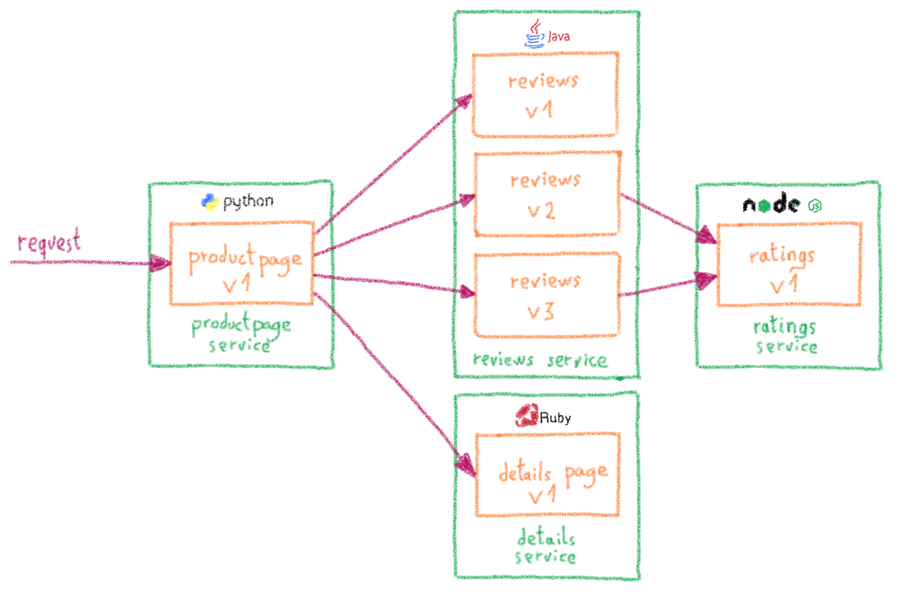

<style>
 pre {
     font-size: 14px;
 }
 pre.console {
   background-color: #300A24; 
   color: #ccc;
   font-family: monospace;
   padding: 5px;
   margin-bottom: 5px;
 }
 pre.console code {
   border: solid 0px transparent;
   font-family: monospace !important;
   font-size: 0.75em;
   color: #ccc;
 }
 .small {
     font-size: 0.75em;
 }
</style>

**Last updated 1<sup>st</sup> July, 2019.**

[Istio](https://istio.io){.external} is a open source service mesh and platform to reduce the complexity of deploying, securing, controlling and observing distributed services. As the Istio site explains, Istio helps you to:

- Control the flow of traffic between services
- Secure the services and manage the authentication, authorization and encryption of inter-service communications
- Apply and enforce policies on distributes services
- Monitor the services gathering metrics, logs and traces

In this tutorial we are showing some of the traffic management features of Istio, and how you can use them on your OVHcloud Managed Kubernetes cluster.


## Before you begin

This tutorial presupposes that you already have a working OVHcloud Managed Kubernetes cluster, and some basic knowledge of how to operate it. If you want to know more on those topics, please look at the [deploying a Hello World application](../deploying-hello-world/) documentation.

It also supposes you have a basic knowledge of Istio, and that you have installed it in your Kubernetes cluster. If it isn't the case, please follow the [Installing Istio on OVHcloud Managed Kubernetes](../installing-istio/) tutorial. We are going to use the [Bookinfo](https://istio.io/docs/examples/bookinfo/){.external} example application, as we did in that tutorial, so if you haven't installed it, please do it now.

## Preparing the Bookinfo app

Before you can use Istio to control the Bookinfo version routing, you need to define the available versions, called `subsets`, in [destination rules](https://istio.io/docs/concepts/traffic-management/#destination-rules){.external}.

Go to your Istio install folder and apply the `DestinationRules` for Bookinfo:

```bash
kubectl -n istio-apps apply -f samples/bookinfo/networking/destination-rule-all-mtls.yaml
```

Then wait a few moments to for the destination rules to propagate and verify them:

```bash
kubectl -n istio-apps get destinationrules -o yaml
```

In the case of my example cluster:

<pre class="console"><code>$ kubectl -n istio-apps apply -f samples/bookinfo/networking/destination-rule-all-mtls.yaml
destinationrule.networking.istio.io/productpage created
destinationrule.networking.istio.io/reviews created
destinationrule.networking.istio.io/ratings created
destinationrule.networking.istio.io/details created

$ kubectl -n istio-apps get destinationrules -o yaml
apiVersion: v1
items:
- apiVersion: networking.istio.io/v1alpha3
  kind: DestinationRule
  metadata:
    annotations:
      kubectl.kubernetes.io/last-applied-configuration: |
        {"apiVersion":"networking.istio.io/v1alpha3","kind":"DestinationRule","metadata":{"annotations":{},"name":"details","namespace":"istio-apps"},"spec":{"host":"details","subsets":[{"labels":{"version":"v1"},"name":"v1"},{"labels":{"version":"v2"},"name":"v2"}],"trafficPolicy":{"tls":{"mode":"ISTIO_MUTUAL"}}}}
    creationTimestamp: 2019-07-02T23:23:02Z
    generation: 1
    name: details
    namespace: istio-apps
    resourceVersion: "13136422929"
    selfLink: /apis/networking.istio.io/v1alpha3/namespaces/istio-apps/destinationrules/details
    uid: 56437acb-9d20-11e9-8f94-f2cd6677333a
  spec:
    host: details
    subsets:
    - labels:
        version: v1
      name: v1
    - labels:
        version: v2
      name: v2
    trafficPolicy:
      tls:
        mode: ISTIO_MUTUAL
[...] 
</code></pre>

## A/B Testing with Istio

[A/B Testing](https://en.wikipedia.org/wiki/A/B_testing) is used when we want to try two different versions of an application and compare user interaction and engagement to choose the best one. It requires to be able to push the two versions into production at the same time, split traffic between the two versions, and collect metrics to be able to do an informed choice.

A/B Testing used to be a difficult problem with traditional deployment methods, and it's very hard to do it directly in Kubernetes since there is no notion of versions, but Istio make it rather simple. 

Let's use the Bookinfo  application to show how easily you can do A/B Testing on Kubernetes with Istio. The Bookinfo application composed of four separate microservices: 

- `productpage`: it calls the `reviews` and `details` service and build the page
- `reviews`: it contains with book reviews, and it calls the `rating` service
- `details`: it contains the book information
- `ratings`: it contains the book rating information

To setup A/B Testing on Bookinfo we are using the `reviews` microservice, as it has three versions:

- `v1`: it doesn't call the `ratings` service
- `v2`: it calls the `ratings` service and displays the rating as black stars
- `v3`: it calls the `ratings` service and displays the rating as red stars

{.thumbnail}

By default, the Bookinfo install deploys the three versions without explicit routing definitions. Istio then routes the requests to all available versions of `reviews` in a round robin fashion, so sometimes the book review output contains star ratings and other times it does not.

Let's say we want to send 50% of traffic to `v2` and get the black stars, and the other 50% to `v3` and its red stars. We can create a `VirtualService` to define this behavior:

```yaml
apiVersion: networking.istio.io/v1alpha3
kind: VirtualService
metadata:
  name: reviews
spec:
  hosts:
    - reviews
  http:
  - route:
    - destination:
        host: reviews
        subset: v2
      weight: 50
    - destination:
        host: reviews
        subset: v3
      weight: 50
```

Write down the `VirtualService` into a `reviews-50-v2-50-v3.yaml` file and apply it:

```bash
kubectl apply -n istio-apps -f reviews-50-v2-50-v3.yaml
```

and confirm that the rule is created:

```bash
kubectl -n istio-apps get virtualservice reviews -o yaml
```

In the case of my example cluster:

<pre class="console"><code>$ kubectl apply -n istio-apps -f ./reviews-50-v2-50-v3.yaml 
virtualservice.networking.istio.io/reviews created

$ kubectl -n istio-apps get virtualservice reviews -o yaml
apiVersion: networking.istio.io/v1alpha3
kind: VirtualService
metadata:
[...]
spec:
  hosts:
  - reviews
  http:
  - route:
    - destination:
        host: reviews
        subset: v2
      weight: 50
    - destination:
        host: reviews
        subset: v3
      weight: 50
</code></pre>

Now, on the `/productpage` of the Bookinfo app, at every refresh you will see that stars change alternatively between back (`v2`) and red (`v3`).


{.thumbnail}


## Canary Testing with Istio

Similar to A/B Testing, [Canary Testing](https://whatis.techtarget.com/definition/canary-canary-testing) is pushing a new version of a service to a small group of users. The idea is to test the new release in a reduced number of real-world users, to quickly discovering potential bugs while minimizing the number of users impacted.

The strategy is called Canary Testing because canaries were once used in coal mining to alert miners when toxic gases reached dangerous levels. Like the canary in a coal mine, the end user who is selected to receive the new release is unaware he is being used to provide an early warning.

Doing Canary Testing on Kubernetes with Istio is similar to A/B Testing.

Let's begin by redirecting all the `reviews` traffic to `v1`, it will be our stable release:

```yaml
apiVersion: networking.istio.io/v1alpha3
kind: VirtualService
metadata:
  name: reviews
spec:
  hosts:
    - reviews
  http:
  - route:
    - destination:
        host: reviews
        subset: v1
      weight: 100
```

Write down the `VirtualService` into a `review-all-v1.yaml` file and apply it:

```bash
kubectl apply -f review-all-v1.yaml
```

and confirm that the rule is created:

```bash
kubectl -n istio-apps apply  get virtualservice reviews -o yaml
```

At this moment all the traffic goes to the `v1` version of reviews, without ratings:

{.thumbnail}

Now let's say we want to send the `v2` to 5% of the traffic. We simply define the new behavior in a YAML file:

```yaml
apiVersion: networking.istio.io/v1alpha3
kind: VirtualService
metadata:
  name: reviews
spec:
  hosts:
    - reviews
  http:
  - route:
    - destination:
        host: reviews
        subset: v1
      weight: 90
    - destination:
        host: reviews
        subset: v2
      weight: 10
```

Write down the `VirtualService` into a `reviews-90-v1-10-v2.yaml` file and apply it:

```bash
kubectl -n istio-apps apply -f review-90-v1-10-v2.yaml
```

and confirm that the rule is created:

```bash
kubectl -n istio-apps apply get virtualservice reviews -o yaml
```

Now, on the `/productpage` of the Bookinfo app, 9 times out of 10 you will get the `v1`, without ratings, and 1 out of 10 times you will get the `v2`, with black stars.

{.thumbnail}


## Rolling Deployments and Blue/Green Deployments

Both [Rolling Deployments](https://searchitoperations.techtarget.com/definition/rolling-deployment) and [Blue/Green Deployments](rolling deployment) are deployment strategies to ensure that new releases can be shipped without any downtime.

{.thumbnail}

Doing a Rolling Deployment on Istio is rather simple, you can take as base te examples of Canary Testing and A/B Testing.

Let's apply again the `reviews-all-v1.yaml` file to redirect all the `reviews` traffic to the `v1`:

```bash
kubectl -n istio-apps apply  apply -f reviews-all-v1.yaml
```

The `v1` is then our initial release. Let's say we want to ship `v2` as new release, but using Rolling Deployment to be sure there is no downtime. The easiest wa would be pass by an intermediate state where traffic is split 50%-50% between `v1` and `v2`:

```yaml
apiVersion: networking.istio.io/v1alpha3
kind: VirtualService
metadata:
  name: reviews
spec:
  hosts:
    - reviews
  http:
  - route:
    - destination:
        host: reviews
        subset: v1
      weight: 50
    - destination:
        host: reviews
        subset: v2
      weight: 50
```

Write down the `VirtualService` into a `reviews-50-v1-50-v2.yaml` file and apply it:

```bash
kubectl apply-n istio-apps -f reviews-50-v1-50-v2.yaml
```

At this moment traffic will be equally split between the two releases of `reviews`. 


{.thumbnail}

If everything is correct, we can safely route all the traffic to `v2`:

```yaml
apiVersion: networking.istio.io/v1alpha3
kind: VirtualService
metadata:
  name: reviews
spec:
  hosts:
    - reviews
  http:
  - route:
    - destination:
        host: reviews
        subset: v2
      weight: 100
```

Write down the `VirtualService` into a `reviews-all-v2.yaml` file and apply it:

```bash
kubectl -i istio-apps apply -f reviews-all-v2.yaml
```

And now the `v2` of `reviews` receives all the traffic, and our Rolling Deployment is completed.


{.thumbnail}


## What's next?

Now you have seem some of the traffic management capabilities of Istio, you can explore other [exaples of Istio traffic management](https://istio.io/docs/tasks/traffic-management/){.external}: [fault injection](https://istio.io/docs/tasks/traffic-management/fault-injection/){.external}, [circuit breaking](https://istio.io/docs/tasks/traffic-management/circuit-breaking/){.external}, [mirroring](https://istio.io/docs/tasks/traffic-management/mirroring/){.external}... 

