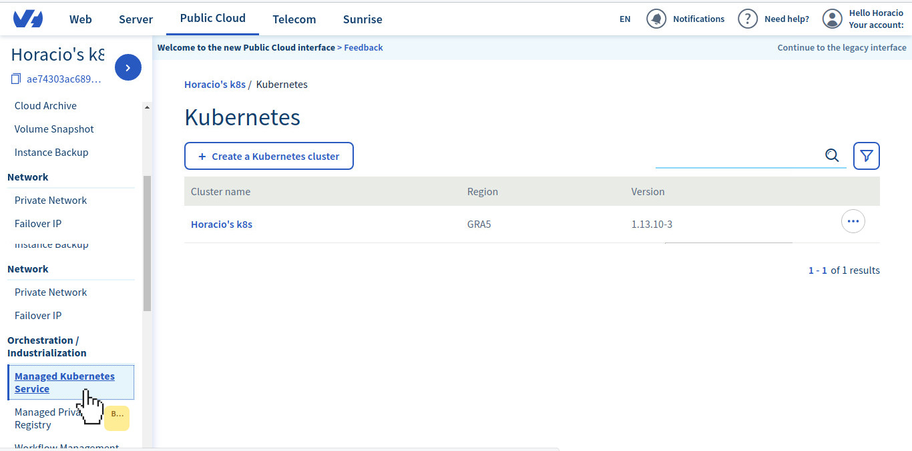
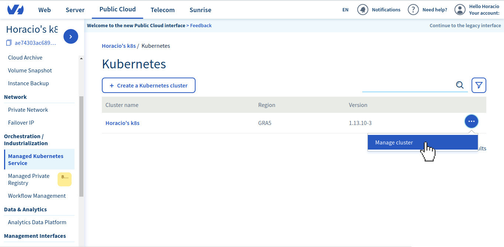
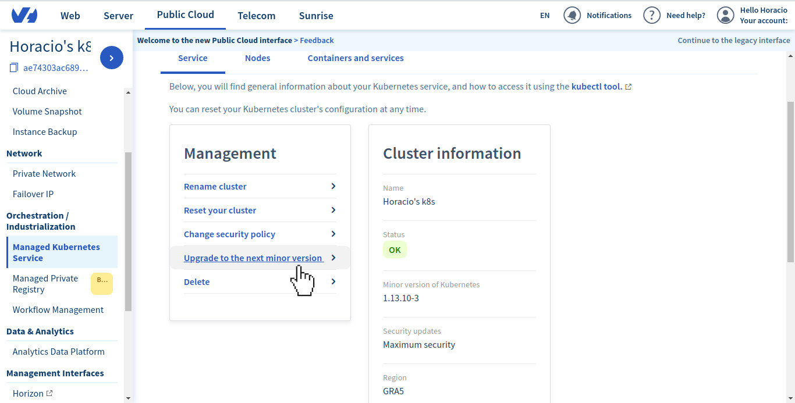
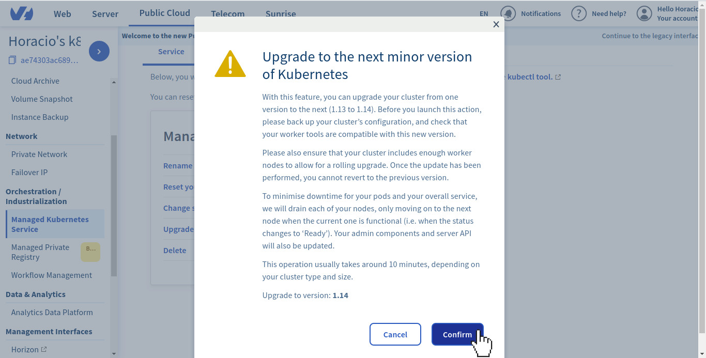
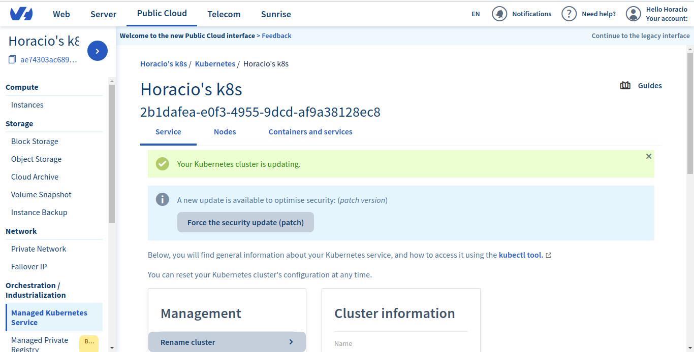

**Last updated September 5th, 2019.**

## Objective

OVH Managed Kubernetes service provides you Kubernetes clusters without the hassle of installing or operating them. In this guide we cover how you can easily upgrade your cluster to the next minor version of Kubernetes.

On OVH Managed Kubernetes we have deployed a *Upgrade to the next minor version of Kubernetes* feature to upgrade your cluster from one version to the next (*e.g.* 1.13 to 1.14).

## Requirements 

- An OVH Managed Kubernetes cluster

## Important information on the upgrading process

Before you launching the upgrade, please back up your cluster’s configuration, and check that your worker tools are compatible with this new version.

The upgrading process will try to do a [rolling upgrade](https://en.wikipedia.org/wiki/Rolling_release). Please ensure that your cluster includes enough worker nodes to allow for a rolling upgrade. 

To minimise downtime for your pods and your overall service, we will drain each of your nodes, only moving on to the next node when the current one is functional (i.e. when the status changes to ‘Ready’). Your admin components and server API will also be updated.

 This operation usually takes around 10 minutes, depending on your cluster type and size.

Once the update has been performed, you cannot revert to the previous version.

## Instructions

### Step 1 - Ask for a minor version upgrade on the OVH Cloud Manager 

1. Access our administration UI for your OVH Managed Kubernetes clusters by clicking on the *Managed Kubernetes Service* menu in the [OVH Cloud Manager](https://www.ovh.com/manager/cloud/)

    {.thumbnail}

1. Click on the right end button and choose *Manage cluster*

    {.thumbnail}

1. On the *Management* section, click on *Upgrade to the next minor version*

    {.thumbnail}

1. Click on *Confirm*   

    {.thumbnail}

### Step 2 - Wait for the resetting to end 

The upgrading process can take several minutes. During that time, a message on the manager warns you that the cluster is being upgraded:

  {.thumbnail}

## Go further

To have an overview of OVH Managed Kubernetes service, you can go to the [OVH Managed Kubernetes site](https://labs.ovh.com/kubernetes-k8s).

Otherwise to skip it and learn more about using your Kubernetes cluster the practical way, we invite you to look at our  [tutorials]() .

Join our community of users on https://community.ovh.com/en/.