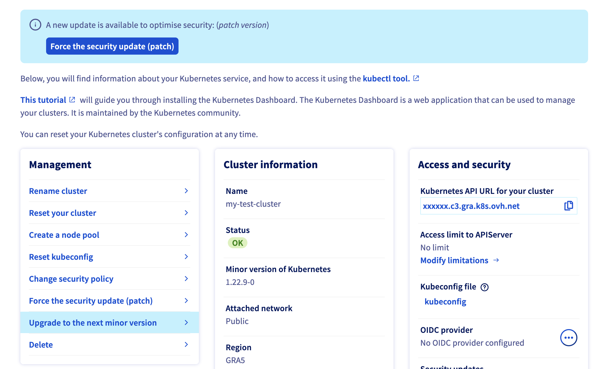

**Last updated 3rd January 2023**

## Objective

The OVHcloud Managed Kubernetes service provides you Kubernetes clusters without the hassle of installing or operating them. In this guide we cover how you can easily upgrade your cluster to the next minor version of Kubernetes.

On OVHcloud Managed Kubernetes we have deployed a *Upgrade to the next minor version of Kubernetes* feature to upgrade your cluster from one version to the next (*e.g.* 1.13 to 1.14).

## Requirements 

- An OVHcloud Managed Kubernetes cluster

## Important information on the upgrading process

Before you launch the upgrade, please back up your cluster’s configuration, and check that your worker tools are compatible with this new version.

The upgrading process will try to do a [rolling upgrade](https://en.wikipedia.org/wiki/Rolling_release). Please ensure that your cluster includes enough worker nodes to allow for a rolling upgrade. 

To minimise downtime for your pods and your overall service, we will drain each of your nodes, only moving on to the next node when the current one is functional (i.e. when the status changes to ‘Ready’). Your admin components and server API will also be updated.

This operation usually takes around 5 minutes per node in your cluster, but that can vary depending on your cluster type and size.

Once the update has been performed, you cannot revert to the previous version.

## Instructions

### Step 1 - Ask for a minor version upgrade on the OVH Cloud Manager 

1. Log in to the [OVHcloud Control Panel](https://ca.ovh.com/auth/?action=gotomanager&from=https://www.ovh.com/world/&ovhSubsidiary=ws), go to the `Public Cloud`{.action} section and select the Public Cloud project concerned.

    Access the administration UI for your OVHcloud Managed Kubernetes clusters by clicking on `Managed Kubernetes Service`{.action} in the left-hand menu.

    {.thumbnail}

1. Click on the right end button of your Kubernetes cluster and choose `Manage cluster`{.action}

    {.thumbnail}

1. On the *Management* section, click on `Upgrade to the next minor version`{.action}

    {.thumbnail}

1. Click on `Confirm`{.action}

    {.thumbnail}

> [!primary]
>
> Your security policy must be set at least to "Minimum unavailability", otherwise the upgrade will fail.
>
> {.thumbnail}
>
> {.thumbnail}
>

### Step 2 - Wait for the upgrading to end 

The upgrading process can take several minutes (around 5 minutes per node in your cluster). During that time, a message on the OVHcloud Control Panel warns you that the cluster is being upgraded:

  {.thumbnail}

## Go further

To have an overview of the OVHcloud Managed Kubernetes service, you can go to the [OVHcloud Managed Kubernetes page](https://www.ovh.com/public-cloud/kubernetes/).

To learn more about how to use your Kubernetes cluster the practical way, we invite you to look at our [tutorials](../).

Join our [community of users](https://community.ovh.com/en/).
