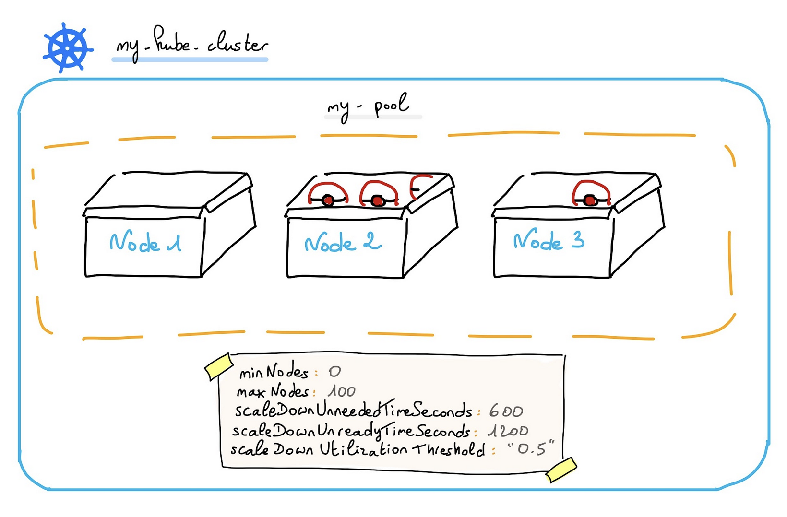

<style>
 pre {
     font-size: 14px;
 }
 pre.console {
   background-color: #300A24; 
   color: #ccc;
   font-family: monospace;
   padding: 5px;
   margin-bottom: 5px;
 }
 pre.console code {
   border: solid 0px transparent;
   font-family: monospace !important;
   font-size: 0.75em;
   color: #ccc;
 }
 .small {
     font-size: 0.75em;
 }
</style>

**Last updated May 17<sup>th</sup>, 2022.**

## Objective

OVHcloud Managed Kubernetes service provides you Kubernetes clusters without the hassle of installing or operating them.

During the day-to-day life of your cluster, you may want to dynamically adjust the size of your cluster to accommodate your workloads. The cluster autoscaler simplifies the task by scaling up or down your OVHcloud Managed Kubernetes cluster to meet the demand of your workloads.

This guide will cover how to enable and manage the cluster autoscaler on your OVHcloud Managed Kubernetes cluster.

## Requirements

- An OVHcloud Managed Kubernetes cluster.
- Some basic knowledge of how to operate it. If you want to know more on those topics, please look at the [OVHcloud Managed Kubernetes Service Quickstart](../deploying-hello-world/).
- Some basic understanding of [how nodes and node pools work](../managing-nodes/) on OVHcloud Managed Kubernetes.

## Instructions

### The cluster autoscaler

#### Horizontal pod scaling and cluster scaling

One of the hallmarks of cloud native environments is that they must automatically adapt to fluctuating loads. These fluctuations can be for the most part regular, such as day-night or work-weekend cycles, or more ad hoc, such as a Black Friday situation. A well-designed cloud native system must scale up and down to adapt to fluctuations in load without human intervention.

Kubernetes has a powerful set of features to accommodate to shifting workloads, the [horizontal pod autoscaling](https://kubernetes.io/docs/tasks/run-application/horizontal-pod-autoscale/).

> [!primary]
>
> The Horizontal Pod Autoscaler automatically scales the number of Pods in a replication controller, deployment, replica set or stateful set based on observed CPU utilization (or, with custom metrics support, on some other application-provided metrics).

But the horizontal pod autoscaling has a hard limit, the number of available nodes in your Kubernetes cluster. It can only add pods to a Replica Set if there is enough available resources in your Kubernetes nodes, and it cannot reduce the size of your cluster if your nodes are underutilized.

In order to go further with the scalability, you need to have a cluster autoscaler. The Cluster autoscaler adds or removes nodes in a cluster based on all pods' requested resources, without human intervention.

The horizontal pod autoscaler and the cluster autoscaler work better when deployed together in the cluster, because the horizontal pod autoscaler focuses on managing pods to allow them to match the demand while the autoscaler manages the number of nodes in the cluster to be sure that the horizontal pod autoscaler can do its role.

The cluster and horizontal pod autoscalers can work together, and are often both deployed in a cluster. When combined, the horizontal pod autoscaler is focused on running the number of pods required to meet application demand. The cluster autoscaler is focused on running the number of nodes required to support the scheduled pods.

#### Scaling up and down

To scale-up a cluster, the cluster autoscale watches the load on your nodes and detects when your cluster has resource constraints (e.g. it cannot schedule nodes because of lack of resources). When such a situation arise, the cluster autoscaler adds nodes to your [node pools](../managing-nodes/) to match the demand.

The cluster autoscaler also works the other way around, monitoring underutilized nodes and decreasing the number of nodes, helping to reduce your costs.

> [!primary]
>
> The scaling up is conceptually easier than the scaling down. When the autoscaler detects resource constraints, it *simply* needs to add yet another node (providing it's under the user defined limit of nodes). But in order to scale down, even if most nodes are underutilized, it needs to move all the pods outside of one of the nodes before deleting it.
>
> Some considerations like pods using node selectors, anti-affinity, or restrictive PodDisruptionBudget (PDB).
>
> For more information on this factors disrupting the scaling down of the cluster, please see the [What types of pods can prevent CA from removing a node?](https://github.com/kubernetes/autoscaler/blob/master/cluster-autoscaler/FAQ.md#what-types-of-pods-can-prevent-ca-from-removing-a-node) page.

In order to scale up and down the cluster, the autoscaler uses user-defined parameters for things like limits (*what are the upper and lower number of nodes limits in your cluster?*), nodes resource thresholds (*at what load level should it add or remove a node?*) or time intervals (*how often should it scale the cluster?*). These parameters are described in the [Configuring the cluster autoscaler](../configuring-cluster-autoscaler/) guide.

### Enabling the autoscaler

#### Using Kubernetes API

The easiest way to enable the autoscaler is using the Kubernetes API, for example using `kubectl`.

As explained in the [How nodes and node pools work](../managing-nodes/) guide, in your OVHcloud Managed Kubernetes cluster, nodes are grouped in node pools (groups of nodes sharing the same configuration).

{.thumbnail}

Autoscale is configured on a node pool basis, i.e. you don't enable autoscaling on a full cluster, you enable it for one or more of your node pools.

You can activate the autoscaler on several node pools, each of which can have a different type of instance as well as different min and max nodes number limits.

> [!primary]
>
> In order to avoid unexpected expenses, you should be careful to not enable autoscaling on monthly-billed node pools. However, you are still allowed to do so if you know what you are doing.
>
> A common configuration is to use non-autoscaled, monthly-billed node pools as base for your static workload, and autoscaled, hourly-billed node pools with smaller flavors for your dynamic workload.

When you create your cluster, you can bootstrap a default node pool in it, and you can add others in the Public Cloud section of the [OVHcloud Control Panel](https://ca.ovh.com/auth/?action=gotomanager&from=https://www.ovh.com/asia/&ovhSubsidiary=asia) or directly [using the Kubernetes API](../managing-nodes/).

To list node pools, you can use:

```bash
kubectl get nodepools
```

In my case I have one node pool in my cluster, called `nodepool-b2-7`, with 3 B2-7 nodes:

<pre class="console"><code>$ kubectl get nodepools
NAME            FLAVOR   AUTO SCALED   MONTHLY BILLED   ANTI AFFINITY   DESIRED   CURRENT   UP-TO-DATE   AVAILABLE   [...]
nodepool-b2-7   b2-7     false         false            false           3         3         3            3           [...]
</code></pre>

As you can see, the `AUTO SCALED` field is set to `false`.  Let's see why by looking at the node pool description.

You can then get the description of the node pool in YAML format using:

```bash
kubectl get nodepools <your_nodepool_name> -o yaml
```

For my example cluster:

<pre class="console"><code>$ kubectl get nodepools nodepool-b2-7 -o yaml
apiVersion: kube.cloud.ovh.com/v1alpha1
kind: NodePool
metadata:
    [...]
  name: nodepool-b2-7
  resourceVersion: "22315717368"
  selfLink: /apis/kube.cloud.ovh.com/v1alpha1/nodepools/nodepool-b2-7
  uid: de606632-3948-46c0-ba91-e34a6de6a1aa
spec:
  antiAffinity: false
  autoscale: false
  autoscaling:
    scaleDownUnneededTimeSeconds: 600
    scaleDownUnreadyTimeSeconds: 1200
    scaleDownUtilizationThreshold: "0.5"
  desiredNodes: 3
  flavor: b2-7
  maxNodes: 100
  minNodes: 0
  monthlyBilled: false
status:
  availableNodes: 3
  conditions:
    [...]
  currentNodes: 3
  observedGeneration: 2
  upToDateNodes: 3
</code></pre>

In the `spec` section you can see that the `autoscale` parameter is set to `false`. In order to enable the autoscaler, you need to patch the node pool to set this field to `true`.

```bash
kubectl patch nodepool <your_nodepool_name> --type="merge" --patch='{"spec": {"autoscale": true}}'
```

As you can see in my example, patching the node pool definition enables the autoscaler:

<pre class="console"><code>$ kubectl patch nodepool nodepool-b2-7 --type="merge" --patch='{"spec": {"autoscale": true}}'
nodepool.kube.cloud.ovh.com/nodepool-b2-7 patched

$ kubectl get nodepools
NAME            FLAVOR   AUTO SCALED   MONTHLY BILLED   ANTI AFFINITY   DESIRED   CURRENT   UP-TO-DATE   AVAILABLE   [...]
nodepool-b2-7   b2-7     true          false            false           3         3         3            3           [...]   
</code></pre>

When the autoscaler is enabled on a node pool, it uses a by-default configuration. To better understand the by-default configuration and its parameters, see the [Configuring the cluster autoscaler](../configuring-cluster-autoscaler/) guide.

### Configuring the autoscaler

#### Using Kubernetes API

When the autoscaler is enabled on a node pool, it uses a [default configuration](https://docs.ovh.com/sg/en/kubernetes/configuring-cluster-autoscaler/#cluster-autoscaler-configuration).

You can change several parameters values through kubectl command:

```bash
kubectl patch nodepool <your_nodepool_name> --type="merge" --patch='{"spec": {"autoscaling": {"scaleDownUnneededTimeSeconds": <a_value>, "scaleDownUnreadyTimeSeconds": <another_value>, "scaleDownUtilizationThreshold": "<and_another_one>"}}}'
```

In my example cluster:
<pre class="console"><code>$ kubectl get nodepool nodepool-b2-7 -o json | jq .spec
{
  "antiAffinity": false,
  "autoscale": true,
  "autoscaling": {
    "scaleDownUnneededTimeSeconds": 600,
    "scaleDownUnreadyTimeSeconds": 1200,
    "scaleDownUtilizationThreshold": "0.5"
  },
  "desiredNodes": 3,
  "flavor": "b2-7",
  "maxNodes": 100,
  "minNodes": 0,
  "monthlyBilled": false
}
</code></pre>

<pre class="console"><code>$ kubectl patch nodepool nodepool-b2-7 --type="merge" --patch='{"spec": {"autoscaling": {"scaleDownUnneededTimeSeconds": 900, "scaleDownUnreadyTimeSeconds": 1500, "scaleDownUtilizationThreshold": "0.7"}}}'
nodepool.kube.cloud.ovh.com/nodepool-b2-7 patched
</code></pre>

<pre class="console"><code>$ kubectl get nodepool nodepool-b2-7 -o json | jq .spec
{
  "antiAffinity": false,
  "autoscale": true,
  "autoscaling": {
    "scaleDownUnneededTimeSeconds": 900,
    "scaleDownUnreadyTimeSeconds": 1500,
    "scaleDownUtilizationThreshold": "0.7"
  },
  "desiredNodes": 3,
  "flavor": "b2-7",
  "maxNodes": 100,
  "minNodes": 0,
  "monthlyBilled": false
}
</code></pre>

For the moment, only these following parameters are editable:

- autoscale
- autoscaling
- desiredNodes
- minNodes
- maxNodes

If you consider that we should prioritize the possible customization of other autoscaling parameters, you are welcome to create an issue on our [Public roadmap](https://github.com/ovh/public-cloud-roadmap/projects/1).

## Go further

To have an overview of OVHcloud Managed Kubernetes service, you can go to the [OVHcloud Managed Kubernetes page](https://www.ovh.com/public-cloud/kubernetes/).

Otherwise to skip it and learn more about using your Kubernetes cluster the practical way, we invite you to look at our  [tutorials](../) .

Join our [community of users](https://community.ovh.com/en/).
