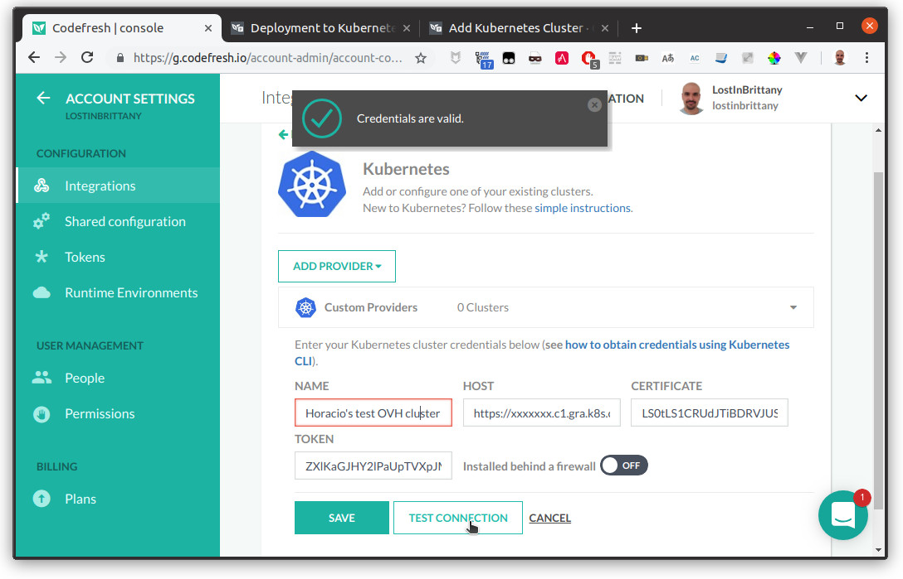

**Last updated March 8th, 2019**.

<style>
 pre {
     font-size: 14px;
 }
 pre.console {
   background-color: #300A24; 
   color: #ccc;
   font-family: monospace;
   padding: 5px;
   margin-bottom: 5px;
 }
 pre.console code {
   border: solid 0px transparent;
   font-family: monospace !important;
 }
 .small {
     font-size: 0.75em;
 }
</style>

In this tutorial we will see how you can connect [Codefresh](htts://codefrsh.io), a CI/CD platform for Kubernetes, to an OVH Managed Kubernetes cluster.


## Before you begin

The first thing you need to follow this tutorial is a Codefresh account, you can get it directly at [Codefresh](htts://codefrsh.io) site.

{.thumbnail}

This tutorial also presupposes that you already have a working OVH Managed Kubernetes cluster, and some basic knowledge of how to operate it. If you want to know more on those topics, please look at the [OVH Managed Kubernetes Service Quickstart](../deploying-hello-world/).


## Connect an OVH Kubernetes cluster to Codefresh dashboard

You can use the Codefresh GUI to connect your OVH Managed Kubernetes cluster to Codefresh. In Codefresh GUI, start by going into your *Account Configuration*, by clicking on *Account Settings* on the left sidebar. On the first section called *Integrations* click the *Configure* button next to Kubernetes.

{.thumbnail}

{.thumbnail}

As the current time, Codefresh doesn't propose a direct integration with OVH Managed Kubernetes Service, so you will have to add your cluster manually. To do it, click on the *Add provider* button and select *Custom providerx*.

{.thumbnail}

{.thumbnail}

{.thumbnail}

The integration between Codefresh and your Kubernetes cluster is API based and relies on a Kubernetes service account of your choosing that will be used to manage the integration.

The configurations you’ll be required to add are:

1. Name - Any name of your choosing, that will represent your cluster context in Codefresh.
1. Host - The full URL of the Kubernetes API endpoints including protocol and port
1. Certificate - The Kubernetes service account certificate used for the integration with Codefresh (base64 encoded)
1. Token - The Kubernetes service account token used for the integration with Codefresh (base64 encoded)

Let's see how you can obtain these parameters, using `kubectl`.

### Set the permissions

In order to allow Codefresh to connect to your cluster, you need to set up a `Role`, a `ServiceAccount` and a `RoleBinding`. Create a `codefresh-role-sa-bind.yml` YAML file:

```yaml
kind: ClusterRole
apiVersion: rbac.authorization.k8s.io/v1
metadata:
  name: codefresh-role
rules:
  - apiGroups: [""]
    resources: ["*"]
    verbs: ["list", "watch", "get"] 
---
apiVersion: v1
kind: ServiceAccount
metadata:
  name: codefresh-user
  namespace: kube-system
---
apiVersion: rbac.authorization.k8s.io/v1beta1
kind: ClusterRoleBinding
metadata:
  name: codefresh-user
roleRef:
  apiGroup: rbac.authorization.k8s.io
  kind: ClusterRole
  name: codefresh-role
subjects:
- kind: ServiceAccount
  name: codefresh-user
  namespace: kube-system
```

And apply it using `kubectl`:

```
kubectl apply -f codefresh-role-sa-bind.yml
```

The `Role`, the `ServiceAccount` and the `RoleBinding` are created: 

<pre class="console"><code>$ kubectl apply -f codefresh-role-sa-bind.yml 
clusterrole.rbac.authorization.k8s.io/codefresh-role created
serviceaccount/codefresh-user created
clusterrolebinding.rbac.authorization.k8s.io/codefresh-user created
</code></pre>


### Getting the *Host*

Use `kubectl` to get the full URL of the OVH Managed Kubernetes API endpoints:

```
kubectl cluster-info
```

The *Host* parameter is the URL of the Kubernetes master.


<pre class="console"><code>$ kubectl cluster-info
Kubernetes master is running at https://xxxxxxxx.c1.gra.k8s.ovh.net
KubeDNS is running at https://xxxxxxxx.c1.gra.k8s.ovh.net/api/v1/namespaces/kube-system/services/kube-dns:dns/proxy

To further debug and diagnose cluster problems, use 'kubectl cluster-info dump'.
</code></pre>

In my example cluster, the *Host* is `https://xxxxxxxx.c1.gra.k8s.ovh.net`.


### Getting the *Certificate*

Use `kubectl` to generate a certificate: 

```
echo $(kubectl get secret --namespace kube-system  -o go-template='{{index .data "ca.crt" }}' $(kubectl get sa codefresh-user --namespace kube-system -o go-template="{{range .secrets}}{{.name}}{{end}}"))

```

Copy the generated certificate into the *Certificate* field on Codefresh.

<pre class="console"><code>$ echo $(kubectl get secret --namespace kube-system  -o go-template='{{index .data "ca.crt" }}' $(kubectl get sa codefresh-user --namespace kube-system -o go-template="{{range .secrets}}{{.name}}{{end}}"))
LS0tLS1CRUdJTiBDRVJUSUZJQ0FURS0tLS0tCk1JSUZtVENDQTRHZ0F3SUJBZ0lCS2pBTkJna3Foa2lHOXcwQkFRc0ZBREF2TVMwd0t3WURWUVFERENReVlqRmsKWVdabFlTMWxNR1l6TFRRNU5UVXRPV1JqWkMxaFpqbGhNemd4TWpobFl6Z3dIaGNOTVRneE1EQTVNVGMxTVRVMQpXaGNOTWpNeE1EQTRNVGMxTVRVMVdqQXZNUzB3S3LS0tLS1CRUdJTiBDRVJUSUZJQ0FURS0tLS0tCk1JSUZtVENDQTRHZ0F3SUJBZ0lCS2pBTkJna3Foa2lHOXcwQkFRc0ZBREF2TVMwd0t3WURWUVFERENReVlqRmsKWVdabFlTMWxNR1l6TFRRNU5UVXRPV1JqWkMxaFpqbGhNemd4TWpobFl6Z3dIaGNOTVRneE1EQTVNVGMxTVRVMQpXaGNOTWpNeE1EQTRNVGMxTVRVMVdqQXZNUzB3S3LS0tLS1CRUdJTiBDRVJUSUZJQ0FURS0tLS0tCk1JSUZtVENDQTRHZ0F3SUJBZ0lCS2pBTkJna3Foa2lHOXcwQkFRc0ZBREF2TVMwd0t3WURWUVFERENReVlqRmsKWVdabFlTMWxNR1l6TFRRNU5UVXRPV1JqWkMxaFpqbGhNemd4TWpobFl6Z3dIaGNOTVRneE1EQTVNVGMxTVRVMQpXaGNOTWpNeE1EQTRNVGMxTVRVMVdqQXZNUzB3S3LS0tLS1CRUdJTiBDRVJUSUZJQ0FURS0tLS0tCk1JSUZtVENDQTRHZ0F3SUJBZ0lCS2pBTkJna3Foa2lHOXcwQkFRc0ZBREF2TVMwd0t3WURWUVFERENReVlqRmsKWVdabFlTMWxNR1l6TFRRNU5UVXRPV1JqWkMxaFpqbGhNemd4TWpobFl6Z3dIaGNOTVRneE1EQTVNVGMxTVRVMQpXaGNOTWpNeE1EQTRNVGMxTVRVMVdqQXZNUzB3S3LS0tLS1CRUdJTiBDRVJUSUZJQ0FURS0tLS0tCk1JSUZtVENDQTRHZ0F3SUJBZ0lCS2pBTkJna3Foa2lHOXcwQkFRc0ZBREF2TVMwd0t3WURWUVFERENReVlqRmsKWVdabFlTMWxNR1l6TFRRNU5UVXRPV1JqWkMxaFpqbGhNemd4TWpobFl6Z3dIaGNOTVRneE1EQTVNVGMxTVRVMQpXaGNOTWpNeE1EQTRNVGMxTVRVMVdqQXZNUzB3S3LS0tLS1CRUdJTiBDRVJUSUZJQ0FURS0tLS0tCk1JSUZtVENDQTRHZ0F3SUJBZ0lCS2pBTkJna3Foa2lHOXcwQkFRc0ZBREF2TVMwd0t3WURWUVFERENReVlqRmsKWVdabFlTMWxNR1l6TFRRNU5UVXRPV1JqWkMxaFpqbGhNemd4TWpobFl6Z3dIaGNOTVRneE1EQTVNVGMxTVRVMQpXaGNOTWpNeE1EQTRNVGMxTVRVMVdqQXZNUzB3S3LS0tLS1CRUdJTiBDRVJUSUZJQ0FURS0tLS0tCk1JSUZtVENDQTRHZ0F3SUJBZ0lCS2pBTkJna3Foa2lHOXcwQkFRc0ZBREF2TVMwd0t3WURWUVFERENReVlqRmsKWVdabFlTMWxNR1l6TFRRNU5UVXRPV1JqWkMxaFpqbGhNemd4TWpobFl6Z3dIaGNOTVRneE1EQTVNVGMxTVRVMQpXaGNOTWpNeE1EQTRNVGMxTVRVMVdqQXZNUzB3S3LS0tLS1CRUdJTiBDRVJUSUZJQ0FURS0tLS0tCk1JSUZtVENDQTRHZ0F3SUJBZ0lCS2pBTkJna3Foa2lHOXcwQkFRc0ZBREF2TVMwd0t3WURWUVFERENReVlqRmsKWVdabFlTMWxNR1l6TFRRNU5UVXRPV1JqWkMxaFpqbGhNemd4TWpobFl6Z3dIaGNOTVRneE1EQTVNVGMxTVRVMQpXaGNOTWpNeE1EQTRNVGMxTVRVMVdqQXZNUzB3S3LS0tLS1CRUdJTiBDRVJUSUZJQ0FURS0tLS0tCk1JSUZtVENDQTRHZ0F3SUJBZ0lCS2pBTkJna3Foa2lHOXcwQkFRc0ZBREF2TVMwd0t3WURWUVFERENReVlqRmsKWVdabFlTMWxNR1l6TFRRNU5UVXRPV1JqWkMxaFpqbGhNemd4TWpobFl6Z3dIaGNOTVRneE1EQTVNVGMxTVRVMQpXaGNOTWpNeE1EQTRNVGMxTVRVMVdqQXZNUzB3S3LS0tLS1CRUdJTiBDRVJUSUZJQ0FURS0tLS0tCk1JSUZtVENDQTRHZ0F3SUJBZ0lCS2pBTkJna3Foa2lHOXcwQkFRc0ZBREF2TVMwd0t3WURWUVFERENReVlqRmsKWVdabFlTMWxNR1l6TFRRNU5UVXRPV1JqWkMxaFpqbGhNemd4TWpobFl6Z3dIaGNOTVRneE1EQTVNVGMxTVRVMQpXaGNOTWpNeE1EQTRNVGMxTVRVMVdqQXZNUzB3S31NBQnUKLS0tLS1FTkQgQ0VSVElGSUNBVEUtLS0tLQo=
</code></pre>


### Getting the *Token*

Use `kubectl` to generate a token:

```
echo $(kubectl get secret --namespace kube-system -o go-template='{{index .data "token" }}' $(kubectl get sa codefresh-user --namespace kube-system -o go-template="{{range .secrets}}{{.name}}{{end}}"))
```

Copy the generated token into the *Token* field on Codefresh.

<pre class="console"><code>$ echo $(kubectl get secret -o go-template='{{index .data "token" }}' $(kubectl get sa default -o go-template="{{range .secrets}}{{.name}}{{end}}"))
ZXlKaGJHY2lPaUpTVXpJMU5pSXNJbXRwWkNJNklpSjkuZXlKcGMzTWlPaUpyZFdKbGNtNWxkR1Z6TDNObGNuWnBZMlZoWTJOdmRXNTBJaXdpYTNWaVpYSnVaWFJsY3k1cGJ5OXpaWEoyYVdObFlXTmpiM1Z1ZEM5dVlXMWxjM0JoWTJVaU9pSmtaV1poZFd4MElpd2lhM1ZpWlhKdVpYUmxjeTVwYnk5elpYSjJhV05sWVdOamIzVnVkQzZXlKaGJHY2lPaUpTVXpJMU5pSXNJbXRwWkNJNklpSjkuZXlKcGMzTWlPaUpyZFdKbGNtNWxkR1Z6TDNObGNuWnBZMlZoWTJOdmRXNTBJaXdpYTNWaVpYSnVaWFJsY3k1cGJ5OXpaWEoyYVdObFlXTmpiM1Z1ZEM5dVlXMWxjM0JoWTJVaU9pSmtaV1poZFd4MElpd2lhM1ZpWlhKdVpYUmxjeTVwYnk5elpYSjJhV05sWVdOamIzVnVkQzZXlKaGJHY2lPaUpTVXpJMU5pSXNJbXRwWkNJNklpSjkuZXlKcGMzTWlPaUpyZFdKbGNtNWxkR1Z6TDNObGNuWnBZMlZoWTJOdmRXNTBJaXdpYTNWaVpYSnVaWFJsY3k1cGJ5OXpaWEoyYVdObFlXTmpiM1Z1ZEM5dVlXMWxjM0JoWTJVaU9pSmtaV1poZFd4MElpd2lhM1ZpWlhKdVpYUmxjeTVwYnk5elpYSjJhV05sWVdOamIzVnVkQzZXlKaGJHY2lPaUpTVXpJMU5pSXNJbXRwWkNJNklpSjkuZXlKcGMzTWlPaUpyZFdKbGNtNWxkR1Z6TDNObGNuWnBZMlZoWTJOdmRXNTBJaXdpYTNWaVpYSnVaWFJsY3k1cGJ5OXpaWEoyYVdObFlXTmpiM1Z1ZEM5dVlXMWxjM0JoWTJVaU9pSmtaV1poZFd4MElpd2lhM1ZpWlhKdVpYUmxjeTVwYnk5elpYSjJhV05sWVdOamIzVnVkQzZXlKaGJHY2lPaUpTVXpJMU5pSXNJbXRwWkNJNklpSjkuZXlKcGMzTWlPaUpyZFdKbGNtNWxkR1Z6TDNObGNuWnBZMlZoWTJOdmRXNTBJaXdpYTNWaVpYSnVaWFJsY3k1cGJ5OXpaWEoyYVdObFlXTmpiM1Z1ZEM5dVlXMWxjM0JoWTJVaU9pSmtaV1poZFd4MElpd2lhM1ZpWlhKdVpYUmxjeTVwYnk5elpYSjJhV05sWVdOamIzVnVkQzSmtGQ3lxU01Rb3RqejFhNFc3R3VFQk03MlJjMUhZSUwtOHhSNy1aVzRBQU9jeGdxMVhyZ2F2LVZhRQ==
</code></pre>

  

### Test and save the connection

Click on the *Test connection* button to test the configuration. You should get a message telling you that your OVH Managed Kubernetes cluster connects successfully with Codefresh: 

{.thumbnail}

Then click on *Save* to save your cluster on your Codefresh Dashboard.


### And now?

Now you can follow [Codefresh official tutorial](https://codefresh.io/docs/docs/getting-started/deployment-to-kubernetes-quick-start-guide/) to deploy a Docker image to a Kubernetes cluster and also how to to setup an automated pipeline to automatically redeploy it when the source code changes.

{.thumbnail}

