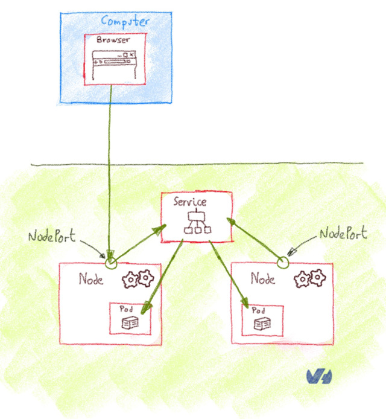
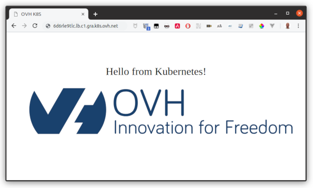

# Using the OVH Managed Kubernetes LoadBalancer

<style>
 pre {
     font-size: 14px;
 }
 pre.console {
   background-color: #300A24; 
   color: #ccc;
   font-family: monospace;
   padding: 5px;
   margin-bottom: 5px;
 }
 pre.console code {
   border: solid 0px transparent;
   font-family: monospace !important;
 }
 .small {
     font-size: 0.75em;
 }
</style>


In this tutorial we are explaining how to deploy services on OVH Managed Kubernetes service using our `LoadBalancer` to get external traffic into your cluster. We will begin by listing the main methods to expose Kubernetes services outside the cluster, with its advantages and disadvantage. Then  we will see a complete example of `LoadBalancer` service deployment.


## Before you begin

This tutorial presupposes that you already have a working OVH Managed Kubernetes cluster, and some basic knowledge of how to operate it. If you want to know more on those topics, please look at the [OVH Managed Kubernetes Service Quickstart](../deploying-hello-world/).


## Some concepts: ClusterIP, NodePort, Ingress and LoadBalancer

When you begin to use Kubernetes for real applications, one of the first questions if how to get external traffic into your cluster. The [official doc](https://kubernetes.io/docs/concepts/services-networking/service/#publishing-services-service-types) gives you a good but rather dry explanation on the topic, but here we are trying to explain the concepts in a minimal, need-to-know way.

There are several ways to route the external traffic into your cluster:

- Using Kubernetes proxy and `ClusterIP`: The default Kubernetes `ServiceType` is `ClusterIp`, that exposes the `Service` on a cluster-internal IP. To reach the `ClusterIp` from an external source, you can open a Kubernetes proxy between the external source and the cluster. Its is usually only used for development.

- Exposing services as `NodePort`: Declaring a `Service` of type `NodePort` exposes the service on each Node’s IP at a static port (the `NodePort`). You can then access the `Service` from the outside of the cluster by requesting `<NodeIp>:<NodePort>`. It can be used for production, with some limitations.

- Exposing services as `LoadBalancer`: Declaring a `Service` of type `LoadBalancer` exposes it externally using a cloud provider’s load balancer. The cloud provider will provision a load balancer for the `Service`, and map it to its automatically assigned `NodePort`. It is the most widely used method in production environments.

### Using Kubernetes proxy and ClusterIP

The default Kubernetes `ServiceType` is `ClusterIp`, that exposes the `Service` on a cluster-internal IP. To reach the `ClusterIp` from an external computer, you can open a Kubernetes proxy between the external computer and the cluster. 

You can use `kubectl` to create such a proxy. When the proxy is up, you're directly connected to the cluster, and you can use the `Services` internal IP (ClusterIp)


{.thumbnail}


This method isn't suited for a production environment, but it's interesting for development, debugging or other quick-and-dirty operations.

### Exposing services as NodePort

Declaring a service of type `NodePort` exposes the `Service` on each Node’s IP at a static port, the `NodePort` (a fixed port for that `Service`, in the default range of 30000-32767). You can then access the `Service` from the outside of the cluster by requesting `<NodeIp>:<NodePort>`. Every service you deploy as `NodePort` will ve exposed in its own port, on every Node.


{.thumbnail}


It's rather cumbersome to use `NodePort` `Services` in production. As you are using non-standard ports, you often need to set-up an external load balancer that listen in standard ports and redirects the traffic to  the `<NodeIp>:<NodePort>`.


 ### Exposing services as LoadBalancer

Declaring a service of type `LoadBalancer` exposes it externally using a cloud provider’s load balancer. The cloud provider will provision a load balancer for the `Service`, and map it to its automatically assigned `NodePort`.How the traffic from that external load balancer is routed to the `Service` pods depends on the cluster provider.


{.thumbnail}


The `LoadBalancer` is the best option for a production environnement, with two caveats:

- Every `Service` of type `LoadBalancer` you deploy will get it's own IP.
- The `LoadBalancer` is usually billed by the number of exposed services, it can be expensive.

> [!primary]
> We are currently offering OVH Managed Kubernetes LoadBalancer service as a free preview, until the end of summer 2019. During the free preview there is a limit of 6 active `LoadBalancer` per cluster. This limit can be exceptionally raised upon request though our support team


### What about Ingress

According to the [official documentation](https://kubernetes.io/docs/concepts/services-networking/ingress/), an `Ingress` is an API object that manages external access to the services in a cluster, typically HTTP. Whats the difference with the `LoadBalancer` or `NodePort`?

`Ingress` isn't a type of `Service`, but un object that acts as a [reverse proxy](https://en.wikipedia.org/wiki/Reverse_proxy), and single entrypoint to your cluster that routes the request to the different services. The most basic `Ingress` is the [NGINX Ingress Controller](https://github.com/kubernetes/ingress-nginx), where the NGINX take the role of reverse proxy, but also functions as SSL.

And Ingress is exposed to the outside of the cluster either via `ClusterIP` and Kubernetes proxy, `NodePort` or `LoadBalancer`, and it routes incoming traffic according to configured rules.

The main advance of using an `Ingress` behind a `LoadBalancer` is the cost: you can have lots of services behind a single `LoadBalancer`.


## Deploying LoadBalancer Services on OVH Managed Kubernetes clusters

In our OVH Managed Kubernetes we propose a load balancing service enabling you to use `LoadBalancer` `ServiceType`. We are currently offering OVH Managed Kubernetes LoadBalancer service as a free preview until the end of summer 2019. During the free preview there is a limit of 6 active `LoadBalancer` per cluster. This limit can be exceptionally raised upon request though our support team

## Deploying a Hello World LoadBalancer service 

Create a `hello.yaml` file for our `ovhplatform/hello` Docker image, defining the service type as `LoadBalancer`:

```
apiVersion: v1
kind: Service
metadata:
  name: hello-world
  labels:
    app: hello-world
spec:
  type: LoadBalancer
  ports:
  - port: 80
    targetPort: 80
    protocol: TCP
    name: http
  selector:
    app: hello-world
---
apiVersion: apps/v1
kind: Deployment
metadata:
  name: hello-world-deployment
  labels:
    app: hello-world
spec:
  replicas: 1
  selector:
    matchLabels:
      app: hello-world
  template:
    metadata:
      labels:
        app: hello-world
    spec:
      containers:
      - name: hello-world
        image: ovhplatform/hello
        ports:
        - containerPort: 80
```


And apply the file:

```
kubectl apply -f hello.yml
```

After applying the YAML file, a new `hello-world` service and the corresponding `hello-world-deployment` deployment are created:

<pre class="console"><code>$ kubectl apply -f  hello.yml
service/hello-world created
deployment.apps/hello-world-deployment created
</code></pre>

> [!primary]
> The application you have just deployed is a simple nginx server with a single static *Hello World* page. 
> Basically it just deploys the Docker image [`ovhplatform/hello`](https://hub.docker.com/r/ovhplatform/hello/)


### List the services

And now you're going to use `kubectl` to see your service:

```
kubectl get service hello-world -w
```

You should see your newly created service:

<pre class="console"><code>$ kubectl get services
NAME          TYPE           CLUSTER-IP    EXTERNAL-IP                        PORT(S)                      AGE
hello-world   LoadBalancer   10.3.81.234   &lt;pending>                          80:31699/TCP              9s
</code></pre>

As the `LoadBalancer` creation is asynchronous, and the provisioning of the load balancer can take several minutes, you will surely get a `&lt;pending>` `EXTERNAL-IP`. 

If you try again in a few minutes you should get an `EXTERNAL-IP`:

<pre class="console"><code>$ kubectl get service hello-world 
NAME          TYPE           CLUSTER-IP    EXTERNAL-IP                        PORT(S)        AGE
hello-world   LoadBalancer   10.3.81.234   6d6regsa9pc.lb.c1.gra.k8s.ovh.net   80:31699/TCP   4m
</code></pre>

For each service you deploy with LoadBalancer type, you will get a new sub-domain `XXXXXX.lb.c1.gra.k8s.ovh.net` to access the service. In my example that URL to access the service would be `http://6d6regsa9pc.lb.c1.gra.k8s.ovh.net`

> [!primary]
> The `LoadBalancer` is giving you a domain name and not an IP, because we anticipate a possible IP change at the end of the `LoadBalancer` free preview phase. The domain name will remain stable, so we prefer you to use it.
> This can be a problem if you're directing a domain name to your OVH Managed Kubernetes cluster, as to route your domain name to the `LoadBalancer` domain name you can only use `CNAME` records and not `A` ones.
> If you want to route a root domain, for which `CNAME` records aren't allowed, you could use an `A` record to the IP behind the `LoadBalancer` domain name, but if you do it, please be aware that the IP can change. 


### Testing your service

If you point your web browser to the service URL, the `hello-world` service will answer you:

{.thumbnail}


### Cleaning up

At the end you can proceed to clean up by deleting the service and the deployment.

Let's begin by deleting the service:

```
kubectl delete service hello-world
```

If you list the services you will see that `hello-world` doesn't exist anymore:

<pre class="console"><code>$ kubectl delete service hello-world
service "hello-world" deleted
$ kubectl get services
No resources found.
</code></pre>

Then, you can delete the deployment:

```
kubectl delete deploy hello-world-deployment
```

And now if you list you deployment you will find no resources:

<pre class="console"><code>$ kubectl delete deploy hello-world-deployment
deployment.extensions "hello-world-deployment" deleted
$ kubectl get deployments
No resources found.
</code></pre>


If now you list the pods:

```
kubectl get pods
```

you will see that the pod created for `hello-world` has been deleted too:

<pre class="console"><code>$ kubectl -n=default get pods
No resources found
</code></pre>
