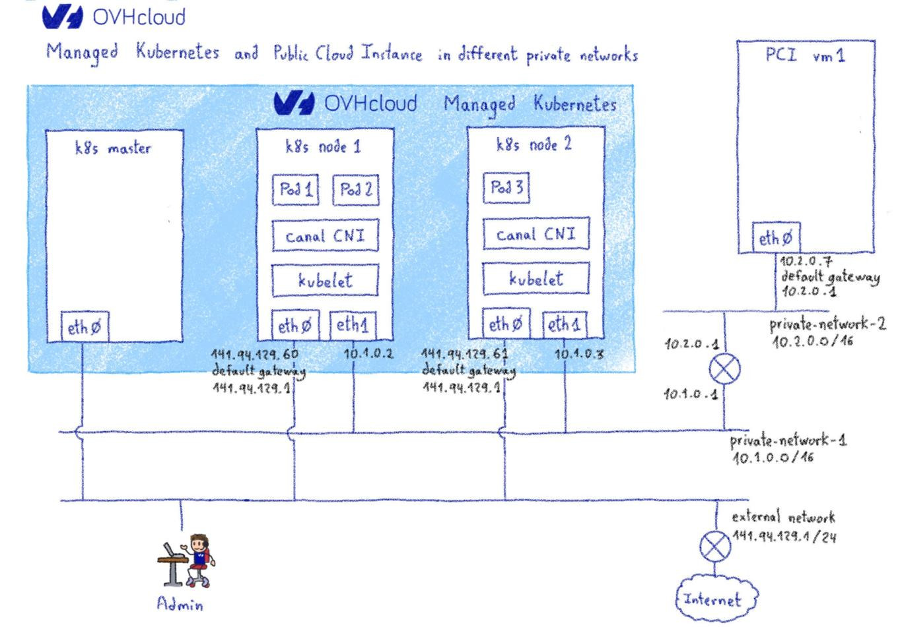
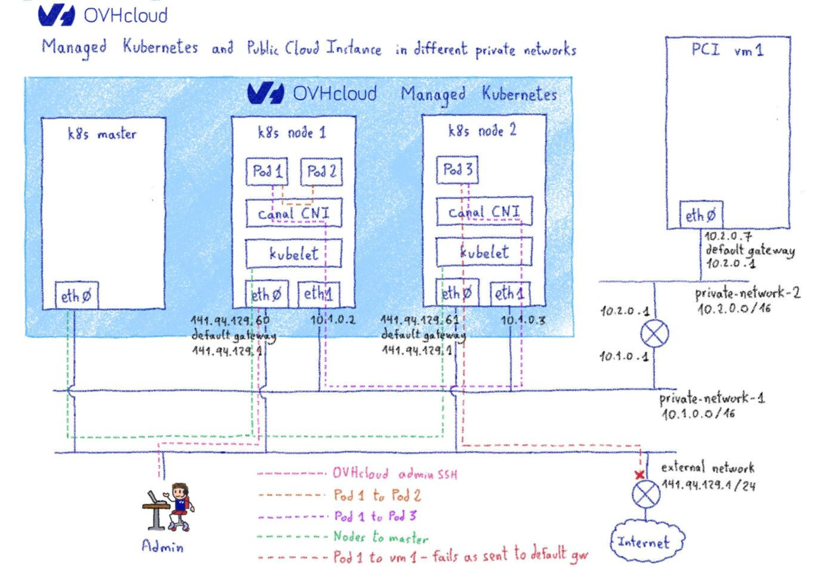

**Last updated July 31thth, 2021.**

## Objective

OVHcloud Managed Kubernetes service provides you Kubernetes clusters without the hassle of installing or operating them. 

By default, your Kubernetes clusters will have public IPs. For some uses cases, or for security reasons, you could prefer having your Kubernetes cluster inside a private network. 

OVHcloud [vRack](https://www.ovh.co.uk/solutions/vrack/) is a private networking solution that enables our customers to route traffic between OVHcloud dedicated servers as well as other OVHcloud services. 

When your Managed Kubernetes and your other services are both in vRack, but in different private networks, some extra configuration is needed. In this document, you will find an explanation of why this extra configuration is needed and how to do it.

> [!warning]
> The need of extra manual configuration described in this guide is **temporary**. Our Managed Kubernetes team is working on a more streamlined solution, as explained in [this issue](https://github.com/ovh/public-cloud-roadmap/issues/116) in our [Public Cloud roadmap](https://github.com/ovh/public-cloud-roadmap/).
>

In this document we suppose that you have some understanding of how to use OVHcloud Managed Kubernetes in the vRack. To get  ore information nn this topic you can look at the [Using vRack Private Network](../using_vrack/) guide and [../vrack-example-k8s-and-pci/](Working with vRack example - Managed Kubernetes and Public Cloud instances) tutorial.

## Networking in Managed Kubernetes inside the vRack

In order to better see why some extra configuration is needed, let's begin by explaining how the OVHcloud Managed Kubernetes integration with vRack private networks is done. 

### OVHcloud Managed Kubernetes without vRack

Let's have a look at our Managed Kubernetes without vRack. Both the master and the nodes have IP addresses in a network exposed on the internet:

{.thumbnail}

All the traffic between the master and the nodes is done using this IP addresses, as are administration traffic and traffic to/from resources external to the cluster.

{.thumbnail}

### OVHcloud Managed Kubernetes inside vRack

When you put an OVHcloud Managed Kubernetes cluster in a private network in the vRack, a new network interface connected to this private network is added to every node. 

{.thumbnail}

Using the addresses and names in the schema, each node have a `eth0` network interface to the external network, and a `eth1` to the private network. 

Communication between nodes and master, and admin traffic still passes by the `eth0`, by the external network. Pod to pod traffic, and traffic to the private network is routed through `eth1`. 

In order to do it, the default gateway for each node is in the external network, via their `eth0` interface, and only the traffic towards the private network is routed through `eth1`.

{.thumbnail}

For this use case, no additional configuration is needed, you simply has to choose the private network at the creation of your Managed Kubernetes cluster, as explained in the [Using vRack Private Network](../using_vrack/) guide and [../vrack-example-k8s-and-pci/](Working with vRack example - Managed Kubernetes and Public Cloud instances) tutorial.

### Communication between different private networks

In some use cases you don't want to have a single private network, but several ones, while keeping the capacity to communicate between them (one of the strong points of vRack is to allow a transparent communication between your private networks).

This use case currently asks for additional configuration on the OVHcloud Managed Kubernetes cluster side.

> [!warning]
> The need of extra manual configuration described in this guide is **temporary**. Our Managed Kubernetes team is working on a more streamlined solution, as explained in [this issue](https://github.com/ovh/public-cloud-roadmap/issues/116) in our [Public Cloud roadmap](https://github.com/ovh/public-cloud-roadmap/).

 The reason is the networking model we have detailed in the precedent point. Let's adapt the precedent schema to make the PCI virtual machine to be in a different private network than the Managed Kubernetes cluster:
 
{.thumbnail}

As explained before, in order to allow pod to master communication, the default gateway for Managed Kubernetes nodes is in the external network, by `eth0`, and only the traffic to the private network to which the cluster is attached is routed to `eth1`.

That means that if in our schema *Pod 3* wants to communicate with the PCI *vm1*, that is in a different private network, the traffic won't get routed to `eth1` but to `eth0` towards the default gateway, that has no access to *vm1*, thus the connection fails.

{.thumbnail}
