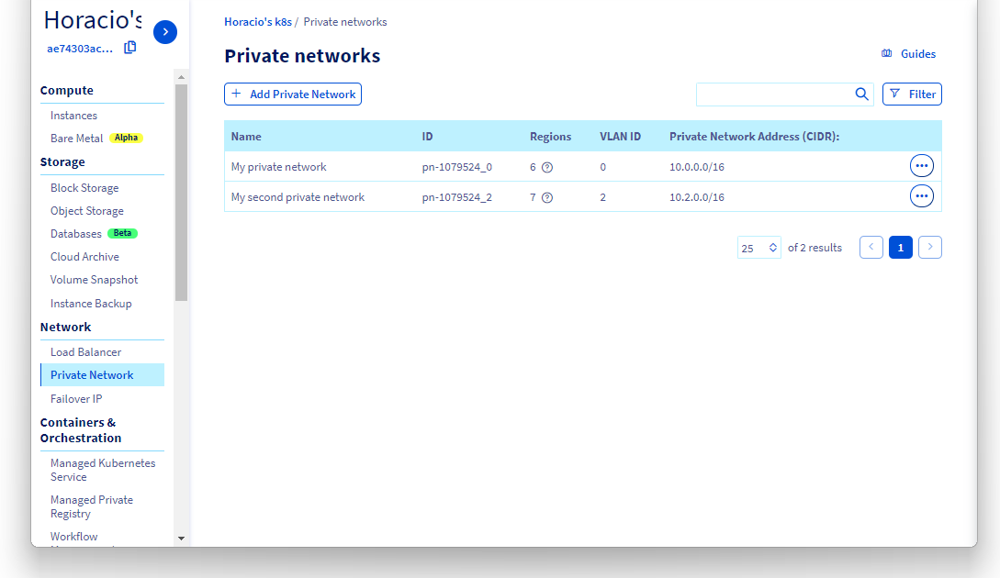
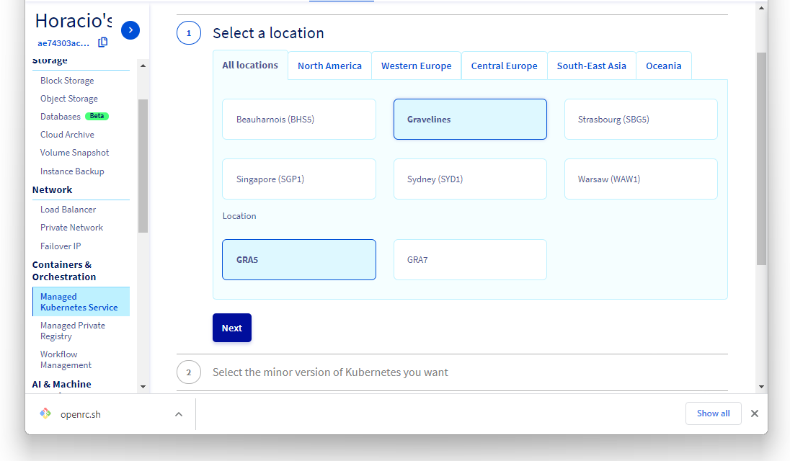
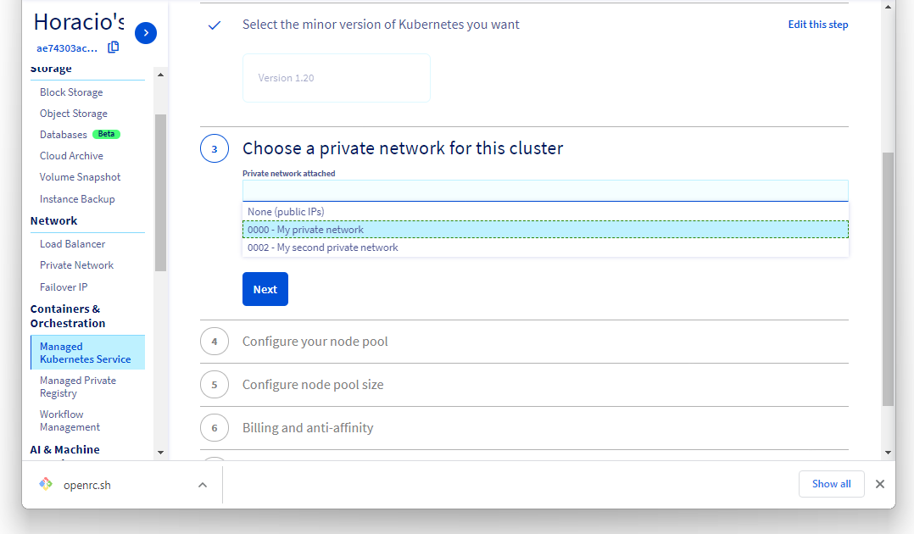
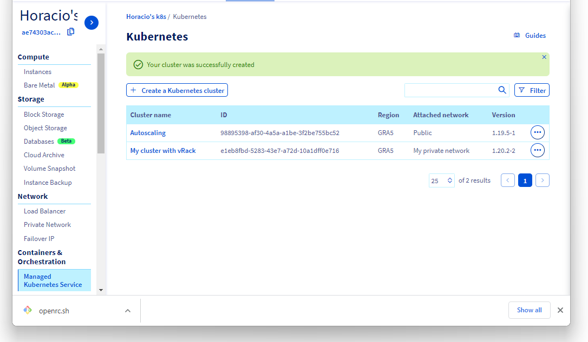

**Last updated July 31<sup>st</sup>, 2021.**

<style>
 pre {
     font-size: 14px;
 }
 pre.console {
   background-color: #300A24; 
   color: #ccc;
   font-family: monospace;
   padding: 5px;
   margin-bottom: 5px;
 }
 pre.console code {
   border: solid 0px transparent;
   font-family: monospace !important;
   font-size: 0.75em;
   color: #ccc;
 }
 .small {
     font-size: 0.75em;
 }
</style>

## Objective

OVHcloud [vRack](https://www.ovh.com.au/solutions/vrack/) is a private networking solution that enables our customers to route traffic between most OVHcloud services (dedicated servers, Public Cloud instances...). You can for example add Public Cloud instances, a baremetal servers and Managed Kubernetes clusters to your private network to create an private infrastructure of physical, virtual and containerized workloads.

Connecting a Managed Kubernetes cluster to another service in the same private network in the vRack is an easier process, as no network configuration is needed. Please have a look at our [Working with vRack example - Managed Kubernetes and Public Cloud instances](../vrack-example-k8s-and-pci/) tutorial to see an example in action.  

In this tutorial, we are going to activate the vRack on a Public Cloud project. Then we will create a Managed Kubernetes cluster and a Public Cloud instance (PCI). Eventually, both of them will be added inside the vRack but in **different private networks**. 

**In this tutorial we are going to give you an example of how to use the OVHcloud [vRack](https://www.ovh.com.au/solutions/vrack/) to connect a Managed Kubernetes cluster with a Public Cloud instance inside different private network.**

> [!warning]
> The method described in this tutorial is a **temporary one**, only required if you want to route traffic between different private networks in a single vRack. Our Managed Kubernetes team is working on a more streamlined solution for this advanced use case, as explained in [this issue](https://github.com/ovh/public-cloud-roadmap/issues/116) in our [Public Cloud roadmap](https://github.com/ovh/public-cloud-roadmap/).
>


## Requirements

This tutorial presupposes that you already have a working OVHcloud Managed Kubernetes cluster, and some basic knowledge of how to operate it. If you want to know more on those topics, please look at the [OVHcloud Managed Kubernetes Service Quickstart](../deploying-hello-world/).

You also need to have [Helm](https://docs.helm.sh/) installed on your workstation and your cluster. Please refer to the [How to install Helm on OVHcloud Managed Kubernetes Service](../installing-helm/) tutorial.

It also supposes that you already have followed the [Using vRack](../using_vrack/) guide to activate the vRack on your Public Cloud project and put your OVHcloud Managed Kubernetes cluster inside the vRack.  It will also be useful to have followed our [Working with vRack example - Managed Kubernetes and Public Cloud instances](../vrack-example-k8s-and-pci/) tutorial to understand the easier use case when both services are in the same private network.

And to understand why this configuration is needed, please have a look at the [Using vRack - Communicating between different private networks](../using-vrack-between-private-networks/) technical document.

> [!warning]
> This guide assumes you are familiar with the [OVHcloud API](https://ca.api.ovh.com/console/). If you have never used it, you can find the basics here: [First steps with the OVHcloud API](https://docs.ovh.com/au/en/api/first-steps-with-ovh-api/).
>

## Instructions

### Setting-up the vRack

First of all, we will need to set up vRack Private Network for our Public Cloud. To do it, we follow the [Configuring vRack for Public Cloud](../../public-cloud/public-cloud-vrack/) guide. 

As explained in the [known limits](../known-limits/) guide, the default subnet ranges for our private networks won't work with OVHcloud Managed Kubernetes, as the ranges `10.2.0.0/16` and `10.3.0.0/16` are reserved to internal Managed Kubernetes use.

Once we have created a vRack, we need to create two different Private Networks enabled at least on the region of our cluster (GRA5 in our example). The private networks created via the OVHcloud Manager have by-default ranges, that can't be easily modified. We are thus creating the private networks using the [OVHcloud API](https://ca.api.ovh.com/console/). 

For this example we are creating two private networks, `priv-net-01` & `priv-net-02`, with DHCP subnets with ranges of `10.0.1.0/24` et `10.0.2.0/24`.

We will use the `POST /cloud/project/{serviceName}/network/private` endpoint to create the private networks:

{.thumbnail}

And then we assign them the subnets using the `POST /cloud/project/{serviceName}/network/private/{networkId}/subnet` endpoint:

{.thumbnail}


### Retrieving the Openstack configuration file

Now we need to download the `openrc.sh` configuration file, as explained in the [Setting OpenStack environment variables](../../public-cloud/set-openstack-environment-variables/) guide. 

{.thumbnail}

We will be working on GRA5 region, so we download the *Gravelines (GRA5)* file.

{.thumbnail}

Following the steps on the [Setting OpenStack environment variables](../../public-cloud/set-openstack-environment-variables/) guide to be sure that the Openstack CLI is working on our workstation.


<pre class="console"><code>~$ source openrc.sh
Please enter your OpenStack Password:

~$ nova list
+--------------------------------------+---------------------+--------+------------+-------------+------------------------+
| ID                                   | Name                | Status | Task State | Power State | Networks               |
+--------------------------------------+---------------------+--------+------------+-------------+------------------------+
| 0bee959e-48fb-4a7d-94d0-35470837320d | horacio-workstation | ACTIVE | -          | Running     | Ext-Net=51.210.xxx.xxx |
  [...]                         
+--------------------------------------+---------------------+--------+------------+-------------+------------------------+
</code></pre>


### Configuring the private networks

Let's begin by getting the private networks openstack IDs using the openstack CLI:

> [!warning]
> In this case, `priv-net-01` has a subnet range of `10.0.1.0/24`, and `priv-net-02` has a subnet range of `10.0.2.0/24`, don't forget to adapt the commands to your specific subnet ranges.

```bash
PRIV_NET_01=$(openstack subnet list --subnet-range 10.0.1.0/24 --column ID -f value)
PRIV_NET_02=$(openstack subnet list --subnet-range 10.0.2.0/24 --column ID -f value)
```

Now we can configure `priv_net_01` with a static route to `priv_net_02`, and `priv_net_02` with a static route to `priv_net_01`:

```bash
openstack subnet set --host-route destination=10.0.2.0/24,gateway=10.0.1.1 $PRIV_NET_01
openstack subnet set --host-route destination=10.0.1.0/24,gateway=10.0.2.1 $PRIV_NET_02
```

In my case:

<pre class="console"><code>~$ PRIV_NET_01=$(openstack subnet list --subnet-range 10.0.1.0/24 --column ID -f value)
~$ PRIV_NET_02=$(openstack subnet list --subnet-range 10.0.2.0/24 --column ID -f value)
~$ $ echo $PRIV_NET_01
c03017c1-401e-49a0-bad0-852ec0efe7f5
~$ $ echo $PRIV_NET_02
f258dbbd-ae0b-40a6-8ce2-76e67837ce95
~$ openstack subnet set --host-route destination=10.0.2.0/24,gateway=10.0.1.1 $PRIV_NET_01
~$ openstack subnet set --host-route destination=10.0.1.0/24,gateway=10.0.2.1 $PRIV_NET_02
</code></pre>


### Setting up a PCI gateway


Now we are going to create a Public Cloud instance in GRA5, to act as a gateway for our vRack. 

{.thumbnail}

We are going to create an Ubuntu instance:

{.thumbnail}

We do NOT attach the instance to a private network yet, as you can unfortunately configure only one private network at the creation stage in the OVHcloud Manager. 

{.thumbnail}


#### Adding the two private networks

Once the gateway instance is created, we need to add the two private networks to its configuration.

Let's get the private networks and the PCI gateway Openstack IDs:

```bash
PRIV_NET_01_ID=$(openstack network list --name priv-net-01 --column ID -f value)
PRIV_NET_02_ID=$(openstack network list --name priv-net-02 --column ID -f value) 
INSTANCE_ID=$(openstack server list --name my-vrack-gateway --column ID -f value)
```

And add two private network interfaces, for the two private networks, with the addresses `10.0.1.1` and `10.0.1.1`:

```bash
openstack server add fixed ip --fixed-ip-address 10.0.1.1 ${INSTANCE_ID} ${PRIV_NET_01_ID}
openstack server add fixed ip --fixed-ip-address 10.0.2.1 ${INSTANCE_ID} ${PRIV_NET_02_ID}
```

Now we can verify that the gateway instance have two new private IPs:

```bash
openstack server show ${INSTANCE_ID} --column addresses -f value
```

As the last command also gave us the gateway instance public IP (in my example `54.38.255.196`), let's add it as shell variable:

```bash
INSTANCE_IP=54.38.255.196    # Don't forget to replace it with your instance public IP
```

In my case:

<pre class="console"><code>~$ PRIV_NET_01_ID=$(openstack network list --name priv-net-01 --column ID -f value)
~$ PRIV_NET_02_ID=$(openstack network list --name priv-net-02 --column ID -f value)
~$ INSTANCE_ID=$(openstack server list --name my-vrack-gateway --column ID -f value)
~$ $ echo "$PRIV_NET_01_ID | $PRIV_NET_02_ID | $INSTANCE_ID"
d2080f3f-285d-464a-aad8-74b935cf75e3 | b3cfb808-b4b7-406a-9e36-223c73747278 | 372b424a-ce4d-4e86-be67-4a8293f44f48
~$ openstack server add fixed ip --fixed-ip-address 10.0.1.1 ${INSTANCE_ID} ${PRIV_NET_01_ID}
~$ openstack server add fixed ip --fixed-ip-address 10.0.2.1 ${INSTANCE_ID} ${PRIV_NET_02_ID}
~$ openstack server show ${INSTANCE_ID} --column addresses -f value
Ext-Net=2001:41d0:305:1000::3e88, 54.38.255.196; priv-net-01=10.0.1.1; priv-net-02=10.0.2.1
~$ INSTANCE_IP=54.38.255.54 
</code></pre>


#### Adding and configuring the private network NICs to the gateway instance

Let's SSH into the gateway instance using its public IP:

```bash
ssh ubuntu@$INSTANCE_IP
```

And get the MAC addresses of the two private network interfaces (NICs):

```bash
ip addr show
```


Let's modify the network configuration to configure the two new NICs. Edit `/etc/netplan/50-cloud-init.yaml` (with a `sudo vim /etc/netplan/50-cloud-init.yaml`) and add the information for `ens7` and `ens8`:

`/etc/netplan/50-cloud-init.yaml`
```yaml
# This file is generated from information provided by the datasource.  Changes
# to it will not persist across an instance reboot.  To disable cloud-init's
# network configuration capabilities, write a file
# /etc/cloud/cloud.cfg.d/99-disable-network-config.cfg with the following:
# network: {config: disabled}
network:
    version: 2
    ethernets:
        ens3:
            dhcp4: true
            match:
                macaddress: fa:16:3e:75:96:e5
            mtu: 1500
            set-name: ens3
        ens7:
            dhcp4: false
            addresses: [10.0.1.1/24]
            match:
                macaddress: fa:16:3e:14:80:68
            set-name: ens7
        ens8:
            dhcp4: false
            addresses: [10.0.2.1/24]
            match:
                macaddress: fa:16:3e:17:b6:33
            set-name: ens8
```                    

And restart the network:

```bash
sudo netplan apply
```

In this case:

<pre class="console"><code>~$ ssh ubuntu@$INSTANCE_IP
Welcome to Ubuntu 21.04 (GNU/Linux 5.11.0-17-generic x86_64)

ubuntu@my-vrack-gateway:~$ ip addr show
[...]
3: ens7: <BROADCAST,MULTICAST> mtu 1500 qdisc noop state DOWN group default qlen 1000
    link/ether fa:16:3e:14:80:68 brd ff:ff:ff:ff:ff:ff
    altname enp0s7
4: ens8: <BROADCAST,MULTICAST> mtu 1500 qdisc noop state DOWN group default qlen 1000
    link/ether fa:16:3e:17:b6:33 brd ff:ff:ff:ff:ff:ff
    altname enp0s8
ubuntu@my-vrack-gateway:~$ sudo vim /etc/netplan/50-cloud-init.yaml
ubuntu@my-vrack-gateway:~$ sudo netplan apply
ubuntu@my-vrack-gateway:~$ ip addr show
[...]
3: ens7: <BROADCAST,MULTICAST,UP,LOWER_UP> mtu 1500 qdisc fq_codel state UP group default qlen 1000
    link/ether fa:16:3e:14:80:68 brd ff:ff:ff:ff:ff:ff
    altname enp0s7
    inet 10.0.1.1/24 brd 10.0.1.255 scope global ens7
       valid_lft forever preferred_lft forever
    inet6 fe80::f816:3eff:fe14:8068/64 scope link
       valid_lft forever preferred_lft forever
4: ens8: <BROADCAST,MULTICAST,UP,LOWER_UP> mtu 1500 qdisc fq_codel state UP group default qlen 1000
    link/ether fa:16:3e:17:b6:33 brd ff:ff:ff:ff:ff:ff
    altname enp0s8
    inet 10.0.2.1/24 brd 10.0.2.255 scope global ens8
       valid_lft forever preferred_lft forever
    inet6 fe80::f816:3eff:fe17:b633/64 scope link
       valid_lft forever preferred_lft forever
</code></pre>


#### Configuring the gateway instance to route the traffic between the two private networks

Now we can configure the gateway instance to route the traffic between the two private networks:

```bash
sudo sed -i 's/#net.ipv4.ip_forward=1/net.ipv4.ip_forward=1/' /etc/sysctl.conf
sudo sysctl -p
sudo iptables -t nat -A POSTROUTING ! -d 10.0.1.0/24 -o ens8 -j SNAT --to-source 10.0.2.1
sudo iptables -t nat -A POSTROUTING ! -d 10.0.2.0/24 -o ens7 -j SNAT --to-source 10.0.1.1
sudo apt update
sudo DEBIAN_FRONTEND=noninteractive apt-get -yq install iptables-persistent
```


In this case:

<pre class="console"><code>ubuntu@my-vrack-gateway:~$ sudo sed -i 's/#net.ipv4.ip_forward=1/net.ipv4.ip_forward=1/' /etc/sysctl.conf
ubuntu@my-vrack-gateway:~$ sudo sysctl -p
net.ipv4.ip_forward = 1
ubuntu@my-vrack-gateway:~$ sudo iptables -t nat -A POSTROUTING ! -d 10.0.1.0/24 -o ens8 -j SNAT --to-source 10.0.2.1
ubuntu@my-vrack-gateway:~$ sudo iptables -t nat -A POSTROUTING ! -d 10.0.2.0/24 -o ens7 -j SNAT --to-source 10.0.1.1
ubuntu@my-vrack-gateway:~$ sudo apt update
Get:1 http://security.ubuntu.com/ubuntu hirsute-security InRelease [101 kB]
[...]
Get:31 http://nova.clouds.archive.ubuntu.com/ubuntu hirsute-backports/universe amd64 c-n-f Metadata [192 B]
Fetched 1832 kB in 1s (1686 kB/s)
Reading package lists... Done
Building dependency tree... Done
Reading state information... Done
44 packages can be upgraded. Run 'apt list --upgradable' to see them.
ubuntu@my-vrack-gateway:~$ sudo DEBIAN_FRONTEND=noninteractive apt-get -yq install iptables-persistent
Reading package lists...
[...]
Building dependency tree...
Reading state information...
The following additional packages will be installed:
  netfilter-persistent
The following NEW packages will be installed:
  iptables-persistent netfilter-persistent
[...]
No user sessions are running outdated binaries.
</code></pre>

### Setting up the Managed Kubernetes attached to `priv_net_01`

Then we create a Kubernetes cluster in GRA5 region, attached to`priv_net_01`, as explained in the [Create a cluster](../creating-a-cluster/) guide. 


{.thumbnail}

Integrating a cluster into a vRack Private Network must be done at the third step on cluster creation, when we can choose an existing private network for the cluster:

{.thumbnail}

Our new cluster will be created inside `priv_net_01`.

In the Managed Kubernetes Service Dashboard, we can see the cluster, with the chosen private network in the *Attached network* column:

{.thumbnail}

Don't forget to grab your `kubeconfig` and configure `kubectl` to use it, as explained in the [Configuring kubectl on an OVHcloud Managed Kubernetes cluster](../configuring-kubectl/) guide.


### Setting up a PCI attached to `priv_net_02`

Now we can create a new Public Cloud instance, also in GRA5 region, and attach it to `priv_net_02` by following the [Integrating an instance into vRack](../../public-cloud/public-cloud-vrack/#step-3-integrating-an-instance-into-vrack_1) guide.

We are going to create an Ubuntu instance:

{.thumbnail}

In the fourth step of the creation, we call it `vrack-example-between-private-networks` and we attach it to `priv_net_02`:

{.thumbnail}

After the instance creation, we can see the connection details in the OVHcloud Control Panel. 


{.thumbnail}


If we log in to the instance using SSH, we can see that it has two network interfaces, one attached to the public IP address we use to log in, the other attached to the private network:

<pre class="console"><code>~$ ssh ubuntu@54.38.254.242
Welcome to Ubuntu 21.04 (GNU/Linux 5.11.0-18-generic x86_64)

  System information as of Fri Jun 18 04:37:54 UTC 2021

  System load:  0.35              Processes:             113
  Usage of /:   3.6% of 48.29GB   Users logged in:       0
  Memory usage: 3%                IPv4 address for ens3: 54.38.254.242
  Swap usage:   0%                IPv4 address for ens4: 10.0.2.142

ubuntu@example-vrack-k8s-pci:~$ exit
</code></pre>

Please take note of the private network IP address (in my case `10.0.2.142`), as we will need to use it later.

### Verifying that we can access the PCI from the Kubernetes cluster

Let's create a modified nginx pod to test our setup. Create a `shell-demo.yaml` manifest:

`shell-demo.yaml`
```yaml
apiVersion: v1
kind: Pod
metadata:
  name: shell-demo
spec:
  volumes:
  - name: shared-data
    emptyDir: {}
  containers:
  - name: nginx
    image: nginx
    volumeMounts:
    - name: shared-data
      mountPath: /usr/share/nginx/html
  hostNetwork: true
  dnsPolicy: Default
```

And deploy it in the cluster:

```bash
kubectl apply -f shell-demo.yaml
```


Now we can log in to the `shell-demo` pod and add some packages to allows us to verify if we can reach the instance on `priv_net_02` (in my example with the `10.0.2.142` IP address):

```bash
kubectl exec --stdin --tty shell-demo -- /bin/bash
apt update
apt install iproute2 iputils-ping
ping 10.0.2.142
traceroute 10.0.2.142
```

If everything happens as intended, we can reach the PCI instance in `priv_net_02` via the gateway:

<pre class="console"><code>~$ kubectl apply -f shell-demo.yaml
pod/shell-demo created
~$ kubectl get pod shell-demo
NAME         READY   STATUS    RESTARTS   AGE
shell-demo   1/1     Running   0          31s

~$ kubectl exec --stdin --tty shell-demo -- /bin/bash
root@nodepool-db0e5587-9718-4faf-b4-node-d69703:/# apt update
Get:1 http://security.debian.org/debian-security buster/updates InRelease [65.4 kB]
[...]

root@nodepool-db0e5587-9718-4faf-b4-node-d69703:/# apt install iproute2 iputils-ping
Reading package lists... Done
Building dependency tree
root@nodepool-db0e5587-9718-4faf-b4-node-d69703:/# ping 10.0.2.142
PING 10.0.2.142 (10.0.2.142) 56(84) bytes of data.
64 bytes from 10.0.2.142: icmp_seq=1 ttl=63 time=2.52 ms
64 bytes from 10.0.2.142: icmp_seq=2 ttl=63 time=1.01 ms
64 bytes from 10.0.2.142: icmp_seq=3 ttl=63 time=0.903 ms
64 bytes from 10.0.2.142: icmp_seq=4 ttl=63 time=1.02 ms
^C
--- 10.0.2.142 ping statistics ---
4 packets transmitted, 4 received, 0% packet loss, time 6ms
rtt min/avg/max/mdev = 0.903/1.361/2.519/0.671 ms

root@nodepool-db0e5587-9718-4faf-b4-node-d69703:/# traceroute 10.0.2.142
traceroute to 10.0.2.142 (10.0.2.142), 30 hops max, 60 byte packets
 1  10.0.1.1 (10.0.1.1)  1.259 ms  0.683 ms  0.471 ms
 2  10.0.2.142 (10.0.2.142)  1.694 ms * *
</code></pre>


### Verifying that we can access the Kubernetes cluster from the PCI

Let's create another nginx pod and expose it with a `NodePort` service:

```bash
kubectl run nginx --image=nginx
kubectl expose pod nginx --port 80 --type NodePort
```

We get the `NodePort` port and we store it in a variable:

```bash
kubectl get svc nginx -o=jsonpath='{.spec.ports[?(@.port==80)].nodePort}'
```

And the `priv_net_01` IP address of one of our Kubernetes nodes:

```bash
kubectl get nodes -o jsonpath='{.items[0].status.addresses[?(@.type=="InternalIP")].address}'
```

We can SSH again into the PCI instance, and do a `traceroute` to see if we can reach the node, and then a curl to the NodePort:

<pre class="console"><code>~$ kubectl run nginx --image=nginx
pod/nginx created
~$ kubectl expose pod nginx --port 80 --type NodePort
service/nginx exposed
~$ kubectl get svc nginx -o=jsonpath='{.spec.ports[?(@.port==80)].nodePort}'
30902
~$ kubectl get pod nginx -o jsonpath='{.status.hostIP}'
10.0.1.146
~$ ssh ubuntu@54.38.254.242
Welcome to Ubuntu 21.04 (GNU/Linux 5.11.0-18-generic x86_64)

  System information as of Fri Jun 18 04:37:54 UTC 2021

  System load:  0.0               Processes:             111
  Usage of /:   3.9% of 48.29GB   Users logged in:       0
  Memory usage: 2%                <b>IPv4 address for ens3: 54.38.254.242</b>
  Swap usage:   0%                <b>IPv4 address for ens4: 10.0.2.142</b>

ubuntu@vrack-example-between-private-networks:~$ sudo apt install traceroute
Reading package lists... Done
Building dependency tree... Done
Reading state information... Done
The following NEW packages will be installed:
  traceroute
[...]  

ubuntu@example-vrack-k8s-pci:~$  traceroute 10.0.1.146
traceroute to 10.0.1.146 (10.0.1.146), 30 hops max, 60 byte packets
 1  _gateway (10.0.2.1)  1.653 ms  1.584 ms  1.549 ms
 2  10.0.1.146 (10.0.1.146)  2.471 ms * *

ubuntu@vrack-example-between-private-networks:~$ curl 10.0.1.146:30902
&lt;!DOCTYPE html>
&lt;html>
&lt;head>
&lt;title>Welcome to nginx!&lt;/title>
&lt;style>
    body {
        width: 35em;
        margin: 0 auto;
        font-family: Tahoma, Verdana, Arial, sans-serif;
    }
&lt;/style>
&lt;/head>
&lt;body>
&lt;h1>Welcome to nginx!&lt;/h1>
<p>If you see this page, the nginx web server is successfully installed and
working. Further configuration is required.&lt;/p>

&lt;p>For online documentation and support please refer to
&lt;a href="http://nginx.org/">nginx.org&lt;/a>.&lt;br/>
Commercial support is available at
&lt;a href="http://nginx.com/">nginx.com&lt;/a>.&lt;/p>

&lt;p>&lt;em>Thank you for using nginx.&lt;/em>&lt;/p>
&lt;/body>
&lt;/html>
</code></pre>

## Go further

Join our community of users on <https://community.ovh.com/en/>.
