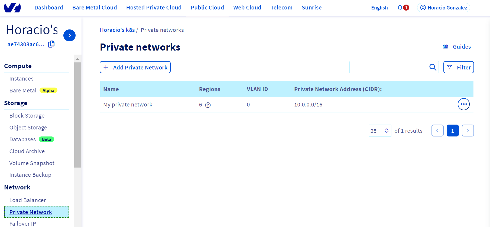
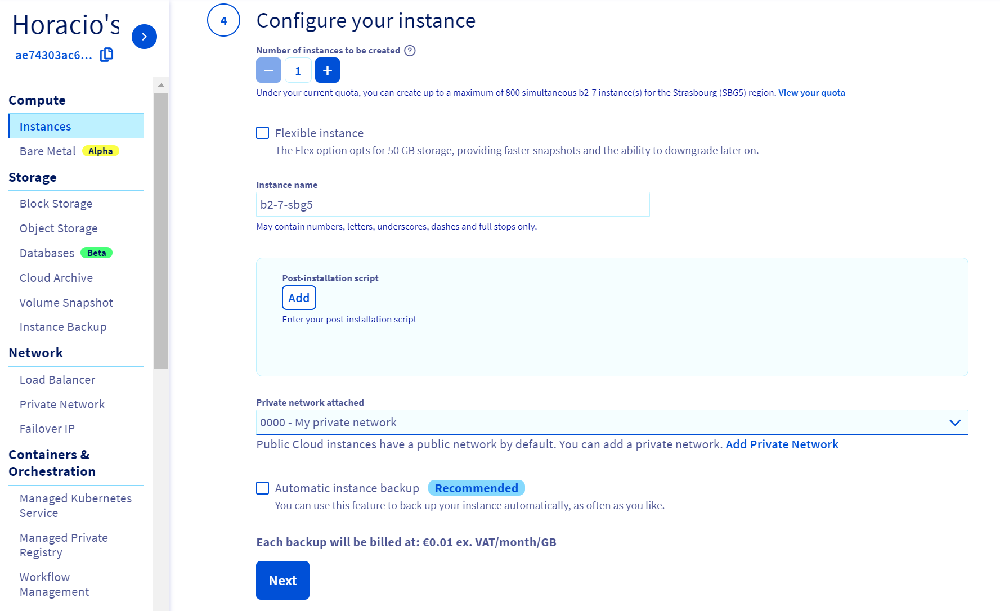
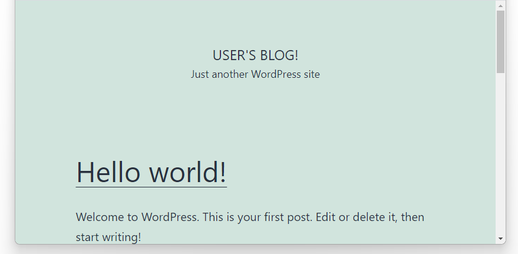

**Last updated July 27th<sup>th</sup>, 2021.**

<style>
 pre {
     font-size: 14px;
 }
 pre.console {
   background-color: #300A24; 
   color: #ccc;
   font-family: monospace;
   padding: 5px;
   margin-bottom: 5px;
 }
 pre.console code {
   border: solid 0px transparent;
   font-family: monospace !important;
   font-size: 0.75em;
   color: #ccc;
 }
 .small {
     font-size: 0.75em;
 }
</style>

## Objective

OVHcloud [vRack](https://www.ovh.com/sg/solutions/vrack/) is a private network solution that enables our customers to route traffic between OVHcloud dedicated servers as well as other OVHcloud services. At the same time, it allows you to add Public Cloud instances and Managed Kubernetes clusters to your private network to create an infrastructure of physical and virtual resources.

In this tutorial, we are going to activate the vRack on a Public Cloud project. Then we will create a Managed Kubernetes cluster and a Public Cloud instance (PCI). Eventually, both of them will be added inside the vRack. 

Concretely, we are going to install an OVHcloud Managed Kubernetes cluster and a Public Cloud instance, both of them in the same private network. We are going to deploy a [Wordpress](https://wordpress.org/){.external} on the Kubernetes cluster that will use the private network to connect to a [MariaDB database](https://mariadb.org/) installed on the Public Cloud instance.

**In this tutorial we are going to give you an example of how to use the OVHcloud [vRack](https://www.ovh.com/sg/solutions/vrack/) to connect a Managed Kubernetes cluster with a Public Cloud instance inside the same private network.**

> [!warning]
> The method described in this tutorial currently works if the Managed Kubernetes cluster and the external instance are in the same private network in the vRack. The process to connect them between *different* private networks will be described in a next tutorial.
>

## Requirements

This tutorial presupposes that you already have a working OVHcloud Managed Kubernetes cluster, and some basic knowledge of how to operate it. If you want to know more on those topics, please look at the [OVHcloud Managed Kubernetes Service Quickstart](../deploying-hello-world/).

You also need to have [Helm](https://docs.helm.sh/) installed on your workstation and your cluster. Please refer to the [How to install Helm on OVHcloud Managed Kubernetes Service](../installing-helm/) tutorial.

It also supposes that you already have followed the [Using vRack](../using-vrack/) guide to activate the vRack on your Public Cloud project and put your OVHcloud Managed Kubernetes cluster inside the vRack.


## Instructions

### Setting up the vRack

First of all, we will need to set up vRack Private Network for our Public Cloud. To do it, we follow the [Configuring vRack for Public Cloud](../../public-cloud/public-cloud-vrack/) guide. Once you have created a vRack and added it into a Private Network, you can continue. 

{.thumbnail}

> [!warning]
> As explained in the [Known limits](../known-limits/) guide, the following subnets are not compliant with the `vRack` feature and can generate some incoherent behaviours with our used overlay networks:
>

```bash
10.2.0.0/16 # Subnet used by pods
10.3.0.0/16 # Subnet used by services
172.17.0.0/16 # Subnet used by the Docker daemon
```


### Setting up the Managed Kubernetes

Then we create a Kubernetes cluster, as explained in the [Create a cluster](../creating-a-cluster/) guide. Integrating a cluster into a vRack Private Network must be done at the third step on cluster creation, when we can choose an existing private network for the cluster:

{.thumbnail}

Our new cluster will be created inside the vRack Private Network we have chosen.

In the Managed Kubernetes Service Dashboard, we can see the cluster, with the chosen private network in the *Attached network* column:

{.thumbnail}

### Setting up the PCI

Now we can create a new Public Cloud instance inside the vRack, by following the [Integrating an instance into vRack](../../public-cloud/public-cloud-vrack/#step-3-integrating-an-instance-into-vrack_1) guide.

We are going to create an Ubuntu instance:

{.thumbnail}

In the fourth step of creation, we attach it to the private network we created before:

{.thumbnail}

After instance creation, we can see the connection details in the OVHcloud Control Panel. If we log in to the instance using SSH, we can see that it has two network interfaces, one attached to the public IP address we use to log in, the other attached to the private network:

<pre class="console"><code>horacio@my-laptop:~$ ssh ubuntu@51.68.xxx.xxx
Enter passphrase for key '/home/horacio/.ssh/id_rsa':
Welcome to Ubuntu 21.04 (GNU/Linux 5.11.0-18-generic x86_64)

  System information as of Fri Jun 18 04:37:54 UTC 2021

  System load:  0.0               Processes:             111
  Usage of /:   3.9% of 48.29GB   Users logged in:       0
  Memory usage: 2%                <b>IPv4 address for ens3: 51.68.xxx.xxx</b>
  Swap usage:   0%                <b>IPv4 address for ens4: 10.0.128.251</b>

ubuntu@example-vrack-k8s-pci:~$</code></pre>

Please take note of the private network IP address (in this case `10.0.128.251`), as we will need to use it to configure WordPress.

### Setting up MariaDB on the PCI

#### Installing MariaDB

The easiest way to install MariaDB in the PCI is to use the `apt` package manager:

```bash
sudo apt -y install mariadb-server
```

That will install MariaDB and all its dependencies:

<pre class="console"><code>ubuntu@example-vrack-k8s-pci:~$ sudo apt -y install mariadb-server
Reading package lists... Done
Building dependency tree... Done
Reading state information... Done
The following additional packages will be installed:
  [...]
Suggested packages:
  [...]
The following NEW packages will be installed:
  [...]
0 upgraded, 31 newly installed, 0 to remove and 0 not upgraded.
Need to get 15.3 MB of archives.
After this operation, 102 MB of additional disk space will be used.
Get:1 http://nova.clouds.archive.ubuntu.com/ubuntu hirsute/main amd64 mysql-common all 5.8+1.0.5ubuntu2 [7496 B]
  [...]
Get:19 http://nova.clouds.archive.ubuntu.com/ubuntu hirsute/main amd64 libcgi-fast-perl all 1:2.15-1 [10.5 kB]
Setting up libfcgi-bin (2.4.2-2) ...
  [...]
Setting up mariadb-server (1:10.5.10-0ubuntu0.21.04.1) ...
Setting up libcgi-fast-perl (1:2.15-1) ...
Processing triggers for man-db (2.9.4-2) ...
Processing triggers for libc-bin (2.33-0ubuntu5) ...
Scanning processes...
Scanning linux images...

Running kernel seems to be up-to-date.

No services need to be restarted.

No containers need to be restarted.

No user sessions are running outdated binaries.</code></pre>

#### Creating a user and a database

Now we can connect to the database using the `mysql` client:

```bash
sudo mysql
```

By default, the root account has no password when connected from the localhost, so we directly arrive to the MariaDB CLI.

Let's create a `wordpress_db` database and a `wordpress_user` user:

1\. **Create the database:**
  
```sql
create database wordpress_db;
```

2\. **Create the user (with remote access) and grant privileges to this user on the new database:**

```sql
grant all privileges on wordpress_db.* TO 'wordpress_user'@'%' identified by 'a_strong_password';
```

3\. **Apply the changes to be sure that the modifications on the MariaDB grant tables take effect immediately:**

```sql
flush privileges;
```

The MariaDB instance is now ready.

<pre class="console"><code>ubuntu@example-vrack-k8s-pci:~$ sudo  mysql
Welcome to the MariaDB monitor.  Commands end with ; or \g.
Your MariaDB connection id is 37
Server version: 10.5.10-MariaDB-0ubuntu0.21.04.1 Ubuntu 21.04

Copyright (c) 2000, 2018, Oracle, MariaDB Corporation Ab and others.

Type 'help;' or '\h' for help. Type '\c' to clear the current input statement.

MariaDB [(none)]> create database wordpress_db;
Query OK, 1 row affected (0.000 sec)

MariaDB [(none)]> grant all privileges on wordpress_db.* TO 'wordpress_user'@'%' identified by 'a_strong_password';
Query OK, 0 rows affected (0.041 sec)

MariaDB [(none)]> flush privileges;
Query OK, 0 rows affected (0.001 sec)

MariaDB [(none)]> exit
Bye
ubuntu@example-vrack-k8s-pci:~$</code></pre>

#### Making MariaDB listen on the private network interface

By default, MariaDB only listens on localhost. In order to accept requests coming from the private network, we need to make it also listen on that network interface.

The easiest way to do it is by adding a `bind_address` line at the end of the global `/etc/my.cnf` configuration file:

```yaml
bind-address = <MARIADB_ADDRESS>
```

Where `<MARIADB_ADDRESS>` is the private network IP address of the MariaDB instance (in this case `10.0.128.251`).

Then restart MariaDB:

```bash
sudo service mariadb restart
```

And try to connect to MariaDB using that interface:

```bash
mysql -h<MARIADB_ADDRESS> -u wordpress_user -pa_strong_password
```

In this case:

<pre class="console"><code>~$ mysql -h10.0.128.251 -u wordpress_user -pa_strong_password
Welcome to the MariaDB monitor.  Commands end with ; or \g.
Your MariaDB connection id is 33
Server version: 10.5.10-MariaDB-0ubuntu0.21.04.1 Ubuntu 21.04

Copyright (c) 2000, 2018, Oracle, MariaDB Corporation Ab and others.

Type 'help;' or '\h' for help. Type '\c' to clear the current input statement.

MariaDB [(none)]> show databases;
+--------------------+
| Database           |
+--------------------+
| information_schema |
| wordpress_db       |
+--------------------+
2 rows in set (0.02 sec)

MariaDB [(none)]> 
</code></pre>

#### Accessing the MariaDB instance from the Managed Kubernetes cluster

To verify that the vRack is working as intended, let's test if we can access the MariaDB instance from the Managed Kubernetes cluster via the vRack.

We are deploying a MySQL client in the Kubernetes cluster, that will connect to the MariaDB instance using the vRack. Don't forget to replace `<MARIADB_ADDRESS>` with the private network IP address of the MariaDB instance (in this case `10.0.128.251`).

```bash
kubectl run -it --rm --image=mysql:5.6 --restart=Never mysql-client -- mysql -h <MARIADB_ADDRESS> -uwordpress_user  -pa_strong_password
```

<pre class="console"><code>~$ kubectl run -it --rm --image=mysql:5.6 --restart=Never mysql-client -- mysql -h 10.0.128.251 -uwordpress_user  -pa_strong_password
If you don't see a command prompt, try pressing enter.

mysql> show databases;
+--------------------+
| Database           |
+--------------------+
| information_schema |
| wordpress_db       |
+--------------------+
2 rows in set (0.01 sec)

mysql> exit
Bye
pod "mysql-client" deleted
</code></pre>

### Setting up WordPress

Now we have set up the database, we can deploy WordPress on the Kubernetes cluster. We are following a similar process as in our [Installing WordPress](../installing-wordpress) tutorial, but adapting it to use an external database.

#### Using the WordPress Helm chart

For this tutorial we are using the [WordPress Helm chart](https://github.com/bitnami/charts/tree/master/bitnami/wordpress){.external} found on [Bitnami repository](https://github.com/bitnami/charts/). The chart is fully configurable, but we will only need to tweak the external database parameters:

```
mariadb.enabled
externalDatabase.host
externalDatabase.user
externalDatabase.password
externalDatabase.database
externalDatabase.port
```

As `externalDatabase.host` we will need to use the MariaDB instance's private network IP address, that be written down after creating the PCI.

```
helm install my-first-k8s-wordpress bitnami/wordpress --set mariadb.enabled=false,externalDatabase.host=<MARIADB_ADDRESS>,externalDatabase.user=wordpress_user,externalDatabase.password=a_strong_password,externalDatabase.database=wordpress_db,externalDatabase.port=3306 
```

Don't forget to replace `<MARIADB_ADDRESS>` with the private network IP address of the MariaDB instance (in this case `10.0.128.251`).

<pre class="console"><code>~$ helm install my-first-k8s-wordpress bitnami/wordpress --set mariadb.enabled=false,externalDatabase.host=10.0.128.251,externalDatabase.user=wordpress_user,externalDatabase.password=a_strong_password,externalDatabase.database=wordpress_db,externalDatabase.port=3306
NAME: my-first-k8s-wordpress
LAST DEPLOYED: Tue Jul 27 11:11:48 2021
NAMESPACE: default
STATUS: deployed
REVISION: 1
TEST SUITE: None
NOTES:
** Please be patient while the chart is being deployed **

Your WordPress site can be accessed through the following DNS name from within your cluster:

    my-first-k8s-wordpress.default.svc.cluster.local (port 80)

To access your WordPress site from outside the cluster follow the steps below:

1. Get the WordPress URL by running these commands:

  NOTE: It may take a few minutes for the LoadBalancer IP to be available.
        Watch the status with: 'kubectl get svc --namespace default -w my-first-k8s-wordpress'

   export SERVICE_IP=$(kubectl get svc --namespace default my-first-k8s-wordpress --template "{{ range (index .status.loadBalancer.ingress 0) }}{{.}}{{ end }}")
   echo "WordPress URL: http://$SERVICE_IP/"
   echo "WordPress Admin URL: http://$SERVICE_IP/admin"

2. Open a browser and access WordPress using the obtained URL.

3. Login with the following credentials below to see your blog:

  echo Username: user
  echo Password: $(kubectl get secret --namespace default my-first-k8s-wordpress -o jsonpath="{.data.wordpress-password}" | base64 --decode)
</code></pre>

Then we can follow the instructions to get the Admin URL:

<pre class="console"><code>~$ export SERVICE_IP=$(kubectl get svc --namespace default my-first-k8s-wordpress --template "{{ range (index .status.loadBalancer.ingress 0) }}{{.}}{{ end }}")

~$ echo "WordPress URL: http://$SERVICE_IP/"
WordPress URL: http://152.228.251.63/

~$ echo "WordPress Admin URL: http://$SERVICE_IP/admin"
WordPress Admin URL: http://152.228.251.63/admin  
</code></pre>
  
And putting the URL in the browser will take us to the new blog, accessing the MariaDB database from the PCI instance via the vRack.

{.thumbnail}

## Go further

Join our community of users on <https://community.ovh.com/en/>.
