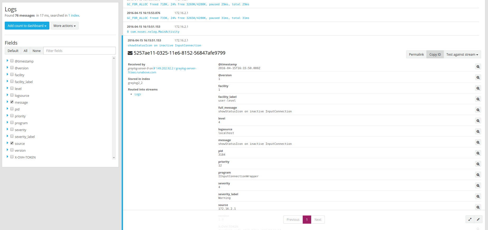

**Last updated 11th April, 2019**

## Objective

If you have a device running Android 4.4 KitKat or less, like a smart TV, a set-top box, simply a phone that hasn't been updated to Lollipop or newer, this guide will help you to monitor its network activity. [NXlog](https://nxlog.co){.external} has developed an Android app that allows you to send your device's logs to the Logs Data Platform. Its configuration is fairly simple and you will able to witness your logs in PaaS logs within minutes.


## Requirements

In order to follow this guide you will have to have created and activated your account on Logs Data Platform and be able to send your logs to a stream.

- [Activated your Logs Data Platform account.](https://www.ovh.com/fr/order/express/#/new/express/resume?products=~%28~%28planCode~%27logs-basic~productId~%27logs%29){.external}
- [To create at least one Stream and get its token.](../quick_start/guide.en-gb.md){.ref}

## Instructions

### Collector on the Logs Data Platform

In order to exploit the NXlogs on the Logs Data Platform you will need to setup a dedicated collector. The current Android Version of NXLog does not allow you to use your token inside your message like we did in the [Windows tutorial](../windows_nxlog/guide.en-gb.md){.ref}. But don't worry your personal collector on the  Logs Data Platform will gently take care of all of this stuff :-).

For simplicity, we will use a [Logstash Collector](../logstash_input/guide.en-gb.md){.ref} since it provides a syslog input right from the start.

#### Collector Configuration

In your Logs Data Platform Manager, add a collector by using the **add a new data-gathering tool** button. Name it, describe it, Put 4000 as the Exposed port (the port that we will send our logs to) and link it to one of your streams. Then you can click on the `Next`{.action} button to reach the configuration panel.

- On the Input section, use this very simple configuration :

```
 syslog {
     port => 4000
 }
```

Click on the `Test the configuration`{.action} button to validate it.

- On **Networking** panel, configure any firewall rule if you want to restrict your Input to specific IPs and click on **Update configuration**.
- Start the collector by clicking on Start on the **...** Menu in the Data-gathering tool Page. At the end of the deployment, you will obtain the address of your collector in the following form `<your_cluster>-<some_id>.<your_cluster>.logs.ovh.com`. This is the host to send your logs to.

## NXLog on Android

Android has a complex ecosystem with a lot of different devices and OS versions available. This tutorial has been successfully tested on devices with Android 4.4. No root is needed to use the NXLog application but note that some devices under this version may be incompatible. To download the application head to link in the Play Store : [NXLog on Play Store](https://play.google.com/store/apps/details?id=com.nxsec.nxlog){.external}. If your device is not compatible with the Play Store, head to the official download page of [NXLog](http://nxlog.co/products/nxlog-community-edition/download){.external}.

#### NXLog configuration

The default NXLog configuration is fairly simple, you just open the default configuration and you set the host and the port of the Output Module to the host and port you have obtained just before :

```ApacheConf hl_lines="4"
 <Output out>
     Module  om_tcp
     # Change the IP address and port below
     Host    <your_cluster>-<some_id>.<your_cluster>.logs.ovh.com
     Port    4000
     Exec    to_syslog_bsd();
 </Output>
```

Keep everything else in the same form and hit the button `Start`{.action} below.

If everything is alright you will have a log line that tells you the PID of the NXLog process.

### Logs on Graylog

Head to your Graylog stream (by using the link in your manager) to see your logs in your stream. As soon as your device does something, you'll know it!

{.thumbnail}

## Go further

- Getting Started: [Quick Start](../quick_start/guide.en-gb.md){.ref}
- Documentation: [Guides](../product.en-gb.md){.ref}
- Community hub: [https://community.ovh.com](https://community.ovh.com/en/c/Platform){.external}
- Create an account: [Try it free!](https://www.ovh.com/fr/order/express/#/new/express/resume?products=~%28~%28planCode~%27logs-basic~productId~%27logs%29){.external}
