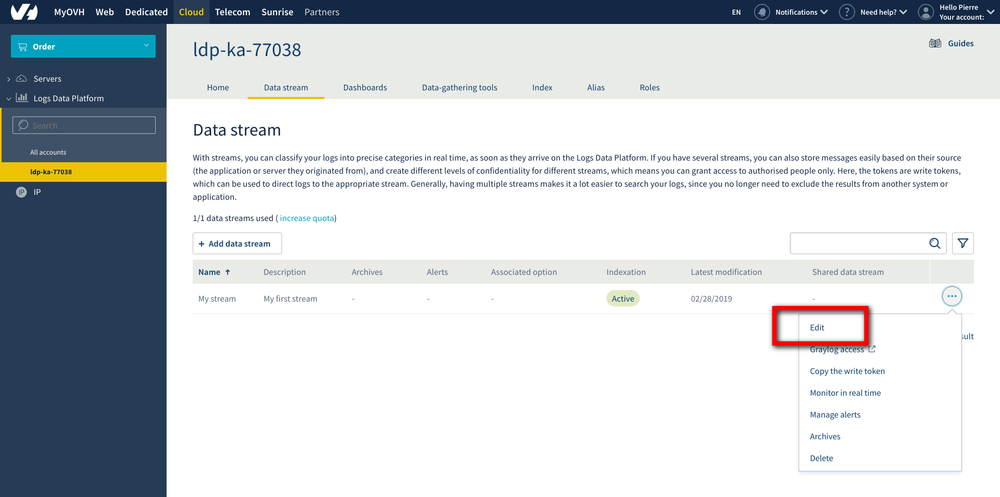
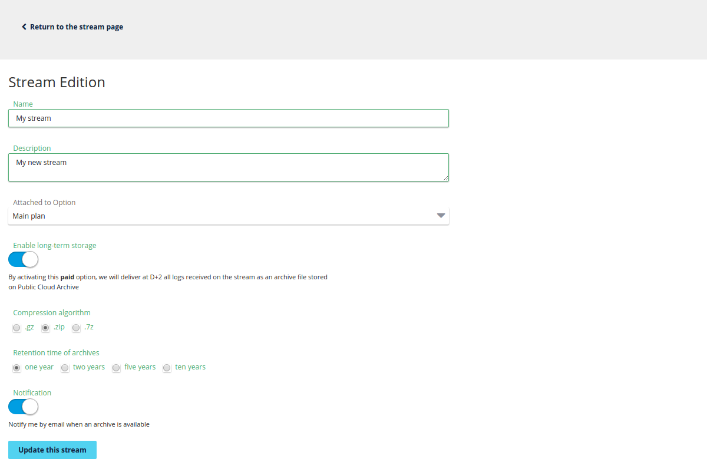
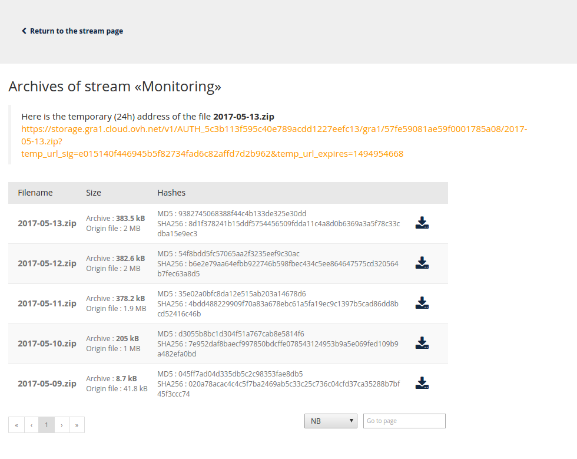

**Last updated 2nd April, 2019**

## Objective

The Logs Data Platform gives you a valuable log retention system, even with [the most basic plan](https://www.ovh.com/fr/data-platforms/logs/){.external}. But in some cases you may want to keep your logs beyond the provided duration. It can be for legal reasons, for analytic purposes or maybe only for historical ones. The long-term storage feature allows you to generate a daily archive of any stream with some simple configuration steps.

## Requirements

As implied in the title, you will need a stream. If you don't know what a stream is or if you don't have any, you can follow this [quick start tutorial](../quick_start/guide.en-gb.md){.ref}. You must edit the stream configuration to activate the cold storage. Click on the Edit button in the menu to go to the stream configuration page.

{.thumbnail}
 
## Instructions

### Activating cold storage on a stream

On this page you will find the long-term storage toggle. Once enabled, you will be able to choose different options:

- The compression algorithm. We currently support [GZIP](http://www.gzip.org/){.external}, [DEFLATE (AKA zip)](http://www.zlib.net/feldspar.html){.external}, [Zstandard](https://facebook.github.io/zstd/){.external} or [LZMA (used by 7-Zip)](http://www.7-zip.org/7z.html){.external}.
- The retention duration of your archives (from one year to ten years).
- The activation of the notification for each new archive available.

{.thumbnail}

As soon as you click on `Save`{.action}, the cold storage is activated. Here are some more things you need to know about this feature:

> [!warning]
> 
> As soon as the feature is activated, your logs will be stored for the specified duration. The effect is immediate so the billing of this feature will be also immediate.
> 
> - Deactivating the cold storage on a stream will prevent the producing of new archives but it won't delete the already produced archives. These archives will be kept for the duration configured.
> - Changing the retention duration WILL delete any archive exceeding the new retention (Ex: choosing a one year retention will implicitely delete all archives older than one year).
> - We push a daily archive of the 2 days old data you pushed.
> - When you activate the feature for the first time we can't create an archive for data older than two days before the activation.
> - Deleting the stream WILL delete any archive associated. The stream must be alive to be able to keep its archive.
>

### Retrieving the archives

#### Using the OVH Manager

On a cold storage enabled stream (you can quickly see if they are with the archive checkbox), you have a new `Archives`{.action} item on the bottom of the stream menu. Click on it to navigate to the archives pages. On this page, you have a list of the archives produced. Each archive is named after its date, so you can quickly retrieve an archive of a particular day. 

{.thumbnail}

From this page you can launch the "unfreezing" process of your archive and make it available for download. This delay varies between 10 minutes to 4 hours depending on multiple factors like the size of the archive. 
Once available, its status changes and a new `Download`{.action} action appears.

#### Using the API

If you want to download your logs using the API (to use them in a Big Data analysis platform for example), you can do all these steps by using the OVH api available at [https://api.ovh.com](https://api.ovh.com){.external}. You can try all these steps with the [OVH API Console](https://api.ovh.com/console/){.external}.

You will need your OVH service name associated with your account. Your service name is the login logs-xxxxx that is displayed in the left of the OVH Manager.

**Retrieve your stream using the streams API call**

> [!faq]
>
> Endpoint:
>
>> > [!api]
>> >
>> > @api {GET} /dbaas/logs/{serviceName}/output/graylog/stream
>> >
>>
>
> About:
>
>> Return the list of graylog streams.
> 
> Parameters:
>> serviceName *
>>> The internal ID of your Logs Data Platform service (string)

**Retrieve the list of your archives and its details with the corresponding endpoints**

> [!faq]
>
> Endpoint:
>
>> > [!api]
>> >
>> > @api {GET} /dbaas/logs/{serviceName}/output/graylog/stream/{streamId}/archive/{archiveId}
>> >
>>
>
> About:
>
>> Return details of specified archive.
> 
> Parameters:
>> serviceName *
>>> The internal ID of your Logs Data Platform service (string)
>> streamId *
>>> The stream you want archives from.
>> archiveId *
>>> The archive you want details from.

**You can generate a temporary URL download by using this following endpoint**

> [!faq]
>
> Endpoint:
>
>> > [!api]
>> >
>> > @api {POST} /dbaas/logs/{serviceName}/output/graylog/stream/{streamId}/archive/{archiveId}/url
>> >
>>
>
> About:
>
>> Get a public temporary URL to access the archive.
> 
> Parameters:
>> serviceName *
>>> The internal ID of your Logs Data Platform service (string)
>> streamId *
>>> The stream you want archives from.
>> archiveId *
>>> The archive you want details from.
>> expirationInSeconds
>>> The URL expiration duration in seconds.

Using this call will generate a URL. You will have to make a GET on this URL to start the unfreezing of your archive. The first call will be a **HTTP 429 Error Code** meaning you will have to retry after some time. The time you will have to wait is in the response Header **Retry-After** and is specified in seconds. For example here is the result of the call with a curl.

```shell-session
$ curl --verbose -XGET "https://storage.gra1.cloud.ovh.net/v1/AUTH_5c3b113f595c40e789acdd1/gra2/57fe5853ce210200010a8d3a/2017-05-14.zip?temp_url_sig=20837885e7115aaf45c30b851dbf4666335c014a&temp_url_expires=1495038473"
*   Trying 5.39.17.161...
* Connected to storage.gra1.cloud.ovh.net (5.39.17.161) port 443 (#0)
* found 173 certificates in /etc/ssl/certs/ca-certificates.crt
* found 704 certificates in /etc/ssl/certs
* ALPN, offering http/1.1
* SSL connection using TLS1.2 / ECDHE_RSA_AES_128_GCM_SHA256
*    server certificate verification OK
*    server certificate status verification SKIPPED
*    common name: storage.gra1.cloud.ovh.net (matched)
*    server certificate expiration date OK
*    server certificate activation date OK
*    certificate public key: RSA
*    certificate version: #3
*    subject: OU=Domain Control Validated,OU=PositiveSSL Multi-Domain,CN=storage.gra1.cloud.ovh.net
*    start date: Tue, 14 Feb 2017 00:00:00 GMT
*    expire date: Wed, 14 Feb 2018 23:59:59 GMT
*    issuer: C=GB,ST=Greater Manchester,L=Salford,O=COMODO CA Limited,CN=COMODO RSA Domain Validation Secure Server CA
*    compression: NULL
* ALPN, server did not agree to a protocol
> GET /v1/AUTH_5c3b113f595c40e789acdd1/gra2/57fe5853ce210200010a8d3a/2017-05-14.zip?temp_url_sig=20837885e7115aaf45c30b851dbf4666335c014a&temp_url_expires=1495038473 HTTP/1.1
> Host: storage.gra1.cloud.ovh.net
> User-Agent: curl/7.43.0
> Accept: */*
>
< HTTP/1.1 429 Too Many Requests
< Retry-After: 300
< Content-Length: 64
< Content-Type: text/html; charset=UTF-8
< X-Trans-Id: tx34c1342f0eb44d92b807b-00591b29c3
< X-Openstack-Request-Id: tx34c1342f0eb44d92b807b-00591b29c3
< Date: Tue, 16 May 2017 16:33:07 GMT
<
* Connection #0 to host storage.gra1.cloud.ovh.net left intact
<html><h1>Too Many Requests</h1><p>Too Many Requests.</p></html>
```

Here the **Retry-After** Header has a value of 300 seconds. After 300 seconds, you can issue the same call at the same URL to download the file.

#### Using ldp-archive-mirror

To allow you to get a local copy of all your cold stored archives on Logs Data Platform, we have developed an open source tool that will do this passively: **ldp-archive-mirror**
The installation and configuration procedure is described on the related [github page](https://github.com/ovh/ldp-archive-mirror){.external}

#### Content of the archive

The data you retrieve in the archive is by default in [GELF format](http://docs.graylog.org/en/latest/pages/gelf.html){.external}. It is ordered by the field timestamp and retain all additional fields that you would have add (with your [Logstash collector](../logstash_input/guide.en-gb.md){.ref} for example). Since this format is fully compatible with JSON, you can use it right away in any other system.

```json
 {"_facility":"gelf-rb","_id":11,"_monitoring":"cb1068c485e738655cfe10df5df3a9a185aa8e301b5c8d0747b3502e8fdcc157","_type":"direct","full_message":"monitoring message (11) at 2017-05-17 09:58:08 +0000","host":"shinken","level":1,"short_message":"monitoring msg (11)","timestamp":1.4950150886486998E9}
 {"_facility":"gelf-rb","_id":23,"_monitoring":"490de2b690eaab7aaf647cfaddb95e0fe51617985efad3afcce45ae931c41c97","_type":"direct","full_message":"monitoring message (23) at 2017-05-17 09:58:08 +0000","host":"shinken","level":1,"short_message":"monitoring msg (23)","timestamp":1.4950150888951592E9}
 {"_facility":"gelf-rb","_id":10,"_monitoring":"b6e4749eb577d8534e237f930b4fc9612a74012aab50fc01b2ef317db1125df1","_type":"direct","full_message":"monitoring message (10) at 2017-05-17 10:03:09 +0000","host":"shinken","level":1,"short_message":"monitoring msg (10)","timestamp":1.4950153892895508E9}
 {"_facility":"gelf-rb","_id":22,"_monitoring":"8b08f448859698e35cbcfeaac3a4c2eb21f08230292cbbd7a1dfce625ff1e633","_type":"direct","full_message":"monitoring message (22) at 2017-05-17 10:03:09 +0000","host":"shinken","level":1,"short_message":"monitoring msg (22)","timestamp":1.4950153895357378E9}
 {"_facility":"gelf-rb","_id":9,"_monitoring":"fe7f7c6f36a6a8de0333a8bee7576181448d96a79390bf7018b66dd96582c3ba","_type":"direct","full_message":"monitoring message (9) at 2017-05-17 10:08:09 +0000","host":"shinken","level":1,"short_message":"monitoring msg (9)","timestamp":1.49501568940605E9}
 {"_facility":"gelf-rb","_id":21,"_monitoring":"cc4f1dd33a01800ea95f88807053ad9d0ba6aecfddf5d9a4499230ea598adfb1","_type":"direct","full_message":"monitoring message (21) at 2017-05-17 10:08:09 +0000","host":"shinken","level":1,"short_message":"monitoring msg (21)","timestamp":1.495015689660263E9}
 {"_facility":"gelf-rb","_id":8,"_monitoring":"25c435285c4e5feb23a8997a33b3115e43f3979e17c1d89c5eb7aa209bf6fddb","_type":"direct","full_message":"monitoring message (8) at 2017-05-17 10:13:09 +0000","host":"shinken","level":1,"short_message":"monitoring msg (8)","timestamp":1.4950159899833767E9}
 {"_facility":"gelf-rb","_id":20,"_monitoring":"59d4615fed4a68661a3a154377a938f91cdb621df6b3d700a166f20540ceda31","_type":"direct","full_message":"monitoring message (20) at 2017-05-17 10:13:10 +0000","host":"shinken","level":1,"short_message":"monitoring msg (20)","timestamp":1.495015990229378E9}
 {"_facility":"gelf-rb","_id":7,"_monitoring":"ff558f06ab12e03cd9c5ff23ba0f8bebbdf939d00e5b8c2faaf3f7a03be8a6e0","_type":"direct","full_message":"monitoring message (7) at 2017-05-17 10:18:09 +0000","host":"shinken","level":1,"short_message":"monitoring msg (7)","timestamp":1.495016289332681E9}
```

You can also use a special field [X-OVH-TO-FREEZE](../field_naming_conventions/guide.en-gb.md){.ref} on your logs to craft an additional archive with only the value of this specific field at each line (along with the usual gelf archive). This file can be used for example to restore a common human readable log file.


## Go further

- Getting Started: [Quick Start](../quick_start/guide.en-gb.md){.ref}
- Documentation: [Guides](../product.en-gb.md){.ref}
- Community hub: [https://community.ovh.com](https://community.ovh.com/en/c/Platform){.external}
- Create an account: [Try it free!](https://www.ovh.com/fr/order/express/#/new/express/resume?products=~%28~%28planCode~%27logs-basic~productId~%27logs%29){.external}