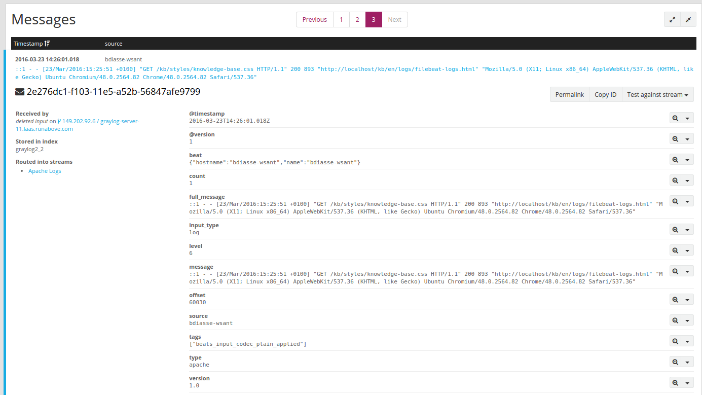

**Last updated 10th April, 2019**

## Objective

[Filebeat](https://github.com/elastic/beats/tree/master/filebeat){.external} is an open source file harvester, mostly used to fetch logs files and feed them into logstash. Together with Logstash, Filebeat is a really powerful tool that allows you to parse and send your logs to PaaS logs in a elegant and non intrusive way (except installing filebeat of course).

This guide will describe how to ask OVH to host your own dedicated Logstash on the Logs Data Platform and how to setup Filebeat on your system to forward your logs to it. It will also present you with some configuration setup you can use on Logstash to further structure your logs.

## Requirements

Note that in order to complete this tutorial, you should have at least:

- [Activated your Logs Data Platform account.](https://www.ovh.com/fr/order/express/#/new/express/resume?products=~%28~%28planCode~%27logs-basic~productId~%27logs%29){.external}
- [To create at least one Stream and get its token.](../quick_start/guide.en-gb.md){.ref}

## Instructions

### Simple Logstash 6.x Configuration on Logs Data Platform

This simple configuration is here to make it easier for you to see your logs, later on, you will find more advanced configurations that will breakdown your code. If you are already familiar with Logstash configuration on the Logs Data Platform, you can skip this one. Otherwise, it is a good start point to get it up and running. On Logs Data Platform manager, create a collector by doing the following:

1. Click on `Host a new data-gathering tool`{.action}
2. Give a name, a short description, select "Logstash 6.x" as engine,
3. Attach your Graylog stream to logstash by using the list. Please refer to [this guide first](../quick_start/guide.en-gb.md){.ref} if you need to create a new one.
4. Enter `5044` as exposed port. If you change it, you will have to also change it in the input section of your Logstash configuration.
5. Click on `Next`{.action}  to add it.
6. On `Configuration` panel, select **Filebeat** from our configuration wizard. It will fill the input, filter and grok sections with common Filebeat usage.

Once configured and tested, you can launch your Logstash by clicking on `Start`{.action} button. At the end the procedure, a hostname will appear in green, meaning your input has started. You will need this hostname for your Filebeat configuration.

### Setup Filebeat 6.X in your system

Filebeat supports many platforms as listed here [https://www.elastic.co/downloads/beats/filebeat](https://www.elastic.co/downloads/beats/filebeat){.external}

You can decide to setup Filebeat from a package or to compile it from source (you will need the latest [go compiler](https://golang.org/){.external} to compile it) or just download the binary to start immediately.

For this part, head to [Filebeat download website](https://www.elastic.co/downloads/beats/filebeat){.external} to download the best version for your distribution. On Linux, try the Linux 64 bit if you don't know which one to choose.

The following configuration files have been tested on the latest version of Filebeat available at the time of writing (**6.7.1**).

The Debian installation package will install the config file in the following directory: `/etc/filebeat/filebeat.yml`.


### Configure Filebeat 6.X on your system

In the following example we will enable Apache and Syslog support, but you can easily prospect [https://www.elastic.co/guide/en/beats/filebeat/6.7/filebeat-modules.html](anything else){.external}.

Filebeat expect a configuration file named **filebeat.yml** .

1. For the configuration to work, the important part is to replace *hosts: ["`<your_cluster>-XXXXXXXXXXXXXXXXXXX.<your_cluster>.logs.ovh.com:5044`"] with the hostname given by Logs Data Platform.
2. You should also put the SSL Certificate authority of the dedicated input into a file, (ex: /etc/ssl/certs/ldp.pem). The input SSL CA certificate is available in the **Home** page of the LDP manager.

#### Filebeat configuration

```yaml hl_lines="103 113"
###################### Filebeat Configuration Example #########################

# This file is an example configuration file highlighting only the most common
# options. The filebeat.reference.yml file from the same directory contains all the
# supported options with more comments. You can use it as a reference.
#
# You can find the full configuration reference here:
# https://www.elastic.co/guide/en/beats/filebeat/index.html

# For more available modules and options, please see the filebeat.reference.yml sample
# configuration file.

#=========================== Filebeat inputs =============================

filebeat.inputs:

# Each - is an input. Most options can be set at the input level, so
# you can use different inputs for various configurations.
# Below are the input specific configurations.

- type: log

  # Change to true to enable this input configuration.
  enabled: false

  # Paths that should be crawled and fetched. Glob based paths.
  paths:
    - /var/log/*.log
    #- c:\programdata\elasticsearch\logs\*

  # Exclude lines. A list of regular expressions to match. It drops the lines that are
  # matching any regular expression from the list.
  #exclude_lines: ['^DBG']

  # Include lines. A list of regular expressions to match. It exports the lines that are
  # matching any regular expression from the list.
  #include_lines: ['^ERR', '^WARN']

  # Exclude files. A list of regular expressions to match. Filebeat drops the files that
  # are matching any regular expression from the list. By default, no files are dropped.
  #exclude_files: ['.gz$']

  # Optional additional fields. These fields can be freely picked
  # to add additional information to the crawled log files for filtering
  #fields:
  #  level: debug
  #  review: 1

  ### Multiline options

  # Multiline can be used for log messages spanning multiple lines. This is common
  # for Java Stack Traces or C-Line Continuation

  # The regexp Pattern that has to be matched. The example pattern matches all lines starting with [
  #multiline.pattern: ^\[

  # Defines if the pattern set under pattern should be negated or not. Default is false.
  #multiline.negate: false

  # Match can be set to "after" or "before". It is used to define if lines should be append to a pattern
  # that was (not) matched before or after or as long as a pattern is not matched based on negate.
  # Note: After is the equivalent to previous and before is the equivalent to to next in Logstash
  #multiline.match: after


#============================= Filebeat modules ===============================

filebeat.config.modules:
  # Glob pattern for configuration loading
  path: ${path.config}/modules.d/*.yml

  # Set to true to enable config reloading
  reload.enabled: false

  # Period on which files under path should be checked for changes
  #reload.period: 10s

#================================ General =====================================

# The name of the shipper that publishes the network data. It can be used to group
# all the transactions sent by a single shipper in the web interface.
#name:

# The tags of the shipper are included in their own field with each
# transaction published.
#tags: ["service-X", "web-tier"]

# Optional fields that you can specify to add additional information to the
# output.
#fields:
#  env: staging

#================================ Outputs =====================================

# Configure what output to use when sending the data collected by the beat.

#----------------------------- Logstash output --------------------------------
output.logstash:
  # Boolean flag to enable or disable the output module.
  enabled: true

  # The Logstash hosts
  hosts: ["<your_cluster>-XXXXXXXXXXXXXXXXXX.<your_cluster>.logs.ovh.com:5044"]

  # Set gzip compression level.
  compression_level: 3

  # Enable SSL support. SSL is automatically enabled if any SSL setting is set.
  ssl.enabled: true

  # Optional SSL configuration options. SSL is off by default.
  # List of root certificates for HTTPS server verifications
  ssl.certificate_authorities: ["/etc/ssl/certs/ldp.pem"]

#================================ Processors =====================================

# Configure processors to enhance or manipulate events generated by the beat.

processors:
  - add_host_metadata: ~
  - add_cloud_metadata: ~

#================================ Logging =====================================

# Sets log level. The default log level is info.
# Available log levels are: error, warning, info, debug
#logging.level: debug

# At debug level, you can selectively enable logging only for some components.
# To enable all selectors use ["*"]. Examples of other selectors are "beat",
# "publish", "service".
#logging.selectors: ["*"]
```

#### SSL CA Certificate

Fill the value of **/etc/ssl/certs/ldp.pem** with the "Data-gathering tools" certificate you will find in the **Home** page of your service.

{.thumbnail}

#### Enable Apache Filebeat module

To enable the apache2 support on filebeat, call the following command:

```shell-session
$ ldp@ubuntu:~$ sudo filebeat modules enable apache2
```

It will generate a new module file: **/etc/filebeat/modules.d/apache2.yml**, please change it to include all your apache2 access/error path files:

```yaml hl_lines="8 16"
- module: apache2
  # Access logs
  access:
    enabled: true

    # Set custom paths for the log files. If left empty,
    # Filebeat will choose the paths depending on your OS.
    var.paths: ["/var/log/apache2/access.log*","/var/log/apache2/ssl_access.log*"]

  # Error logs
  error:
    enabled: true

    # Set custom paths for the log files. If left empty,
    # Filebeat will choose the paths depending on your OS.
    var.paths: ["/var/apache2/httpd/error_log*","/var/log/apache2/ssl_error_log*"]
```

#### Enable System Filebeat module

Syslog and authentication supports are part of the system filebeat module, to enable it:

```shell-session
$ ldp@ubuntu:~$ sudo filebeat modules enable system
```

Once again, it will generate a file **/etc/filebeat/modules.d/system.yml**

```yaml hl_lines="8 16"
- module: system
  # Syslog
  syslog:
    enabled: true

    # Set custom paths for the log files. If left empty,
    # Filebeat will choose the paths depending on your OS.
    var.paths: ["/var/log/syslog*"]

  # Authorization logs
  auth:
    enabled: true

    # Set custom paths for the log files. If left empty,
    # Filebeat will choose the paths depending on your OS.
    var.paths: ["/var/log/auth.log*"]
```

Ensure both file path exists on your system.

##### Launch Filebeat

Launch the Filebeat binary or service to test your config file and head to your apache website for an example of how to send some logs. You will see this kind of log in Graylog:

```shell-session
$ ldp@ubuntu:~$ sudo systemctl restart filebeat.service
```

or

```shell-session
$ ldp@ubuntu:~$ sudo /etc/init.d/filebeat restart
```

{.thumbnail}

Note the type value (apache or syslog or apache-error) that indicates the source file of the log message. You can easily display only your apache access logs for example by typing in the search bar **fileset_module:apache2**.

### Conclusion and useful resources

Filebeat is a really useful tool to send the content of your current log files to Logs Data Platform. Combined with the filter in Logstash, it offers a clean and easy way to send your logs without changing the configuration of your software. There is a lot you can do with Logstash and Filebeat. Don't hesitate to check the links below to master these tools.

- Configuration's details: [https://www.elastic.co/guide/en/beats/filebeat/current/filebeat-configuration-details.html](https://www.elastic.co/guide/en/beats/filebeat/current/filebeat-configuration-details.html){.external}
- Getting started: [https://www.elastic.co/guide/en/beats/filebeat/current/filebeat-getting-started.html](https://www.elastic.co/guide/en/beats/filebeat/current/filebeat-getting-started.html){.external}
- Grok Patterns Documentation: [https://www.elastic.co/guide/en/logstash/current/plugins-filters-grok.html](https://www.elastic.co/guide/en/logstash/current/plugins-filters-grok.html){.external}
- Current Grok Pattern reference: [https://github.com/logstash-plugins/logstash-patterns-core/tree/master/patterns](https://github.com/logstash-plugins/logstash-patterns-core/tree/master/patterns){.external}
- Even a logstash_forwarder to filebeat tutorial: [https://www.elastic.co/guide/en/beats/filebeat/current/migrating-from-logstash-forwarder.html](https://www.elastic.co/guide/en/beats/filebeat/current/migrating-from-logstash-forwarder.html){.external}

## Go further

- Getting Started: [Quick Start](../quick_start/guide.en-gb.md){.ref}
- Documentation: [Guides](../product.en-gb.md){.ref}
- Community hub: [https://community.ovh.com](https://community.ovh.com/en/c/Platform){.external}
- Create an account: [Try it free!](https://www.ovh.com/fr/order/express/#/new/express/resume?products=~%28~%28planCode~%27logs-basic~productId~%27logs%29){.external}
