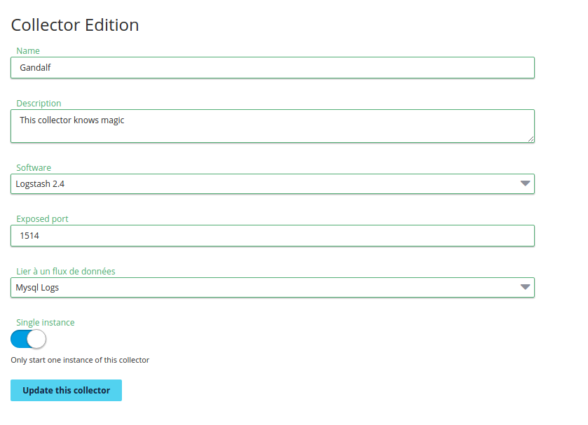
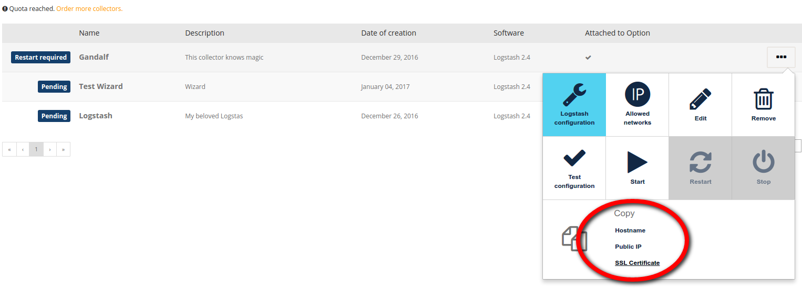
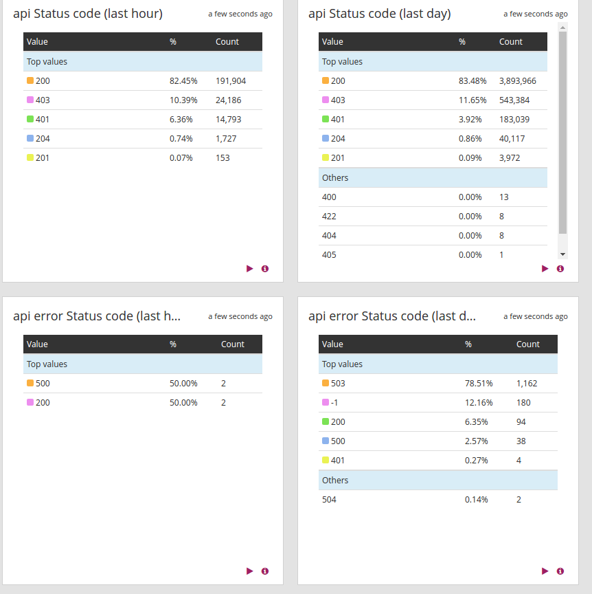

**Last updated 10th April, 2019**

## Objective

[HAProxy](http://www.haproxy.org/){.external} is the de-facto standard load balancer for your TCP and HTTP based applications. This French software provides high availability, load balancing, and proxying with high performance, unprecedented reliability and a very fair price (it's completely free and open-source). It is used by the world most visited web sites and is also heavily used internally at OVH and in some of our products.

HAProxy has a lot of features and because it is located between your infrastructure and your clients, it can give you a lot of information about either of them. Logs Data Platform helps you to exploit this data and can answer to a lot of your questions:

- What is the most visited webpage?
- What is the slowest API Call?
- When is your traffic at its peak?
- How much data is going out from your infrastructure?
- Where are your clients from?
- How long do your clients stay on your websites?
- Are all of your back-end servers healthy?

This guide will show you two ways to forward your HAProxy logs to the Logs Data Platform. Both ways will use [rsyslog](http://www.rsyslog.com/){.external} to send logs. The first configuration will leverage Logstash parsing capabilities, and the second will use the custom log format feature of HAProxy to send logs using the [LTSV Format](http://ltsv.org/){.external}.

## Requirements

For this tutorial, you should have read the following ones to fully understand what's next:

- [Starting with Logs Data Platform.](../quick_start/guide.en-gb.md){.ref}
- [Field Naming conventions of Logs Data Platform.](../field_naming_conventions/guide.en-gb.md){.ref}
- [How to setup a Logstash input?](../logstash_input/guide.en-gb.md){.ref}

## Instructions

### HAProxy&#58;

HAProxy is a powerful software with many configuration options available. Fortunately the [configuration documentation](http://www.haproxy.org/download/1.9/doc/configuration.txt){.external} is very complete and cover everything you need to know for this tutorial. This tutorial is not a HAProxy tutorial so it will not cover how to install, configure and deploy HAProxy but you will find material on the matter [on the offical website](http://www.haproxy.org/#docs){.external}. Depending on your backend you have the choice between several formats for your logs:

- **Default format**: Despite giving some information about the client and the destination, this format is not really verbose and cannot really be used for any deep analysis.
- **Tcp Log format**: This format gives you much more information for troubleshooting your tcp connections and is the one you should use when you have no idea what type of application is started behind your backend.
- **Http Log Format**: As the name suggests, this format is the most suitable option to analyze the  protocol. Of course it only makes sense when your HAProxy is acting as a HTTP proxy. It gives even more information than the tcp log like the HTTP status code for example.
- **Custom Log Format**: This one allows you to fully customize the log format by using flags. You fully control what information you log.

Here is an example of a log line with the HTTP log format :

```text
 haproxy[14389]: 5.196.2.38:39527 [03/Nov/2015:06:25:25.105] services~ api/api 4599/0/0/428/5027 304 320 - - ---- 1/1/0/1/0 0/0 "GET /v1/service HTTP/1.1"
```

Every block of this line (including the dashes characters) gives one piece of information about the terminated connection. On this single line you have information about the process, its pid, the client ip, the client port, the date of the opening of the connection, the frontend, backend and server names, timers in milliseconds waiting for the client, process buffers, and server, the status code, the number of bytes read, the cookies information, the termination state, the number of concurrent connection respectively on the process, the frontend, the backend and the servers, the number of retries, the backend queue number and finally the request itself. You can visit the chapter 8 [on HAProxy Documentation](http://www.haproxy.org/download/1.6/doc/configuration.txt){.external} to have a detailed description on all these formats and on the available fields.

To activate the logging on HAProxy you must set a global **log** option on the **/etc/haproxy/haproxy.cfg**.

```text
 global
     log /dev/log    local0
     log /dev/log    local1 notice
     chroot /var/lib/haproxy
     stats socket /run/haproxy/admin.sock mode 660 level admin
     stats timeout 30s
     user haproxy
     group haproxy
     daemon
```

This option tells HAProxy to route logs to the **/dev/log** socket with different syslog facilities: **local0** facility by default and **local1** for notice level messages. To specify the logging type for a backend, a frontend or a listen directive you use a simple option:

```text
 listen my_tcp_application
   bind 172.XXX.XXX.XXX:53100
   mode tcp
   option  tcplog
   option  tcpka
   timeout client  1h
   timeout server  1h
   maxconn 64510
   bind-process 2
   server lb-cloud-1 192.168.XXX.XXX:53100 check port 53100 weight 1 backup
   server lb-cloud-2 192.168.XXX.XXX:53100 check port 53100 weight 10
```

### Rsyslog&#58;

[Rsyslog](http://www.rsyslog.com){.external} is a fast log processor fully compatible with the syslog protocol. It has evolved into a generic collector able to accept entries from a lot of different inputs, transform them and finally send them to various destinations. Installation and configuration documentation can be found at the official website. Head to [http://www.rsyslog.com/doc/v8-stable/](http://www.rsyslog.com/doc/v8-stable/){.external} for detailed information.

To send HAProxy logs to Logs Data Platform, we will use several methods: a [dedicated Logstash collector](../logstash_input/guide.en-gb.md){.ref} and the plain [LTSV format](http://ltsv.org){.external}. The first method is the least intrusive and can be used when you need Logstash processing of your logs (for example to anonymize some logs under some conditions. The second method should be preferred when you have a high traffic website (at least 1000 requests by second.).

For both methods you will need our SSL certificate to enable TLS communication. Some Debian Linux distributions need you to install the package **rsyslog-gnutls** to enable SSL.

### Exploit a dedicated Logstash Data-Gathering tool

Once you have activated the tcp or http logs of your HAProxy instance, you must then send them and transform them. For this part of the tutorial you will need your own dedicated Logstash collector. Logstash is one of the most powerful tool to transform logs. Create a Logstash data-gathering tool as described in the [Logstash tutorial](../logstash_input/guide.en-gb.md){.ref}, and configure the port **1514** (or the port of your choice) as the exposed port.

{.thumbnail}

#### Logstash collector configuration

As you may guess we have to configure the Logstash collector with some clever [Grok filters](https://www.elastic.co/guide/en/logstash/6.7/plugins-filters-grok.html){.external} to make the collector be aware of our [field naming convention](../field_naming_conventions/guide.en-gb.md){.ref}. The collector will accept logs in a generic [TCP input](https://www.elastic.co/guide/en/logstash/6.7/plugins-inputs-tcp.html){.external} and use grok filters to extract the information. Thanks to the wizard feature, you won't even need to copy and paste the following configuration snippets, but they are still given for reference purpose.

Here is the Logstash input configuration:

```ruby
tcp {
  port => 1514
  type => haproxy
  ssl_enable => true
  ssl_verify => false
  ssl_extra_chain_certs => ["/etc/ssl/private/ca.crt"]
  ssl_cert => "/etc/ssl/private/server.crt"
  ssl_key => "/etc/ssl/private/server.key"
}
```

This configuration should be familiar, we set the port, the ssl parameter and the ssl configuration with our provided certificates. Let's continue with the filter part. The custom grok used will be described hereafter:

```ruby
 if [type] == "haproxy" {
   grok {
     match => [ "message", "%{OVHHAPROXYHTTP}" ]
     patterns_dir => "/opt/logstash/patterns"
     named_captures_only => true
   }
   if ("_grokparsefailure" in [tags]) {
     mutate {
       remove_tag => [ "_grokparsefailure" ]
     }
     grok {
       match => [ "message", "%{OVHHAPROXYTCP}" ]
       patterns_dir => "/opt/logstash/patterns"
       named_captures_only => true
     }
   }
   if ("_grokparsefailure" in [tags]) {
     mutate {
       remove_tag => [ "_grokparsefailure" ]
     }
     grok {
       match => [ "message", "%{OVHHAPROXYERROR}" ]
       patterns_dir => "/opt/logstash/patterns"
       named_captures_only => true
     }
   }
   if !("_grokparsefailure" in [tags]) {
     date {
       locale => "en"
       match => [ "accept_date", "dd/MMM/YYYY:HH:mm:ss.SSS", "ISO8601"]
       timezone => "Europe/Paris"
       target => "accept_date"
     }
     date {
       match => [ "timestamp8601_date", "ISO8601" ]
       timezone => "Europe/Paris"
       target => "@timestamp"
     }
   }
 }
```

The filter is divided in 3+1 parts. The first 3 parts are grok filters that try to parse the different format. If failing (with a **_grokparsefailure** tag), it try another log format. HTTP, TCP and the error log format are the one tried. The last part is a date filter. This filter is used to translate the dates to the correct [ISO 8601](https://en.wikipedia.org/wiki/ISO_8601){.external} format we use for date parsing. This filter is only executed when one of the previous filter was successful.

```ruby
 ### HA PROXY ###
 ## Documentation of the haproxy log formats can be found at the following link:
 ## www.haproxy.org/download/1.6/doc/configuration.txt
 
 OVHHAPROXYTIME (?!<[0-9])%{HOUR:haproxy_hour_int:int}:%{MINUTE:haproxy_minute_int:int}(?::%{SECOND:haproxy_second_int:int})(?![0-9])
 OVHHAPROXYDATE %{MONTHDAY:haproxy_monthday_int:int}/%{MONTH:haproxy_month}/%{YEAR:haproxy_year_int:int}:%{OVHHAPROXYTIME:haproxy_time}.%{INT:haproxy_milliseconds:int}
 OVHSYSLOGHEAD <%{NONNEGINT:facility:int}.%{NONNEGINT:severity:int}>
 
 OVHHAPROXYHEAD (?:%{SYSLOGTIMESTAMP:syslog_timestamp}|%{TIMESTAMP_ISO8601:timestamp8601_date}) %{IPORHOST:syslog_server} %{SYSLOGPROG}:
 
 # parse a haproxy 'httplog' line
 OVHHAPROXYHTTPBASE %{IP:client_ip}:%{INT:client_port_int:int} \[%{OVHHAPROXYDATE:accept_date}\] %{NOTSPACE:frontend_name} %{NOTSPACE:backend_name}/%{NOTSPACE:server_name} %{INT:time_request_int:int}/%{INT:time_queue_int:int}/%{INT:time_backend_connect_int:int}/%{INT:time_backend_response_int:int}/%{NOTSPACE:time_duration_int:int} %{INT:http_status_code_int:int} %{NOTSPACE:bytes_read_int:int} %{DATA:captured_request_cookie} %{DATA:captured_response_cookie} %{NOTSPACE:termination_state} %{INT:actconn_int:int}/%{INT:feconn_int:int}/%{INT:beconn_int:int}/%{INT:srvconn_int:int}/%{NOTSPACE:retries_int:int} %{INT:srv_queue_int:int}/%{INT:backend_queue_int:int} (\{%{HAPROXYCAPTUREDREQUESTHEADERS}\})?( )?(\{%{HAPROXYCAPTUREDRESPONSEHEADERS}\})?( )?"(<BADREQ>|(%{WORD:http_verb} (%{URIPROTO:http_proto}://)?(?:%{USER:http_user}(?::[^@]*)?@)?(?:%{URIHOST:http_host})?(?:%{URIPATHPARAM:http_request})?( HTTP/%{NUMBER:http_version})?))?"
 OVHHAPROXYHTTP %{OVHHAPROXYHEAD} %{OVHHAPROXYHTTPBASE}
 
 # parse a haproxy 'tcplog' line
 OVHHAPROXYTCP %{OVHHAPROXYHEAD} %{IP:client_ip}:%{INT:client_port_int:int} \[%{OVHHAPROXYDATE:accept_date}\] %{NOTSPACE:frontend_name} %{NOTSPACE:backend_name}/%{NOTSPACE:server_name} %{INT:time_queue_int:int}/%{INT:time_backend_connect_int:int}/%{NOTSPACE:time_duration_int:int} %{NOTSPACE:bytes_read_int:int} %{NOTSPACE:termination_state} %{INT:actconn_int:int}/%{INT:feconn_int:int}/%{INT:beconn_int:int}/%{INT:srvconn_int:int}/%{NOTSPACE:retries_int:int} %{INT:srv_queue_int:int}/%{INT:backend_queue_int:int}
 
 # parse a haproxy 'error' line
 OVHHAPROXYERROR %{OVHHAPROXYHEAD} %{IP:client_ip}:%{INT:client_port_int:int} \[%{OVHHAPROXYDATE:accept_date}\] %{NOTSPACE:frontend_name}/%{NOTSPACE:bind_name}: %{GREEDYDATA:error_message}
```

Every grok pattern has a dedicated part of the log line to parse.

- **OVHHAPROXYTIME**: This parses the time to extract the hour, minutes and seconds of the connection.
- **OVHHAPROXYDATE**: This parses the date to extract the day of month, the month, the year and the milliseconds by leveraging the previous pattern.
- **OVHSYSLOGHEAD**: This can parse an eventual syslog header. We won't use it but it can be useful with some flavors of syslog.
- **OVHHAPROXYHEAD**: This parses the rsyslog header and the time of reception of the log.
- **OVHHAPROXYHTTPBASE**: This is the main grok pattern extracting all the information included in a HTTP log line. It uses the field naming convention.
- **OVHHAPROXYHTTP**: By using a previous header pattern combined with the OVHHAPROXYHTTPBASE, this pattern is the one used in the grok filter.
- **OVHHAPROXYTCP**: This pattern is the main pattern used to parse TCP logs. It will also use the field naming convention.
- **OVHHAPROXYERROR**: This pattern will parse any connection error log.

You can then click on `Test the configuration`{.action} to validate it.


#### Rsyslog basic configuration

Rsyslog will be configured to complete 2 actions:

- Send logs to Logs Data Platform
- Keep logs in a dedicated file

For the first action you will need the collector certificate and its hostname, you will find them both in the menu of your collector

{.thumbnail}

Copy the certificate in a file **logstash.pem** and copy the hostname and your port. Depending of your flavor of rsylog and HAProxy, your configuration file may be already present at a particular location. If you do not have any HAProxy related file in the directory **/etc/rsyslog.d/**, create a new file in this directory. if the directory does not exist , simply edit the **/etc/rsyslog.conf** file. Don't hesitate to review [the rsyslog documentation](http://www.rsyslog.com/doc/master/configuration/index.html){.external} to have more information. On Debian flavors for example, if you used the rsyslog and HAProxy packages you may have a file located in **/etc/rsyslog.d/46-haproxy.conf**. In that case, you should prefer editing this file.

```text hl_lines="4 10"
 $AddUnixListenSocket /var/lib/haproxy/dev/log
 $template haproxy,"%timestamp:::date-rfc3339% %HOSTNAME% %syslogtag%%msg%\n"
 
 $DefaultNetstreamDriverCAFile /etc/ssl/certs/logstash.pem
 $DefaultNetstreamDriver gtls # use gtls netstream driver
 $ActionSendStreamDriverMode 1 # require TLS for the connection
 $ActionSendStreamDriverAuthMode anon # server is NOT authenticated
 
 # Send HAProxy messages to your container
 if $programname startswith 'haproxy' then @@gra1-XXXXXXXXXXXXXXXXXXXXXXXXX.gra1.logs.ovh.com:1514;haproxy
 
 # Send HAProxy messages to a dedicated logfile
 if $programname startswith 'haproxy' then /var/log/haproxy.log;haproxy
 &~
```

The important settings here are the **logstash.pem** path location, **activation of gtls** and the **collector hostname** configuration. Note that this configuration keeps the logs in a dedicated file **/var/log/haproxy.log**.

### Use the high performance LTSV format

You can use the high performance [LTSV format](http://ltsv.org){.external} with HAProxy by using a custom format. This option is best suited for high traffic websites and is highly customisable. You can remove fields that you don't need in your logs or add some optional ones (like SSL ciphers and version used in the connection, client port, request counter...). To configure it you will need to specify your format in the HAProxy configuration file and then configure your rsyslog configuration to enclose the log line into a compatible LTSV log line. Moreover you can spawn your own high-performance collector with [Flowgger](https://github.com/jedisct1/flowgger){.external} on Logs Data Platform to have even more security and performance.

#### HAProxy log format configuration

The flags used to define your log format are described in the [HAProxy documentation](http://www.haproxy.org/download/1.8/doc/configuration.txt){.external} (section 8.2.4 in the version 1.8 of HAProxy). Here is an exemple of a log format that is fully compatible with our field naming convention. In place of your previous log option, use the following entry:

```text
log-format client_ip:%ci\tclient_port_int:%cp\tdate_time:%t\tfrontend_name:%ft\tbackend_name:%b\tserver_name:%s\ttime_request_int:%Tq\ttime_queue_int:%Tw\ttime_backend_connect_int:%Tc\ttime_backend_response_int:%Tr\ttime_duration_int:%Tt\thttp_status_code_int:%ST\tbytes_read_int:%B\tcaptured_request_cookie:%CC\tcaptured_response_cookie:%CS\ttermination_state:%tsc\tactconn_int:%ac\tfeconn_int:%fc\tbeconn_int:%bc\tsrvconn_int:%sc\tretries_int:%rc\tsrv_queue_int:%sq\tbackend_queue_int:%bq\tcaptured_request_headers:%hr\tcaptured_response_headers:%hs\thttp_request:%r\tmessage:%ci:%cp\ [%t]\ %ft\ %b/%s\ %Tq/%Tw/%Tc/%Tr/%Tt\ %ST\ %B\ %CC\ \ %CS\ %tsc\ %ac/%fc/%bc/%sc/%rc\ %sq/%bq\ %hr\ %hs\ %{+Q}r
```

This format not only define which values are logged but also the final name of the fields that will be used in Logs Data Platform.

#### Rsyslog template configuration

Rsyslog configuration will be enhanced by using a LTSV template instead of the default configuration. If you have configured your own Flowgger collector on Logs Data Platform, use its certificate and hostname. If you want to use the global LTSV input of your cluster, head to the **Home page** to copy your cluster certificate and get your LTSV endpoint port. You should choose the **LTSV line** port for this use case. One of the downside of using the global input is that you will have to provide the token of your stream in a X-OVH-TOKEN field. Navigate to the **Stream page** on the OVH Manager to retrieve your token.

Here is the rsyslog configuration:

```text hl_lines="23 24"
# Remove invalid utf-8 character (need rsyslog >=8.3.1, remove this part for older rsyslog)
module(load="mmutf8fix")
action(type="mmutf8fix")

# Create an additional socket in haproxy's chroot in order to allow logging via
# /dev/log to chroot'ed HAProxy processes
$MaxMessageSize 32k
$EscapeControlCharactersOnReceive off
$AddUnixListenSocket /var/lib/haproxy/dev/log
 
$DefaultNetstreamDriverCAFile /etc/ssl/certs/global.pem
$DefaultNetstreamDriver gtls # use gtls netstream driver
$ActionSendStreamDriverMode 1 # require TLS for the connection
$ActionSendStreamDriverAuthMode anon # server is NOT authenticated
 
$ModLoad imuxsock # local message reception
$WorkDirectory /var/spool/rsyslog # default location for work (spool) files
$ActionQueueType LinkedList # use asynchronous processing
$ActionQueueFileName srvrfwd # set file name, also enables disk mode
$ActionResumeRetryCount -1 # infinite retries on insert failure
$ActionQueueSaveOnShutdown on # save in-memory data if rsyslog shuts down
 
$template ltsv,"X-OVH-TOKEN:<YOUR STREAM TOKEN><TAB>time:%timestamp:::date-rfc3339%<TAB>host:%HOSTNAME%<TAB>level:%syslogseverity%<TAB>facility:%syslogfacility%<TAB>program:%app-name%<TAB>pid:%procid%<TAB>%msg:2:32768%\n"
$template ltsv_fix,"X-OVH-TOKEN:<YOUR STREAM TOKEN><TAB>time:%timestamp:::date-rfc3339%<TAB>host:%HOSTNAME%<TAB>level:%syslogseverity%<TAB>facility:%syslogfacility%<TAB>program:%app-name%<TAB>pid:%procid%<TAB>message:%msg:2:32768%\n"
 
# Send HAProxy messages to LDP and a dedicated logfile
if $programname startswith 'haproxy' then {
if $msg contains '<TAB>' then {
@@<your cluster>.logs.ovh.com:12201;ltsv
} else {
@@<your cluster>.logs.ovh.com:12201;ltsv_fix
}
}
if $programname startswith 'haproxy' then /var/log/haproxy.log
&~
```

> [!alert]
>
> `<TAB>` are placeholders! You should replace every <TAB> by proper tabulation characters.
> 

In this configuration, we added some $Action directives to have a more robust configuration and never lose messages when there is a network issue for example. As we mentioned before, you should replace the $DefaultNetstreamDriverCAFile path to your endpoint certificate path. This setup uses two templates that are used in two different cases. The first one is when the incoming message is a LTSV one. We detect it by looking for tabulations characters in the message. If there is no tabulation, we use the second template: it means it is an unexpected message and to not lose it, we enclose it in a dedicated message: field. These templates add some information like the token. You should put your own stream token in both template and you can also add any custom field.

### Dashboard and alerts

Here is an example of a dashboard that you can craft from the HAProxy logs. HAProxy logs give you a lot of information about your application and infrastructure. It's up to you to exploit them in whichever way suits you best. You can also configure some [alerts](../alerting/guide.en-gb.md){.ref} to warn you when a backend is down or is not responding properly.

{.thumbnail}
{.thumbnail}
{.thumbnail}

## Go further

- Getting Started: [Quick Start](../quick_start/guide.en-gb.md){.ref}
- Documentation: [Guides](../product.en-gb.md){.ref}
- Community hub: [https://community.ovh.com](https://community.ovh.com/en/c/Platform){.external}
- Create an account: [Try it free!](https://www.ovh.com/fr/order/express/#/new/express/resume?products=~%28~%28planCode~%27logs-basic~productId~%27logs%29){.external}
