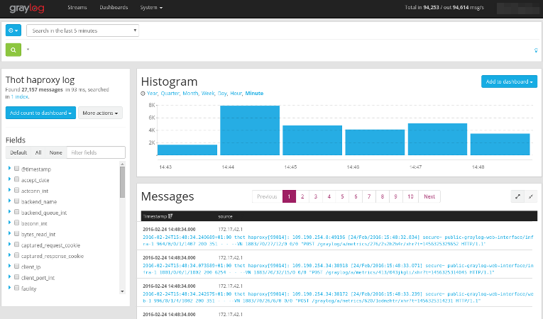

**Last updated 27th February, 2018**

## Objective
 
You have a server, a raspberry pi, a cloud instance or something else running on **Linux** and you want to follow your Logs, the easy way? You have never installed a log collector and you're new to Graylog?

Then this guide is for you!

In this guide will show you how to send Logs from your Linux instance to Logs Data Platform. Don't be afraid, it will be easier than you think.

## Requirements

- A **Linux** based instance (server, VPS, Cloud instance, Raspberry Pi, ...). Command lines will be for **DEBIAN 8** in this tutorial
- A root access to this instance
- [Activate the Logs Data Platform account on ovh.com and create an account](https://docs.ovh.com/gb/en/logs-data-platform/quick-start/){.external}
- [Create a Stream and get your token](https://docs.ovh.com/gb/en/logs-data-platform/tokens-logs-data-platform/){.external}

## Instructions

### Why?

On Linux, logs are generated automatically, for a variety of actions. RAM usage, file downloads, login attempts, network failure, ... almost everything. But logs can be difficult to read without proper tools. With this platform, you'll be able to sort logs and create fancy dashboards.


### What are logs?

Here are some example logs from an OVH Public Cloud instance on **Debian 8** :

```
 Jan 27 12:21:15 bastiengraphana syslog-ng[29512]: syslog-ng starting up; version='3.3.5'
 Jan 27 12:21:15 bastiengraphana syslog-ng[29512]: Syslog connection established; fd='10', server='AF_INET(5.196.84.225:6514)', local='AF_INET(0.0.0.0:0)'
 Jan 29 15:32:23 bastiengraphana sshd[9563]: Received disconnect from 211.110.82.180: 11: Bye Bye [preauth]
 Jan 29 18:39:24 bastiengraphana sshd[29694]: Failed password for root from 59.45.79.51 port 39827 ssh2
```

Conclusion : lot of info, with a date, a process, a description. but hard to follow.

### Configure your Account

First thing to do is to configure your Logs Data Platform account: order a plan (we have free plans ;-), create your user, a stream and a dashboard. Verify that everything works already perfectly. We wrote an independent guide for this, please read it and come back here after : [Quick start](https://docs.ovh.com/gb/en/logs-data-platform/quick-start/){.external} Good? let's go to step #4 then !

### Install and configure a log collector

So let's assume you have your Linux. This guside **DOES NOT** fully cover how to configure other flavors of syslog nor other OSs. Please refer to their own documentation to know how to setup a template and a external destination for the logs. You can still read this entire document to have a grasp on how the template is built. However this configuration should work on any syslog-ng version above 3.0.

We will install a log collector. What's this? It's a tool that collects logs from any source, processes them and delivers them to various destinations, like the Logs Data Platform.

In this guide we will install Syslog-ng :

- Log in your Linux
- Install syslog-ng
- Check that your syslog-ng version is above 3.0 (use **syslog-ng --version**) for that.

```shell-session
$ ubuntu@server:~$ sudo apt-get install syslog-ng
```

- Once it's done we will configure it to collect system logs and deliver them to the platform
- open syslog-ng configuration file

```shell-session
$ ubuntu@server:~$ nano /etc/syslog-ng/syslog-ng.conf
```

- Remove the text in it, and copy-paste this configuration. Don't forget to modify the token by yours

```
 @version: 3.5
 @include "scl.conf"
 @include "`scl-root`/system/tty10.conf"
 
 # Syslog-ng configuration file, compatible with default Debian syslogd
 # installation.
 
 
 # First, set some global options.
 options { chain_hostnames(off); flush_lines(0); use_dns(no); use_fqdn(no);
           owner("root"); group("adm"); perm(0640); stats_freq(0);
           bad_hostname("^gconfd$");
 };
 
 ########################
 # Sources
 ########################
 # This is the default behavior of syslogd package
 # Logs may come from unix stream, but not from another machine.
 #
 source s_src { unix-dgram("/dev/log"); internal();
              file("/proc/kmsg" program_override("kernel"));
 };

 ########################
 # TEMPLATES
 ########################
 template ovhTemplate {
     # important:
     ## Bracket [] no space between inside (opening/closing), space outside.
     ## sid_id (exampleSDID@32473), flowgger need an id for structured data as specified by the RFC 5424.
     ## change X-OVH-TOKEN=\"xxxxxxxxxxxxxx\" by your X-OVH-TOKEN
     #flowgger RFC5424 example:
     #<23>1 2016-09-05T15:53:45.637824Z hostname appname 69 42 [origin@123 software="test script" swVersion="0.0.1"] test message
     #pri timestamp hostname appname pid msgid [sd_id sd_field=sd_value] message
 
     template("<${LEVEL_NUM}>1 ${ISODATE} ${HOST} ${PROGRAM} ${PID} - [sdid@32473 X-OVH-TOKEN=\"xxxxxxxx-xxxx-xxxx-xxxx-xxxxxxxxxxxx\" pid=\"${PID}\" facility=\"${FACILITY}\" priority=\"${PRIORITY}\"] ${MSG}\n");
     template_escape(no);
 };
 
 ########################
 # Destinations
 ########################
 # First some standard logfile
 #
 destination ovhPaaSLogs {
     tcp("<your_cluster>.logs.ovh.com"
         port(6514),
         template(ovhTemplate),
         ts_format("iso"),
         tls(peer-verify("require-trusted") ca_dir("/etc/ssl/certs/")),
         keep-alive(yes),
         so_keepalive(yes),
     );
 };
 
 destination localfile {
     file("/var/log/temporaryfiletochecklogs.log");
 };
 
 log {
     source(s_src);
     destination(ovhPaaSLogs);
 };
 
 log {
     source(s_src);
     destination(localfile);
 };
 
 ###
 # Include all config files in /etc/syslog-ng/conf.d/
 ###
 @include "/etc/syslog-ng/conf.d/"
```

Let's review this configuration.

**SOURCES** : this is the logs sources to collect. So here, we collect System and Internal. More sources can be added of course!

**TEMPLATE** : we will deliver logs to the platform based on this template, it will bring more comprehension for Graylog

**DESTINATION** : This is where we will deliver logs in nearly real time. Here, we have to destinations : The first is the remote endpoint in Logs Data Platform, the second one is local. Retrieve the correct endpoint for RFC 5424 by going to your manager and head to the `About page`{.action}. I create a new log file locally in order to check if the logs are properly sent. It's optional of course, and you can safely remove it once everything is fine. as you can see, the remote destination will use the template, the local destination will not.

- Save the file, close nano and restart syslog

```shell-session
$ ubuntu@server:~$ sudo service syslog-ng restart
$ ubuntu@server:~$ sudo syslog-ng
```

- Open the temporary local file, check if there is something inside

```shell-session
$ ubuntu@server:~$ nano /var/log/temporaryfiletochecklogs.log
```

If it's empty, that's not normal. Check your syslog configuration again. In the best case, we should have something like this :

```
 Jan 27 12:21:15 bastiengraphana syslog-ng[29512]: syslog-ng starting up; version='3.3.5'
 Jan 27 12:21:15 bastiengraphana syslog-ng[29512]: Syslog connection established; fd='10', server='AF_INET(5.196.84.224:6514)', local='AF_INET(0.0.0.0:0)'
```

It means syslog-ng has started up, and connection to remote endpoint is fine.

### Let's play with Graylog Dashboards

Let's recap : you have a Linux instance, and it's sending log locally and remotely, thanks to a log collector. We send 2 flows : internal() and system()

The last step is to create a dashboard displaying the result :

- Connect to the Logs Data Platform manager, ensure you that you have a Stream and that the token in the syslog configuration file is OK. Ensure that you have a Dashboard created.
- Head to your stream by using the button `Graylog access`{.action} located in the **...** menu of your stream, or head directly to the graylog access of your cluster.
- Once in Graylog, Go in Stream Tab, click on your stream. In the top-left corner, chose a 1 Day range and click on the green button to search.
- You should have some results like this :

{.thumbnail}

- On the top right corner of the histogram, click on `Add to dashboard`{.action}.

Alright, you just created the first widget in you dashboard. Now, let's create a Pie chart :

- On the left, click on the small blue triangle before "facility"
- click on "Quick Values"
- A pie chart will appear, you can also add it to your dashboard

Well done, second Widget added!

The best feature is to mix criteria, based on what is important to you. For example, `facility:auth AND level:6`. Also you will soon be able to create Alerts in Logs Data manager.

## Go further

- Join our community of users on <https://community.ovh.com/en/>
- Getting Started: [Quick Start](https://docs.ovh.com/gb/en/logs-data-platform/quick-start/){.external}
- Documentation: [Guides](https://docs.ovh.com/gb/en/logs-data-platform/){.external}
- Community hub: [https://community.ovh.com](https://community.ovh.com/c/platform/data-platforms-lab){.external}
- Mailing List: [paas.logs-subscribe@ml.ovh.net](mailto:paas.logs-subscribe@ml.ovh.net){.external}
- Create an account: [Try it free!](https://www.ovh.com/fr/order/express/#/new/express/resume?products=~%28~%28planCode~%27logs-basic~productId~%27logs%29){.external}