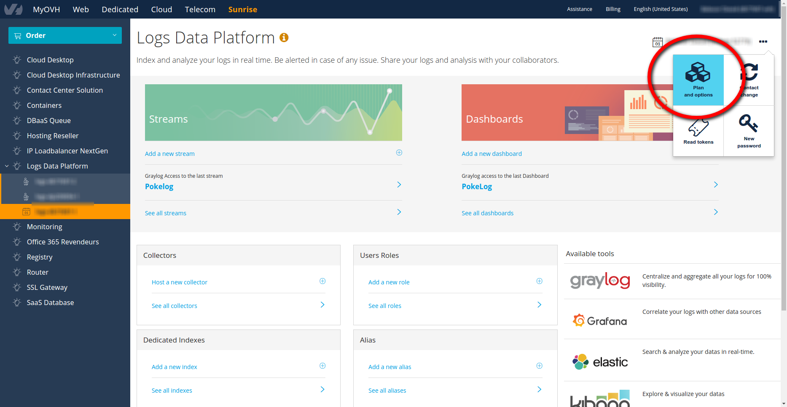
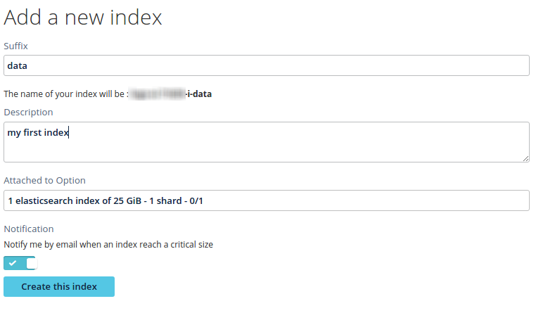
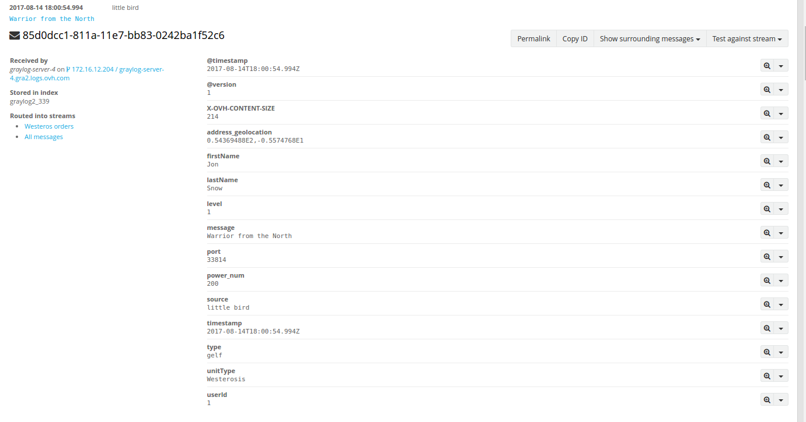

**Last updated 2nd April 2019**

## Objective
 
Elasticsearch is one of the main components of the Logs Data Platform. It is one of the most powerful search and analytics engines. From the outset we offered the possibility to host a Kibana index for your Kibana metadata. Index As A Service is the obvious next step of this functionality. You can now use a fully unlocked index for any purpose; complex documents, reports or even logs. Thanks to the Elasticsearch API, you will be able to use most of the tools of the ELK (Elasticsearch, Logstash, Kibana) Ecosystem.

## Requirements

This is what you need to know to get you started:

- You have ordered one of the Index Option.
- Your have access to the port 9200 of your cluster (head to the **Home** page in manager to know the address of your cluster).

## Instructions

### First steps with an Elasticsearch index

#### Create an index

To create an Elasticsearch index, you first need to order one with your active LDP (Logs Data Platform) account. This step can be done in the [OVH manager](https://www.ovh.com/manager/){.external}. Navigate to the **Home** page of the service and in the **Subscription** box, select the **edit** link in "Options" row to reach the dedicated page.

{.thumbnail}

On this page, you have the status of your current plan and options. You can then order an **index** with different sizes and number of **shards**. A **shard** is the main component of **index**. Multiple shards means more volume, more parallelism in your requests and thus more performance. We offer several choices of number of shards.

Once purchased you can then go back to the main page and add a new index by clicking on the `Add a new index`{.action} on the Elasticsearch index section

{.thumbnail}

You must choose a suffix for your index that follows the `logs-<username>-i-<suffix>` naming convention. Optionally, you can also be notified when your index is close to its critical size. Once your index is created, you can use it right away.

#### Index some data

Logs Data Platform Elasticsearch indices are compatible with the [Elasticsearch REST API](https://www.elastic.co/guide/en/elasticsearch/reference/6.7/docs.html){.external}. Therefore you can use simple http requests to index and search your data. The api is accessible behind a secured https endpoint with mandatory authentication. We recommend that you use [tokens](../tokens_logs_data_platform/guide.en-gb.md){.ref} to authenticate yourself. You can retrieve the endpoint of the API at the **Home** page of your service. Here is a simple example to index a document with curl with an index on the cluster `graX.logs.ovh.com`.


```shell-session
$ curl -u <your-token-value>:token -XPUT -h 'Content-Type: application/json' 'https://graX.logs.ovh.com:9200/logs-<username>-i-<suffix>/_doc/1' -d '{ "user" : "Oles", "company" : "OVH", "message" : "Hello World !", "post_date" : "1999-11-02T23:01:00" }'
```

Here is a quick explanation of this command:

- The **PUT** HTTP command can be used to create or modify a document.
- The address contains the endpoint of the cluster followed by the **name of your index**
- The **test** just after the index name is the type of the document.
- The **1** here is the id of your document that can be any string.
- The payload of the request is a simple **JSON document** that will be indexed.

This command will return with a simple payload indicating if the document has been indexed by all the shards involved.

```json hl_lines="3"
{
   "_id": "1", 
   "_index": "logs-<username>-i-<suffix>", 
   "_primary_term": 1, 
   "_seq_no": 0, 
   "_shards": {
      "failed": 0, 
      "successful": 2, 
      "total": 2
   }, 
   "_type": "_doc", 
   "_version": 1, 
   "result": "created"
}
```

#### Search your data

There are multiple ways to search your data, this is one area where the Elasticsearch REST API excels. You can either get your data directly by using a GET request, or search it with the Search APIs. To get your document indexed previously, use the following curl request:

```shell-session
$ curl -XGET -u <your-token-value>:token 'https://graX.logs.ovh.com:9200/logs-<username>-i-<suffix>/_doc/1'
{"_id":"1","_index":"logs-<username>-i-<suffix>","_primary_term":1,"_seq_no":0,"_source":{"company":"OVH","message":"Hello World !","post_date":"1999-11-02T23:01:00","user":"Oles"},"_type":"_doc","_version":1,"found":true}
```

To issue a simple search you can either use the [Query DSL](https://www.elastic.co/guide/en/elasticsearch/reference/6.7/query-dsl.html){.external} or a [URI search.](https://www.elastic.co/guide/en/elasticsearch/reference/6.7/search-uri-request.html){.external}. Here is a simple example with an URI search:

```shell-session
$ curl -XGET -u <your-token-value>:token 'https://graX.logs.ovh.com:9200/logs-<username>-i-<suffix>/_search?q=user:Oles'
{"_shards":{"failed":0,"skipped":0,"successful":1,"total":1},"hits":{"hits":[{"_id":"1","_index":"newindice","_score":0.2876821,"_source":{"company":"OVH","message":"Hello World !","post_date":"1999-11-02T23:01:00","user":"Oles"},"_type":"_doc"}],"max_score":0.2876821,"total":1},"timed_out":false,"took":31}
```

### Use case&#58; Enrich Logs Data on the fly

The following shows how your e-commerce application logs can be sent to the Logs Data Platform whenever a product is ordered. It logs the customer order by using Id for the customers name. For performance reasons or maybe by-design, the application doesn't fetch the full name of the client or other information from the customer database just to produce a log. You can add this information on the fly by using an Elasticsearch Index and a Logstash collector on the Logs Data Platform.

#### Fill an index with clients information

The first thing to do is to index some clients information. The snippet below is one entry of the client index.

```json
{
    "firstName": "Jon",
    "lastName": "Snow",
    "age": 22,
    "address":
    {
        "streetAddress": "21 2nd Street",
        "city": "Winterfell",
        "state": "North",
        "postalCode": "14578",
        "geolocation":
        {
            "lat": 54.369488,
            "long": -5.574768
        }
    },
    "phoneNumber":
    [
        {
          "type": "home",
          "number": "212 555-1234"
        },
        {
          "type": "mobile",
          "number": "102 555-4567"
        }
    ]
}
```

To index several documents at once, it is more efficient to use the bulk api. Here is a small snippet of 3 users you can use to test it.

```json
{ "index" : { "_index" : "logs-<username>-i-<suffix>", "_type" : "_doc" } }
{ "userId": "1", "firstName": "Jon","lastName": "Snow", "age": 22, "address": { "streetAddress": "21 2nd Street", "city": "Winterfell", "state": "North", "postalCode": "14578",  "geolocation": { "lat": 54.369488, "long": -5.574768 } },"phoneNumber": [ { "type": "home", "number": "212 555-1234" }, { "type": "mobile", "number": "102 555-4567" } ] }
{ "index" : { "_index" : "logs-<username>-i-<suffix>", "_type" : "_doc" } }
{ "userId": "2", "firstName": "Cersei","lastName": "Lannister", "age": 43, "address": { "streetAddress": "1 Palace Street", "city": "King's Landing", "state": "The Crownlands", "postalCode": "26863",  "geolocation": { "lat": 42.639758, "long": 18.1094725 } },"phoneNumber": [ { "type": "home", "number": "212 555-6789" }, { "type": "mobile", "number": "102 555-8901" } ] }
{ "index" : { "_index" : "logs-<username>-i-<suffix>", "_type" : "_doc" } }
{ "userId": "3", "firstName": "Daenerys","lastName": "Targaryen", "age": 22, "address": { "streetAddress": "3 Blackwater Bay Ave", "city": "Dragonstone", "state": "Dragonstone", "postalCode": "75197",  "geolocation": { "lat": 43.300097, "long": -2.261580 } },"phoneNumber": [ { "type": "home", "number": "212 555-1234" }, { "type": "mobile", "number": "102 555-2345" } ] }
```

A bulk request is a succession of JSON objects with this structure:

```
 action_and_meta_data\n
 optional_source\n
 action_and_meta_data\n
 optional_source\n
 ...
 action_and_meta_data\n
 optional_source\n
```

You can in one request ask Elasticsearch to index, update, delete several documents. Save the content of the previous commands in a file named **bulk** and use the following call to index these 3 users:

```shell-session
$ curl -u <your-token-value>:token -XPUT -h 'Content-Type: application/json' 'https://graX.logs.ovh.com:9200/logs-<username>-i-<suffix>/_bulk' --data-binary "@bulk"
```

This call will take the content of the bulk file and execute each index operation. Note that you have to use the option **--data-binary** and no **-d** to preserve the newline after each JSON. You can check that your data are properly indexed with the following call:

```shell-session
$ curl -u <your-token-value>:token -XGET 'https://graX.logs.ovh.com:9200/logs-<username>-i-<suffix>/_doc/_search?pretty=true'
```

This will give you back the documents of your index:

```json hl_lines="13 41 69"
{
  "took" : 1,
  "timed_out" : false,
  "_shards" : {
    "total" : 1,
    "successful" : 1,
    "failed" : 0
  },
  "hits" : {
    "total" : 3,
    "max_score" : 1.0,
    "hits" : [ {
      "_index" : "logs-<username>-i-<suffix>",
      "_type" : "_doc",
      "_id" : "AV3HvbQAz85mIBfrJjkV",
      "_score" : 1.0,
      "_source" : {
        "userId" : "1",
        "firstName" : "Jon",
        "lastName" : "Snow",
        "age" : 22,
        "address" : {
          "streetAddress" : "21 2nd Street",
          "city" : "Winterfell",
          "state" : "North",
          "postalCode" : "14578",
          "geolocation" : {
            "lat" : 54.369488,
            "long" : -5.574768
          }
        },
        "phoneNumber" : [ {
          "type" : "home",
          "number" : "212 555-1234"
        }, {
          "type" : "mobile",
          "number" : "102 555-4567"
        } ]
      }
    }, {
      "_index" : "logs-<username>-i-<suffix>",
      "_type" : "_doc",
      "_id" : "AV3HvbQAz85mIBfrJjkW",
      "_score" : 1.0,
      "_source" : {
        "userId" : "2",
        "firstName" : "Cersei",
        "lastName" : "Lannister",
        "age" : 43,
        "address" : {
          "streetAddress" : "1 Palace Street",
          "city" : "King's Landing",
          "state" : "The Crownlands",
          "postalCode" : "26863",
          "geolocation" : {
            "lat" : 42.639758,
            "long" : 18.1094725
          }
        },
        "phoneNumber" : [ {
          "type" : "home",
          "number" : "212 555-6789"
        }, {
          "type" : "mobile",
          "number" : "102 555-8901"
        } ]
      }
    }, {
      "_index" : "logs-<username>-i-<suffix>",
      "_type" : "_doc",
      "_id" : "AV3HvbQAz85mIBfrJjkX",
      "_score" : 1.0,
      "_source" : {
        "userId" : "3",
        "firstName" : "Daenerys",
        "lastName" : "Targaryen",
        "age" : 22,
        "address" : {
          "streetAddress" : "3 Blackwater Bay Ave",
          "city" : "Dragonstone",
          "state" : "Dragonstone",
          "postalCode" : "75197",
          "geolocation" : {
            "lat" : 43.300097,
            "long" : -2.26158
          }
        },
        "phoneNumber" : [ {
          "type" : "home",
          "number" : "212 555-1234"
        }, {
          "type" : "mobile",
          "number" : "102 555-2345"
        } ]
      }
    } ]
  }
}
```

Now that you have some data, you can enrich your logs with it. For this we will use a Logstash collector.

#### Configure a Logstash collector

If you don't know how to create a Logstash collector, please refer to the [Logstash guide](../logstash_input/guide.en-gb.md){.ref}. Edit the configuration of Logstash. For this example we will use a SSL TCP input with the GELF codec. Here is the input configuration.

```ruby
tcp {
    port => 12202
    type => gelf
    ssl_enable => true
    ssl_verify => false
    ssl_cert => "/etc/ssl/private/server.crt"
    ssl_key => "/etc/ssl/private/server.key"
    ssl_extra_chain_certs => ["/etc/ssl/private/ca.crt"]
    codec => gelf { delimiter => "\x00" }
}
```

The most important part in this configuration is the filter part:

```ruby  hl_lines="2 3 4"
elasticsearch {
    hosts => ["https://gra2.logs.ovh.com:9200"]
    index => "logs-<username>-i-<suffix>"
    user => "y762pm8j2yhge9c2idpdaqs456dshr78nb2313eaze4656oue45psla"
    password => "token"
    enable_sort => false
    query => "userId:%{[userId]}"
    fields  => {
       "firstName" => "firstName"
       "lastName" => "lastName"
       "address" => "address"
    }
}

if "_elasticsearch_lookup_failure" not in [tags] {
     mutate {
        add_field => {
            "address_geolocation" => "%{[address][geolocation][lat]},%{[address][geolocation][long]}"
        }
        remove_field => [ "address" ]
     }
}
```

The filter part is composed by two plugins, the **elasticsearch** plugin and the **mutate** plugin. The Elasticsearch plugin has the following configuration:

- **hosts**: This is the address of the Elasticsearch API of your LDP cluster. Note that we use https here.
- **index**: This is the name of the index containing your static data.
- **username**: This is the username to authenticate yourself against the API. Again, we recommend that you use [tokens](../tokens_logs_data_platform/guide.en-gb.md){.ref} for that.
- **password**: The password of the user.
- **enable_sort**: this setting tells that there is no need to sort the data for the request.
- **query**: This is the query issued. Here the query is a simple string query searching for the document having the field **userId** set at the value userId found in the log event. **%{[userID]}** will be replaced by the value contained in the field userId of the log event.
- **fields**: This is where the magic happens. The field of the document found will be added to the event. The field of the document is on the left and the new (or updated) field of the event is on the right. Be sure to follow the [field naming conventions](../field_naming_conventions/guide.en-gb.md){.ref}.

The mutate plugin is here to show you how you can combine different subfield information in one top level field. Here we combine a latitude and a longitude field to create a geolocation field then we remove the original address top-field.

#### Send and retrieve your logs

One simple way to test your new Logstash configuration is to send a log by using echo and openssl. Check the examples below:

```shell-session
$ echo -e '{"version":"1.1", "host": "little bird", "short_message": "Warrior from the North", "level":1, "_userId": "2", "_unitType": "Westerosis", "_power_num": 200 }'\0 | openssl s_client -quiet -no_ign_eof -connect <input-hostname>:<port>
$ echo -e '{"version":"1.1", "host": "little bird", "short_message": "A legendary dragon", "level":1, "_userId": "3", "_unitType": "Dragon", "_power_num": 200000 }'\0 | openssl s_client -quiet -no_ign_eof -connect <input-hostname>:<port>
```

As you can see we just specify the **userId** this order belong to. Sending this log to your Logstash input will give you the following final log:

{.thumbnail}

The log has been enriched with the fields we declared in our filter automatically. Linking information from an index and the logs allow you to create more meaningful Dashboards based on these information:

{.thumbnail}

In this Dashboard, you can see that the first widget is a "quick values" widget based on the firstName fields of the logs we retrieved.

### Additional Information

Index as a service has some specificities on our platforms. This additional and technical information can help you to use it properly:

- **Replication** is set at 1 and cannot be changed. We ensure the high availability of your index in case of a hardware failure.
- The **maximum size** of your index is fixed and is dependent on the number of shards. Shards are the unit of parellism in Elasticsearch, so if search performance is critical, you should choose an index with the highest number of shard you can afford. Thanks to the high performance nodes we use, we managed to send thousands of logs to the Logstash and enrich all of them within seconds using only one shard.
- The **index_refresh_interval** of the index is set at 1 second ensuring near real time search results.
- You are not allowed to change the settings of your index.
- You can create an **alias** on Logs Data Platform and attach it to one or several indices.
- If there is a feature missing, feel free to contact us on the [community hub](https://community.ovh.com/c/platform/data-platforms-lab){.external} or on the mailing list.


## Go further

- Getting Started: [Quick Start](../quick_start/guide.en-gb.md){.ref}
- Documentation: [Guides](../product.en-gb.md){.ref}
- Community hub: [https://community.ovh.com](https://community.ovh.com/en/c/Platform){.external}
- Create an account: [Try it free!](https://www.ovh.com/fr/order/express/#/new/express/resume?products=~%28~%28planCode~%27logs-basic~productId~%27logs%29){.external}
