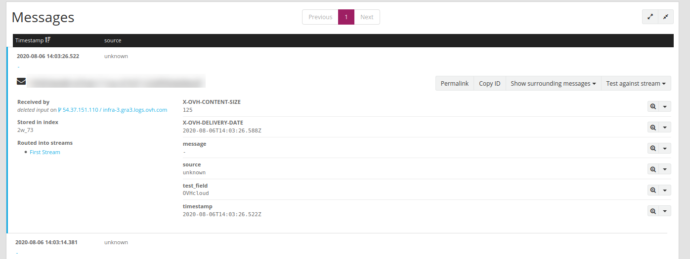
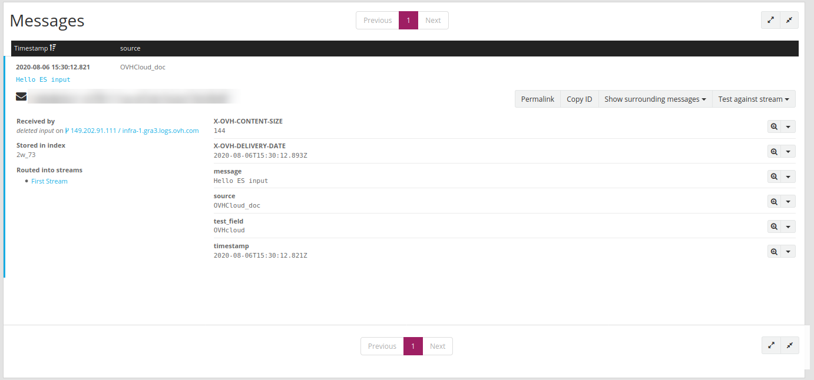
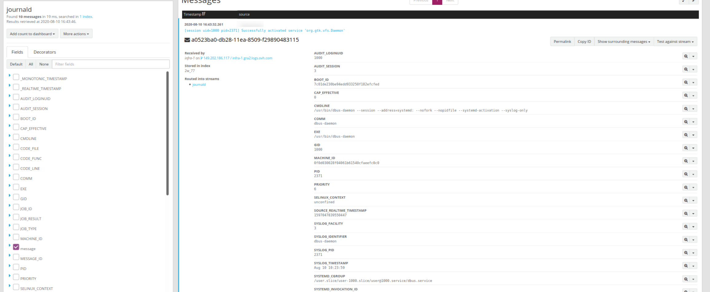

**Last updated 13th June, 2022**


## Overview

OpenSearch is the star component of our platform, making it possible to use [OpenSearch indexes](../index-as-a-service){.ref} to store your documents. The OpenSearch indexes are quite flexible, but they are not part of the log pipeline. If you want to also use the [Websocket live-tail](../ldp-tail){.ref}, or the [Alerting system](../alerting){.ref} or the [Cold Storage](../cold-storage){.ref} feature, and have automatic retention management, then you will need to use the log pipeline. Thanks to our OpenSearch log endpoint, it shall enable you to send logs using the HTTP OpenSearch API. Moreover, the endpoint supports also [OpenSearch Ingest](https://opensearch.org/docs/latest/opensearch/rest-api/ingest-apis/index/){.external}, meaning you can use advanced processing on your logs before they are sent in the pipeline. There is no additional cost for this feature, all you need is a [stream](../quick-start){.ref}.


## OpenSearch endpoint


The OpenSearch endpoint is a dedicated index where you can send a JSON document. The port used is the **9200**, the same HTTP port used for all other OpenSearch API of Logs Data Platform. The only field needed are the **X-OVH-TOKEN** and an extra field (any custom field). Don't hesitate to go to the [Quick Start documentation](../quick_start){.ref} if you are not familiar with this notion. This document log will be transformed into a valid GELF log and any missing field will be filled automatically. In order to respect the GELF convention, you can also use all the [GELF format reserved fields](https://docs.graylog.org/docs/gelf){.external}. Here is one example of the minimal message you can send:

```shell-session
$ curl -H 'Content-Type: application/json' -u '<user>:<password>' -XPOST https://<ldp-cluster>.logs.ovh.com:9200/ldp-logs/message -d '{ "X-OVH-TOKEN" : "7f00cc33-1a7a-4464-830f-91be90dcc880" , "test_field" : "OVHcloud"}'
```

Replace the `<user>`, `<password>` and `<ldp-cluster>` with your Logs Data Platform username, password and cluster. You can also use [tokens](../tokens-logs-data-platform){.ref} in place of your credentials.  Sending this payload will result in this log:

{.thumbnail}


The system automatically put the timestamp at the date when the log was received and add the field **test_field** to the log message. Source was set to **unknown** and the message to `-`.
Note that the payload follow the JSON specification (and not the GELF one). The system will still recognize any reserved field used by the [GELF specification](https://docs.graylog.org/docs/gelf){.external}. Here is another example:

```shell-session
$ curl -H 'Content-Type: application/json' -u '<user>:<password>' -XPOST https://<ldp-cluster>.logs.ovh.com:9200/ldp-logs/message -d '{ "X-OVH-TOKEN" : "7f00cc33-1a7a-4464-830f-91be90dcc880" , "test_field" : "OVHcloud" , "short_message" : "Hello OS input", "host" : "OVHcloud_doc" }'
```

This will create the following log:

{.thumbnail}

The system used the reserved fields associated with GELF to create the message and the source fields.

Logs Data Platform will also detect any typed field in the original data and convert them accordingly to our [field naming convention](../field-naming-conventions){.ref}. This last example illustrates it:

```shell-session
$ curl -H 'Content-Type: application/json' -u '<user>:<password>' -XPOST https://<ldp-cluster>.logs.ovh.com:9200/ldp-logs/message -d '{ "X-OVH-TOKEN" : "7f00cc33-1a7a-4464-830f-91be90dcc880" , "test_field" : "OVHcloud" , "short_message" : "Hello OS input", "host" : "OVHcloud_doc", "numeric_field" : 43.5  }'
```

The numeric field **numeric_field** will be detected as a number and will be suffixed to follow our naming conventions.

{.thumbnail}


The OpenSearch input will also flatten any sub-object or array sent through it and supports also ingest pipelines, they are used for example with [Filebeat integrations](../filebeat-logs){.ref}


## Use case: Vector


[Vector](https://vector.dev/){.external} is a fast and lightweigth log forwarder written in Rust. This software is quite similar to [Logstash](../logstash-input){.ref} or [Fluent Bit](../kubernetes-fluent-bit){.ref}. It takes logs from a source, apply a transformation on them and send them in a format compatible with the configured output module.

The vector integrations are numerous with more than 20 sources supported, more than 25 transforms and 30 sinks supported. It supports OpenSearch as a sink thanks to its Elasticsearch compability. We will use the simplest configuration to make it work from a **journald** source to our OpenSearch endpoint. Don't hesitate to check the [documentation](https://vector.dev/docs/about/what-is-vector/){.external} to explore all the possibilities.


```toml
data_dir = "/var/lib/vector" # optional, must be allowed in read-write

[sources.journald]
type = "journald" # required

[transforms.token]
#This VRL transorm add the token
type = "remap"
inputs = ["journald"]
source = '''
."X-OVH-TOKEN" = "<stream-token>"
'''


[sinks.ldp]
type = "elasticsearch" # required
inputs = ["token"] # required
mode = "bulk"
compression = "gzip" # optional, default is none
healthcheck = true # required
endpoint = "https://<<ldp-cluster>>.logs.ovh.com:9200" # required
bulk.index = "ldp-logs" # required
auth.strategy = "basic"
auth.user = "<username>"
auth.password = "<password>"
```


Here is the explanation of this configuration.


The source part of the TOML configuration file configure the [journald](https://vector.dev/docs/reference/sources/journald/){.external} source. By default this source will use the `/var/lib/vector` directory to store its data. You can configure this directory with the global option data_dir.

The transform configuration part relates to the [remap](https://vector.dev/docs/reference/configuration/transforms/remap/){.external} transform. This transform named here token has for unique goal to add the token stream value. It takes logs from the **inputs** named journald and add a **X-OVH-TOKEN** value. This token value can be found on the `...`{.action} stream menu on the stream page in the Logs Data Platform manager. Replace **<stream-token>** with the token value of your stream.


The final part is the [Elasticsearch sink](https://vector.dev/docs/reference/sinks/elasticsearch/){.external}. It takes data from the previous **inputs** token and setup several config points:

- gzip is supported on our endpoint, so it's activated with the **compression** configuration.
- **healthcheck** are also supported and allow you to be sure that the platform is alive and well
- the **endpoint** configuration must be replaced with your assigned cluster
- the **bulk.index** must be set to "ldp-logs", our special OpenSearch logs index
- the **auth.strategy** must be set to "basic".
- **auth.user** and **auth.password** must be set to the username of the Logs Data Platform account and its associated password. Note that you can use [tokens](../tokens-logs-data-platform){.ref} in place of your credentials.

Once configured and launched you will immediately see this type of logs in Graylog:


{.thumbnail}


The logs from journald arrived fully parsed and ready to be explored. Use differents sources and transforms to send your application logs to Logs Data Platform.


## Go further

- Getting Started: [Quick Start](../quick-start){.ref}
- Documentation: [Guides](../){.ref}
- Community hub: [https://community.ovh.com](https://community.ovh.com/en/c/Platform/data-platforms){.external}
- Create an account: [Try it!](https://www.ovh.com/fr/order/express/#/express/review?products=~(~(planCode~'logs-account~productId~'logs)){.external}
