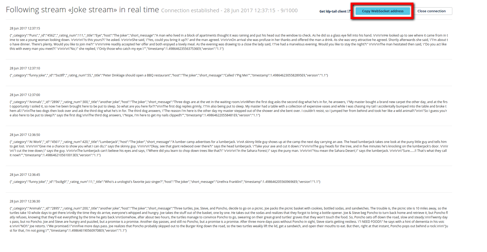

**Last updated 2nd April 2019**

## Objective

This guide will show you how to use the Logs Data Platform to stream your logs in real time.

The Logs Data Platform allows you to connect different applications or servers to one unique endpoint and make all of them appear in one stream if needed. **ldp-tail** is able to follow one your stream in real-time with sub-second latency by using one of the exclusive feature of the platform: the WebSocket endpoint.

## Requirements

- **ldp-tail** can be run on Linux, Mac or Windows, locally or remotely
- You will need an internet connection
- A LDP Pro account with [an active stream](../quick_start/guide.en-gb.md){ref} and WebSocket option enabled

## Instructions

### Download and test ldp-tail in two minutes

**ldp-tail** is derived from a internal tool used by OVH engineers to follow in real time hundreds of applications and servers logs. It is written in Go and is completely open-source. So if you're curious enough, you can check the code at [https://github.com/ovh/ldp-tail](https://github.com/ovh/ldp-tail){.external}. You can also download binary releases from this website. Go to [https://github.com/ovh/ldp-tail/releases](https://github.com/ovh/ldp-tail/releases){.external} to download the release for your platform. 64 bits versions of Linux, Windows and Mac OS X are currently supported.. Decompress the archive obtained and you will get the **ldp-tail** binary.

You can test it right away on our demo stream by using this command in a terminal.

```shell-session
$ ldp@ubuntu:~$ ./ldp-tail --address "wss://gra1.logs.ovh.com/tail/?tk=demo" --pattern "{{ .short_message }}"
```

There are only two options here: the address and the pattern.

- The **address** is the WebSocket address of your stream depending on your cluster and on your stream.
- The **pattern** is the display format of your logs. Note that this option is not mandatory. You will find more information about this option later.

To test **ldp-tail** with one of your stream, you have first to retrieve your WebSocket address. Here is how.

### Retrieve your WebSocket address

Let's retrieve the WebSocket address that will allow you to follow your logs. For this you will need first to connect to the manager and go to the streams page. From there, open the menu of the stream you want the address of and click on `Monitor in real-time`{.action}

{.thumbnail}

You will land on a new page where you will see all your logs in real-time as soon as they arrive. On this page click on the button `Copy WebSocket address`{.action} to copy the WebSocket address in your clipboard. Just use the address as in the example and you will see your logs flowing in your terminal right away.

{.thumbnail}

You will also find on this page a link to the ldp-tail release page and three ways to test your stream with commands.

### Formatting and Filtering

**ldp-tail** is not just a plain tail (as its name suggest). It comes with advanced formatting and filtering capabilities. The full documentation of these capabilities are all available at the [github website](https://github.com/ovh/ldp-tail#parameters){.external}. Here are the two main options that you can use to enhance your output.


#### The pattern option

This option is here to allow you to format the output and to select which fields you want to display. For example, with the demo stream:

```shell-session
$ ldp@ubuntu:~$ ./ldp-tail --address "wss://gra1.logs.ovh.com/tail/?tk=demo" --pattern "My Title: {{ ._title }} , The Joke: {{ .short_message }}"
2017/06/23 17:23:13 Connecting to gra1.logs.ovh.com...
2017/06/23 17:23:14 Connected!
My Title: Why did the Ancient Egyptians build Great Pyramids? , The Joke: Because their Great Igloos melted.
My Title: Success , The Joke: Success is relative. The more success, the more relatives!
My Title: Freeway , The Joke: When everything is coming your way, you're on the wrong side of the freeway.
```

Please note that in this example we use the [GELF](http://docs.graylog.org/en/2.2/pages/gelf.html){.external} field naming convention of, which means that your extra fields must all have an underscore. This is because the WebSocket endpoint sends messages fully compatible with the GELF format so you can use them after in any GELF compatible tool.

The pattern option allows you also to customize colors, background and text colors are customizable.

```shell-session
$ ldp@ubuntu:~$ ./ldp-tail --address "wss://gra1.logs.ovh.com/tail/?tk=demo" --pattern "My Title: {{color \"red\"}} {{ ._title }} , {{ noColor }} The Joke: {{ color \"blue\" }} {{ .short_message }} {{ noColor }}"
```

In this example, the title field will be colored in red, and the body will be colored in blue. You can use the **bColor** attribute to color the background instead. The pattern option supports many different operations like date formatting, concatenation, human readable duration displaying, etc. **ldp-tail**  also supports conditional formatting. This can be useful to sort important information in your stream. For example this kind of rule can be implemented: if a value is greater than a threshold, display the message in red, otherwise display it in green.

With our demo stream, we can use this kind of filter and the **rating_num** numeric attribute to display in yellow every joke rated above 100.

```shell-session
$ ldp@ubuntu:~$ ./ldp-tail --address "wss://gra1.logs.ovh.com/tail/?tk=demo" --pattern "My Title: {{color \"red\"}} {{ ._title }} , {{noColor }} The Joke: {{if (lt (._rating_num) 100)}}{{ color \"blue\" }}{{else}}{{color \"yellow\"}} {{ .short_message }} {{ noColor }}"
```

#### The match option

As the name implies, the match option is able to choose which messages you want or don't want to display in your ldp-tail. The option contains several operators, all described at [https://github.com/ovh/ldp-tail](https://github.com/ovh/ldp-tail){.external}. You can easily display messages beginning with some values or display only message that have a certain field or whose a field is higher or lower than a value.

Here is how you can display only logs that have a title beginning with the word "another"

```shell-session
$ ldp@ubuntu:~$ ./ldp-tail --address "wss://gra1.logs.ovh.com/tail/?tk=demo" --match "_title.begin=another" --pattern "{{ ._title}} The Joke: {{ .short_message }}"
```

You can of course combine multiple matches by issuing **ldp-tail --match <COND_1> --match <COND_2> --pattern ...**. A pattern and match combination can be really difficult to read, thats why ldp-tail supports a TOML configuration file.

#### TOML Configuration file

Here is an example of a [TOML](https://github.com/toml-lang/toml){.external} configuration file for ldp-tail

```text
Address = "wss://gra1.logs.ovh.com/tail/?tk=demo"
Pattern = "{{ ._title}} The Joke: {{ .short_message }}"

[[Match]]
Key="_rating_num"
Operator="gt"
Value=100
Not=false

[[Match]]
Key="_title"
Operator="begin"
Value="another"
Not=false
```

If you are not familiar with TOML, here are some explanations. **Address** and **pattern** are similar to the options you have in the command line. **Match option** is a little bit different. Since you can have multiple conditions, **Match** is an array of tables where every object is a full condition with the field, the operator, the value and the negation of this condition if needed. Note that the **Value** attribute can be a string or a number. The **Not** attribute must be the boolean true or false.

Once your file is ready, you can launch ldp-tail with it:

```shell-session
$ ldp@ubuntu:~$ ./ldp-tail --address "wss://gra1.logs.ovh.com/tail/?tk=demo" --config "myfile.toml"
```

### Combining matches and filters

If you combine matches and filters you can, for example, print the call to an API and format the output depending on the status or the duration of the call.

{.thumbnail}

This example has been generated using the following configuration:

```text
Address = "wss://XXXXXXXXXXXXXXXXXXXXXXXXXXXXXXXXXXX"
Pattern = "{{if (lt (int ._duration_ms_num) 200)}}{{color \"green\"}}{{else if (lt (int ._duration_ms_num) 500)}}{{color \"yellow\"}}{{else}}{{color \"red\"}}{{end}}{{date .timestamp}} | {{ printf \"%-80s\" (join \" \" ._method ._path )}} | {{ ._httpStatus_int }} | {{ duration ._duration_ms_num 1000000 }}{{noColor}}"

[[Match]]
Key="_path"
Operator="begin"
Value="/dbaas/logs"
Not=false
```

If you have any difficulty understanding this pattern or if you want help creating your own, don't hesitate to reach us on the mailing list or on the [Community Hub](https://community.ovh.com/en/c/Platform){.external}.

### Replay tail

It's also possible to replay a given time window in the past.

To proceed, give the begin & end as uri query parameter.

Sample:

```shell-session
$ ldp@ubuntu:~$ ldp-tail --address "wss://gra1.logs.ovh.com/tail/?tk=demo&begin=1553601030&end=1553611040" --pattern "{{date .timestamp}}: {{ ._category }}"
```

To make the magic happens, replace begin and end values with timestamps that have been in the last few weeks.


## Go further

- Getting Started: [Quick Start](../quick_start/guide.en-gb.md){.ref}
- Documentation: [Guides](../product.en-gb.md){.ref}
- Community hub: [https://community.ovh.com](https://community.ovh.com/en/c/Platform){.external}
- Create an account: [Try it free!](https://www.ovh.com/fr/order/express/#/new/express/resume?products=~%28~%28planCode~%27logs-basic~productId~%27logs%29){.external}
